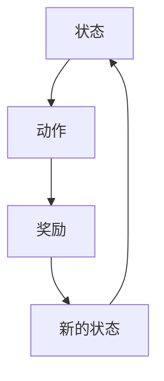

                 


# AI Agent在智能冰箱中的食材管理

---

## 关键词：AI Agent, 智能冰箱, 食材管理, 状态空间, Q-learning, 系统架构

---

## 摘要：  
本文深入探讨AI Agent在智能冰箱中的食材管理应用，分析其核心概念、算法原理、系统架构，并结合实际案例，展示如何通过AI技术优化食材管理流程。文章从背景介绍到项目实战，全面解析AI Agent在智能冰箱中的角色与实现，为技术开发者和用户提供深刻的洞察。

---

## 第一部分: AI Agent在智能冰箱中的食材管理背景介绍

### 第1章: AI Agent与智能冰箱概述

#### 1.1 AI Agent的基本概念
- **AI Agent的定义与特点**  
  AI Agent（人工智能代理）是指能够感知环境、自主决策并执行任务的智能实体。其特点包括自主性、反应性、目标导向和学习能力。

- **AI Agent的核心功能与应用场景**  
  AI Agent的核心功能包括感知环境、处理信息、决策规划和执行任务。应用场景广泛，如智能家居、自动驾驶和智能助手。

- **AI Agent在智能冰箱中的作用**  
  在智能冰箱中，AI Agent负责食材管理、库存预警和食谱推荐，提升用户体验。

#### 1.2 智能冰箱的概述
- **智能冰箱的基本功能与技术特点**  
  智能冰箱具备食材存储、温度控制和物联网连接等功能，通过传感器和网络实现智能化管理。

- **智能冰箱的食材管理需求**  
  用户需要智能冰箱能够自动记录食材信息、提醒保质期并推荐食谱。

- **智能冰箱的用户痛点与解决方案**  
  用户痛点包括食材浪费和管理复杂性，AI Agent通过自动化管理解决这些问题。

#### 1.3 食材管理的背景与挑战
- **食材管理的主要问题**  
  包括食材过期、浪费和管理复杂性。

- **AI Agent在食材管理中的优势**  
  AI Agent能够实时感知、自主决策并优化管理流程。

- **智能冰箱食材管理的边界与外延**  
  管理范围限于冰箱内部食材，外延至厨房设备和智能家居系统。

### 第2章: AI Agent与食材管理的核心概念

#### 2.1 AI Agent在食材管理中的核心原理
- **AI Agent的状态感知与决策机制**  
  AI Agent通过传感器感知环境，基于状态空间进行决策。

- **AI Agent的行为规划与执行**  
  通过路径规划和任务分解，执行食材管理任务。

- **AI Agent的学习与优化**  
  使用强化学习优化决策策略。

#### 2.2 食材管理的核心要素与属性
- **食材的基本属性**  
  包括种类、保质期、存储条件和营养信息。

- **食材管理的核心需求**  
  需要实现库存管理、保质期提醒和食谱推荐。

- **食材管理的用户行为特征**  
  用户关注食材新鲜度和便捷性，倾向于个性化服务。

#### 2.3 AI Agent与食材管理的实体关系分析
- **ER实体关系图**
```mermaid
er
  entity 用户 {
    id

    姓名
    手机号
    邮箱
  }

  entity 食材 {
    id

    名称
    数量
    保质期
    类型
  }

  entity 状态空间 {
    id

    当前状态
    状态描述
  }

  entity 动作空间 {
    id

    动作类型
    动作描述
  }

  entity AI Agent {
    id

    状态感知
    决策逻辑
    行为执行
  }
```

---

## 第二部分: AI Agent在食材管理中的核心概念与联系

### 第3章: AI Agent的算法原理

#### 3.1 AI Agent的算法原理
- **AI Agent的状态空间与动作空间**  
  状态空间定义当前环境的状态，动作空间定义可能的操作。

- **基于Q-learning的AI Agent算法**  
  Q-learning是一种强化学习算法，通过状态-动作价值函数优化决策。

- **Q-learning算法的流程图**


- **Q-learning算法的数学模型**
$$ Q(s, a) = Q(s, a) + \alpha (r + \gamma \max Q(s', a') - Q(s, a)) $$
其中，\( \alpha \) 是学习率，\( \gamma \) 是折扣因子。

- **Python实现示例**
```python
import numpy as np

class QAgent:
    def __init__(self, state_space, action_space):
        self.state_space = state_space
        self.action_space = action_space
        self.Q = np.zeros((state_space, action_space))
    
    def choose_action(self, state, epsilon=0.1):
        if np.random.random() < epsilon:
            return np.random.randint(self.action_space)
        return np.argmax(self.Q[state, :])
    
    def update_Q(self, state, action, reward, new_state):
        self.Q[state, action] += 0.1 * (reward + 0.9 * np.max(self.Q[new_state, :]) - self.Q[state, action])
```

---

### 第4章: 食材管理的数学模型

#### 4.1 食材管理的状态空间建模
- **状态空间的定义**  
  状态空间由食材的种类、数量和保质期组成。

#### 4.2 动作空间的定义
- **动作空间的定义**  
  包括记录食材、更新库存和推荐食谱。

#### 4.3 基于Q-learning的数学模型
$$ Q(s, a) = Q(s, a) + \alpha (r + \gamma \max Q(s', a') - Q(s, a)) $$

---

### 第5章: 系统分析与架构设计

#### 5.1 系统功能设计
- **食材信息管理模块**  
  实现食材的录入、更新和查询功能。

- **库存预警模块**  
  监控食材保质期，及时提醒用户。

- **食谱推荐模块**  
  基于用户饮食习惯推荐食谱。

#### 5.2 系统架构设计
- **分层架构**  
  包括数据层、业务逻辑层和用户界面层。

#### 5.3 系统接口设计
- **RESTful API**  
  提供食材管理的API接口。

#### 5.4 系统交互流程
- **用户操作流程**  
  用户录入食材，系统更新库存并推荐食谱。

---

### 第6章: 项目实战

#### 6.1 环境配置
- **Python版本**：3.8+
- **依赖库**：numpy, gym

#### 6.2 核心代码实现
```python
import numpy as np

class FoodManager:
    def __init__(self, food_types):
        self.food_types = food_types
        self.inventory = {ft: 0 for ft in food_types}
    
    def record_food(self, food_type, quantity):
        self.inventory[food_type] += quantity
    
    def update_expiration(self, food_type, days_left):
        if days_left <= 0:
            del self.inventory[food_type]
        else:
            self.inventory[food_type] = days_left
    
    def recommend_recipe(self):
        available_foods = [k for k, v in self.inventory.items() if v > 0]
        return f"推荐食谱：使用{available_foods[0]}制作美食"
```

#### 6.3 代码解读与分析
- **FoodManager类**  
  管理食材库存，记录食材、更新保质期并推荐食谱。

#### 6.4 案例分析
- **案例一**  
  用户录入牛奶，系统记录并推荐食谱。

---

## 第三部分: 总结与展望

### 第7章: 总结与展望

#### 7.1 总结
- **AI Agent在食材管理中的作用**  
  AI Agent通过智能化管理提升用户体验。

#### 7.2 展望
- **未来发展方向**  
  结合物联网和云计算，实现更智能的食材管理。

#### 7.3 最佳实践 tips
- **数据安全**  
  确保食材数据的安全性。

- **用户体验优化**  
  提供更个性化的服务。

---

## 作者：AI天才研究院/AI Genius Institute & 禅与计算机程序设计艺术 /Zen And The Art of Computer Programming

