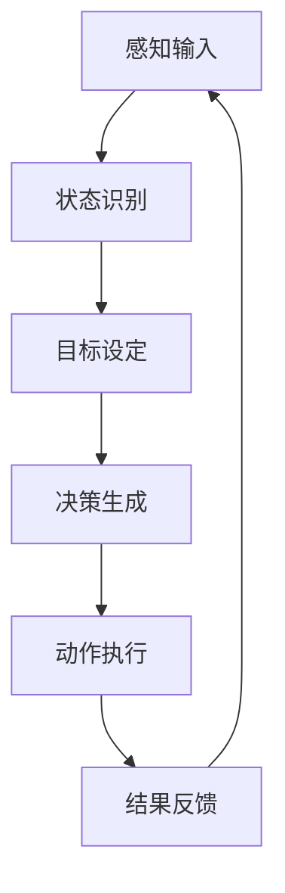
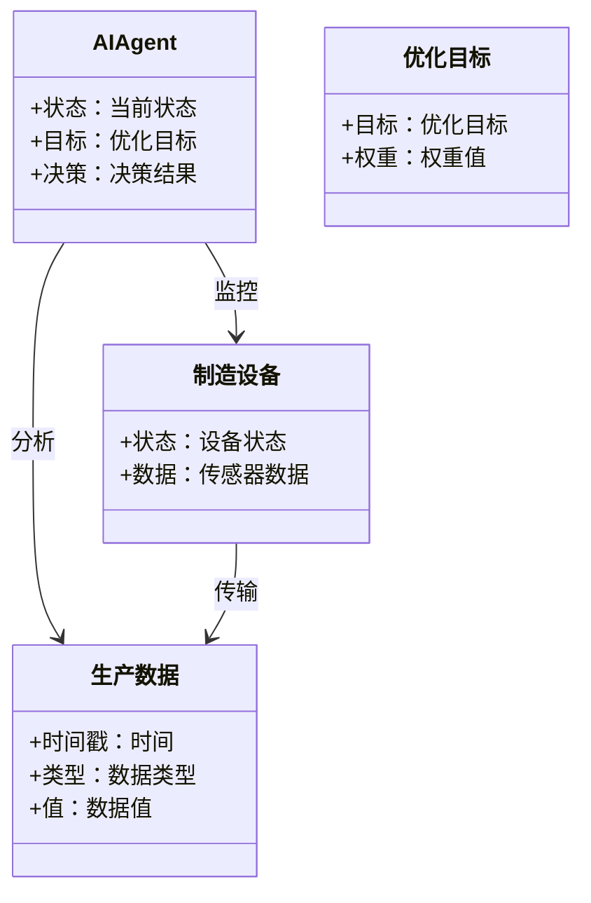
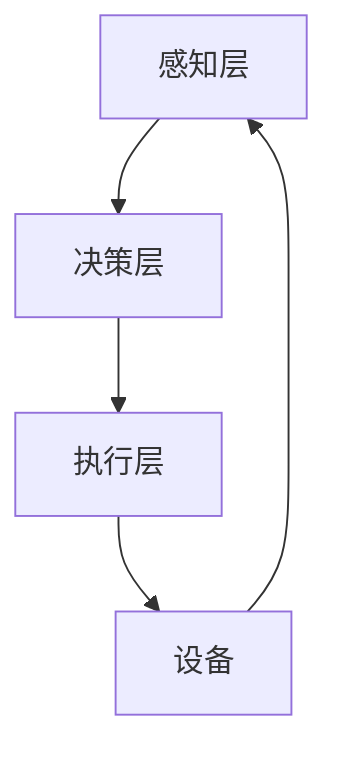
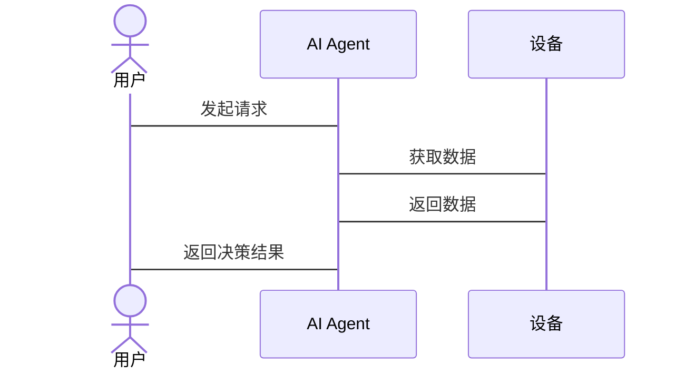

                 


# AI Agent在智能制造中的实践应用

> **关键词**: 智能制造、AI Agent、人工智能、工业自动化、工业互联网、数字化转型

> **摘要**: 本文深入探讨了AI Agent在智能制造中的应用，分析了其在生产优化、设备维护、质量控制等关键领域的实践案例。通过结合强化学习算法和系统架构设计，详细讲解了AI Agent的核心原理、算法流程及系统实现，展示了其在提升生产效率、降低成本和推动工业智能化中的巨大潜力。

---

## 第一部分: AI Agent与智能制造的背景与概念

---

### 第1章: AI Agent与智能制造的背景介绍

#### 1.1 制造业的智能化转型

##### 1.1.1 传统制造业的痛点与挑战
在传统制造业中，企业面临着生产效率低下、资源浪费严重、设备维护成本高等问题。例如，生产线上的设备常常无法实时反馈状态，导致故障发生后才进行维修，造成生产中断。此外，生产过程中的数据孤岛现象严重，不同设备和系统之间的数据难以互联互通，限制了企业的数据驱动决策能力。

##### 1.1.2 智能制造的定义与目标
智能制造是一种通过物联网、大数据、人工智能等技术实现生产过程智能化的新型制造模式。其目标是通过实时数据采集、智能分析和自主决策，优化生产流程，提高产品质量，降低成本。

##### 1.1.3 AI Agent在智能制造中的作用
AI Agent（智能体）是一种能够感知环境、自主决策并执行动作的智能系统。在智能制造中，AI Agent可以用于设备监控、生产优化、质量控制等领域，帮助企业在复杂多变的生产环境中实现高效决策。

#### 1.2 AI Agent的基本概念

##### 1.2.1 AI Agent的定义与特点
AI Agent是指能够通过感知环境、理解任务目标，并通过自主决策和行动来实现特定目标的智能系统。其特点包括自主性、反应性、学习能力和适应性。

##### 1.2.2 AI Agent的核心功能与能力
AI Agent的核心功能包括数据采集与处理、智能决策、自主行动和结果反馈。它能够通过机器学习算法不断优化自身的决策能力，适应不同的生产场景。

##### 1.2.3 AI Agent与传统自动化的区别
传统自动化依赖于预设的程序和规则，而AI Agent能够根据实时数据和环境变化自主调整行为。AI Agent的灵活性和自适应能力使其在复杂场景中更具优势。

#### 1.3 AI Agent在智能制造中的应用前景

##### 1.3.1 智能制造的潜在应用场景
智能制造中，AI Agent可以应用于设备监控、生产优化、质量检测、供应链管理等领域。例如，AI Agent可以通过分析设备的实时数据，预测设备故障并提前进行维护。

##### 1.3.2 AI Agent在智能制造中的优势
AI Agent能够通过实时数据分析快速做出决策，减少生产中断时间，提高生产效率。同时，AI Agent可以通过学习不断优化自身的决策模型，适应不同的生产场景。

##### 1.3.3 AI Agent应用的挑战与机遇
AI Agent的应用面临数据隐私、算法复杂性和系统集成等挑战。然而，随着人工智能技术的快速发展，这些挑战正在逐步被克服，为智能制造带来了更多机遇。

---

## 第二部分: AI Agent的核心概念与原理

---

### 第2章: AI Agent的核心概念与联系

#### 2.1 AI Agent的核心原理

##### 2.1.1 AI Agent的感知与决策机制
AI Agent通过传感器和数据采集系统感知环境，利用机器学习算法分析数据，生成决策并执行动作。例如，AI Agent可以通过分析生产线上的温度和振动数据，预测设备是否会发生故障。

##### 2.1.2 AI Agent的学习与优化算法
AI Agent的核心是其学习和优化算法。常见的算法包括强化学习、监督学习和无监督学习。通过这些算法，AI Agent能够从历史数据中学习，不断优化自身的决策模型。

##### 2.1.3 AI Agent的自主性与适应性
AI Agent的自主性使其能够独立完成任务，而其适应性则使其能够根据环境变化调整行为。例如，在设备故障预测中，AI Agent可以根据历史数据和实时数据不断优化其预测模型。

#### 2.2 AI Agent与智能制造的实体关系图

```mermaid
er
actor: 制造企业
actor: 设备供应商
actor: 用户
class: AI Agent
class: 制造设备
class: 生产数据
class: 优化目标
```

#### 2.3 AI Agent的核心算法流程图



---

## 第三部分: AI Agent的算法原理与数学模型

---

### 第3章: AI Agent的核心算法原理

#### 3.1 基于强化学习的AI Agent算法

##### 3.1.1 强化学习的基本原理
强化学习是一种通过试错方式学习策略的算法。AI Agent通过与环境交互，获得奖励或惩罚，逐步优化其决策策略。

##### 3.1.2 Q-learning算法的数学模型
Q-learning算法的数学模型如下：
$$ Q(s, a) = Q(s, a) + \alpha (r + \gamma \max_{a'} Q(s', a') - Q(s, a)) $$
其中，$Q(s, a)$ 表示在状态 $s$ 下采取动作 $a$ 的价值，$\alpha$ 是学习率，$\gamma$ 是折扣因子，$r$ 是奖励值。

##### 3.1.3 强化学习算法的实现步骤
1. 初始化Q表。
2. 环境提供当前状态。
3. 根据当前状态选择动作。
4. 执行动作，获得奖励和新的状态。
5. 更新Q表。
6. 重复上述步骤，直到达到终止条件。

---

## 第四部分: 系统分析与架构设计

---

### 第4章: 系统分析与架构设计

#### 4.1 系统分析

##### 4.1.1 问题场景介绍
在智能制造中，AI Agent需要实时监控设备状态、优化生产流程并预测设备故障。例如，AI Agent可以用于预测生产线上的设备故障，并提前安排维护。

##### 4.1.2 系统功能设计
系统功能包括数据采集、设备监控、故障预测和优化建议。AI Agent需要能够与多种设备和系统进行交互，处理不同类型的数据。

##### 4.1.3 系统功能的领域模型类图



#### 4.2 系统架构设计

##### 4.2.1 系统架构设计
系统架构包括感知层、决策层和执行层。感知层负责数据采集，决策层负责分析和决策，执行层负责执行动作。

##### 4.2.2 系统架构的mermaid架构图



#### 4.3 系统接口设计

##### 4.3.1 API设计
API设计包括数据接口、决策接口和执行接口。数据接口用于数据的传输，决策接口用于接收决策请求，执行接口用于执行决策结果。

##### 4.3.2 系统交互序列图



---

## 第五部分: 项目实战

---

### 第5章: 项目实战

#### 5.1 环境安装与配置

##### 5.1.1 安装Python
安装Python 3.8及以上版本。

##### 5.1.2 安装依赖
安装以下依赖：
- numpy
- pandas
- matplotlib
- scikit-learn
- gym

#### 5.2 系统核心实现

##### 5.2.1 数据采集与预处理
```python
import numpy as np
import pandas as pd

# 读取数据
data = pd.read_csv('production_data.csv')
# 数据预处理
data = data.dropna()
```

##### 5.2.2 强化学习算法实现
```python
class AI_Agent:
    def __init__(self, state_space, action_space):
        self.state_space = state_space
        self.action_space = action_space
        self.Q = np.zeros((state_space, action_space))
    
    def get_action(self, state, epsilon=0.1):
        if np.random.random() < epsilon:
            return np.random.randint(self.action_space)
        return np.argmax(self.Q[state, :])
    
    def update_Q(self, state, action, reward, next_state, alpha=0.1, gamma=0.9):
        self.Q[state, action] += alpha * (reward + gamma * np.max(self.Q[next_state, :]) - self.Q[state, action])
```

##### 5.2.3 系统集成与测试
```python
# 初始化环境
env = gym.make('ManufacturingEnv-v0')
agent = AI_Agent(env.observation_space, env.action_space)

# 训练过程
for episode in range(1000):
    state = env.reset()
    total_reward = 0
    while True:
        action = agent.get_action(state)
        next_state, reward, done, _ = env.step(action)
        agent.update_Q(state, action, reward, next_state)
        total_reward += reward
        state = next_state
        if done:
            break
    print(f"Episode {episode}, Total Reward: {total_reward}")
```

#### 5.3 案例分析与结果解读

##### 5.3.1 案例分析
在本案例中，AI Agent通过强化学习算法优化了设备的维护策略，减少了设备故障的发生，提高了生产效率。

##### 5.3.2 结果解读
通过训练，AI Agent能够在复杂环境下做出最优决策，显著降低生产成本并提高产品质量。

---

## 第六部分: 总结与展望

---

### 第6章: 总结与展望

#### 6.1 总结
本文详细探讨了AI Agent在智能制造中的应用，分析了其在生产优化、设备维护和质量控制中的实践案例。通过结合强化学习算法和系统架构设计，展示了AI Agent的核心原理和实际应用。

#### 6.2 未来展望
未来，随着人工智能技术的不断发展，AI Agent在智能制造中的应用将更加广泛。其在多智能体协作、边缘计算和工业互联网中的应用潜力巨大，将推动制造业向更高效、更智能的方向发展。

---

## 参考文献

1. Russell, S., & Norvig, P. (2010). Artificial Intelligence: A Modern Approach.
2. Goodfellow, I., Bengio, Y., & Courville, A. (2016). Deep Learning.
3. Mnih, V., et al. (2016). Human-level control through deep reinforcement learning.

---

## 附录

#### 附录A: 工具安装指南
1. Python安装：访问Python官网下载并安装Python。
2. 依赖安装：使用pip安装numpy、pandas、matplotlib和scikit-learn。

#### 附录B: 代码下载链接
代码可通过以下链接下载：[AI Agent代码](#)

---

**作者：AI天才研究院 & 禅与计算机程序设计艺术**

