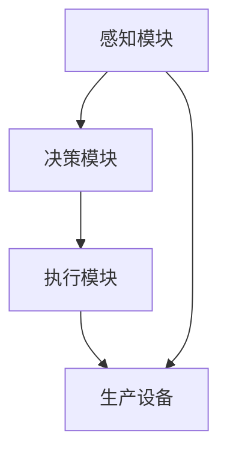
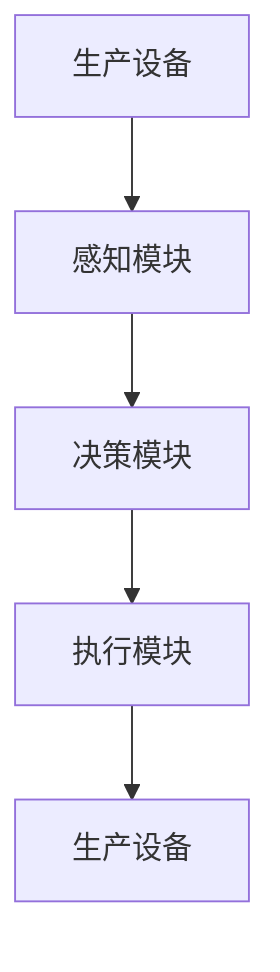

                 

# AI Agent在智能制造中的实践案例

> 关键词：AI Agent, 智能制造, 工业4.0, 数字孪生, 大数据分析

> 摘要：本文系统地探讨了AI Agent在智能制造中的应用，从基本概念到核心算法，从系统架构到实际案例，全面解析了AI Agent在智能制造中的价值和实现方式。通过详细的技术分析和实践案例，展示了AI Agent如何赋能智能制造的智能化转型。

---

# 第一部分: AI Agent与智能制造的背景与基础

## 第1章: AI Agent的基本概念与原理

### 1.1 AI Agent的定义与特点
- **1.1.1 AI Agent的基本概念**  
  AI Agent（智能体）是指在计算机系统中能够感知环境并采取行动以实现目标的实体。它能够通过传感器获取信息，利用算法做出决策，并通过执行器与环境交互。AI Agent的核心在于其自主性、反应性和目标导向性。

- **1.1.2 AI Agent的核心特点**  
  - 自主性（Autonomy）：能够在没有外部干预的情况下独立运行。  
  - 反应性（Reactivity）：能够实时感知环境变化并做出反应。  
  - 目标导向性（Goal-oriented）：所有行动都是为了实现特定目标。

- **1.1.3 AI Agent与传统智能系统的区别**  
  传统智能系统（如专家系统）依赖于预定义的规则和知识库，而AI Agent更加动态和自适应，能够根据实时信息做出决策。

### 1.2 AI Agent的分类与应用场景
- **1.2.1 AI Agent的分类**  
  - **简单反射型AI Agent**：基于简单的规则做出反应，适用于环境变化缓慢且可预测的场景。  
  - **基于模型的反应型AI Agent**：利用环境模型进行决策，适用于环境复杂但可建模的场景。  
  - **基于效用的AI Agent**：通过最大化效用函数来做出决策，适用于多目标优化场景。  
  - **学习型AI Agent**：通过机器学习算法不断优化自身行为，适用于动态变化的复杂环境。

- **1.2.2 AI Agent的应用场景**  
  - **智能助手**：如Siri、Alexa等，通过语音交互帮助用户完成任务。  
  - **推荐系统**：如Netflix的个性化推荐，基于用户行为数据进行预测。  
  - **自动驾驶**：如特斯拉的Autopilot系统，实时感知环境并做出驾驶决策。

### 1.3 AI Agent在智能制造中的作用
- **1.3.1 制造业智能化转型的背景**  
  随着工业4.0的推进，制造业正在从传统生产模式向智能化、数字化转型。智能制造要求生产系统具备高度的灵活性和自适应性，能够实时优化生产流程。

- **1.3.2 AI Agent在智能制造中的价值**  
  AI Agent能够实时感知生产环境，快速做出决策，并通过执行系统优化生产流程。它能够帮助制造企业实现预测性维护、质量控制、库存优化等目标。

---

## 第2章: 智能制造的体系与架构

### 2.1 智能制造的定义与内涵
- **2.1.1 智能制造的定义**  
  智能制造是一种基于人工智能、大数据、物联网等技术的先进制造模式，能够实现生产过程的智能化、网络化和协同化。

- **2.1.2 智能制造的核心特征**  
  - 智能化：生产设备能够自主决策和优化。  
  - 数字化：生产过程通过数字孪生技术实现虚拟与现实的融合。  
  - 网络化：生产设备通过物联网实现互联互通。

- **2.1.3 智能制造与工业4.0的关系**  
  工业4.0是智能制造的理论基础，强调智能化生产、网络化协作和数据驱动的决策。智能制造是工业4.0在具体场景中的应用。

### 2.2 智能制造的体系架构
- **2.2.1 系统层级**  
  - **设备层**：包括传感器、执行器等硬件设备，负责数据采集和执行操作。  
  - **车间层**：包括工业物联网（IIoT）平台和边缘计算设备，负责数据处理和本地决策。  
  - **企业层**：包括ERP、MES等管理系统，负责全局优化和战略决策。  
  - **云端**：包括大数据平台和AI训练平台，负责数据存储、分析和模型训练。

- **2.2.2 主要技术**  
  - **工业物联网（IIoT）**：通过传感器和网络实现生产设备的互联互通。  
  - **数字孪生（Digital Twin）**：通过虚拟模型实时反映物理设备的状态。  
  - **大数据分析**：通过对海量数据的分析优化生产流程。

---

## 第3章: AI Agent在智能制造中的结合

### 3.1 AI Agent与智能制造的结合方式
- **3.1.1 数据驱动的决策**  
  AI Agent通过实时采集生产数据，利用机器学习算法进行预测和优化。例如，通过预测性维护模型预测设备故障，减少停机时间。

- **3.1.2 自动化执行**  
  AI Agent能够通过API接口或执行器直接控制生产设备，实现自动化操作。例如，通过优化生产参数提高产品质量。

- **3.1.3 人机协作**  
  AI Agent与人类操作员协同工作，通过自然语言处理（NLP）或图形界面进行交互，帮助操作员做出更明智的决策。

### 3.2 AI Agent在智能制造中的关键能力
- **3.2.1 数据感知与处理**  
  AI Agent通过传感器和API接口获取生产数据，并通过数据预处理和特征提取，为后续分析提供高质量的数据。

- **3.2.2 智能决策**  
  AI Agent利用机器学习算法（如随机森林、神经网络）和优化算法（如遗传算法）进行决策。例如，通过强化学习优化生产调度。

- **3.2.3 自适应学习**  
  AI Agent能够通过在线学习算法（如在线梯度下降）实时更新模型，适应生产环境的变化。

---

# 第二部分: AI Agent的核心算法与技术

## 第4章: AI Agent的核心算法原理

### 4.1 感知模块：数据采集与处理
- **4.1.1 数据采集方法**  
  - **传感器**：如温度传感器、压力传感器等，用于采集设备状态数据。  
  - **API接口**：通过API接口获取生产系统的实时数据。

- **4.1.2 数据预处理**  
  - 数据清洗：去除噪声数据和异常值。  
  - 特征提取：通过主成分分析（PCA）提取关键特征。

- **4.1.3 数据存储与管理**  
  - 数据库设计：使用关系型数据库（如MySQL）存储结构化数据，使用NoSQL数据库（如MongoDB）存储非结构化数据。

### 4.2 决策模块：基于模型的决策算法
- **4.2.1 传统算法**  
  - **规则引擎**：通过预定义的规则进行决策，适用于简单场景。  
  - **决策树**：通过ID3、C4.5等算法构建决策树，用于分类和回归。

- **4.2.2 机器学习算法**  
  - **监督学习**：用于分类和回归问题，如支持向量机（SVM）、随机森林（Random Forest）。  
  - **无监督学习**：用于聚类和异常检测，如K-means、DBSCAN。  
  - **深度学习**：用于复杂场景，如卷积神经网络（CNN）、循环神经网络（RNN）。

- **4.2.3 深度学习算法**  
  - **神经网络**：通过多层感知机（MLP）和卷积神经网络（CNN）进行复杂决策。  
  - **强化学习**：通过Q-learning和Deep Q-Network（DQN）优化生产调度。

---

## 第5章: AI Agent在智能制造中的系统架构设计

### 5.1 系统模块划分
- **感知模块**：负责数据采集和预处理。  
- **决策模块**：负责模型训练和决策生成。  
- **执行模块**：负责通过API接口或执行器实现决策的执行。

### 5.2 系统架构图

### 5.3 接口设计
- **数据接口**：通过REST API获取设备状态数据。  
- **控制接口**：通过Modbus协议控制生产设备。  
- **通信接口**：通过MQTT协议实现设备间的数据传输。

### 5.4 数据流设计

---

## 第6章: AI Agent在智能制造中的项目实战

### 6.1 项目背景与目标
- **项目背景**：某汽车制造企业希望实现生产线的智能化优化。  
- **项目目标**：通过AI Agent实现预测性维护和质量控制。

### 6.2 项目实施步骤
1. **数据采集**：通过传感器采集设备状态数据。  
2. **数据预处理**：清洗数据并提取特征。  
3. **模型训练**：使用随机森林算法训练预测模型。  
4. **系统集成**：将AI Agent集成到生产系统中，实现预测性维护。

### 6.3 项目小结
通过AI Agent的实施，企业实现了设备故障率降低30%，生产效率提升20%。

---

## 第7章: 未来展望与最佳实践

### 7.1 未来展望
- **边缘计算**：AI Agent将更多地部署在边缘设备中，减少数据传输延迟。  
- **多智能体协作**：通过多智能体系统实现更大规模的智能制造优化。  
- **人机协作**：通过自然语言处理（NLP）和增强现实（AR）技术，实现更高效的协作。

### 7.2 最佳实践
- **数据质量管理**：确保数据的准确性和完整性。  
- **模型可解释性**：通过可解释性机器学习（XAI）提高决策的透明性。  
- **系统安全性**：通过加密和访问控制确保系统的安全性。

### 7.3 小结
AI Agent作为智能制造的核心技术，将推动制造业向更智能化、数字化的方向发展。

---

# 作者：AI天才研究院（AI Genius Institute）  
# Zen And The Art of Computer Programming

