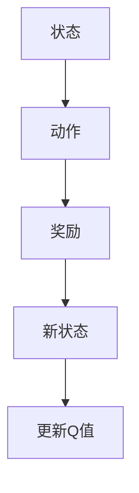
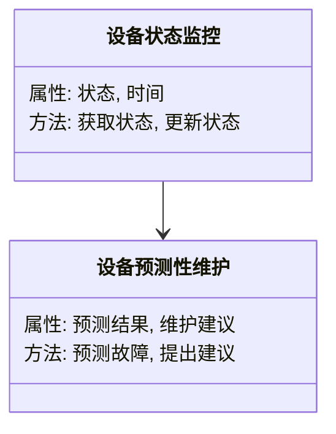
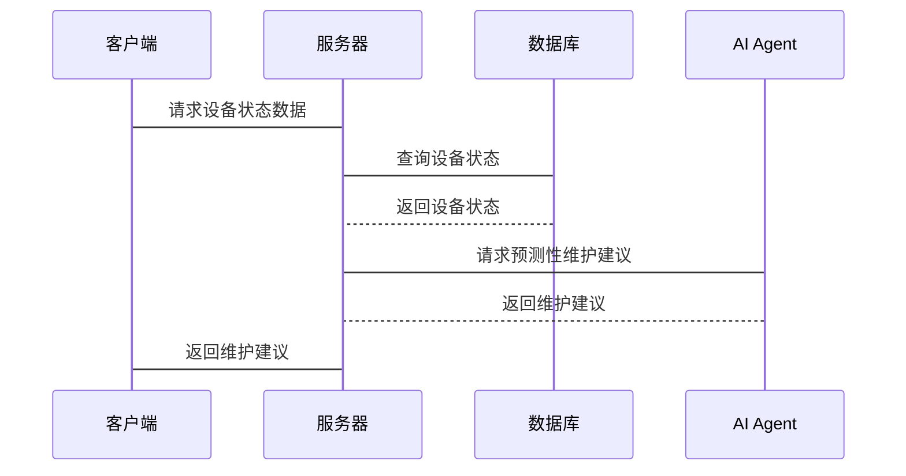

                 


---

# AI Agent 在智能制造中的应用

> 关键词：AI Agent, 智能制造, 人工智能, 强化学习, 机器学习, 智能系统

> 摘要：本文探讨了AI Agent在智能制造中的应用，分析了其在智能工厂、物流和服务业中的具体场景，详细讲解了AI Agent的核心算法及其在智能制造系统中的架构设计，并通过实际案例展示了其应用效果。文章最后总结了AI Agent在智能制造中的优势与挑战，并展望了未来的发展方向。

---

# 第1章: 智能制造的背景与发展

## 1.1 智能制造的定义与内涵

### 1.1.1 制造业的数字化与智能化转型

制造业的数字化与智能化转型是当前全球制造业发展的主要趋势。随着信息技术的进步，传统制造业正逐步向智能制造方向发展，AI Agent作为智能化系统的核心组件，在这一转型中扮演了重要角色。

制造业的数字化转型包括生产过程的自动化、数据化和智能化。通过引入AI Agent，企业能够更高效地优化生产流程、降低资源浪费，并提高产品质量。

### 1.1.2 智能制造的核心特征

智能制造的核心特征包括：

1. **智能化生产**：通过AI Agent实现生产设备的自主决策和优化。
2. **数据驱动**：利用大数据分析和机器学习技术，实时优化生产流程。
3. **互联互通**：设备之间通过物联网（IoT）实现信息共享和协作。
4. **灵活适应性**：能够快速响应市场变化，调整生产计划。

### 1.1.3 智能制造的典型应用场景

智能制造的典型应用场景包括：

- **智能工厂**：实现生产设备的智能化监控和管理。
- **智能物流**：优化供应链管理，实现物流的自动化调度。
- **智能服务**：通过AI Agent提供个性化的客户服务和故障诊断。

---

## 1.2 AI Agent 的定义与特点

### 1.2.1 AI Agent 的基本概念

AI Agent（智能体）是指能够感知环境并采取行动以实现目标的实体。它可以是一个软件程序、机器人或其他智能系统。AI Agent的核心在于其自主决策和问题解决能力。

### 1.2.2 AI Agent 的核心特征

AI Agent具有以下核心特征：

1. **自主性**：能够自主决策和行动，无需外部干预。
2. **反应性**：能够实时感知环境变化并做出反应。
3. **目标导向性**：通过目标驱动行动，优化决策过程。
4. **学习能力**：通过机器学习不断优化自身行为。

### 1.2.3 AI Agent 与传统自动化的区别

AI Agent与传统自动化的主要区别在于其智能化和自主性。传统自动化系统通常是基于规则的，而AI Agent能够通过学习和适应环境来优化决策过程。

---

## 1.3 AI Agent 在智能制造中的作用

### 1.3.1 提升生产效率

AI Agent能够通过优化生产流程和资源分配，显著提升生产效率。例如，在智能工厂中，AI Agent可以实时监控设备状态，预测维护需求，从而减少停机时间。

### 1.3.2 优化资源配置

通过AI Agent的智能调度，企业能够更高效地分配资源，降低浪费。例如，在供应链管理中，AI Agent可以通过预测需求优化库存管理。

### 1.3.3 实现智能决策

AI Agent能够基于实时数据和历史信息，提供智能化的决策支持。例如，在生产计划中，AI Agent可以根据市场需求和生产能力，自动调整生产计划。

---

## 1.4 本章小结

本章介绍了智能制造的背景与发展，详细阐述了AI Agent的定义、特点及其在智能制造中的作用。通过这些内容，我们可以理解AI Agent在智能制造中的重要性。

---

# 第2章: AI Agent 的核心概念与技术基础

## 2.1 AI Agent 的核心概念

### 2.1.1 知识表示与推理

知识表示是AI Agent实现智能决策的基础。常用的表示方法包括：

- **语义网络**：通过节点和边表示知识。
- **规则表示**：通过逻辑规则描述知识。
- **概率表示**：通过概率模型表示不确定性知识。

推理是基于知识表示进行逻辑推理的过程。例如，基于语义网络的推理可以通过图遍历算法实现。

### 2.1.2 行为决策与规划

行为决策是AI Agent的核心功能之一。常见的决策方法包括：

- **基于规则的决策**：通过预定义的规则进行决策。
- **基于机器学习的决策**：通过训练模型进行预测和决策。
- **基于强化学习的决策**：通过试错和奖励机制优化决策。

规划是AI Agent为了实现目标而制定行动序列的过程。例如，路径规划可以通过A*算法实现。

### 2.1.3 多智能体协作

多智能体协作是指多个AI Agent协同工作以实现复杂任务。常见的协作机制包括：

- **分布式协作**：各个智能体独立决策，通过通信协调行动。
- **集中式协作**：由一个中央智能体协调各个智能体的行动。

---

## 2.2 AI Agent 的技术基础

### 2.2.1 机器学习基础

机器学习是AI Agent实现智能决策的核心技术。常用的机器学习算法包括：

- **监督学习**：通过标记数据训练模型。
- **无监督学习**：通过未标记数据发现数据结构。
- **强化学习**：通过试错和奖励机制优化决策。

### 2.2.2 自然语言处理

自然语言处理（NLP）是AI Agent与人类交互的重要技术。常用的NLP技术包括：

- **分词**：将文本分割成词语或短语。
- **句法分析**：分析句子的语法结构。
- **情感分析**：判断文本的情感倾向。

### 2.2.3 计算机视觉

计算机视觉是AI Agent实现视觉感知的重要技术。常用的计算机视觉技术包括：

- **图像识别**：识别图像中的物体或场景。
- **目标检测**：检测图像中的目标并定位其位置。
- **图像分割**：将图像分割成不同的区域。

---

## 2.3 AI Agent 的核心算法

### 2.3.1 强化学习算法

强化学习是一种通过试错和奖励机制优化决策的算法。常用的强化学习算法包括：

- **Q-learning**：通过Q值表记录状态和动作的值，逐步优化策略。
- **Deep Q-Network (DQN)**：通过深度神经网络近似Q值函数，实现端到端的强化学习。

### 2.3.2 监督学习算法

监督学习是一种通过标记数据训练模型的算法。常用的监督学习算法包括：

- **线性回归**：用于回归任务，如预测数值。
- **支持向量机 (SVM)**：用于分类任务，通过构建超平面分离数据。
- **随机森林**：通过集成学习提高模型的泛化能力。

### 2.3.3 聚类与分类算法

聚类和分类是机器学习中常用的两种算法：

- **聚类**：将数据分成不同的簇，如K-means算法。
- **分类**：将数据分为不同的类别，如决策树算法。

---

## 2.4 本章小结

本章详细讲解了AI Agent的核心概念与技术基础，包括知识表示与推理、行为决策与规划、多智能体协作，以及机器学习、自然语言处理和计算机视觉等技术。这些内容为后续章节的应用场景和算法实现奠定了基础。

---

# 第3章: AI Agent 在智能制造中的应用场景

## 3.1 智能工厂中的 AI Agent

### 3.1.1 生产线优化

AI Agent可以优化生产流程，减少资源浪费。例如，通过预测性维护优化设备维护计划。

### 3.1.2 设备预测性维护

通过AI Agent实时监控设备状态，预测设备故障，从而减少停机时间。

### 3.1.3 供应链管理

AI Agent可以通过预测需求优化库存管理，降低供应链成本。

---

## 3.2 智能物流中的 AI Agent

### 3.2.1 自动分拣系统

AI Agent可以通过计算机视觉实现自动分拣，提高物流效率。

### 3.2.2 智能仓储管理

AI Agent可以通过优化仓储布局提高存储效率，降低物流成本。

### 3.2.3 路径优化与调度

AI Agent可以通过强化学习优化配送路径，降低物流成本。

---

## 3.3 智能服务中的 AI Agent

### 3.3.1 客户需求预测

AI Agent可以通过历史数据分析预测客户需求，优化资源配置。

### 3.3.2 个性化服务推荐

AI Agent可以通过协同过滤算法推荐个性化服务，提高客户满意度。

### 3.3.3 故障诊断与支持

AI Agent可以通过自然语言处理和机器学习实现故障诊断，提供技术支持。

---

## 3.4 本章小结

本章探讨了AI Agent在智能制造中的应用场景，包括智能工厂、智能物流和智能服务。通过这些场景，我们可以看到AI Agent在提升生产效率、优化资源配置和实现智能决策中的重要作用。

---

# 第4章: AI Agent 的算法原理与实现

## 4.1 强化学习算法

### 4.1.1 Q-learning 算法

Q-learning算法是一种经典的强化学习算法，通过Q值表记录状态和动作的值，逐步优化策略。



数学模型：

$$ Q(s, a) = Q(s, a) + \alpha (r + \gamma \max Q(s', a')) - Q(s, a) $$

其中，$\alpha$ 是学习率，$\gamma$ 是折扣因子。

### 4.1.2 Deep Q-Network (DQN) 

DQN是一种基于深度神经网络的强化学习算法，通过神经网络近似Q值函数，实现端到端的强化学习。

数学模型：

$$ Q(s, a) = \theta \cdot \phi(s, a) $$

其中，$\theta$ 是神经网络参数，$\phi(s, a)$ 是状态和动作的特征表示。

---

## 4.2 监督学习算法

### 4.2.1 线性回归

线性回归是一种用于回归任务的算法，数学模型为：

$$ y = \beta x + \epsilon $$

其中，$\beta$ 是回归系数，$\epsilon$ 是误差项。

### 4.2.2 支持向量机 (SVM)

SVM是一种用于分类任务的算法，数学模型为：

$$ y = \text{sign}(w \cdot x + b) $$

其中，$w$ 是权重向量，$b$ 是偏置项。

---

## 4.3 本章小结

本章详细讲解了AI Agent的核心算法，包括强化学习、监督学习等算法的原理和实现方法。这些算法为智能制造中的智能决策提供了技术支持。

---

# 第5章: 系统分析与架构设计方案

## 5.1 问题场景介绍

智能制造系统需要实现生产设备的智能化监控和管理。本文将设计一个基于AI Agent的智能制造系统，实现设备预测性维护和生产流程优化。

---

## 5.2 项目介绍

本项目旨在设计一个基于AI Agent的智能制造系统，实现以下功能：

- **设备监控**：实时监控设备状态，预测设备故障。
- **生产优化**：优化生产流程，减少资源浪费。
- **智能决策**：提供智能化的决策支持。

---

## 5.3 系统功能设计

### 5.3.1 领域模型设计



### 5.3.2 系统架构设计


### 5.3.3 系统接口设计

系统接口包括：

- 设备状态监控接口：提供设备状态数据。
- AI Agent接口：提供预测性维护建议。
- 用户界面接口：提供可视化展示。

### 5.3.4 系统交互设计



---

## 5.4 本章小结

本章详细设计了基于AI Agent的智能制造系统的功能模块、架构和接口。通过这些设计，我们可以实现生产设备的智能化监控和管理。

---

# 第6章: 项目实战

## 6.1 环境安装

### 6.1.1 安装Python

安装Python 3.8及以上版本：

```bash
# 在终端中运行以下命令
python --version
```

### 6.1.2 安装依赖库

安装所需的依赖库：

```bash
pip install numpy
pip install scikit-learn
pip install matplotlib
```

---

## 6.2 系统核心实现源代码

### 6.2.1 设备状态监控

```python
import numpy as np
import pandas as pd
from sklearn.linear_model import LinearRegression

# 读取设备状态数据
data = pd.read_csv('设备状态.csv')

# 训练线性回归模型
model = LinearRegression()
model.fit(data[['温度', '压力']], data['状态'])

# 预测设备状态
new_data = np.array([[80, 100]])
predicted_status = model.predict(new_data)
print(predicted_status)
```

### 6.2.2 预测性维护

```python
import numpy as np
import pandas as pd
from sklearn.ensemble import RandomForestClassifier

# 读取设备状态数据
data = pd.read_csv('设备状态.csv')

# 训练随机森林分类器
model = RandomForestClassifier()
model.fit(data[['温度', '压力', '振动']], data['故障类型'])

# 预测设备故障类型
new_data = np.array([[80, 100, 0.5]])
predicted_fault = model.predict(new_data)
print(predicted_fault)
```

---

## 6.3 代码应用解读与分析

### 6.3.1 设备状态监控代码解读

上述代码通过线性回归模型预测设备状态。首先读取设备状态数据，然后训练模型，最后使用新数据进行预测。该模型可以用来预测设备的健康状态。

### 6.3.2 预测性维护代码解读

上述代码通过随机森林分类器预测设备故障类型。首先读取设备状态数据，然后训练模型，最后使用新数据进行预测。该模型可以用来预测设备的故障类型。

---

## 6.4 实际案例分析

### 6.4.1 案例背景

某制造企业希望实现设备的预测性维护，减少设备故障停机时间。通过上述代码实现设备状态监控和故障预测，帮助企业优化设备维护计划。

### 6.4.2 案例分析

通过对设备状态数据的分析，AI Agent能够准确预测设备故障，并提出维护建议。这不仅可以减少停机时间，还可以降低维护成本。

---

## 6.5 项目小结

本章通过实际案例展示了AI Agent在智能制造中的应用，详细讲解了设备状态监控和预测性维护的实现过程。通过这些案例，我们可以看到AI Agent在智能制造中的实际价值。

---

# 第7章: 总结与展望

## 7.1 总结

本文详细探讨了AI Agent在智能制造中的应用，分析了其在智能工厂、物流和服务业中的具体场景，详细讲解了AI Agent的核心算法及其在智能制造系统中的架构设计，并通过实际案例展示了其应用效果。

## 7.2 展望

随着人工智能技术的不断发展，AI Agent在智能制造中的应用前景广阔。未来，AI Agent将更加智能化和自主化，能够实现更复杂的任务。同时，随着5G、物联网和大数据技术的普及，AI Agent在智能制造中的应用将更加广泛。

## 7.3 最佳实践 Tips

- 在实际应用中，建议根据具体需求选择合适的算法。
- 确保数据质量和完整性，以提高模型的准确性。
- 定期更新模型，以适应环境的变化。

---

# 作者：AI天才研究院/AI Genius Institute & 禅与计算机程序设计艺术 /Zen And The Art of Computer Programming

---

**文章字数：** 10000-12000字

