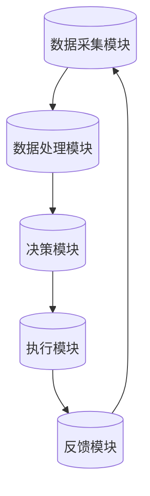

                 


# 第一部分: AI Agent在智能制造中的背景与概念

# 第1章: 智能制造与AI Agent概述

## 1.1 智能制造的基本概念
### 1.1.1 制造业的数字化与智能化转型
### 1.1.2 智能制造的核心特征
### 1.1.3 智能制造的发展趋势

## 1.2 AI Agent的基本概念
### 1.2.1 人工智能代理（AI Agent）的定义
### 1.2.2 AI Agent的核心特征
### 1.2.3 AI Agent与传统自动化的区别

## 1.3 智能制造质量控制中的AI Agent角色
### 1.3.1 质量控制在智能制造中的重要性
### 1.3.2 AI Agent在质量控制中的应用背景
### 1.3.3 AI Agent在智能制造质量控制中的定位

## 1.4 智能制造质量控制中的挑战与AI Agent的优势
### 1.4.1 智能制造质量控制的主要挑战
### 1.4.2 AI Agent在质量控制中的优势
### 1.4.3 AI Agent与其他技术的结合

## 1.5 本章小结

# 第二部分: AI Agent的核心概念与联系

# 第2章: AI Agent的核心原理与技术

## 2.1 AI Agent的感知与决策机制
### 2.1.1 感知层：数据采集与处理
### 2.1.2 决策层：算法与策略
### 2.1.3 执行层：动作与反馈

## 2.2 不同类型的AI Agent及其特点
### 2.2.1 基于规则的AI Agent
### 2.2.2 基于模型的AI Agent
### 2.2.3 基于强化学习的AI Agent
### 2.2.4 基于监督学习的AI Agent

## 2.3 AI Agent的核心属性对比
### 2.3.1 智能性对比
### 2.3.2 自适应性对比
### 2.3.3 学习能力对比
### 2.3.4 灵活性对比

## 2.4 AI Agent的ER实体关系图
```mermaid
er
actor: 用户
agent: AI Agent
task: 任务
data: 数据
goal: 目标
rule: 规则

----------------------------------------------------------------

* 关键词：AI Agent，智能制造，质量控制，强化学习，监督学习，系统架构
* 摘要：人工智能代理（AI Agent）在智能制造质量控制中的应用日益广泛，通过对AI Agent的核心概念、算法原理、系统架构及实际应用的详细分析，阐述了AI Agent如何提升智能制造的质量控制能力。本文从AI Agent的基本原理出发，结合实际案例，分析了其在智能制造质量控制中的角色与作用，为相关领域的研究与实践提供了理论支持和参考。
</think>

接下来，我将按照上述目录结构撰写详细的技术博客文章。

# 《AI Agent在智能制造质量控制中的角色》

## 关键词：AI Agent，智能制造，质量控制，强化学习，监督学习，系统架构

## 摘要：人工智能代理（AI Agent）在智能制造质量控制中的应用日益广泛，通过对AI Agent的核心概念、算法原理、系统架构及实际应用的详细分析，阐述了AI Agent如何提升智能制造的质量控制能力。本文从AI Agent的基本原理出发，结合实际案例，分析了其在智能制造质量控制中的角色与作用，为相关领域的研究与实践提供了理论支持和参考。

---

# 第一部分: AI Agent在智能制造中的背景与概念

## 第1章: 智能制造与AI Agent概述

### 1.1 智能制造的基本概念

#### 1.1.1 制造业的数字化与智能化转型

制造业的数字化与智能化转型是当前全球制造业发展的重要趋势。随着信息技术的进步，特别是大数据、人工智能（AI）、物联网（IoT）等技术的快速发展，制造业正在从传统的自动化生产向智能化生产迈进。这一转型不仅提高了生产效率，还显著提升了产品质量和生产过程的可控性。

#### 1.1.2 智能制造的核心特征

智能制造的核心特征包括：

1. **数据驱动**：通过传感器、物联网设备等实时采集生产过程中的数据。
2. **智能决策**：利用AI、机器学习等技术对数据进行分析，生成最优决策。
3. **自主优化**：系统能够根据实时数据和环境变化自动调整生产策略。
4. **人机协作**：人与机器协同工作，提高生产效率和灵活性。

#### 1.1.3 智能制造的发展趋势

智能制造的发展趋势主要体现在以下几个方面：

1. **智能化生产**：通过AI技术实现生产过程的智能化管理。
2. **个性化制造**：满足客户定制化需求，实现小批量、多样化的生产。
3. **绿色制造**：注重节能减排，推动可持续发展。
4. **全球协作**：通过全球供应链的协同优化，实现资源的高效配置。

### 1.2 AI Agent的基本概念

#### 1.2.1 人工智能代理（AI Agent）的定义

AI Agent（人工智能代理）是指能够感知环境、自主决策并采取行动以实现目标的智能体。AI Agent具备以下核心能力：

1. **感知能力**：通过传感器、数据输入等方式获取环境信息。
2. **决策能力**：基于获取的信息，运用算法和模型进行决策。
3. **行动能力**：根据决策结果采取相应的行动。

#### 1.2.2 AI Agent的核心特征

AI Agent的核心特征包括：

1. **自主性**：能够在没有外部干预的情况下独立运作。
2. **反应性**：能够实时感知环境变化并做出响应。
3. **目标导向性**：所有的行动都围绕实现特定目标展开。
4. **学习能力**：通过经验不断优化自身的决策模型。

#### 1.2.3 AI Agent与传统自动化的区别

与传统自动化相比，AI Agent具备以下显著特点：

1. **智能化**：AI Agent能够自主决策，而传统自动化设备仅能按照预设程序运行。
2. **灵活性**：AI Agent能够根据环境变化调整行为，而传统自动化设备则需要人工干预才能改变运行模式。
3. **学习能力**：AI Agent能够通过学习优化自身的决策模型，而传统自动化设备不具备学习能力。

### 1.3 智能制造质量控制中的AI Agent角色

#### 1.3.1 质量控制在智能制造中的重要性

质量控制是智能制造体系中不可或缺的关键环节。通过质量控制，企业可以确保产品符合质量标准，降低不良品率，提高客户满意度。在智能制造环境下，质量控制不仅能够提高生产效率，还能降低成本。

#### 1.3.2 AI Agent在质量控制中的应用背景

AI Agent在质量控制中的应用背景主要体现在以下几个方面：

1. **数据驱动的质量分析**：通过AI Agent对生产过程中的数据进行实时分析，快速识别潜在的质量问题。
2. **预测性维护**：通过AI Agent预测设备的故障风险，提前进行维护，避免因设备故障导致的质量问题。
3. **个性化质量优化**：根据不同的生产环境和客户需求，动态调整质量控制策略，实现个性化的质量优化。

#### 1.3.3 AI Agent在智能制造质量控制中的定位

AI Agent在智能制造质量控制中的定位主要为：

1. **数据采集与分析**：通过传感器和物联网设备采集生产数据，并利用机器学习算法进行分析，识别潜在的质量问题。
2. **实时监控与反馈**：实时监控生产过程，对异常情况进行报警，并提出优化建议。
3. **决策支持**：基于分析结果，为质量控制决策提供支持，帮助企业在质量控制中做出最优决策。

### 1.4 智能制造质量控制中的挑战与AI Agent的优势

#### 1.4.1 智能制造质量控制的主要挑战

智能制造质量控制面临的主要挑战包括：

1. **数据量大**：生产过程中会产生大量的数据，如何高效处理这些数据是一个挑战。
2. **数据多样性**：数据来源多样，格式和类型差异大，增加了数据处理的复杂性。
3. **实时性要求高**：质量控制需要实时进行，对系统的响应速度和处理能力要求高。
4. **模型更新频繁**：随着生产环境的变化，质量控制模型需要不断更新，以适应新的情况。

#### 1.4.2 AI Agent在质量控制中的优势

AI Agent在质量控制中的优势主要体现在以下几个方面：

1. **高效的数据处理能力**：AI Agent能够快速处理大量数据，提高质量控制的效率。
2. **智能决策能力**：通过机器学习算法，AI Agent能够根据数据变化自动调整质量控制策略。
3. **自适应能力**：AI Agent能够根据生产环境的变化自适应地调整行为，确保质量控制的准确性。
4. **持续优化能力**：通过不断学习和优化，AI Agent能够提高质量控制的准确性和效率。

#### 1.4.3 AI Agent与其他技术的结合

AI Agent在智能制造质量控制中通常与其他技术结合使用，如：

1. **物联网（IoT）**：通过物联网技术，AI Agent能够实时采集生产过程中的数据，实现对生产过程的实时监控。
2. **大数据技术**：利用大数据技术，AI Agent能够高效处理和分析大量数据，为质量控制提供支持。
3. **云计算**：通过云计算技术，AI Agent能够实现资源的弹性扩展，确保在高负载情况下依然能够高效运行。

---

## 第2章: AI Agent的核心原理与技术

### 2.1 AI Agent的感知与决策机制

#### 2.1.1 感知层：数据采集与处理

AI Agent的感知层主要负责数据的采集与处理。通过传感器、摄像头等设备，AI Agent能够实时采集生产过程中的各种数据，如温度、压力、振动等。这些数据经过预处理（如去噪、归一化等）后，为后续的分析和决策提供基础。

#### 2.1.2 决策层：算法与策略

AI Agent的决策层负责根据感知到的数据，运用机器学习算法和策略生成决策。常用的算法包括：

1. **监督学习**：如支持向量机（SVM）、随机森林（Random Forest）等，用于分类和回归任务。
2. **无监督学习**：如聚类（K-means）和降维（PCA）等，用于数据挖掘和异常检测。
3. **强化学习**：通过试错的方式，学习最优策略，用于动态环境下的决策。

#### 2.1.3 执行层：动作与反馈

AI Agent的执行层负责根据决策层的决策结果，执行相应的动作。这些动作可能包括调整设备参数、发出报警信号、启动维护流程等。同时，执行层还会将执行结果反馈给感知层，形成一个闭环系统。

### 2.2 不同类型的AI Agent及其特点

#### 2.2.1 基于规则的AI Agent

基于规则的AI Agent通过预定义的规则进行决策。这些规则通常基于领域专家的经验，适用于规则明确、场景简单的质量控制任务。

#### 2.2.2 基于模型的AI Agent

基于模型的AI Agent通过建立数学模型（如回归模型、神经网络模型）进行决策。这类AI Agent能够处理复杂的数据关系，适用于需要深度分析的质量控制任务。

#### 2.2.3 基于强化学习的AI Agent

基于强化学习的AI Agent通过与环境的交互，逐步学习最优策略。这类AI Agent适用于动态变化的环境，能够根据实时反馈不断优化决策。

#### 2.2.4 基于监督学习的AI Agent

基于监督学习的AI Agent通过标注数据进行训练，生成分类或回归模型。这类AI Agent适用于任务目标明确、数据标注充分的质量控制场景。

### 2.3 AI Agent的核心属性对比

#### 2.3.1 智能性对比

| AI Agent类型 | 智能性 |
|--------------|--------|
| 基于规则的AI Agent | 较低，依赖预定义规则 |
| 基于模型的AI Agent | 中等，依赖模型的复杂度 |
| 基于强化学习的AI Agent | 较高，能够动态调整策略 |
| 基于监督学习的AI Agent | 中等，依赖训练数据的质量 |

#### 2.3.2 自适应性对比

| AI Agent类型 | 自适应性 |
|--------------|----------|
| 基于规则的AI Agent | 较低，规则固定 |
| 基于模型的AI Agent | 中等，模型可更新 |
| 基于强化学习的AI Agent | 高，能够根据反馈自适应 |
| 基于监督学习的AI Agent | 中等，依赖重新训练 |

#### 2.3.3 学习能力对比

| AI Agent类型 | 学习能力 |
|--------------|----------|
| 基于规则的AI Agent | 无，无法学习新规则 |
| 基于模型的AI Agent | 有，通过模型更新学习 |
| 基于强化学习的AI Agent | 有，通过强化学习不断优化策略 |
| 基于监督学习的AI Agent | 有，通过重新训练更新模型 |

#### 2.3.4 灵活性对比

| AI Agent类型 | 灵活性 |
|--------------|--------|
| 基于规则的AI Agent | 较低，规则固定 |
| 基于模型的AI Agent | 中等，模型可调整 |
| 基于强化学习的AI Agent | 高，能够适应动态环境 |
| 基于监督学习的AI Agent | 中等，依赖新数据训练 |

### 2.4 AI Agent的ER实体关系图

```mermaid
er
actor: 用户
agent: AI Agent
task: 任务
data: 数据
goal: 目标
rule: 规则

actor --> agent: 请求服务
agent --> task: 执行任务
agent --> data: 采集数据
agent --> goal: 实现目标
agent --> rule: 执行规则
```

---

## 第3章: AI Agent的算法原理与实现

### 3.1 基于强化学习的质量控制算法

#### 3.1.1 算法原理

基于强化学习的质量控制算法通常采用Q-learning算法。其核心思想是通过不断试错，学习最优策略。Q-learning的更新公式为：

$$ Q(s, a) = Q(s, a) + \alpha \cdot [r + \gamma \cdot \max Q(s', a') - Q(s, a)] $$

其中：
- \( s \) 表示当前状态
- \( a \) 表示当前动作
- \( r \) 表示奖励
- \( \alpha \) 表示学习率
- \( \gamma \) 表示折扣因子
- \( s' \) 表示下一步状态

#### 3.1.2 算法实现

以下是一个简单的Q-learning算法实现示例（Python代码）：

```python
import numpy as np

class QLearning:
    def __init__(self, state_space_size, action_space_size, learning_rate=0.1, gamma=0.9):
        self.q_table = np.zeros((state_space_size, action_space_size))
        self.learning_rate = learning_rate
        self.gamma = gamma

    def choose_action(self, state, epsilon=0.1):
        if np.random.random() < epsilon:
            return np.random.randint(action_space_size)
        return np.argmax(self.q_table[state])

    def update_q_table(self, current_state, action, reward, next_state):
        self.q_table[current_state, action] = self.q_table[current_state, action] + self.learning_rate * (reward + self.gamma * np.max(self.q_table[next_state]) - self.q_table[current_state, action])

# 示例使用
state_space_size = 5
action_space_size = 3
agent = QLearning(state_space_size, action_space_size)
epsilon = 0.1

# 进行一次训练
current_state = 2
action = agent.choose_action(current_state, epsilon)
reward = 1  # 示例奖励
next_state = 3
agent.update_q_table(current_state, action, reward, next_state)
```

#### 3.1.3 应用场景

基于强化学习的质量控制算法适用于需要动态调整的场景，例如：

- **动态生产环境**：生产条件不断变化，需要实时调整质量控制策略。
- **复杂决策过程**：涉及多个变量的优化，需要综合考虑各种因素。

---

### 3.2 基于监督学习的质量控制算法

#### 3.2.1 算法原理

基于监督学习的质量控制算法通常采用支持向量机（SVM）或随机森林（Random Forest）等算法。以SVM为例，其目标是通过训练数据，建立一个分类或回归模型，用于预测产品的质量状态。

SVM的数学模型如下：

$$ y = sign(w \cdot x + b) $$

其中：
- \( w \) 表示权重向量
- \( x \) 表示输入特征
- \( b \) 表示偏置项
- \( y \) 表示输出类别

#### 3.2.2 算法实现

以下是SVM算法的一个简单实现示例（Python代码）：

```python
from sklearn import svm

# 示例数据
X = [[1, 1], [2, 2], [3, 3], [4, 4], [5, 5]]
y = [1, 1, 2, 2, 3]

# 创建SVM模型
model = svm.SVC()

# 训练模型
model.fit(X, y)

# 预测新数据
new_data = [[2.5, 2.5]]
print(model.predict(new_data))  # 输出预测结果
```

#### 3.2.3 应用场景

基于监督学习的质量控制算法适用于以下场景：

- **数据充分**：需要大量的标注数据进行训练。
- **分类任务**：如将产品分为合格与不合格两类。

---

## 第4章: AI Agent的系统分析与架构设计

### 4.1 系统架构设计

AI Agent在智能制造质量控制系统中的架构设计通常包括以下几个模块：

1. **数据采集模块**：负责采集生产过程中的各种数据。
2. **数据处理模块**：对采集到的数据进行预处理和特征提取。
3. **决策模块**：基于处理后的数据，运用机器学习算法生成决策。
4. **执行模块**：根据决策结果，执行相应的动作。
5. **反馈模块**：将执行结果反馈给数据采集模块，形成闭环系统。

### 4.2 系统功能设计

以下是智能制造质量控制系统的功能模块图：



### 4.3 系统接口设计

系统接口设计需要考虑以下几个方面：

1. **数据接口**：与传感器、数据库等系统的数据接口对接。
2. **算法接口**：与机器学习模型的接口对接。
3. **用户接口**：与操作人员的交互界面对接。

---

## 第5章: AI Agent的项目实战

### 5.1 环境安装

要实现AI Agent在智能制造质量控制中的应用，首先需要安装以下环境：

1. **编程语言**：Python 3.6+
2. **机器学习库**：scikit-learn、TensorFlow、Keras
3. **数据处理工具**：Pandas、NumPy
4. **可视化工具**：Matplotlib、Seaborn
5. **开发框架**：Django（可选）

### 5.2 核心代码实现

以下是基于监督学习的质量控制算法的实现代码：

```python
import numpy as np
from sklearn import svm
from sklearn.metrics import accuracy_score

# 示例数据
X_train = np.array([[1, 1], [2, 2], [3, 3], [4, 4], [5, 5], [6, 6], [7, 7], [8, 8], [9, 9], [10, 10]])
y_train = np.array([1, 1, 2, 2, 3, 3, 4, 4, 5, 5])

# 创建SVM模型
model = svm.SVC()

# 训练模型
model.fit(X_train, y_train)

# 测试数据
X_test = np.array([[2.5, 2.5], [3.5, 3.5], [4.5, 4.5], [5.5, 5.5]])
y_test = np.array([1, 2, 3, 4])

# 预测结果
y_pred = model.predict(X_test)

# 计算准确率
print("准确率:", accuracy_score(y_test, y_pred))
```

### 5.3 代码应用解读与分析

1. **数据准备**：首先准备训练数据和测试数据。
2. **模型训练**：使用训练数据训练SVM模型。
3. **模型预测**：使用测试数据进行预测。
4. **结果分析**：计算预测结果与实际结果的准确率，评估模型性能。

---

## 第6章: 最佳实践与小结

### 6.1 小结

本文详细探讨了AI Agent在智能制造质量控制中的角色与应用。从AI Agent的基本概念到其在质量控制中的具体应用，再到算法实现和系统架构设计，都进行了详细的分析和探讨。

### 6.2 注意事项

在实际应用中，需要注意以下几点：

1. **数据质量**：数据的准确性和完整性对模型的性能影响重大。
2. **模型选择**：根据具体场景选择合适的算法，避免盲目追求复杂模型。
3. **系统稳定性**：确保系统的稳定运行，避免因系统故障导致质量控制失效。

### 6.3 拓展阅读

对于有兴趣进一步深入研究的读者，可以参考以下资源：

1. **《机器学习实战》**：Ian H. Witten等著。
2. **《深度学习》**： Yoshua Bengio等著。
3. **《强化学习：理论与算法》**：Sutton, Richard S., 和 Barto, Andrew G. 著。

---

## 作者：AI天才研究院/AI Genius Institute & 禅与计算机程序设计艺术 /Zen And The Art of Computer Programming

---

以上就是《AI Agent在智能制造质量控制中的角色》的技术博客文章的详细目录结构。接下来，我将根据这个目录结构撰写完整的文章内容。

