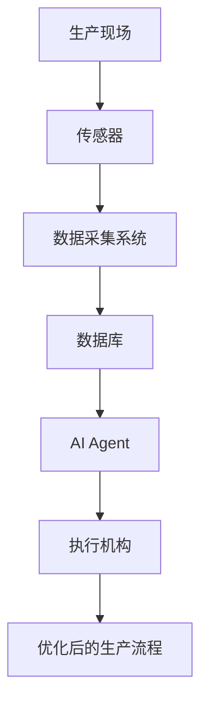

                 


# AI Agent在智能制造过程优化中的角色

**关键词**：智能制造、AI Agent、过程优化、强化学习、DQN算法、系统架构、项目实战

**摘要**：  
智能制造是现代制造业的重要趋势，旨在通过数字化和智能化技术提升生产效率和产品质量。AI Agent（人工智能代理）在其中扮演着关键角色，通过智能化决策和优化算法，帮助企业在复杂生产环境中实现高效运作。本文将详细探讨AI Agent在智能制造中的核心作用，从概念、算法、系统架构到实际应用，全面分析其在生产流程优化中的潜力和实现路径。通过案例分析和代码实现，进一步验证其在智能制造中的实际价值。

---

## 第1章：智能制造概述

### 1.1 智能制造的定义与特点  
智能制造是一种基于数字化技术的制造模式，通过物联网（IoT）、大数据、人工智能（AI）和自动化技术的融合，实现生产过程的智能化、高效化和灵活化。其特点包括：  
1. **数据驱动**：依赖实时数据进行决策。  
2. **自动化**：从数据采集到执行的自动化流程。  
3. **智能化**：通过AI技术实现自主优化和问题解决。  
4. **灵活性**：能够快速适应市场需求变化。  

### 1.2 AI Agent的基本概念  
AI Agent是一种智能实体，能够感知环境、做出决策并执行动作。在智能制造中，AI Agent通常被设计为能够：  
1. **感知环境**：通过传感器和数据采集系统获取生产过程中的实时信息。  
2. **分析数据**：利用机器学习算法对数据进行分析和预测。  
3. **做出决策**：基于分析结果，制定优化策略并执行。  

---

## 第2章：AI Agent在智能制造中的角色

### 2.1 智能制造中的优化问题  
智能制造的核心目标是优化生产流程，降低资源浪费，提高产品质量和效率。常见的优化问题包括：  
1. **生产流程优化**：减少生产周期时间。  
2. **质量控制**：实时检测和纠正生产中的缺陷。  
3. **资源分配**：合理分配人力、设备和原材料。  

### 2.2 AI Agent的核心功能  
AI Agent在智能制造中的核心功能包括：  
1. **数据采集与分析**：从传感器和数据库中获取数据，进行实时分析。  
2. **智能决策与优化**：基于数据分析结果，制定最优策略。  
3. **自适应与动态调整**：根据环境变化动态调整生产计划。  

---

## 第3章：AI Agent的核心概念与原理

### 3.1 状态空间与动作空间  
在强化学习中，AI Agent的决策过程依赖于**状态空间**和**动作空间**：  
- **状态空间**：表示环境中的所有可能状态，例如生产过程中的温度、压力等参数。  
- **动作空间**：表示AI Agent在某一状态下可执行的所有动作，例如调整设备参数或启动某个生产流程。  

### 3.2 奖励函数与目标函数  
AI Agent通过**奖励函数**和**目标函数**来优化其行为：  
- **奖励函数**：定义AI Agent在执行某个动作后的奖励或惩罚，引导其向最优策略靠近。  
- **目标函数**：定义AI Agent的最终优化目标，例如最大化生产效率或最小化成本。  

### 3.3 AI Agent的决策过程  
AI Agent的决策过程可以分为三个主要阶段：  
1. **知识表示与推理**：将问题转化为可计算的形式，例如通过数学模型表示生产流程。  
2. **行为规划与选择**：基于当前状态和历史经验，选择最优动作。  
3. **学习与优化**：通过强化学习算法不断优化其决策策略。  

---

## 第4章：AI Agent的算法原理

### 4.1 强化学习算法  
强化学习是一种通过试错机制优化决策策略的算法。常用的强化学习算法包括：  
- **Q-learning算法**：通过更新Q值表来学习最优策略。  
- **DQN算法**：结合深度神经网络和强化学习，实现复杂环境下的决策优化。  

### 4.2 算法的数学模型  
以Q-learning算法为例，其数学模型如下：  
$$ Q(s, a) = Q(s, a) + \alpha (r + \gamma \max Q(s', a') - Q(s, a)) $$  
其中：  
- \( Q(s, a) \)：状态-动作对的价值。  
- \( \alpha \)：学习率。  
- \( r \)：奖励值。  
- \( \gamma \)：折扣因子。  

### 4.3 算法实现与优化  
通过神经网络实现DQN算法的伪代码如下：  

```python
class DQN:
    def __init__(self, state_size, action_size):
        self.state_size = state_size
        self.action_size = action_size
        self.model = self.build_model()

    def build_model(self):
        # 构建神经网络模型
        model = Sequential()
        model.add(Dense(64, activation='relu', input_dim=self.state_size))
        model.add(Dense(32, activation='relu'))
        model.add(Dense(self.action_size, activation='linear'))
        model.compile(optimizer='adam', loss='mse')
        return model

    def remember(self, state, action, reward, next_state):
        # 记忆单元格
        pass

    def act(self, state):
        # 选择动作
        pass

    def replay(self):
        # 回忆经验
        pass
```

---

## 第5章：智能制造系统的架构设计

### 5.1 系统整体架构  
智能制造系统的架构通常包括以下组件：  
1. **生产过程监控**：实时监控生产过程中的各项参数。  
2. **数据采集与分析**：通过传感器和数据库获取数据，并进行分析和预测。  
3. **AI Agent决策系统**：基于分析结果，制定优化策略并执行。  
4. **执行机构**：根据AI Agent的决策，调整设备参数或启动相关流程。  

### 5.2 系统架构图  
以下是智能制造系统的架构图：  



---

## 第6章：项目实战

### 6.1 环境安装  
安装必要的环境和库：  
- Python 3.8+  
- TensorFlow 2.0+  
- Keras  
- OpenAI Gym  

### 6.2 核心代码实现  
以下是DQN算法的实现代码：  

```python
import numpy as np
import gym
from tensorflow.keras import layers

# 定义环境
env = gym.make('CartPole-v1')
env.seed(123)

# 构建DQN模型
model = Sequential()
model.add(layers.Dense(64, activation='relu', input_shape=(4,)))
model.add(layers.Dense(32, activation='relu'))
model.add(layers.Dense(2, activation='linear'))
model.compile(optimizer='adam', loss='mse')

# 训练过程
def train_model(episodes=1000):
    for episode in range(episodes):
        state = env.reset()
        total_reward = 0
        while True:
            # 选择动作
            if np.random.random() < 0.9:  # 探索策略
                action = env.action_space.sample()
            else:
                Q = model.predict(np.array([state]))
                action = np.argmax(Q[0])
            
            # 执行动作
            next_state, reward, done, _ = env.step(action)
            total_reward += reward
            
            # 回忆经验
            experience_replay(model, state, action, reward, next_state)
            
            state = next_state
            if done:
                break
        print(f"Episode {episode}, Reward: {total_reward}")

def experience_replay(model, state, action, reward, next_state):
    # 简单的回放机制
    pass

train_model()
```

### 6.3 实际案例分析  
通过上述代码实现，AI Agent能够在训练过程中逐步掌握优化生产流程的策略，从而在实际生产中实现效率和质量的提升。  

---

## 总结

AI Agent在智能制造中的应用前景广阔，其通过强化学习算法和智能化决策，能够显著提升生产效率和产品质量。然而，在实际应用中，仍需关注算法的收敛速度、计算资源的消耗以及系统的可扩展性。未来，随着AI技术的不断进步，AI Agent将在智能制造中发挥更加重要的作用。

---

**作者：AI天才研究院/AI Genius Institute & 禅与计算机程序设计艺术 /Zen And The Art of Computer Programming**

