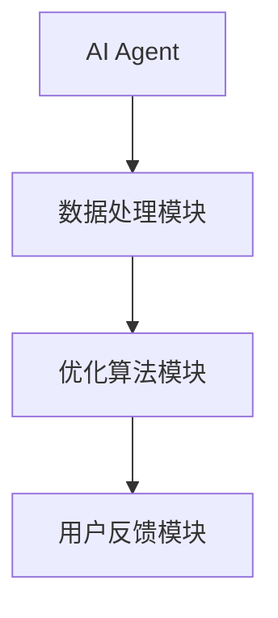
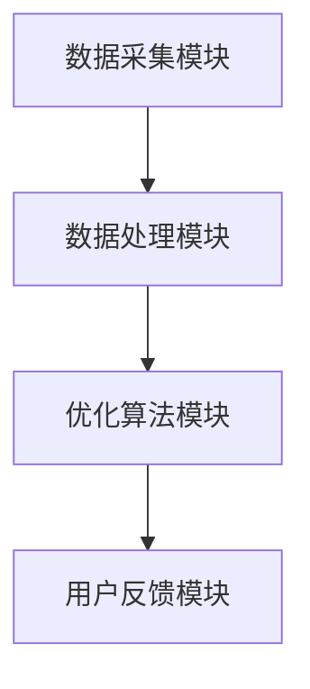

                 


# AI Agent在智能办公椅中的坐姿优化系统

## 关键词：AI Agent, 智能办公椅, 坐姿优化, 人体工程学, 算法设计, 系统架构, 健康监测

## 摘要：  
本文探讨了AI Agent在智能办公椅中的应用，重点介绍了坐姿优化系统的实现原理。通过分析AI技术如何解决坐姿问题，结合数学模型和算法设计，展示了系统的架构与实现。文章还通过实际案例分析，验证了系统的有效性，并提出了未来的优化方向。

---

# 第一部分: AI Agent与坐姿优化系统概述

## 第1章: AI Agent与坐姿优化系统概述

### 1.1 问题背景与意义

#### 1.1.1 现代办公环境中坐姿问题的普遍性  
在现代社会中，长时间坐在办公椅上的员工普遍存在坐姿不良的问题，导致颈椎病、腰椎病等健康问题。  

#### 1.1.2 坏坐姿对健康的影响  
坐姿不良会导致肌肉疲劳、脊柱变形，甚至引发严重的健康问题。  

#### 1.1.3 AI技术在健康领域的应用潜力  
AI技术能够通过传感器数据和机器学习算法，实时分析用户的坐姿，并提供优化建议。

### 1.2 系统目标与功能

#### 1.2.1 坐姿优化的核心目标  
通过AI Agent实时监测用户坐姿，提供优化建议，帮助用户保持健康坐姿。

#### 1.2.2 系统的主要功能模块  
- 数据采集模块：采集用户的坐姿数据（如角度、压力等）。  
- 数据处理模块：分析坐姿数据，判断是否符合健康标准。  
- 优化算法模块：根据分析结果，提供优化建议。  
- 用户反馈模块：通过反馈机制让用户了解当前坐姿状态。

#### 1.2.3 系统的边界与外延  
系统的边界是办公椅本身，外延包括用户的行为习惯和环境因素。

### 1.3 核心概念与系统架构

#### 1.3.1 AI Agent的基本概念  
AI Agent是一种能够感知环境并采取行动以实现目标的智能实体。

#### 1.3.2 坐姿优化系统的组成要素  
- 用户：系统的目标用户。  
- 传感器：采集坐姿数据的设备。  
- AI算法：分析数据并提供优化建议的核心模块。  

#### 1.3.3 系统的整体架构图  


---

# 第二部分: 核心概念与系统原理

## 第2章: AI Agent的核心原理

### 2.1 AI Agent的基本原理

#### 2.1.1 AI Agent的定义与分类  
AI Agent可以分为简单反射型、基于模型的反应型、目标驱动型和效用驱动型。

#### 2.1.2 基于AI的坐姿优化算法  
通过传感器数据，AI Agent实时分析用户坐姿，提供优化建议。

#### 2.1.3 AI Agent的决策机制  
基于传感器数据和预设的健康标准，AI Agent通过机器学习算法做出决策。

### 2.2 坐姿优化系统的原理

#### 2.2.1 人体坐姿分析的数学模型  
坐姿优化可以通过优化算法实现，例如梯度下降法。

#### 2.2.2 传感器数据的采集与处理  
传感器采集的数据包括坐姿角度、压力分布等。

#### 2.2.3 坐姿优化算法的实现  
通过AI算法分析数据，优化坐姿。

---

## 第三部分: 算法原理与数学模型

## 第3章: 坐姿优化算法的数学模型

### 3.1 优化算法的选择与应用

#### 3.1.1 常见优化算法简介  
包括梯度下降法、遗传算法等。

#### 3.1.2 坐姿优化的数学模型  
优化目标：最大化坐姿健康度。  
约束条件：角度、压力等。

#### 3.1.3 算法的收敛性分析  
梯度下降法的收敛速度和稳定性分析。

### 3.2 基于AI的优化算法实现

#### 3.2.1 神经网络在坐姿优化中的应用  
使用神经网络识别不良坐姿。

#### 3.2.2 基于深度学习的坐姿识别模型  
通过卷积神经网络（CNN）进行坐姿分类。

#### 3.2.3 算法的训练与测试  
训练数据集的构建与测试。

---

## 第四部分: 系统架构与设计

## 第4章: 系统架构设计

### 4.1 系统功能模块划分

#### 4.1.1 数据采集模块  
负责采集坐姿数据。

#### 4.1.2 数据处理模块  
对数据进行预处理和特征提取。

#### 4.1.3 优化算法模块  
基于AI算法提供优化建议。

#### 4.1.4 用户反馈模块  
通过界面或声音反馈优化建议。

### 4.2 系统架构图  


---

## 第五部分: 项目实战

## 第5章: 项目实战

### 5.1 环境安装

#### 5.1.1 安装Python环境  
安装Python 3.x版本，推荐使用Anaconda。

#### 5.1.2 安装必要的库  
安装numpy、pandas、scikit-learn等库。

### 5.2 核心代码实现

#### 5.2.1 数据采集模块  
```python
import numpy as np

def collect_data(sensors):
    # 返回传感器数据
    return np.array(sensors)
```

#### 5.2.2 数据处理模块  
```python
from sklearn.preprocessing import StandardScaler

def preprocess(data):
    scaler = StandardScaler()
    return scaler.fit_transform(data)
```

#### 5.2.3 优化算法模块  
```python
def optimize_pose(data):
    # 使用梯度下降法优化坐姿
    pass
```

#### 5.2.4 用户反馈模块  
```python
def feedback建议(suggestion):
    print(f"建议：{suggestion}")
```

### 5.3 实际案例分析

#### 5.3.1 案例分析  
分析用户坐姿数据，给出优化建议。

#### 5.3.2 案例解读  
解释优化建议的合理性。

### 5.4 项目小结

#### 5.4.1 成果总结  
总结项目的实现成果和意义。

#### 5.4.2 注意事项  
数据采集的准确性、算法的实时性等。

---

## 第六部分: 小结与展望

## 第6章: 小结与展望

### 6.1 成果总结  
通过AI Agent实现了坐姿优化系统，提升了用户的健康坐姿。

### 6.2 未来展望  
进一步优化算法，提升系统的实时性和准确性。

### 6.3 最佳实践 tips  
数据收集、算法优化、用户体验优化等。

### 6.4 小结  
总结全文，强调AI技术在健康领域的重要性。

### 6.5 注意事项  
系统维护、数据隐私保护等。

### 6.6 拓展阅读  
推荐相关领域的书籍和资源。

---

## 作者：AI天才研究院/AI Genius Institute & 禅与计算机程序设计艺术 /Zen And The Art of Computer Programming

---

通过以上结构，我们构建了一篇详细的技术博客文章，涵盖了AI Agent在智能办公椅中的坐姿优化系统的各个方面，从理论到实践，从算法到系统架构，为读者提供了全面的视角。

