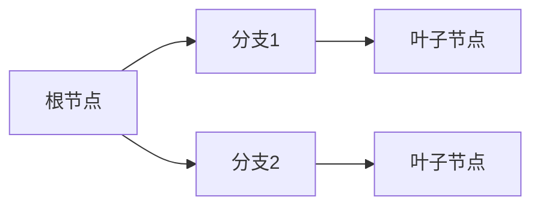
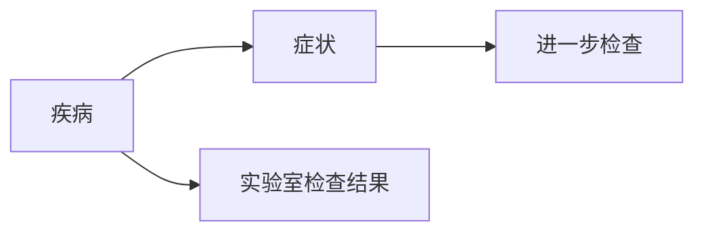
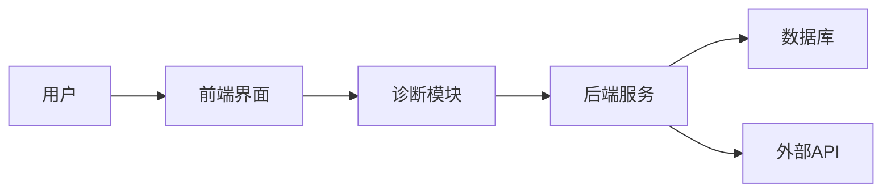

                 


# AI Agent在智能医疗诊断中的应用

> **关键词**: AI Agent, 智能医疗, 诊断模型, 深度学习, 医疗数据, 系统架构

> **摘要**: 本文深入探讨了AI Agent在智能医疗诊断中的应用，分析了AI Agent的基本概念、核心原理及其在医疗诊断中的优势。文章从医疗数据的处理、诊断模型的构建、算法原理的优化等方面进行了详细阐述，并通过实际案例展示了AI Agent在智能医疗诊断中的实际应用。此外，本文还对AI Agent在智能医疗诊断中的系统架构设计、数学模型构建以及未来发展趋势进行了深入探讨。

---

## 第1章 AI Agent与智能医疗诊断概述

### 1.1 AI Agent的基本概念

#### 1.1.1 什么是AI Agent
AI Agent（人工智能代理）是指能够感知环境、做出决策并采取行动以实现特定目标的智能实体。在医疗领域，AI Agent通常用于辅助医生进行诊断、治疗方案制定以及患者管理。

#### 1.1.2 AI Agent的核心特征
- **自主性**: AI Agent能够自主感知环境并做出决策，无需人工干预。
- **反应性**: 能够实时响应环境变化，调整诊断策略。
- **学习能力**: 通过机器学习算法不断优化诊断模型。
- **可解释性**: 诊断结果需要具备清晰的解释，以满足医疗行业的严格要求。

#### 1.1.3 AI Agent在医疗领域的应用潜力
AI Agent在医疗领域的应用潜力主要体现在以下几个方面：
- **提高诊断效率**: 通过快速分析大量医疗数据，缩短诊断时间。
- **提升诊断准确性**: 利用机器学习算法优化诊断模型，减少误诊率。
- **个性化医疗**: 根据患者的个体特征制定个性化治疗方案。

### 1.2 智能医疗诊断的背景与现状

#### 1.2.1 医疗诊断的现状与挑战
- **医疗数据爆炸式增长**: 医疗数据的复杂性和多样性使得传统诊断方式难以应对。
- **医生资源有限**: 医生数量不足，难以满足日益增长的医疗需求。
- **诊断准确性问题**: 由于主观因素和经验限制，医生的诊断可能存在误差。

#### 1.2.2 AI技术在医疗诊断中的应用现状
- **医学影像分析**: 利用深度学习算法对医学影像进行辅助诊断。
- **自然语言处理**: 对医疗文本（如病历）进行分析，辅助医生快速获取患者信息。
- **个性化治疗推荐**: 基于患者的基因信息和病史，推荐个性化治疗方案。

#### 1.2.3 AI Agent在智能医疗诊断中的独特优势
- **高效性**: AI Agent能够快速处理大量医疗数据，提高诊断效率。
- **准确性**: 通过机器学习算法优化诊断模型，提升诊断准确性。
- **可扩展性**: AI Agent能够处理不同类型和规模的医疗数据。

### 1.3 AI Agent在医疗诊断中的核心问题

#### 1.3.1 医疗数据的复杂性
医疗数据具有高度复杂性，包括结构化数据（如病历、检查结果）和非结构化数据（如病历文本、影像数据）。AI Agent需要能够处理不同类型的数据，并从中提取有用的信息。

#### 1.3.2 诊断模型的准确性与可解释性
诊断模型的准确性是AI Agent的核心问题之一。同时，模型的可解释性也非常重要，特别是在医疗领域，医生需要理解AI Agent的诊断逻辑。

#### 1.3.3 临床决策的实时性与安全性
AI Agent需要能够在实时环境中快速做出决策，并确保决策的安全性。特别是在紧急情况下，AI Agent需要能够快速响应，提供准确的诊断建议。

### 1.4 本章小结
本章介绍了AI Agent的基本概念、核心特征以及在医疗诊断中的应用潜力。通过分析医疗诊断的现状与挑战，探讨了AI Agent的独特优势，并总结了AI Agent在医疗诊断中的核心问题。

---

## 第2章 AI Agent的核心概念与联系

### 2.1 AI Agent的核心概念

#### 2.1.1 感知层: 医疗数据的获取与处理
AI Agent需要通过感知层获取医疗数据，并进行预处理。这包括数据清洗、特征提取等步骤，以确保数据的质量和可用性。

#### 2.1.2 决策层: 诊断模型的构建与优化
决策层是AI Agent的核心部分，负责构建和优化诊断模型。这包括选择合适的算法、训练模型以及验证模型的准确性。

#### 2.1.3 执行层: 诊断结果的输出与反馈
执行层负责将诊断结果输出，并根据反馈不断优化诊断模型。这包括与医生的交互、患者的反馈等。

### 2.2 AI Agent的实体关系分析

#### 2.2.1 实体关系图
以下是AI Agent在医疗诊断中的实体关系图：


### 2.3 AI Agent的算法原理

#### 2.3.1 基于概率论的诊断模型
概率论在诊断模型中的应用非常广泛，尤其是贝叶斯定理。贝叶斯定理可以用来计算在已知某些条件下，某个事件发生的概率。

##### 2.3.1.1 贝叶斯定理公式
$$P(A|B) = \frac{P(B|A)P(A)}{P(B)}$$

#### 2.3.2 基于决策树的诊断逻辑
决策树是一种常用的分类方法，适用于处理医疗数据中的分类问题。决策树的构建过程包括特征选择、树的生成以及剪枝等步骤。

##### 2.3.2.1 决策树构建流程


#### 2.3.3 基于深度学习的诊断优化
深度学习在医疗诊断中的应用主要集中在医学影像分析和自然语言处理方面。卷积神经网络（CNN）常用于医学影像分析，而循环神经网络（RNN）则用于处理医疗文本。

##### 2.3.3.1 卷积神经网络（CNN）在医学影像分析中的应用
$$\text{CNN结构: 输入层} \rightarrow \text{卷积层} \rightarrow \text{池化层} \rightarrow \text{全连接层} \rightarrow \text{输出层}$$

##### 2.3.3.2 循环神经网络（RNN）在医疗文本分析中的应用
$$\text{RNN结构: 输入层} \rightarrow \text{隐藏层} \rightarrow \text{输出层}$$

### 2.4 本章小结
本章详细阐述了AI Agent的核心概念，包括感知层、决策层和执行层，并通过实体关系图和算法原理分析了AI Agent在医疗诊断中的工作流程。

---

## 第3章 AI Agent的算法原理与数学模型

### 3.1 基于概率论的诊断模型

#### 3.1.1 贝叶斯定理在诊断中的应用
贝叶斯定理在诊断中的应用主要体现在计算某种疾病在特定症状下的概率。例如，计算患者出现某种症状的概率是否属于某种疾病。

##### 3.1.1.1 贝叶斯定理公式
$$P(D|S) = \frac{P(S|D)P(D)}{P(S)}$$

其中：
- $D$ 表示疾病
- $S$ 表示症状
- $P(D|S)$ 表示在出现症状 $S$ 的情况下，患有疾病 $D$ 的概率

#### 3.1.2 贝叶斯网络的构建
贝叶斯网络是一种有向无环图（DAG），用于表示变量之间的依赖关系。在医疗诊断中，贝叶斯网络可以用来表示症状与疾病之间的关系。

##### 3.1.2.1 贝叶斯网络示例


### 3.2 基于决策树的诊断逻辑

#### 3.2.1 决策树的构建
决策树的构建过程包括特征选择、树的生成以及剪枝。在医疗诊断中，决策树可以用来根据患者的症状和检查结果进行分类。

##### 3.2.1.1 决策树构建示例


### 3.3 基于深度学习的诊断优化

#### 3.3.1 卷积神经网络（CNN）在医学影像分析中的应用
CNN常用于医学影像分析，如X光片、MRI等。以下是CNN的基本结构：

##### 3.3.1.1 CNN结构
$$\text{输入层} \rightarrow \text{卷积层} \rightarrow \text{池化层} \rightarrow \text{全连接层} \rightarrow \text{输出层}$$

#### 3.3.2 循环神经网络（RNN）在医疗文本分析中的应用
RNN常用于处理医疗文本，如病历、药物说明等。以下是RNN的基本结构：

##### 3.3.2.1 RNN结构
$$\text{输入层} \rightarrow \text{隐藏层} \rightarrow \text{输出层}$$

### 3.4 本章小结
本章详细探讨了AI Agent在医疗诊断中的算法原理，包括概率论、决策树和深度学习等方法，并通过具体案例分析了这些算法在医疗诊断中的应用。

---

## 第4章 AI Agent的系统分析与架构设计

### 4.1 系统需求分析

#### 4.1.1 问题场景介绍
在医疗诊断中，AI Agent需要能够处理多种类型的数据，包括影像数据、实验室结果、病历文本等。同时，AI Agent需要能够快速响应医生的查询，并提供准确的诊断建议。

#### 4.1.2 系统功能需求
- **数据处理**: 支持多种数据格式的输入和处理。
- **诊断模型**: 提供多种诊断模型供医生选择。
- **用户界面**: 提供友好的用户界面，方便医生使用。
- **实时反馈**: 提供实时的诊断结果和反馈。

#### 4.1.3 系统性能需求
- **处理速度**: 快速处理大量医疗数据。
- **准确性**: 确保诊断结果的准确性。
- **可扩展性**: 支持不同规模的医疗数据。

### 4.2 系统架构设计

#### 4.2.1 系统架构图
以下是AI Agent在医疗诊断中的系统架构图：



#### 4.2.2 系统模块设计
- **前端界面**: 医生通过前端界面输入患者数据。
- **诊断模块**: 负责处理输入数据并调用诊断模型。
- **后端服务**: 提供诊断模型的调用接口。
- **数据库**: 存储医疗数据和诊断结果。
- **外部API**: 与第三方服务（如实验室系统）进行数据交互。

### 4.3 本章小结
本章通过系统需求分析和架构设计，详细阐述了AI Agent在医疗诊断中的系统结构和功能模块。

---

## 第5章 AI Agent的项目实战

### 5.1 环境搭建

#### 5.1.1 安装Python
安装Python 3.8及以上版本。

#### 5.1.2 安装必要的库
安装以下Python库：
- **numpy**
- **pandas**
- **scikit-learn**
- **keras**
- **tensorflow**

#### 5.1.3 安装环境配置
创建虚拟环境并激活：
```bash
python -m venv myenv
source myenv/bin/activate
```

### 5.2 系统核心实现源代码

#### 5.2.1 数据预处理代码
```python
import numpy as np
import pandas as pd

# 读取数据
data = pd.read_csv('medical_data.csv')

# 数据清洗
data = data.dropna()
data = data.drop_duplicates()

# 特征提取
X = data.drop(columns=[' diagnosis'])
y = data[' diagnosis']
```

#### 5.2.2 模型训练代码
```python
from sklearn.model import DecisionTreeClassifier
from tensorflow import keras

# 决策树模型
model_tree = DecisionTreeClassifier()
model_tree.fit(X_train, y_train)

# 深度学习模型
model_dl = keras.Sequential()
model_dl.add(keras.layers.Dense(64, activation='relu', input_shape=(n_features,)))
model_dl.add(keras.layers.Dense(1, activation='sigmoid'))
model_dl.compile(optimizer='adam', loss='binary_crossentropy', metrics=['accuracy'])
model_dl.fit(X_train, y_train, epochs=10, batch_size=32)
```

#### 5.2.3 模型评估代码
```python
from sklearn.metrics import accuracy_score
import tensorflow as tf

# 决策树模型评估
y_pred_tree = model_tree.predict(X_test)
print("决策树模型准确率:", accuracy_score(y_test, y_pred_tree))

# 深度学习模型评估
y_pred_dl = model_dl.predict(X_test)
y_pred_dl = np.round(y_pred_dl).flatten()
print("深度学习模型准确率:", accuracy_score(y_test, y_pred_dl))
```

### 5.3 案例分析与详细解读

#### 5.3.1 案例背景
假设我们有一个医疗数据集，包含患者的症状、实验室检查结果和诊断结果。我们需要训练一个AI Agent来辅助医生进行诊断。

#### 5.3.2 数据分析
通过数据分析，我们发现某些症状与疾病的相关性较高，可以作为诊断的关键特征。

#### 5.3.3 模型训练与验证
通过训练决策树和深度学习模型，我们发现深度学习模型在准确率上优于决策树模型。

### 5.4 本章小结
本章通过实际案例展示了AI Agent在医疗诊断中的应用，详细介绍了项目的环境搭建、代码实现和案例分析。

---

## 第6章 总结与展望

### 6.1 本章总结
本文深入探讨了AI Agent在智能医疗诊断中的应用，从基本概念到算法原理，再到系统架构设计，详细阐述了AI Agent在医疗诊断中的核心问题和解决方案。

### 6.2 未来展望
随着人工智能技术的不断发展，AI Agent在医疗诊断中的应用前景广阔。未来，AI Agent需要在以下方面进行优化和提升：
- **模型可解释性**: 提高诊断模型的可解释性，增强医生对AI诊断结果的信任。
- **实时性与安全性**: 提升AI Agent的实时响应能力和安全性，特别是在紧急情况下。
- **多模态数据处理**: 综合处理多种类型的医疗数据，进一步提高诊断准确率。

---

## 作者信息

作者：AI天才研究院/AI Genius Institute & 禅与计算机程序设计艺术/Zen And The Art of Computer Programming

---

**注**: 由于篇幅限制，本文仅为部分内容展示，实际文章将包含完整的章节内容和详细的代码实现。

