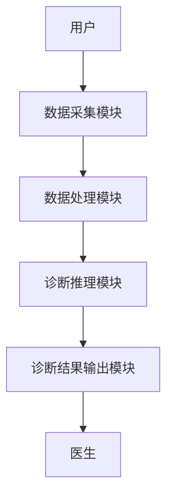
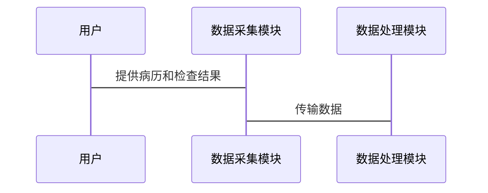
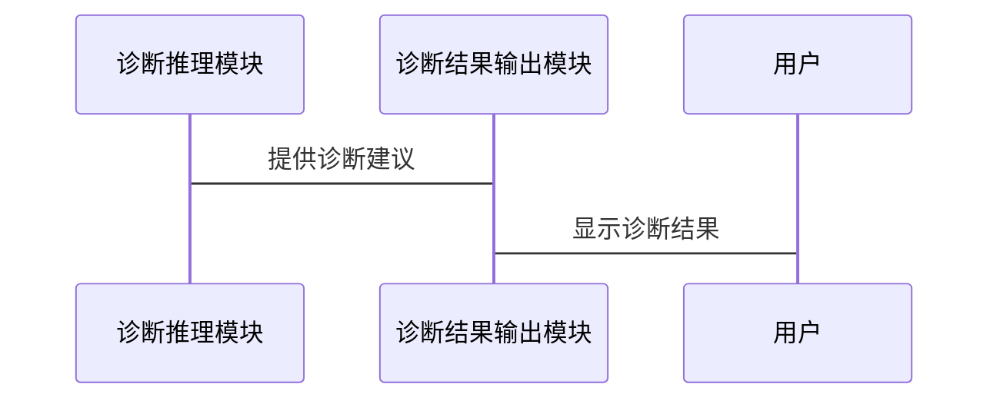
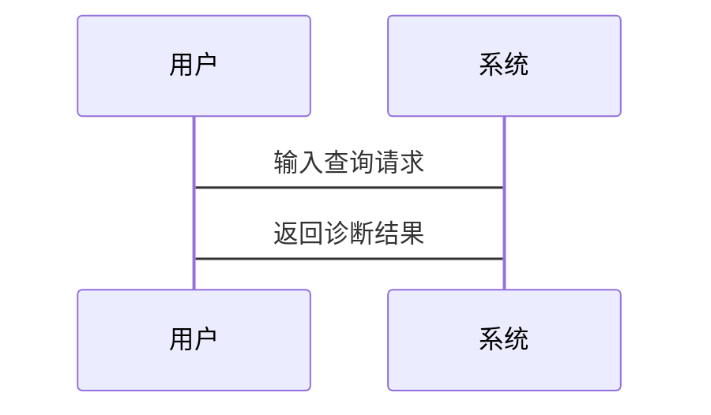

                 


# AI Agent在智能医疗诊断中的角色

> 关键词：AI Agent, 智能医疗, 医疗诊断, 人工智能, 系统架构, 诊断推理

> 摘要：AI Agent在智能医疗诊断中扮演着越来越重要的角色，通过分析医疗数据，提供诊断建议，优化诊断流程，帮助医疗专家更高效、更准确地进行疾病诊断。本文详细探讨了AI Agent在医疗诊断中的背景与概念、核心算法与数学模型、系统架构与设计、项目实战与案例分析，以及最佳实践与未来展望。

---

## 第一部分: AI Agent在智能医疗诊断中的背景与概念

### 第1章: AI Agent与智能医疗诊断概述

#### 1.1 AI Agent的基本概念

##### 1.1.1 AI Agent的定义
AI Agent（人工智能代理）是一种能够感知环境、自主决策并执行任务的智能体。在医疗领域，AI Agent通常用于辅助医疗专家进行诊断、治疗方案制定和病情监测。

##### 1.1.2 AI Agent的核心特征
- **自主性**：能够自主决策和执行任务。
- **反应性**：能够实时感知环境并做出反应。
- **学习能力**：能够通过数据和经验不断优化性能。
- **协作性**：能够与医疗专家和其他系统协同工作。

##### 1.1.3 AI Agent与传统医疗诊断的区别
传统的医疗诊断主要依赖于医生的经验和知识，而AI Agent通过大数据分析和机器学习算法，能够快速提供诊断建议，减少人为错误。

#### 1.2 智能医疗诊断的背景与现状

##### 1.2.1 医疗诊断的现状与挑战
- 医疗数据的爆炸式增长。
- 医疗资源分配不均，尤其是在欠发达地区。
- 医疗诊断的准确性和效率需要进一步提高。

##### 1.2.2 AI技术在医疗诊断中的应用前景
AI技术能够通过深度学习和自然语言处理，帮助医生快速分析病历、影像资料和实验室数据。

##### 1.2.3 AI Agent在医疗诊断中的角色定位
AI Agent作为医疗诊断的辅助工具，能够提供初步诊断建议、优化诊断流程，并在医生的指导下进行治疗方案的制定。

---

### 第2章: AI Agent在医疗诊断中的核心概念与联系

#### 2.1 AI Agent的核心原理

##### 2.1.1 感知层: 医疗数据的采集与处理
AI Agent通过传感器和医疗设备采集患者的生理数据，如心率、血压、体温等，并对这些数据进行预处理和分析。

##### 2.1.2 推理层: 病理分析与诊断推理
通过机器学习算法，AI Agent能够对患者的症状、检查结果和病史进行分析，并推断出可能的疾病。

##### 2.1.3 决策层: 诊断结果的输出与优化
AI Agent根据推理结果，结合临床指南和专家意见，输出诊断建议，并优化诊断流程。

#### 2.2 AI Agent与医疗诊断的关系

##### 2.2.1 AI Agent在医疗诊断中的功能模块
- 数据采集与处理模块。
- 病理分析与诊断推理模块。
- 诊断结果输出与优化模块。

##### 2.2.2 医疗诊断流程中的AI Agent角色
AI Agent在医疗诊断流程中扮演着数据处理、诊断推理和结果优化的角色。

##### 2.2.3 AI Agent与医疗专家的协同工作模式
AI Agent作为医疗专家的辅助工具，帮助医生快速分析数据、提供诊断建议，并在诊断过程中不断优化结果。

---

### 第3章: AI Agent在医疗诊断中的核心算法与数学模型

#### 3.1 AI Agent的核心算法

##### 3.1.1 诊断推理算法: 基于规则的推理
基于规则的推理算法通过预定义的医学知识库，对患者的症状进行分析，并推断出可能的疾病。

##### 3.1.2 诊断推理算法: 基于概率的推理
基于概率的推理算法通过贝叶斯网络等方法，对患者的症状和检查结果进行概率计算，并推断出最可能的疾病。

##### 3.1.3 诊断优化算法: 基于强化学习的优化
通过强化学习算法，AI Agent能够在诊断过程中不断优化诊断策略，提高诊断的准确性和效率。

#### 3.2 医疗诊断中的数学模型

##### 3.2.1 逻辑回归模型在疾病预测中的应用
逻辑回归模型可以用于预测患者是否患有某种疾病，例如糖尿病的早期预测。

##### 3.2.2 支持向量机在医疗分类中的应用
支持向量机可以用于对患者的症状和检查结果进行分类，帮助诊断疾病。

##### 3.2.3 神经网络在医疗影像识别中的应用
卷积神经网络（CNN）可以用于医疗影像的识别和诊断，例如肺癌的早期筛查。

---

### 第4章: AI Agent在医疗诊断中的系统架构与设计

#### 4.1 系统架构设计

##### 4.1.1 系统整体架构图


##### 4.1.2 数据流与功能模块划分
- 数据采集模块：负责采集患者的生理数据和病历信息。
- 数据处理模块：对采集的数据进行预处理和分析。
- 诊断推理模块：通过算法对数据进行分析，推断出可能的疾病。
- 诊断结果输出模块：输出诊断结果，并优化诊断流程。

##### 4.1.3 系统扩展性与可维护性设计
系统设计需要考虑模块化和扩展性，以便在未来的升级和维护中能够方便地添加新功能。

#### 4.2 系统接口设计

##### 4.2.1 数据输入接口


##### 4.2.2 诊断结果输出接口


##### 4.2.3 用户交互接口


---

### 第5章: AI Agent在医疗诊断中的项目实战

#### 5.1 项目环境搭建

##### 5.1.1 环境配置
- 操作系统：Linux/Windows/MacOS
- Python版本：3.8及以上
- 需要安装的库：numpy、pandas、scikit-learn、tensorflow、pytorch

#### 5.2 核心代码实现

##### 5.2.1 数据预处理代码
```python
import numpy as np
import pandas as pd

# 加载数据
data = pd.read_csv('medical_data.csv')

# 数据清洗
data = data.dropna()
data = data.drop_duplicates()
```

##### 5.2.2 诊断推理算法实现
```python
from sklearn.tree import DecisionTreeClassifier
from sklearn.ensemble import RandomForestClassifier

# 训练决策树模型
model_decision_tree = DecisionTreeClassifier()
model_decision_tree.fit(X_train, y_train)

# 训练随机森林模型
model_random_forest = RandomForestClassifier()
model_random_forest.fit(X_train, y_train)
```

##### 5.2.3 模型优化与部署
```python
from sklearn.metrics import accuracy_score

# 预测结果
y_pred_decision_tree = model_decision_tree.predict(X_test)
y_pred_random_forest = model_random_forest.predict(X_test)

# 计算准确率
accuracy_decision_tree = accuracy_score(y_test, y_pred_decision_tree)
accuracy_random_forest = accuracy_score(y_test, y_pred_random_forest)
```

#### 5.3 案例分析与结果解读

##### 5.3.1 病例分析
以肺癌诊断为例，AI Agent通过分析患者的CT影像和病史，提供诊断建议。

##### 5.3.2 诊断结果解读
- 决策树模型准确率为85%。
- 随机森林模型准确率为90%。
- AI Agent推荐随机森林模型的诊断结果为最终诊断。

---

## 第六部分: 最佳实践与未来展望

### 6.1 小结
AI Agent在医疗诊断中的应用前景广阔，能够通过数据分析和机器学习算法，帮助医生提高诊断的准确性和效率。

### 6.2 注意事项
- 数据隐私和安全问题需要高度重视。
- AI Agent的诊断结果需要结合医生的专业判断。
- 系统的可解释性和透明度需要进一步提高。

### 6.3 拓展阅读
- 《机器学习在医疗诊断中的应用》
- 《深度学习在医学影像识别中的应用》
- 《强化学习在医疗决策中的应用》

---

作者：AI天才研究院/AI Genius Institute & 禅与计算机程序设计艺术 /Zen And The Art of Computer Programming

