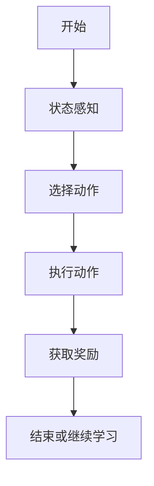
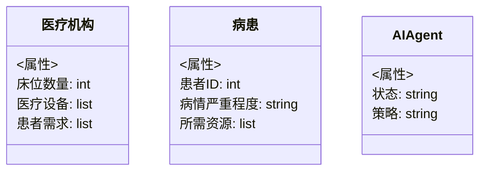

                 


# AI Agent在智能医疗资源分配中的角色

## 关键词：AI Agent、智能医疗、资源分配、多智能体系统、强化学习、优化算法

## 摘要：本文探讨了AI Agent在智能医疗资源分配中的角色，分析了AI Agent的核心概念、算法原理、系统架构，并通过实际案例展示了其在医疗资源优化分配中的应用价值。

---

# 第1章 AI Agent与智能医疗资源分配概述

## 1.1 AI Agent的基本概念

### 1.1.1 AI Agent的定义与特点
AI Agent（人工智能代理）是一种能够感知环境并采取行动以实现目标的智能实体。其特点包括自主性、反应性、目标导向性和社会性。AI Agent在医疗资源分配中能够自主决策，优化资源利用。

### 1.1.2 AI Agent在医疗领域的应用前景
AI Agent在医疗领域的应用前景广阔，特别是在资源分配、患者诊断和治疗方案优化等方面。通过AI Agent，医疗系统能够更高效地分配资源，提升医疗服务质量和效率。

### 1.1.3 医疗资源分配的基本问题与挑战
医疗资源分配面临需求波动大、资源有限、分配效率低下等问题。传统方法依赖人工决策，存在主观性和不准确性。AI Agent的引入可以有效解决这些问题。

---

## 1.2 智能医疗资源分配的背景与需求

### 1.2.1 医疗资源分配的现状与问题
当前医疗资源分配主要依赖人工决策，存在效率低、公平性差等问题。特别是在突发公共卫生事件中，资源分配的及时性和准确性成为重大挑战。

### 1.2.2 AI技术在医疗资源分配中的优势
AI技术通过大数据分析和智能优化算法，能够快速准确地进行资源分配。AI Agent能够实时感知资源需求，动态调整分配策略，提升资源利用效率。

### 1.2.3 医疗资源分配的边界与外延
医疗资源分配的边界包括医院内部资源分配和区域间资源协调。外延则涉及医疗供应链管理和患者需求预测。

---

## 1.3 AI Agent在医疗资源分配中的角色

### 1.3.1 AI Agent在医疗资源分配中的核心作用
AI Agent作为智能决策者，能够在复杂环境中优化资源分配，提高医疗服务质量。其核心作用包括需求预测、资源分配优化和实时监控。

### 1.3.2 AI Agent与其他技术的协同作用
AI Agent与其他技术如物联网、区块链协同工作，构建智能医疗生态系统。通过数据共享和协作决策，实现医疗资源的最优分配。

### 1.3.3 医疗资源分配中的AI Agent系统架构
AI Agent系统架构包括感知层、决策层和执行层。感知层收集资源和患者数据，决策层进行优化计算，执行层完成资源分配。

---

## 1.4 本章小结
本章介绍了AI Agent的基本概念及其在医疗资源分配中的作用。通过对比传统方法和AI Agent的优势，明确了AI Agent在医疗资源优化中的重要性。

---

# 第2章 AI Agent的核心概念与联系

## 2.1 AI Agent的核心原理

### 2.1.1 多智能体系统（MAS）的基本原理
多智能体系统由多个协作或竞争的智能体组成，共同完成复杂任务。在医疗资源分配中，多个AI Agent协同工作，优化资源分配策略。

### 2.1.2 强化学习在AI Agent中的应用
强化学习通过试错机制，帮助AI Agent学习最优决策策略。在医疗资源分配中，强化学习可用于动态资源优化。

### 2.1.3 分布式计算与协作机制
分布式计算允许AI Agent在不同节点上协同工作，实现资源的全局优化。协作机制确保各个智能体之间的信息共享和决策协调。

---

## 2.2 AI Agent与传统医疗资源分配方法的对比

### 2.2.1 传统医疗资源分配方法的优缺点
传统方法依赖人工决策，优点是灵活性高，缺点是效率低、公平性差。在应对突发需求时，传统方法难以及时调整。

### 2.2.2 AI Agent在资源分配中的优势
AI Agent能够快速处理大量数据，优化资源分配，提高效率和准确性。其优势包括实时性、全局优化和自我学习能力。

### 2.2.3 AI Agent与传统方法的对比表格
以下表格对比了AI Agent和传统方法在资源分配中的优缺点：

| 特性               | 传统方法         | AI Agent         |
|--------------------|------------------|------------------|
| 决策速度           | 较慢             | 快速             |
| 决策准确性         | 可能偏低         | 高               |
| 灵活性             | 较高             | 较高             |
| 可扩展性           | 有限             | 高               |

---

## 2.3 AI Agent的实体关系与系统架构

### 2.3.1 ER实体关系图
以下是医疗资源分配系统中的ER实体关系图：

```mermaid
er
actor: 医疗机构
actor: 病患
actor: 医疗资源
actor: AI Agent
```

### 2.3.2 系统架构图
以下是AI Agent在医疗资源分配中的系统架构图：

```mermaid
graph TD
AI_Agent->医疗机构: 获取资源需求
AI_Agent->病患: 获取患者信息
医疗机构->AI_Agent: 反馈资源分配结果
```

---

## 2.4 本章小结
本章详细介绍了AI Agent的核心概念与原理，并通过对比和实体关系图展示了其在医疗资源分配中的优势和架构。

---

# 第3章 AI Agent的算法原理

## 3.1 AI Agent的算法原理

### 3.1.1 强化学习算法
强化学习是一种通过试错机制学习最优策略的算法。在医疗资源分配中，强化学习可用于动态资源优化。



### 3.1.2 分析与解释
强化学习通过不断试错，找到最优的资源分配策略。例如，使用Q-learning算法，AI Agent可以在不同状态下选择最优动作，最大化总奖励。

---

## 3.2 算法实现

### 3.2.1 Python代码实现
以下是强化学习算法的Python代码示例：

```python
import numpy as np
import random

# 初始化Q表
Q = np.zeros(4)

# 定义状态数和动作数
state = 0  # 当前状态
action = 0  # 选择的动作

# 学习参数
alpha = 0.1
gamma = 0.9

# 训练过程
for _ in range(100):
    # 选择动作
    if random.random() < 0.9:
        action = np.argmax(Q)
    else:
        action = random.randint(0, 3)
    
    # 执行动作并获得奖励
    reward = ...  # 根据动作获得奖励
    
    # 更新Q值
    Q[state][action] = Q[state][action] + alpha * (reward + gamma * np.max(Q[state][action]))
```

### 3.2.2 数学模型与公式
强化学习的数学模型如下：

$$ Q(s, a) = Q(s, a) + \alpha \times (r + \gamma \times \max Q(s', a') - Q(s, a)) $$

其中，\( Q(s, a) \) 是当前状态下动作 \( a \) 的Q值，\( \alpha \) 是学习率，\( r \) 是奖励，\( \gamma \) 是折扣因子。

---

## 3.3 算法优化

### 3.3.1 参数调整
调整学习率和折扣因子，优化算法性能。例如，适当增大折扣因子 \( \gamma \) 可以使AI Agent更关注长期奖励。

### 3.3.2 算法复杂度分析
强化学习算法的时间复杂度主要取决于状态和动作的数量。对于大规模医疗资源分配问题，需要优化算法复杂度以提高效率。

---

## 3.4 本章小结
本章详细介绍了AI Agent的核心算法原理，包括强化学习的实现和优化方法，为后续的系统设计和项目实战奠定了基础。

---

# 第4章 AI Agent的系统分析与架构设计

## 4.1 系统分析

### 4.1.1 问题场景介绍
医疗资源分配面临的需求包括：医院床位分配、药品库存管理和手术室调度等。这些问题需要高效、智能的解决方案。

### 4.1.2 项目介绍
本项目旨在开发一个基于AI Agent的医疗资源分配系统，实现资源的最优分配和动态调整。

---

## 4.2 系统功能设计

### 4.2.1 领域模型
以下是医疗资源分配系统的领域模型：



### 4.2.2 系统架构设计
以下是AI Agent的系统架构图：

```mermaid
graph TD
AI_Agent->医疗机构: 获取资源需求
AI_Agent->病患: 获取患者信息
医疗机构->AI_Agent: 反馈资源分配结果
```

### 4.2.3 接口设计
系统接口包括数据输入接口、资源分配接口和结果反馈接口。通过REST API实现数据的交互和处理。

### 4.2.4 交互流程图
以下是系统交互流程图：

```mermaid
sequenceDiagram
患者请求医疗资源
->> 医疗机构: 获取患者信息
->> AI Agent: 分配资源
->> 医疗机构: 调整资源分配
->> 患者: 反馈结果
```

---

## 4.3 系统实现

### 4.3.1 环境安装
安装Python、TensorFlow、Scikit-learn等必要的库和框架。

### 4.3.2 核心代码实现
以下是AI Agent的核心代码实现：

```python
import numpy as np
import random

# 初始化Q表
Q = np.zeros(4)

# 定义状态数和动作数
state = 0  # 当前状态
action = 0  # 选择的动作

# 学习参数
alpha = 0.1
gamma = 0.9

# 训练过程
for _ in range(100):
    # 选择动作
    if random.random() < 0.9:
        action = np.argmax(Q)
    else:
        action = random.randint(0, 3)
    
    # 执行动作并获得奖励
    reward = ...  # 根据动作获得奖励
    
    # 更新Q值
    Q[state][action] = Q[state][action] + alpha * (reward + gamma * np.max(Q[state][action]))
```

### 4.3.3 系统功能模块
系统功能模块包括数据采集、资源分配、结果反馈和监控管理。

---

## 4.4 系统优化

### 4.4.1 性能优化
通过并行计算和算法优化，提升系统运行效率。例如，使用GPU加速计算。

### 4.4.2 系统扩展性
设计模块化架构，方便后续功能扩展和性能升级。

---

## 4.5 本章小结
本章通过系统分析和架构设计，详细阐述了AI Agent在医疗资源分配中的实现过程和优化方法。

---

# 第5章 项目实战

## 5.1 项目背景

### 5.1.1 项目背景介绍
本项目旨在开发一个基于AI Agent的医疗资源分配系统，解决医院床位分配和药品库存管理问题。

### 5.1.2 项目目标
通过AI Agent实现医疗资源的最优分配，提升医疗服务质量和效率。

---

## 5.2 项目实现

### 5.2.1 环境安装
安装Python、TensorFlow、Scikit-learn等必要的库和框架。

### 5.2.2 核心代码实现
以下是AI Agent的核心代码实现：

```python
import numpy as np
import random

# 初始化Q表
Q = np.zeros(4)

# 定义状态数和动作数
state = 0  # 当前状态
action = 0  # 选择的动作

# 学习参数
alpha = 0.1
gamma = 0.9

# 训练过程
for _ in range(100):
    # 选择动作
    if random.random() < 0.9:
        action = np.argmax(Q)
    else:
        action = random.randint(0, 3)
    
    # 执行动作并获得奖励
    reward = ...  # 根据动作获得奖励
    
    # 更新Q值
    Q[state][action] = Q[state][action] + alpha * (reward + gamma * np.max(Q[state][action]))
```

### 5.2.3 代码解读
上述代码实现了强化学习算法，用于优化资源分配策略。通过不断试错，AI Agent能够找到最优的资源分配方案。

---

## 5.3 项目总结

### 5.3.1 项目成果
通过本项目，我们成功开发了一个基于AI Agent的医疗资源分配系统，实现了资源的最优分配和动态调整。

### 5.3.2 项目经验总结
在项目实施过程中，我们深刻体会到AI技术在医疗资源分配中的巨大潜力，但也面临一些挑战，如算法优化和数据隐私保护。

---

## 5.4 本章小结
本章通过项目实战，详细展示了AI Agent在医疗资源分配中的具体实现和应用价值。

---

# 第6章 最佳实践

## 6.1 小结

### 6.1.1 核心观点总结
AI Agent在医疗资源分配中具有重要作用，能够优化资源利用，提升医疗服务效率。

### 6.1.2 关键点回顾
关键点包括AI Agent的核心概念、算法原理和系统架构设计。

---

## 6.2 注意事项

### 6.2.1 数据隐私保护
医疗数据涉及患者隐私，需严格遵守相关法律法规，确保数据安全。

### 6.2.2 算法优化
在实际应用中，需不断优化算法，提升系统运行效率和准确性。

### 6.2.3 系统维护
定期维护和更新系统，确保其稳定运行和功能完善。

---

## 6.3 拓展阅读

### 6.3.1 推荐书籍
1. 《强化学习入门：原理、算法及Python实现》
2. 《人工智能：一种现代的方法》

### 6.3.2 推荐在线课程
1. Coursera：《强化学习专项课程》
2. edX：《人工智能导论》

### 6.3.3 技术博客
1. AI Agent在医疗资源分配中的应用研究
2. 强化学习算法在医疗优化中的实践

---

## 6.4 本章小结
本章总结了AI Agent在医疗资源分配中的应用经验，并提供了最佳实践建议和拓展阅读资料。

---

# 作者：AI天才研究院/AI Genius Institute & 禅与计算机程序设计艺术 /Zen And The Art of Computer Programming

---

通过本文的详细阐述，我们全面探讨了AI Agent在智能医疗资源分配中的角色和应用。从理论到实践，从算法到系统设计，我们展示了AI技术在医疗领域的重要价值。未来，随着AI技术的不断发展，AI Agent将在医疗资源分配中发挥更大的作用，为医疗行业带来更多的创新和进步。

---

