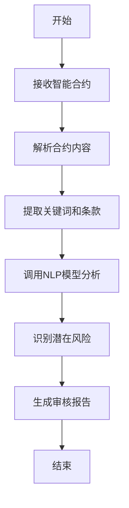
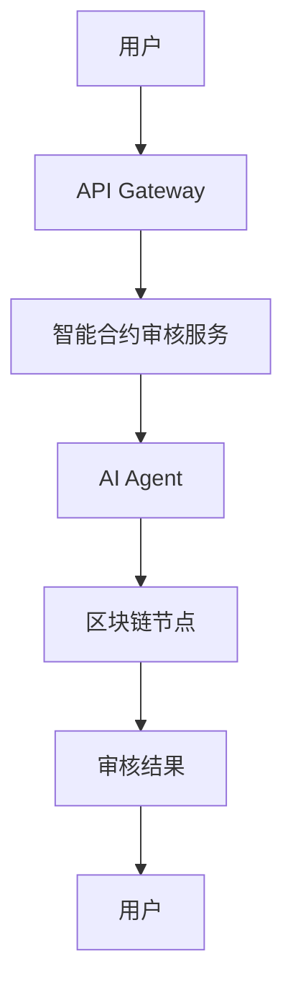

                 


# AI Agent在智能合约审核中的应用

> 关键词：AI Agent，智能合约，自然语言处理，区块链技术，风险管理

> 摘要：本文深入探讨了AI Agent在智能合约审核中的应用，分析了智能合约审核的关键问题和AI Agent的优势，详细讲解了AI Agent的核心原理，包括算法流程、自然语言处理技术，以及其在智能合约审核中的应用场景。通过系统设计、项目实战和高级主题的讨论，全面阐述了AI Agent在智能合约审核中的技术实现和未来发展方向。

---

# 第1章: AI Agent与智能合约概述

## 1.1 AI Agent的基本概念

### 1.1.1 AI Agent的定义

AI Agent（人工智能代理）是指能够感知环境、自主决策并执行任务的智能实体。它可以是一个软件程序、机器人或其他智能系统，通过传感器接收信息，利用算法进行分析，并通过执行器完成目标。

### 1.1.2 AI Agent的核心特征

- **自主性**：能够自主决策，无需外部干预。
- **反应性**：能够实时感知环境并做出反应。
- **目标导向性**：通过目标驱动行为。
- **学习能力**：能够通过数据和经验不断优化自身。

### 1.1.3 AI Agent的分类与应用场景

- **按智能水平**：
  - **反应式AI Agent**：基于当前感知做出反应。
  - **认知式AI Agent**：具备推理和规划能力。
- **应用场景**：
  - **智能合约审核**：通过AI Agent自动检查智能合约的合规性。
  - **金融交易**：AI Agent自动执行和监控交易。
  - **客户服务**：智能客服助手。

## 1.2 智能合约的基本概念

### 1.2.1 智能合约的定义

智能合约是基于区块链技术的自动执行合同，其执行过程通过区块链网络中的预设代码自动完成，无需中介参与。

### 1.2.2 智能合约的特点

- **去中心化**：运行在区块链上，无需信任第三方。
- **自动执行**：一旦条件满足，合约自动执行。
- **不可篡改**：区块链上的合约难以被修改。

### 1.2.3 智能合约的应用场景

- **金融领域**：自动执行金融衍生品合约。
- **法律领域**：自动执行法律合同。
- **供应链管理**：自动处理货物交付。

## 1.3 AI Agent在智能合约审核中的应用价值

### 1.3.1 智能合约审核的重要性

- **合规性**：确保智能合约符合法律法规。
- **安全性**：防止合约漏洞被恶意利用。
- **效率**：自动化审核提高效率。

### 1.3.2 AI Agent在智能合约审核中的优势

- **自动化**：AI Agent可以自动审核大量合约，减少人工干预。
- **高效性**：通过算法快速识别潜在问题。
- **准确性**：减少人为错误，提高审核质量。

### 1.3.3 AI Agent审核智能合约的边界与外延

- **边界**：AI Agent主要负责技术层面的审核，不涉及法律解释。
- **外延**：可以扩展到合约执行后的监控和反馈。

---

# 第2章: AI Agent的核心原理

## 2.1 AI Agent的基本原理

### 2.1.1 AI Agent的算法流程

以下是AI Agent审核智能合约的基本流程：



### 2.1.2 自然语言处理技术

#### 2.1.2.1 自然语言处理（NLP）的定义

NLP是研究如何让计算机理解和生成人类语言的科学。

#### 2.1.2.2 NLP在AI Agent中的应用

- **文本分类**：识别合约类型。
- **实体识别**：提取合同中的关键实体。
- **意图识别**：理解合同的意图和条款。

### 2.1.3 算法模型

#### 2.1.3.1 基于规则的模型

- **规则引擎**：通过预定义规则进行匹配。
- **优点**：简单易懂，易于维护。
- **缺点**：难以处理复杂场景。

#### 2.1.3.2 基于机器学习的模型

- **深度学习模型**：如BERT、GPT。
- **优点**：能够处理复杂语义。
- **缺点**：需要大量数据训练。

---

# 第3章: AI Agent在智能合约审核中的系统设计

## 3.1 系统架构设计

### 3.1.1 系统架构图



### 3.1.2 功能模块设计

- **输入模块**：接收智能合约。
- **解析模块**：解析合约内容。
- **分析模块**：利用NLP和机器学习进行分析。
- **输出模块**：生成审核报告。

## 3.2 系统接口设计

### 3.2.1 API接口

- **输入接口**：接收智能合约文本。
- **输出接口**：返回审核结果和建议。

### 3.2.2 接口交互流程


---

# 第4章: AI Agent在智能合约审核中的项目实战

## 4.1 环境搭建

### 4.1.1 环境配置

- **Python版本**：3.8及以上。
- **依赖库**：spaCy、BERT。

## 4.2 核心代码实现

### 4.2.1 智能合约解析模块

```python
import spacy

nlp = spacy.load("en_core_web_sm")

def parse_contract(text):
    doc = nlp(text)
    entities = [ent.text for ent in doc.ents]
    return entities
```

### 4.2.2 风险识别模块

```python
from transformers import BertForTokenClassification

model = BertForTokenClassification.from_pretrained("bert-base")
tokenizer = BertTokenizer.from_pretrained("bert-base")

def identify_risks(text):
    inputs = tokenizer(text, return_tensors="pt")
    outputs = model(**inputs)
    prediction = outputs.logits.argmax(dim=2)
    # Process prediction to identify risks
    return risks
```

## 4.3 系统测试与优化

### 4.3.1 测试用例设计

- **正常案例**：审核无风险的合约。
- **异常案例**：审核存在漏洞的合约。

### 4.3.2 性能优化

- **缓存机制**：减少重复计算。
- **并行处理**：提高处理速度。

---

# 第5章: 高级主题与未来展望

## 5.1 多模态审核

### 5.1.1 图像与文本结合

- **OCR技术**：提取图片中的文本信息。
- **多模态分析**：结合文本和图像信息进行审核。

## 5.2 可解释性与透明性

### 5.2.1 可解释性的重要性

- **用户信任**：用户需要了解AI的决策过程。
- **法律合规**：审核过程需要可追溯。

## 5.3 模型的可扩展性

### 5.3.1 模型更新

- **持续学习**：模型可以根据新的数据进行优化。
- **模型扩展**：支持更多类型的智能合约。

---

# 结语

AI Agent在智能合约审核中的应用前景广阔，通过自动化、高效性和准确性，AI Agent能够显著提升智能合约审核的效率和质量。随着技术的不断进步，AI Agent在智能合约审核中的应用将更加智能化和普及化。

---

# 作者

作者：AI天才研究院/AI Genius Institute & 禅与计算机程序设计艺术 /Zen And The Art of Computer Programming

