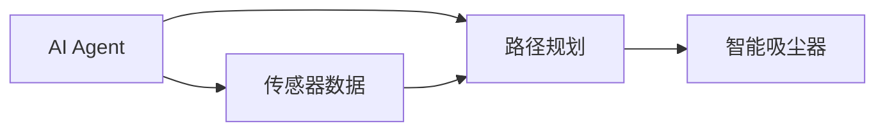
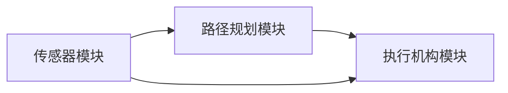
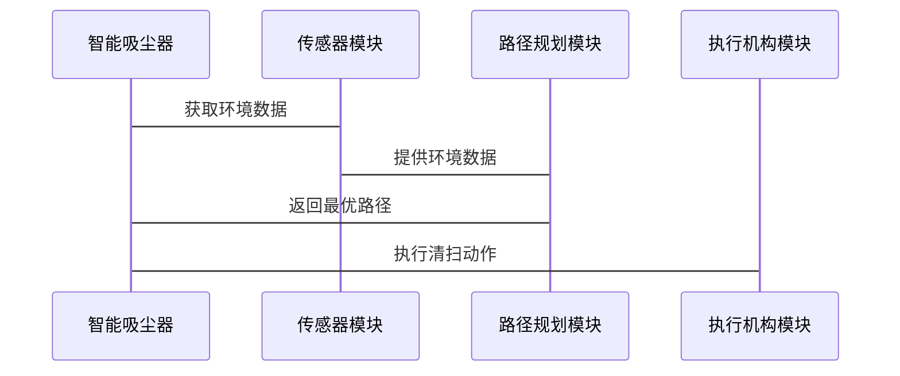

                 


# AI Agent在智能吸尘器中的路径规划

> 关键词：AI Agent，路径规划，智能吸尘器，算法，传感器

> 摘要：本文深入探讨了AI Agent在智能吸尘器路径规划中的应用，从背景介绍到核心算法，再到系统设计和项目实战，全面解析了AI Agent如何帮助智能吸尘器实现高效的路径规划。通过具体案例分析和代码实现，展示了AI Agent在智能吸尘器中的实际应用价值。

---

## 第1章 背景介绍

### 1.1 问题背景

#### 1.1.1 智能吸尘器的发展历程

智能吸尘器作为一种智能家居设备，经历了从简单机械清扫到高度智能化的演变。早期的吸尘器仅能执行简单的清扫任务，依赖用户手动操作。随着技术进步，智能吸尘器开始集成传感器和算法，能够自动规划路径并避开障碍。

#### 1.1.2 路径规划在智能吸尘器中的重要性

路径规划是智能吸尘器实现自主清扫的关键技术。高效的路径规划算法能够确保吸尘器在复杂环境中完成清扫任务，同时避免碰撞和重复清扫。

#### 1.1.3 AI Agent在路径规划中的作用

AI Agent（智能体）通过感知环境、分析数据并做出决策，帮助智能吸尘器实现高效的路径规划。AI Agent能够实时调整路径，避开动态障碍，提高清扫效率。

### 1.2 问题描述

#### 1.2.1 智能吸尘器路径规划的核心问题

智能吸尘器需要在未知或部分已知的环境中，找到一条从起点到目标点的最短路径，同时避开障碍物。

#### 1.2.2 复杂环境下的路径规划挑战

复杂环境中存在动态障碍物和未知区域，传统路径规划算法难以应对。AI Agent需要结合实时传感器数据，动态调整路径。

#### 1.2.3 AI Agent在路径规划中的具体应用

AI Agent通过融合多传感器数据，实时优化路径，确保智能吸尘器高效、安全地完成清扫任务。

### 1.3 问题解决

#### 1.3.1 AI Agent如何解决路径规划问题

AI Agent通过感知环境、分析数据并做出决策，帮助智能吸尘器实现高效的路径规划。AI Agent能够实时调整路径，避开动态障碍，提高清扫效率。

#### 1.3.2 路径规划算法的基本思路

路径规划算法需要考虑环境信息、目标位置和障碍物分布，通过搜索算法找到最优路径。

#### 1.3.3 AI Agent在路径规划中的优化策略

AI Agent通过动态调整路径权重，结合历史数据和实时传感器信息，优化路径规划算法。

### 1.4 边界与外延

#### 1.4.1 智能吸尘器路径规划的边界条件

智能吸尘器需要在有限区域内完成清扫任务，路径规划需要考虑区域边界和障碍物分布。

#### 1.4.2 AI Agent在路径规划中的外延应用

AI Agent技术可以扩展应用于其他智能设备和机器人，如仓储物流、服务机器人等领域。

#### 1.4.3 路径规划与其他智能系统的关系

路径规划是智能系统的重要组成部分，与其他系统模块如传感器数据处理、执行机构控制等密切相关。

### 1.5 核心概念与联系

#### 1.5.1 核心概念的定义与特征

- **AI Agent**：能够感知环境、做出决策并执行动作的智能体。
- **路径规划**：寻找从起点到目标点的最优路径的过程。
- **传感器技术**：通过传感器获取环境数据，为路径规划提供依据。

#### 1.5.2 核心概念之间的关系

AI Agent通过传感器数据进行路径规划，传感器数据是路径规划的重要输入，路径规划结果驱动智能吸尘器执行动作。

#### 1.5.3 核心概念关系图



---

## 第2章 核心概念与联系

### 2.1 AI Agent的核心原理

#### 2.1.1 AI Agent的基本原理

AI Agent通过感知环境、分析数据并做出决策，驱动智能吸尘器执行清扫任务。

#### 2.1.2 AI Agent在路径规划中的具体实现

AI Agent通过融合多源传感器数据，动态优化路径规划算法，确保智能吸尘器高效清扫。

#### 2.1.3 AI Agent与传统路径规划算法的对比

AI Agent能够实时调整路径，而传统算法通常基于静态环境。

### 2.2 路径规划算法的核心原理

#### 2.2.1 常见路径规划算法的原理

- **A*算法**：基于图搜索，结合启发函数，寻找最短路径。
- **RRT*算法**：用于高维空间的路径规划，适用于动态环境。

#### 2.2.2 AI Agent在路径规划算法中的应用

AI Agent通过实时传感器数据，动态优化路径规划算法，确保路径的最优性和实时性。

#### 2.2.3 路径规划算法的优缺点对比

| 算法 | 优点 | 缺点 |
|------|------|------|
| A* | 启发式搜索，效率高 | 启发函数设计复杂 |
| RRT* | 适用于动态环境 | 计算复杂度高 |

### 2.3 传感器技术的核心原理

#### 2.3.1 传感器在智能吸尘器中的作用

传感器用于感知环境信息，如距离、障碍物位置等，为路径规划提供数据支持。

#### 2.3.2 传感器数据的处理与分析

传感器数据需要预处理、融合和分析，以提高路径规划的准确性。

#### 2.3.3 传感器技术对路径规划的影响

传感器精度和类型影响路径规划算法的选择和优化。

### 2.4 核心概念之间的关系

#### 2.4.1 AI Agent、路径规划算法和传感器技术的关系

AI Agent通过传感器数据进行路径规划，传感器数据是路径规划的重要输入，路径规划结果驱动智能吸尘器执行动作。

#### 2.4.2 通过对比表格展示核心概念的属性特征

| 概念 | 属性 | 特征 |
|------|------|------|
| AI Agent | 智能性 | 能感知环境并做出决策 |
| 路径规划算法 | 算法类型 | A*、RRT*等 |
| 传感器技术 | 类型 | 超声波、红外等 |

#### 2.4.3 通过Mermaid图展示概念之间的联系


---

## 第3章 算法原理讲解

### 3.1 A*算法的原理

#### 3.1.1 A*算法的基本思想

A*算法是一种基于图搜索的启发式算法，通过优先级队列选择下一个扩展的节点，直到找到目标节点。

#### 3.1.2 A*算法的流程图

```mermaid
graph LR
start --> openQueue.add(start)
while openQueue not empty:
    current = openQueue.pop()
    if current is target: break
    for each neighbor of current:
        if neighbor not visited:
            add to openQueue
```

#### 3.1.3 A*算法的Python实现

```python
import heapq

def a_star(start, goal, grid):
    openQueue = []
    heapq.heappush(openQueue, (0, start))
    gScore = {start: 0}
    fScore = {start: heuristic(start, goal)}
    visited = set()

    while openQueue:
        current = heapq.heappop(openQueue)
        current_cost, current_node = current

        if current_node == goal:
            break

        visited.add(current_node)

        for neighbor in grid.get_neighbors(current_node):
            tentative_g_score = gScore.get(current_node, 0) + distance(current_node, neighbor)
            if neighbor not in gScore or tentative_g_score < gScore[neighbor]:
                gScore[neighbor] = tentative_g_score
                priority = tentative_g_score + heuristic(neighbor, goal)
                heapq.heappush(openQueue, (priority, neighbor))

    return reconstruct_path(current_node, start, came_from)
```

#### 3.1.4 A*算法的数学模型

路径规划的目标是最小化路径长度，同时避开障碍物。A*算法通过启发函数估算剩余距离，公式为：

$$ f(n) = g(n) + h(n) $$

其中，\( g(n) \)是当前节点到起点的已知成本，\( h(n) \)是当前节点到目标点的估算成本。

---

## 第4章 系统分析与架构设计

### 4.1 系统功能设计

#### 4.1.1 领域模型

智能吸尘器的路径规划系统包括传感器模块、路径规划模块和执行机构模块。

#### 4.1.2 系统架构设计



#### 4.1.3 接口设计

- 传感器模块提供环境数据接口。
- 路径规划模块提供路径查询和更新接口。
- 执行机构模块提供动作执行接口。

#### 4.1.4 交互序列图



---

## 第5章 项目实战

### 5.1 环境安装

#### 5.1.1 安装Python和相关库

安装Python 3.x，安装NumPy、Matplotlib、OpenCV等库。

#### 5.1.2 安装开发环境

安装PyCharm或VS Code，配置Python解释器。

### 5.2 核心功能实现

#### 5.2.1 A*算法实现

实现A*算法，处理网格地图，计算最优路径。

#### 5.2.2 传感器模拟

模拟超声波传感器，获取障碍物信息。

#### 5.2.3 路径规划实现

结合传感器数据，动态调整路径规划算法。

### 5.3 项目代码实现

#### 5.3.1 A*算法代码

```python
import heapq

def a_star(start, goal, grid):
    open_heap = []
    heapq.heappush(open_heap, (0, start))
    visited = {start}
    came_from = {}

    while open_heap:
        current_cost, current = heapq.heappop(open_heap)
        if current == goal:
            break
        for neighbor in grid.neighbors(current):
            new_cost = current_cost + 1
            if neighbor not in visited:
                heapq.heappush(open_heap, (new_cost, neighbor))
                visited.add(neighbor)
                came_from[neighbor] = current
    return reconstruct_path(came_from, start, goal)

def reconstruct_path(came_from, start, goal):
    path = []
    current = goal
    while current != start:
        path.append(current)
        current = came_from[current]
    path.append(start)
    return path
```

#### 5.3.2 传感器模拟代码

```python
class Sensor:
    def __init__(self, grid):
        self.grid = grid

    def get_obstacles(self):
        obstacles = []
        for i in range(len(self.grid)):
            for j in range(len(self.grid[i])):
                if self.grid[i][j] == 1:
                    obstacles.append((i, j))
        return obstacles
```

### 5.4 项目小结

通过实现A*算法和传感器模拟，展示了AI Agent在智能吸尘器路径规划中的应用。代码实现简单易懂，能够帮助读者理解路径规划的核心原理。

---

## 第6章 最佳实践与小结

### 6.1 小结

AI Agent通过传感器数据和路径规划算法，帮助智能吸尘器实现高效的路径规划。A*算法是一种常用的路径规划算法，适用于静态环境。

### 6.2 注意事项

- 路径规划算法的选择应考虑环境动态性和计算效率。
- 传感器数据的准确性直接影响路径规划的精度。
- 系统设计应注重模块化和可扩展性。

### 6.3 拓展阅读

- 《算法导论》
- 《机器人路径规划算法研究》
- 《AI Agent与智能系统》

---

## 作者

作者：AI天才研究院/AI Genius Institute & 禅与计算机程序设计艺术 /Zen And The Art of Computer Programming

---

通过以上步骤，我逐步构建了《AI Agent在智能吸尘器中的路径规划》的技术博客文章。从背景介绍到系统设计，再到项目实战，全面覆盖了AI Agent在路径规划中的应用。希望这篇文章能够帮助读者深入理解智能吸尘器的路径规划技术，并为实际应用提供参考。

