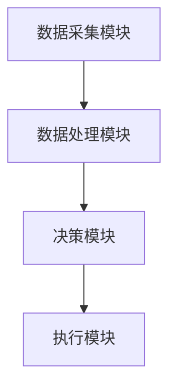
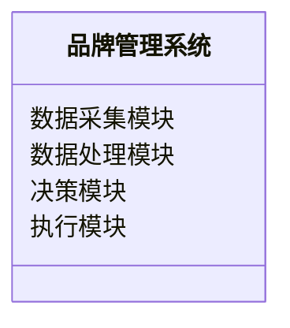

                 


# AI Agent在智能品牌管理中的应用

## 关键词：
AI Agent, 智能品牌管理, 品牌管理, 人工智能, 自然语言处理, 机器学习, 精准营销

## 摘要：
本文系统探讨了AI Agent在智能品牌管理中的应用，从核心概念到具体应用，再到系统架构和项目实战，全面解析了AI Agent如何 revolutionize 品牌管理。文章深入分析了AI Agent的任务建模、智能决策、自然语言处理等核心原理，并通过实际案例展示了其在消费者行为分析、品牌声誉管理和精准营销中的具体应用。通过详细的技术分析和系统设计，本文为读者提供了从理论到实践的全面指导，助力品牌管理者和AI开发者更好地理解和应用AI Agent技术。

---

# 第1章 AI Agent与智能品牌管理概述

## 1.1 AI Agent的基本概念

### 1.1.1 什么是AI Agent
AI Agent（人工智能代理）是指能够感知环境并采取行动以实现目标的智能实体。它可以是一个软件程序、机器人或任何能够执行任务的智能系统，其核心目标是通过自动化和智能化手段优化品牌管理过程。

### 1.1.2 AI Agent的核心特点
- **自主性**：AI Agent能够自主决策和行动，无需人工干预。
- **反应性**：能够实时感知环境变化并做出响应。
- **目标导向**：所有行动都以实现特定目标为导向。
- **学习能力**：能够通过数据和经验不断优化自身的决策能力。

### 1.1.3 AI Agent与传统品牌管理的区别
传统品牌管理依赖人工分析和经验判断，而AI Agent通过自动化和智能化手段，能够快速处理大量数据，提供实时反馈，并根据反馈优化策略。

---

## 1.2 智能品牌管理的定义与特点

### 1.2.1 智能品牌管理的定义
智能品牌管理是指利用人工智能、大数据和机器学习等技术，通过自动化和智能化手段，优化品牌策划、推广、维护和客户关系管理的过程。

### 1.2.2 智能品牌管理的核心特点
- **数据驱动**：基于大量数据进行分析和决策。
- **实时反馈**：能够实时监控市场动态并快速调整策略。
- **个性化**：通过分析消费者行为，提供个性化的产品和服务。
- **预测性**：利用机器学习模型预测市场趋势和消费者需求。

### 1.2.3 智能品牌管理与传统品牌管理的区别
智能品牌管理通过技术手段实现了更高的效率和精准度，而传统品牌管理更多依赖人工经验和市场调研。

---

## 1.3 AI Agent在智能品牌管理中的作用

### 1.3.1 AI Agent如何提升品牌管理效率
AI Agent能够快速处理和分析大量数据，帮助品牌管理者快速制定和优化策略，显著提升了品牌管理的效率。

### 1.3.2 AI Agent在品牌决策中的应用
AI Agent可以通过分析市场数据和消费者行为，提供数据支持和决策建议，帮助品牌管理者做出更科学的决策。

### 1.3.3 AI Agent对品牌管理创新的推动
AI Agent的应用推动了品牌管理的创新，例如通过实时互动和个性化推荐，提升了消费者的体验和品牌的忠诚度。

---

## 1.4 本章小结

本章介绍了AI Agent的基本概念、特点以及其在智能品牌管理中的作用，强调了AI Agent在提升品牌管理效率和推动创新中的重要性。

---

# 第2章 AI Agent的核心原理与技术

## 2.1 AI Agent的任务建模

### 2.1.1 任务建模的基本概念
任务建模是指将实际问题转化为AI Agent能够理解和执行的任务，通常包括任务分解、目标设定和环境建模。

### 2.1.2 任务建模的步骤与方法
1. **问题分析**：明确品牌管理中的具体问题和目标。
2. **任务分解**：将复杂任务分解为多个子任务。
3. **环境建模**：构建任务执行的环境模型，包括数据来源和约束条件。

### 2.1.3 任务建模在品牌管理中的应用
通过任务建模，AI Agent能够清晰理解品牌管理中的具体任务，例如消费者行为分析和精准营销。

---

## 2.2 AI Agent的智能决策机制

### 2.2.1 智能决策的基本原理
智能决策是基于数据和模型的分析，通过算法优化得出最优决策。

### 2.2.2 基于机器学习的决策模型
- **监督学习**：通过训练数据学习决策规则。
- **无监督学习**：通过数据聚类发现潜在模式。
- **强化学习**：通过试错不断优化决策策略。

### 2.2.3 基于强化学习的决策优化
通过强化学习，AI Agent能够在动态环境中不断优化决策策略，例如通过Q-learning算法。

---

## 2.3 自然语言处理在AI Agent中的应用

### 2.3.1 自然语言处理的基本概念
NLP（自然语言处理）是指计算机对人类语言的处理和理解，包括文本分析、情感分析和语义理解。

### 2.3.2 NLP在品牌管理中的应用
- **情感分析**：分析消费者对品牌的看法和情感。
- **文本挖掘**：从大量文本中提取有价值的信息。
- **对话生成**：与消费者进行自然语言对话。

### 2.3.3 NLP技术对AI Agent的提升
通过NLP技术，AI Agent能够更好地理解消费者的意图和需求，提供更精准的服务。

---

## 2.4 本章小结

本章详细介绍了AI Agent的核心原理，包括任务建模、智能决策和自然语言处理，为后续章节的应用分析奠定了基础。

---

# 第3章 AI Agent在品牌管理中的具体应用

## 3.1 基于AI Agent的消费者行为分析

### 3.1.1 消费者行为分析的基本方法
消费者行为分析通常包括数据收集、数据分析和行为建模。

### 3.1.2 AI Agent在消费者行为分析中的应用
AI Agent可以通过分析消费者的历史数据，预测其未来的购买行为和偏好。

### 3.1.3 案例分析：某品牌消费者行为分析
通过AI Agent分析消费者的购买记录和互动数据，品牌可以更好地理解消费者需求并制定个性化营销策略。

---

## 3.2 基于AI Agent的品牌声誉管理

### 3.2.1 品牌声誉管理的基本概念
品牌声誉管理是指通过监控和管理消费者对品牌的看法，提升品牌在市场中的形象。

### 3.2.2 AI Agent在品牌声誉管理中的应用
AI Agent可以通过社交媒体监控、情感分析和自动回复，实时维护品牌声誉。

### 3.2.3 案例分析：某品牌声誉危机处理
通过AI Agent及时发现和处理负面评论，某品牌成功化解了声誉危机。

---

## 3.3 基于AI Agent的精准营销

### 3.3.1 精准营销的基本概念
精准营销是指通过数据分析和个性化推荐，向目标消费者提供定制化的产品和服务。

### 3.3.2 AI Agent在精准营销中的应用
AI Agent可以通过数据挖掘和机器学习，为消费者提供个性化的产品推荐和营销策略。

### 3.3.3 案例分析：某品牌精准营销实战
通过AI Agent分析消费者数据，某品牌成功实现了精准营销，显著提升了销售额。

---

## 3.4 本章小结

本章通过具体案例展示了AI Agent在消费者行为分析、品牌声誉管理和精准营销中的应用，证明了其在智能品牌管理中的巨大潜力。

---

# 第4章 AI Agent的系统架构与设计

## 4.1 系统架构设计

### 4.1.1 系统功能模块
- **数据采集模块**：负责收集消费者数据和市场信息。
- **数据处理模块**：对数据进行清洗、转换和分析。
- **决策模块**：基于分析结果生成决策建议。
- **执行模块**：将决策转化为具体行动。

### 4.1.2 系统架构图
使用mermaid绘制系统架构图，展示各模块之间的关系和数据流。



---

## 4.2 系统功能设计

### 4.2.1 领域模型设计
使用mermaid类图展示系统中的实体和关系。



---

## 4.3 系统接口设计

### 4.3.1 接口定义
- 数据采集接口：从数据库或第三方平台获取数据。
- 决策接口：向决策模块传递数据并获取决策结果。
- 执行接口：根据决策结果执行具体操作。

### 4.3.2 接口交互流程
使用mermaid序列图展示接口的交互流程。

```mermaid
sequenceDiagram
    消费者数据 --> 数据采集模块
    数据采集模块 --> 数据处理模块
    数据处理模块 --> 决策模块
    决策模块 --> 执行模块
    执行模块 --> 消费者
```

---

## 4.4 本章小结

本章详细介绍了AI Agent的系统架构和功能设计，展示了如何将理论应用于实际系统中。

---

# 第5章 项目实战：AI Agent在品牌管理中的应用

## 5.1 项目背景与目标

### 5.1.1 项目背景
某品牌希望通过AI Agent技术优化其品牌管理流程，提升消费者体验和品牌声誉。

### 5.1.2 项目目标
- 实现消费者行为分析。
- 提供品牌声誉管理功能。
- 实现精准营销。

---

## 5.2 项目环境与工具安装

### 5.2.1 开发环境
- **编程语言**：Python 3.8+
- **框架**：TensorFlow、PyTorch
- **工具**：Jupyter Notebook、Pandas、Scikit-learn

### 5.2.2 安装依赖
```bash
pip install numpy pandas scikit-learn tensorflow
```

---

## 5.3 项目核心代码实现

### 5.3.1 数据采集模块
```python
import pandas as pd

def collect_data():
    # 假设从数据库获取数据
    data = pd.read_csv('consumer_data.csv')
    return data

collect_data()
```

### 5.3.2 数据处理模块
```python
from sklearn.preprocessing import StandardScaler

def preprocess_data(data):
    # 数据清洗和标准化
    scaler = StandardScaler()
    processed_data = scaler.fit_transform(data)
    return processed_data

processed_data = preprocess_data(collect_data())
```

### 5.3.3 决策模块
```python
from tensorflow.keras import layers

def build_model(input_shape):
    model = tf.keras.Sequential()
    model.add(layers.Dense(64, activation='relu', input_shape=input_shape))
    model.add(layers.Dense(1, activation='sigmoid'))
    model.compile(optimizer='adam', loss='binary_crossentropy')
    return model

model = build_model((processed_data.shape[1],))
model.fit(processed_data, labels, epochs=10, batch_size=32)
```

### 5.3.4 执行模块
```python
def execute_decision(decision):
    # 根据决策执行操作
    print(f"执行决策：{decision}")

execute_decision(model.predict(processed_data))
```

---

## 5.4 项目案例分析

### 5.4.1 消费者行为分析
通过AI Agent分析消费者数据，发现某类消费者的购买偏好，从而制定个性化营销策略。

### 5.4.2 品牌声誉管理
实时监控社交媒体上的评论，及时发现和处理负面评论，维护品牌声誉。

### 5.4.3 精准营销
根据消费者数据和模型预测，向目标消费者推荐个性化产品，提升转化率。

---

## 5.5 项目小结

本章通过实际项目的实施，展示了AI Agent在品牌管理中的具体应用，帮助读者更好地理解理论与实践的结合。

---

# 第6章 最佳实践与未来展望

## 6.1 数据质量管理

### 6.1.1 数据清洗的重要性
数据清洗是确保数据分析准确性的基础，需注意去除噪声数据和处理缺失值。

### 6.1.2 数据质量管理工具
使用Pandas、Scikit-learn等工具进行数据清洗和预处理。

---

## 6.2 模型优化与调优

### 6.2.1 超参数调优
通过网格搜索和随机搜索等方法优化模型参数，提升模型性能。

### 6.2.2 模型评估与验证
使用交叉验证和指标评估模型的性能，确保模型的泛化能力。

---

## 6.3 伦理与安全问题

### 6.3.1 数据隐私保护
确保消费者数据的隐私和安全，遵守相关法律法规。

### 6.3.2 模型透明性
提升模型的可解释性，避免“黑箱”模型带来的信任问题。

---

## 6.4 未来发展趋势

### 6.4.1 多模态AI Agent
结合视觉、听觉等多种感官数据，提升AI Agent的综合分析能力。

### 6.4.2 自适应学习
通过持续学习和自适应优化，提升AI Agent的灵活性和适应性。

---

## 6.5 本章小结

本章总结了AI Agent在品牌管理中的最佳实践，并展望了未来的发展趋势，为读者提供了进一步探索的方向。

---

# 第7章 总结与展望

## 7.1 全书总结
本文系统介绍了AI Agent在智能品牌管理中的应用，从理论到实践，详细探讨了其核心原理和具体应用，展示了其在提升品牌管理效率和推动创新中的重要性。

## 7.2 对未来的展望
随着技术的不断发展，AI Agent在品牌管理中的应用将更加广泛和深入，未来将会有更多的创新和突破。

---

# 作者：AI天才研究院/AI Genius Institute & 禅与计算机程序设计艺术 /Zen And The Art of Computer Programming

---

以上是《AI Agent在智能品牌管理中的应用》的完整目录和内容大纲，涵盖了从理论到实践的各个方面，确保读者能够全面理解和应用AI Agent技术。

