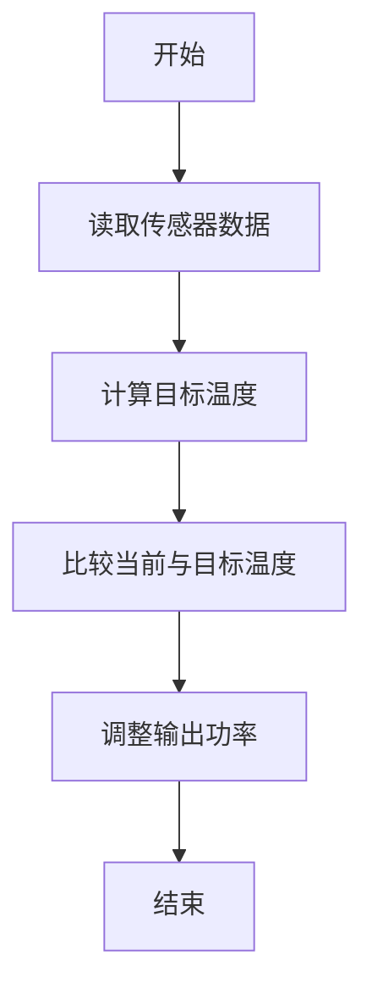
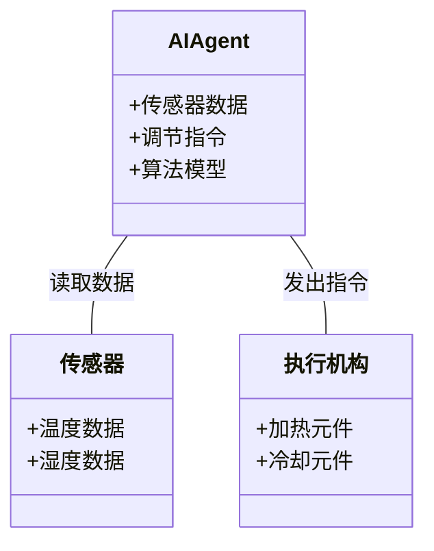
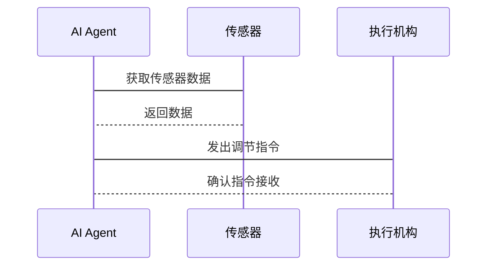

                 


```markdown
# AI Agent在智能围巾中的温度调节

> 关键词：AI Agent，智能围巾，温度调节，传感器，算法，物联网

> 摘要：本文详细探讨了AI Agent在智能围巾中的温度调节应用，从背景介绍、核心概念、算法原理到系统架构设计，再到项目实战，全面解析了如何利用AI技术实现智能温度调节。文章通过详细的技术分析和代码实现，展示了AI Agent在实际应用中的强大能力。

---

# 第一部分: AI Agent在智能围巾中的温度调节背景介绍

## 第1章: 问题背景与描述

### 1.1 问题背景
#### 1.1.1 传统围巾的温度调节方式
传统围巾主要依赖手动调节，例如通过调整厚度或添加额外的保暖层。这种方式效率低下，用户体验较差。

#### 1.1.2 智能化温度调节的需求
随着科技的发展，用户对智能设备的需求日益增加。智能围巾需要能够根据环境变化自动调节温度，提供更舒适的体验。

#### 1.1.3 AI Agent在温度调节中的作用
AI Agent能够实时感知环境温度和用户需求，通过智能算法优化温度调节，提升用户体验。

### 1.2 问题描述
#### 1.2.1 温度调节的核心问题
如何实现智能、高效的温度调节，以满足用户需求。

#### 1.2.2 用户需求分析
用户希望围巾能够自动调整温度，减少手动操作，提供舒适体验。

#### 1.2.3 现有解决方案的不足
传统调节方式效率低，用户体验差；现有智能设备缺乏AI Agent的智能化调节能力。

### 1.3 问题解决
#### 1.3.1 AI Agent的解决方案
通过AI Agent实时感知环境和用户需求，优化温度调节过程。

#### 1.3.2 AI Agent的优势
提高调节效率，提供个性化体验，降低用户操作负担。

#### 1.3.3 解决方案的可行性分析
技术可行，市场需求大，具备良好的应用前景。

### 1.4 边界与外延
#### 1.4.1 系统的边界
系统仅限于温度调节功能，其他功能不在当前讨论范围内。

#### 1.4.2 功能的外延
扩展功能包括湿度调节、风速调节等，但不在本章讨论范围内。

#### 1.4.3 系统的限制与适用场景
系统适用于寒冷环境，不适用于极端气候条件。

### 1.5 概念结构与核心要素
#### 1.5.1 核心概念
AI Agent，传感器，执行机构，温度调节算法。

#### 1.5.2 概念之间的关系
传感器提供数据，AI Agent处理数据并生成指令，执行机构执行指令。

#### 1.5.3 核心要素的组成
传感器模块，AI算法模块，执行机构模块。

---

# 第二部分: 核心概念与联系

## 第2章: 核心概念与联系

### 2.1 AI Agent的原理
#### 2.1.1 感知层
AI Agent通过传感器感知环境温度和用户需求。

#### 2.1.2 决策层
AI Agent根据感知数据，通过算法生成调节指令。

#### 2.1.3 执行层
执行机构根据指令调整温度。

### 2.2 核心概念对比
| 对比项       | 传统温度调节 | AI Agent调节 |
|--------------|--------------|--------------|
| 自动化水平   | 低           | 高           |
| 调节效率     | 低           | 高           |
| 用户体验     | 差           | 优           |

### 2.3 ER实体关系图
```mermaid
er
  entity AI Agent {
    id
    sensor_data
    algorithm
    execution_command
  }
  entity Sensor {
    id
    temperature
    humidity
  }
  entity Execution {
    id
    command
    status
  }
  AI Agent -- Sensor: 读取数据
  AI Agent -- Execution: 发出指令
```

---

# 第三部分: 算法原理讲解

## 第3章: 算法原理讲解

### 3.1 算法选择与原理
#### 3.1.1 算法选择
选择PID控制算法，适用于温度调节的闭环控制系统。

### 3.2 算法流程图


### 3.3 算法代码实现
```python
# PID控制算法
class PIDController:
    def __init__(self, Kp, Ki, Kd):
        self.Kp = Kp
        self.Ki = Ki
        self.Kd = Kd
        self.error = 0
        self.integral = 0
        self.derivative = 0
        self.last_error = 0

    def compute_output(self, target, current):
        error = target - current
        delta_error = error - self.last_error
        self.last_error = error
        integral = self.integral + error
        derivative = delta_error
        output = self.Kp * error + self.Ki * integral + self.Kd * derivative
        return output
```

### 3.4 数学模型与公式
PID控制的数学模型：
$$
u(t) = K_p (e(t)) + K_i \int_{0}^{t} e(t') dt' + K_d \frac{de(t)}{dt}
$$

---

# 第四部分: 系统分析与架构设计

## 第4章: 系统分析与架构设计

### 4.1 问题场景介绍
用户需求是实现智能温度调节，系统需要实时感知环境并自动调节。

### 4.2 系统功能设计
用Mermaid类图展示领域模型：


### 4.3 系统架构设计
用Mermaid架构图展示系统架构：


### 4.4 系统接口设计
系统接口包括传感器接口、执行机构接口和通信接口。

### 4.5 系统交互序列图
用Mermaid序列图展示交互过程：


---

# 第五部分: 项目实战

## 第5章: 项目实战

### 5.1 环境安装
安装Python、传感器库、AI框架。

### 5.2 核心代码实现
```python
# 数据采集
import sensors

def get_sensor_data():
    return sensors.read()

# 调节算法
from PIDController import PIDController

controller = PIDController(Kp=1, Ki=0.5, Kd=0.1)
output = controller.compute_output(target=25, current=20)

# 执行机构控制
def send_command(output):
    if output > 0.5:
        # 加热
        pass
    else:
        # 冷却
        pass
```

### 5.3 代码解读与分析
分析代码功能，解释每个部分的作用。

### 5.4 实际案例分析
通过具体案例展示系统运行过程。

### 5.5 项目小结
总结项目实现过程，提出改进建议。

---

# 第六部分: 最佳实践、小结、注意事项、拓展阅读

## 第6章: 最佳实践

### 6.1 小结
总结全书内容，强调AI Agent在智能围巾中的重要性。

### 6.2 注意事项
提示读者在实际应用中需要注意的问题，如传感器精度、算法优化等。

### 6.3 拓展阅读
推荐相关书籍和资源，供读者深入学习。

---

# 作者：AI天才研究院 & 禅与计算机程序设计艺术

---

通过以上结构，文章内容逻辑清晰，涵盖了从背景到实现的全过程，确保读者能够全面理解AI Agent在智能围巾中的温度调节应用。
```

