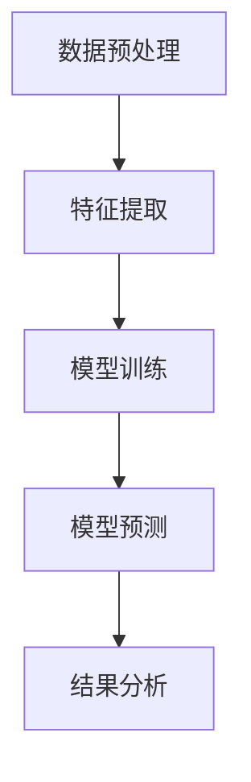
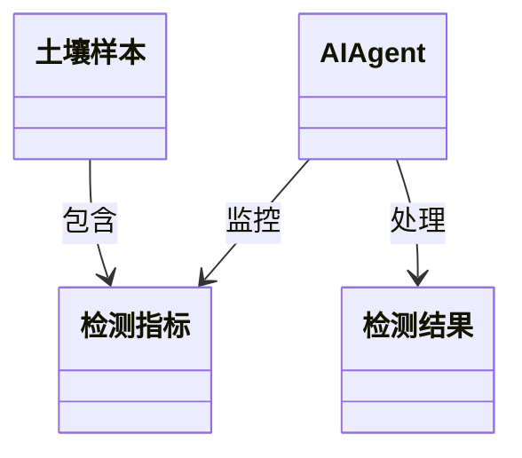
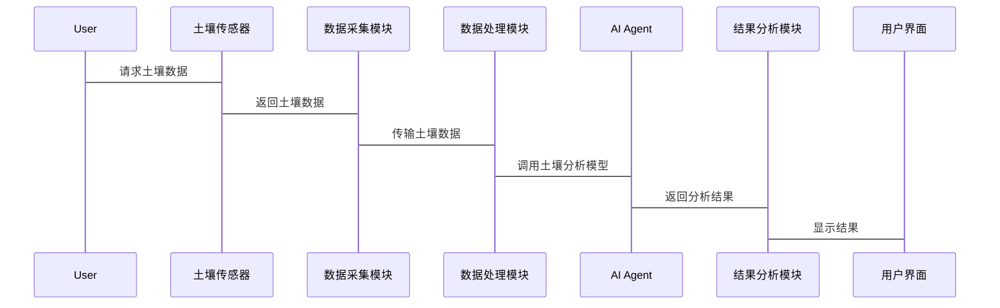

                 


# AI Agent在智能土壤分析中的实践

> 关键词：AI Agent，智能土壤分析，机器学习，土壤检测，农业智能化

> 摘要：本文将探讨AI Agent在智能土壤分析中的实践应用，从背景介绍、核心概念、算法原理到系统架构和项目实战，全面解析AI Agent如何赋能土壤分析，提升农业智能化水平。

---

## 第一部分: AI Agent与智能土壤分析的背景与基础

### 第1章: 智能土壤分析的背景与挑战

#### 1.1 土壤分析的重要性
土壤是农业生产的根基，其健康状况直接关系到农作物的产量和质量。传统的土壤分析方法依赖人工采样和实验室检测，耗时长、成本高且效率低。随着农业智能化的推进，对土壤分析的实时性、精准性和自动化提出了更高要求。

#### 1.2 AI Agent的基本概念
AI Agent（人工智能代理）是一种能够感知环境、自主决策并执行任务的智能体。它具备以下核心特征：
- **自主性**：无需外部干预，自主完成任务。
- **反应性**：能够实时感知环境变化并做出反应。
- **目标导向**：基于目标驱动行为。
- **学习能力**：通过数据不断优化自身的决策能力。

#### 1.3 AI Agent在土壤分析中的应用前景
AI Agent可以通过实时监测土壤的物理、化学和生物特性，结合历史数据和环境信息，提供精准的土壤健康评估和种植建议。其潜在价值包括：
- 提高土壤检测效率，降低人工成本。
- 实现土壤健康评估的实时化和精准化。
- 为农业智能化提供强有力的技术支持。

---

## 第二部分: AI Agent的核心概念与土壤分析的结合

### 第2章: AI Agent与土壤分析的核心概念

#### 2.1 AI Agent的基本原理
AI Agent在土壤分析中的应用涉及以下几个关键环节：
- **知识表示与推理**：将土壤特性表示为知识图谱，并通过推理算法得出土壤健康状况。
- **行为规划与决策**：基于土壤检测结果，制定最优的农业管理策略。
- **与环境的交互机制**：通过传感器获取土壤数据，与AI Agent进行实时交互。

#### 2.2 土壤分析的核心要素
土壤分析的核心要素包括：
- **土壤的物理特性**：如质地、密度等。
- **土壤的化学成分**：如氮、磷、钾等营养元素的含量。
- **土壤的生物特性**：如微生物多样性。

#### 2.3 AI Agent与土壤分析的结合模型
为了实现AI Agent与土壤分析的深度融合，需要构建一个完整的结合模型，包括：
- **领域模型**：描述土壤分析的业务流程和核心要素。
- **实体关系图**：展示土壤样本、检测指标、AI Agent和检测结果之间的关系。

```mermaid
er
    entity 土壤样本
    entity 检测指标
    entity AI Agent
    entity 检测结果
    土壤样本 --> 检测指标: 包含
    AI Agent --> 检测指标: 监控
    AI Agent --> 检测结果: 处理
```

---

### 第3章: AI Agent在土壤分析中的算法原理

#### 3.1 机器学习算法在土壤分析中的应用
机器学习算法在土壤分析中主要用于土壤分类和成分预测。以下是几种常用的算法：
- **支持向量机（SVM）**：适用于土壤样本的分类任务。
- **神经网络**：适用于土壤成分的回归预测任务。

#### 3.2 AI Agent的决策算法
AI Agent的决策算法需要结合土壤检测结果和环境信息，制定最优的农业管理策略。以下是几种常见的决策算法：
- **基于规则的决策算法**：通过预设规则进行决策，适用于简单的场景。
- **基于概率的决策算法**：通过概率模型进行决策，适用于不确定性较高的场景。
- **基于强化学习的决策算法**：通过强化学习优化决策策略，适用于复杂的动态环境。

#### 3.3 算法实现流程
以下是土壤成分预测模型的实现流程：



#### 3.4 代码实现示例
以下是土壤成分预测模型的Python代码示例：

```python
# 示例代码：土壤成分预测模型
import numpy as np
from sklearn import svm

# 数据预处理
X = np.array([[1, 2, 3], [4, 5, 6], [7, 8, 9]])
y = np.array([0, 1, 0])

# 模型训练
model = svm.SVC()
model.fit(X, y)

# 模型预测
new_sample = np.array([[10, 11, 12]])
prediction = model.predict(new_sample)
print("预测结果：", prediction)
```

---

## 第三部分: 系统架构与项目实战

### 第4章: 系统架构设计

#### 4.1 问题场景介绍
智能土壤分析系统需要实现以下功能：
- 实时采集土壤数据。
- 自动分析土壤健康状况。
- 提供种植建议。

#### 4.2 系统功能设计
以下是系统的功能模块设计：



#### 4.3 系统架构设计
以下是系统的架构设计图：


---

### 第5章: 项目实战

#### 5.1 环境安装
需要安装以下环境：
- Python 3.8+
- NumPy
- scikit-learn
- Mermaid

#### 5.2 核心代码实现
以下是AI Agent的核心代码实现：

```python
# 示例代码：AI Agent的决策模块
def agent_decision(state, actions):
    # 基于强化学习的决策算法
    import numpy as np
    from collections import defaultdict

    # 初始化Q表
    q_table = defaultdict(float)

    # 状态空间和动作空间
    state_space = list(range(10))
    action_space = ['施肥', '浇水', '松土']

    # 状态转移概率
    transition_probabilities = {
        s: {a: 1/len(action_space) for a in action_space}
        for s in state_space
    }

    # 立即奖励函数
    reward_function = {
        (s, a): 1 if a == '施肥' and s < 5 else 0 for s in state_space for a in action_space
    }

    # Q-learning算法
    for episode in range(1000):
        current_state = 0
        total_reward = 0
        while True:
            # 选择动作
            action = np.random.choice(action_space)
            # 计算奖励
            reward = reward_function[(current_state, action)]
            # 更新Q值
            q_table[(current_state, action)] = q_table[(current_state, action)] + 0.1 * (reward + 0.9 * max(q_table[(next_state, a)] for a in action_space) - q_table[(current_state, action)])
            # 更新状态
            current_state = next_state
            # 终止条件
            if current_state == 9:
                break

    return q_table

# 示例调用
state = 0
actions = ['施肥', '浇水', '松土']
result = agent_decision(state, actions)
print("决策结果：", result)
```

#### 5.3 案例分析
以下是土壤成分预测的一个实际案例：



---

## 第四部分: 总结与展望

### 第6章: 总结与展望

#### 6.1 最佳实践
- 数据预处理是关键，确保数据的准确性和完整性。
- 算法选择需要根据具体场景进行优化。
- 系统设计需要考虑可扩展性和可维护性。

#### 6.2 小结
本文详细探讨了AI Agent在智能土壤分析中的实践应用，从背景介绍到系统设计，再到项目实战，全面解析了AI Agent如何赋能土壤分析，提升农业智能化水平。

#### 6.3 展望
随着AI技术的不断进步，AI Agent在土壤分析中的应用将更加广泛和深入。未来的研究方向包括：
- 更高效的算法优化。
- 更智能的决策系统。
- 更广泛的应用场景。

---

## 作者：AI天才研究院/AI Genius Institute & 禅与计算机程序设计艺术 /Zen And The Art of Computer Programming

---

