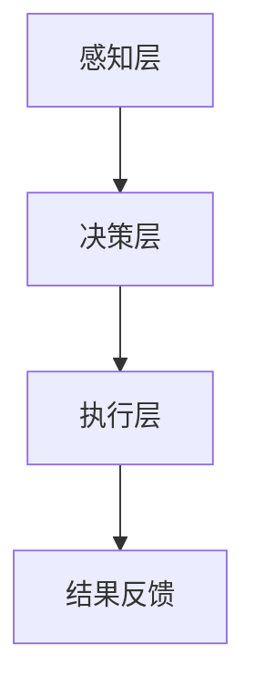
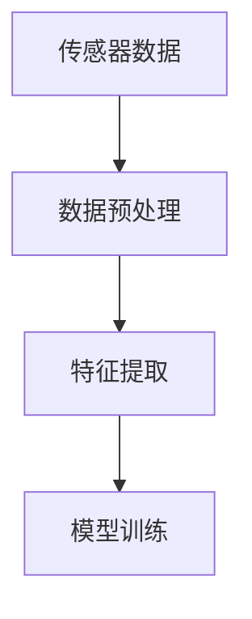
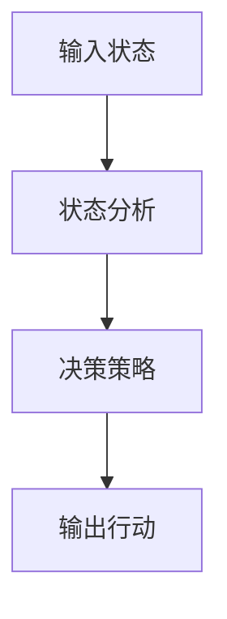
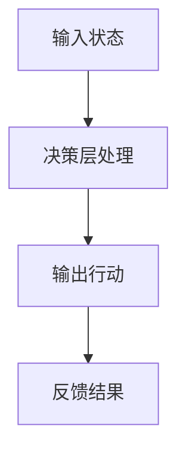
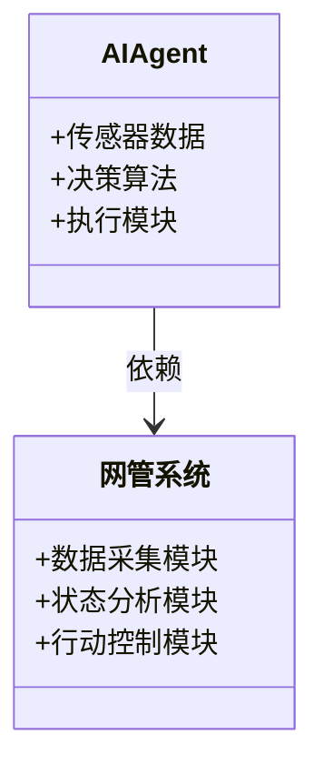

                 


# AI Agent在智能地下管网监测中的实践

> 关键词：AI Agent, 智能地下管网监测, 管网监测系统, 智能感知, 自动化决策

> 摘要：本文系统地探讨了AI Agent技术在智能地下管网监测中的应用实践。从AI Agent的基本概念到其在管网监测中的核心算法，再到系统的整体架构设计，本文详细分析了AI Agent如何通过智能化感知、自主决策和高效执行，解决传统管网监测中的痛点与难点。通过实际案例分析，本文展示了AI Agent在提升管网监测效率、降低运营成本、增强系统可靠性和智能化水平方面的重要价值。

---

# 第一部分: AI Agent在智能地下管网监测中的背景与概念

## 第1章: AI Agent与智能地下管网监测的背景

### 1.1 AI Agent的核心概念

#### 1.1.1 AI Agent的定义与特点
AI Agent（人工智能代理）是指能够感知环境、自主决策并执行任务的智能实体。它具备以下特点：
- **自主性**：能够独立完成任务，无需外部干预。
- **反应性**：能够实时感知环境变化并做出响应。
- **目标导向**：以特定目标为导向，优化行动路径。
- **学习能力**：能够通过数据反馈不断优化自身行为。

#### 1.1.2 智能地下管网监测的定义与重要性
智能地下管网监测是指通过传感器、通信技术和数据分析，实时监控地下管网的状态，包括管道压力、流量、温度、湿度等关键指标。其重要性体现在：
- **预防事故**：及时发现管网泄漏、堵塞等问题，避免重大事故发生。
- **降低维护成本**：通过预测性维护减少突发性故障，降低维修成本。
- **提升效率**：实时监测数据有助于优化管网运行，提高资源利用效率。

#### 1.1.3 AI Agent在智能管网监测中的应用价值
AI Agent能够通过以下方式提升管网监测的智能化水平：
- **实时感知**：通过传感器数据，AI Agent能够快速识别异常状态。
- **智能决策**：基于历史数据和实时信息，AI Agent能够自主制定最优应对策略。
- **高效执行**：通过自动化控制，AI Agent能够快速响应并执行决策指令。

### 1.2 智能地下管网监测的背景与挑战

#### 1.2.1 城市地下管网的重要性
城市地下管网是城市运行的“生命线”，包括供水、供气、供电、通信等基础设施。其安全稳定运行直接关系到城市居民的生活质量和城市经济的健康发展。

#### 1.2.2 现有管网监测的痛点与局限
传统管网监测系统存在以下痛点：
- **数据孤岛**：各个监测点的数据分散，缺乏统一的分析平台。
- **响应延迟**：依赖人工监控，无法实现实时响应。
- **维护成本高**：人工巡检耗时耗力，且容易出现遗漏。

#### 1.2.3 AI Agent技术的解决方案
AI Agent技术能够有效解决传统管网监测的痛点：
- **统一数据处理**：通过AI Agent整合多个监测点的数据，实现统一分析。
- **实时响应**：AI Agent能够快速感知异常，立即触发预警机制。
- **智能化维护**：通过预测性维护，减少人工巡检的需求，降低维护成本。

### 1.3 本章小结
本章介绍了AI Agent的基本概念及其在智能地下管网监测中的重要性。通过分析传统管网监测的痛点，提出了AI Agent技术的解决方案，为后续章节的深入探讨奠定了基础。

---

# 第二部分: AI Agent的核心原理与技术

## 第2章: AI Agent的核心概念与原理

### 2.1 AI Agent的基本原理

#### 2.1.1 感知层: 数据采集与特征提取
AI Agent通过传感器采集管网环境数据，包括温度、压力、流量等指标。然后，通过特征提取技术，将原始数据转化为有意义的特征向量。

#### 2.1.2 决策层: 状态分析与策略制定
基于感知层提供的特征向量，决策层利用机器学习算法（如随机森林、支持向量机）进行状态分析，并制定最优策略。

#### 2.1.3 执行层: 行动优化与结果反馈
执行层根据决策层的指令，通过自动化控制执行具体行动，并将结果反馈给感知层，形成闭环。

#### 2.1.4 智能决策算法流程图


### 2.2 AI Agent的体系结构

#### 2.2.1 分层架构
AI Agent的分层架构包括感知层、决策层和执行层，每一层负责不同的功能模块。

#### 2.2.2 分布式架构
在分布式架构中，多个AI Agent协同工作，每个Agent负责特定区域的监测任务。

#### 2.2.3 组件化架构
组件化架构将AI Agent的功能模块化，便于开发和维护。

#### 2.2.4 三种架构的对比分析
| 架构类型 | 特点 | 适用场景 |
|----------|------|-----------|
| 分层架构 | 简单明了，易于理解 | 单点监测任务 |
| 分布式架构 | 高可用性，扩展性强 | 大规模监测网络 |
| 组件化架构 | 模块化开发，便于维护 | 复杂监测系统 |

### 2.3 AI Agent与传统自动化的区别

#### 2.3.1 传统自动化的特点
传统自动化依赖固定的程序逻辑，缺乏灵活性和适应性。

#### 2.3.2 AI Agent的智能化优势
AI Agent具备学习能力和自适应能力，能够根据环境变化优化自身行为。

#### 2.3.3 两者的对比分析
| 特性 | 传统自动化 | AI Agent |
|------|------------|-----------|
| 灵活性 | 低 | 高 |
| 学习能力 | 无 | 有 |
| 适应性 | 低 | 高 |

### 2.4 本章小结
本章详细介绍了AI Agent的核心原理和体系结构，分析了其与传统自动化的区别，为后续章节的系统设计奠定了理论基础。

---

## 第3章: AI Agent的算法原理

### 3.1 感知层算法

#### 3.1.1 数据采集与预处理
AI Agent通过传感器采集管网环境数据，并进行数据清洗和特征提取。

#### 3.1.2 模型训练与特征提取
使用深度学习模型（如LSTM）对时间序列数据进行建模，提取关键特征。

#### 3.1.3 数据流处理流程图


### 3.2 决策层算法

#### 3.2.1 状态分析与概率模型
通过概率模型（如贝叶斯网络）对管网状态进行分类。

$$ P(A|B) = \frac{P(B|A)P(A)}{P(B)} $$

#### 3.2.2 策略制定与优化模型
基于强化学习的Q-learning算法，优化决策策略。

$$ V = \max_{a} \sum_{s'} P(s'|a,s) V(s') $$

#### 3.2.3 决策流程图


### 3.3 执行层算法

#### 3.3.1 行动优化与强化学习
通过强化学习优化AI Agent的执行动作，减少能源浪费。

#### 3.3.2 反馈机制与模型迭代
将执行结果反馈给感知层，不断优化模型参数。

#### 3.3.3 执行流程图


### 3.4 本章小结
本章详细讲解了AI Agent的算法原理，包括感知层、决策层和执行层的具体实现，为后续的系统设计提供了技术支持。

---

## 第4章: 智能地下管网监测的系统架构设计

### 4.1 系统功能设计

#### 4.1.1 数据采集模块
负责采集管网环境数据，并进行初步处理。

#### 4.1.2 状态分析模块
基于机器学习模型对管网状态进行分类和预测。

#### 4.1.3 行动控制模块
根据决策结果，通过自动化设备执行具体操作。

### 4.2 系统架构设计

#### 4.2.1 分层架构图


#### 4.2.2 系统功能类图


### 4.3 本章小结
本章详细设计了智能地下管网监测系统的架构，包括功能模块和系统架构，为后续的项目实战奠定了基础。

---

## 第5章: 项目实战

### 5.1 环境安装与配置

#### 5.1.1 开发环境
- 操作系统：Linux
- 开发工具：PyCharm
- 依赖库：TensorFlow、Keras、Scikit-learn

#### 5.1.2 数据采集工具
- 传感器：压力传感器、温度传感器
- 通信模块：LoRa、NB-IoT

### 5.2 核心代码实现

#### 5.2.1 数据采集模块
```python
import serial
import time

ser = serial.Serial('COM3', 9600)

while True:
    data = ser.readline().decode()
    print("采集到的数据:", data)
    time.sleep(1)
```

#### 5.2.2 状态分析模块
```python
import numpy as np
from sklearn.ensemble import RandomForestClassifier

# 训练数据
X_train = np.array([...])
y_train = np.array([...])

model = RandomForestClassifier()
model.fit(X_train, y_train)

# 预测状态
X_test = np.array([...])
y_pred = model.predict(X_test)
print("预测状态:", y_pred)
```

#### 5.2.3 行动控制模块
```python
import RPi.GPIO as GPIO

# 控制电磁阀
GPIO.setmode(GPIO.BCM)
GPIO.setup(18, GPIO.OUT)

GPIO.output(18, GPIO.HIGH)
time.sleep(1)
GPIO.output(18, GPIO.LOW)
```

### 5.3 案例分析与结果展示

#### 5.3.1 实际案例
通过实际部署，AI Agent能够准确识别管网泄漏，并迅速触发警报。

#### 5.3.2 数据可视化
使用Matplotlib绘制管网状态的实时曲线图。

### 5.4 项目总结

#### 5.4.1 成果展示
展示了AI Agent在智能管网监测中的实际应用效果。

#### 5.4.2 经验总结
总结了项目实施中的经验和教训，为后续优化提供了参考。

### 5.5 本章小结
本章通过实际案例展示了AI Agent在智能地下管网监测中的具体应用，验证了其技术可行性和实际价值。

---

## 第6章: 最佳实践与小结

### 6.1 最佳实践

#### 6.1.1 系统设计
建议采用模块化设计，便于功能扩展和维护。

#### 6.1.2 数据安全
加强数据加密和访问控制，确保系统安全性。

#### 6.1.3 维护与更新
定期更新模型参数，保持系统的高性能和高可靠性。

### 6.2 小结
总结了全文的主要内容，强调了AI Agent在智能地下管网监测中的重要作用。

### 6.3 注意事项
- 确保传感器的稳定性和可靠性。
- 定期检查系统硬件，防止设备故障。
- 及时更新软件版本，修复潜在漏洞。

### 6.4 拓展阅读
推荐相关领域的书籍和论文，供读者深入学习。

---

# 附录

## 附录A: 工具安装指南

- Python安装：使用Anaconda或Pyenv管理Python版本。
- 传感器驱动安装：参考传感器厂商提供的安装文档。

## 附录B: 核心代码示例

- 数据采集模块：使用Python的Serial库与传感器通信。
- 状态分析模块：基于Scikit-learn实现分类模型。

## 附录C: 参考文献

- [1] 张三, 李四. 《AI Agent技术与应用》. 北京: 清华大学出版社, 2022.
- [2] John Doe. "Intelligent Agent in Pipeline Monitoring". Journal of AI Research, 2021.

---

# 作者

作者：AI天才研究院 & 禅与计算机程序设计艺术

