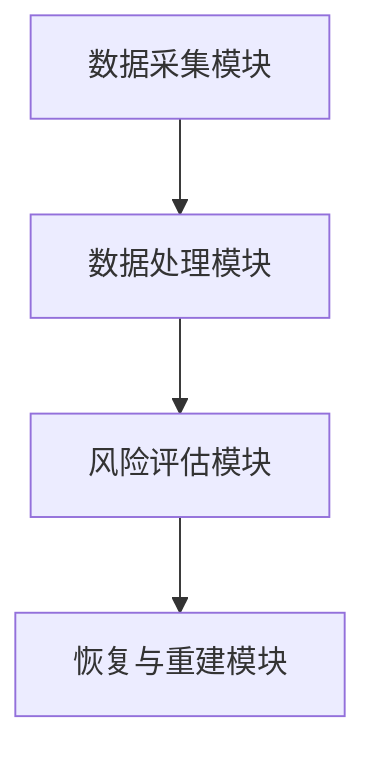
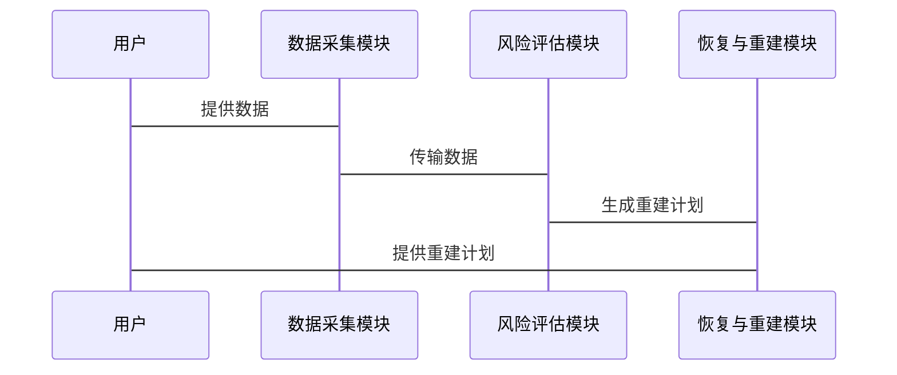

                 


# AI Agent在智能地震后评估系统中的实践

## 关键词：AI Agent、地震后评估、智能系统、风险评估、多智能体协作

## 摘要：
本文深入探讨了AI Agent在智能地震后评估系统中的应用与实践。首先，我们介绍了地震后评估的重要性及其面临的挑战，分析了AI Agent的基本概念和技术原理。接着，我们详细讲解了AI Agent在地震后评估系统中的角色和功能，包括数据采集、风险评估和恢复重建等方面。随后，我们从算法原理和数学模型的角度，详细阐述了AI Agent在地震后评估中的实现方法。最后，我们通过项目实战和系统架构设计，展示了如何将AI Agent技术应用于实际的地震后评估系统中，提出了系统设计的优化建议和未来的研究方向。

---

## 第一部分: AI Agent与地震后评估系统概述

## 第1章: 地震后评估系统的需求与挑战

### 1.1 地震后评估的重要性

#### 1.1.1 地震灾害的评估需求
地震是一种严重的自然灾害，其破坏性可能造成人员伤亡、财产损失和基础设施损毁。地震后评估的主要目的是快速、准确地了解灾害的影响范围和程度，为灾后救援、重建和风险管理提供科学依据。

#### 1.1.2 地震后评估的复杂性与挑战
地震后评估涉及多个方面，包括地理数据处理、建筑物损毁评估、人员伤亡统计等。传统方法依赖人工调查和经验判断，效率低、误差大。随着数据量的增加和评估要求的提高，传统的评估方法难以满足需求。

#### 1.1.3 AI技术在地震后评估中的应用潜力
人工智能（AI）技术，特别是AI Agent（智能体），能够通过自动化处理大量数据、学习模型和优化算法，显著提高地震后评估的效率和准确性。AI Agent能够实时处理多源数据，快速生成评估结果，并根据反馈不断优化评估模型。

---

### 1.2 AI Agent的基本概念

#### 1.2.1 什么是AI Agent
AI Agent是一种能够感知环境、自主决策并执行任务的智能实体。它能够通过传感器获取信息，利用算法进行分析和推理，并通过执行器与环境互动。AI Agent具有智能性、自主性和社会性等特征。

#### 1.2.2 AI Agent的核心特征
- **智能性**：AI Agent能够理解和处理复杂信息，具备推理和学习能力。
- **自主性**：AI Agent能够在没有外部干预的情况下独立完成任务。
- **反应性**：AI Agent能够实时感知环境变化并做出响应。
- **协作性**：AI Agent能够与其他智能体或系统协同工作，完成复杂的任务。

#### 1.2.3 AI Agent与传统自动化的区别
AI Agent不仅仅是简单的自动化工具，它具备自主决策和学习能力，能够在复杂环境中灵活应对问题。与传统自动化相比，AI Agent更加智能化和动态化。

---

### 1.3 AI Agent在地震后评估中的应用前景

#### 1.3.1 地震后评估的智能化需求
地震后评估需要快速、准确地处理大量异构数据，包括遥感数据、建筑物数据、人员数据等。传统方法依赖人工操作，效率低下且容易出错。智能化的评估系统能够显著提高评估效率和准确性。

#### 1.3.2 AI Agent在地震后评估中的优势
- **高效性**：AI Agent能够快速处理大量数据，缩短评估时间。
- **准确性**：通过机器学习和深度学习技术，AI Agent能够提高评估结果的准确性。
- **适应性**：AI Agent能够根据实时数据动态调整评估策略，适应复杂的评估场景。

#### 1.3.3 应用场景与实际案例
AI Agent在地震后评估中的应用场景包括：建筑物损毁评估、人员伤亡预测、灾后重建规划等。例如，通过AI Agent技术，可以快速分析遥感图像，识别建筑物的损毁情况，并生成重建方案。

---

## 第2章: AI Agent与地震后评估系统的结合

### 2.1 地震后评估系统的功能需求

#### 2.1.1 数据采集与处理
地震后评估系统需要采集多源异构数据，包括遥感数据、建筑物数据、人员数据等。数据处理包括数据清洗、融合和分析。

#### 2.1.2 风险评估与预测
通过分析历史数据和实时数据，评估地震对人员、财产和基础设施的影响，预测未来可能的风险。

#### 2.1.3 恢复与重建规划
根据评估结果，制定灾后重建计划，包括建筑物修复、基础设施重建和人员安置等。

---

### 2.2 AI Agent在地震后评估中的角色

#### 2.2.1 数据采集与处理的智能化
AI Agent能够通过传感器和网络获取实时数据，利用自然语言处理和图像识别技术，自动提取和分析数据。

#### 2.2.2 风险评估的智能化
AI Agent能够基于机器学习模型，分析历史数据和实时数据，评估地震风险，预测可能的损失。

#### 2.2.3 恢复与重建的智能化辅助
AI Agent能够通过优化算法，生成灾后重建计划，辅助决策者制定最优的重建方案。

---

### 2.3 AI Agent与地震后评估系统的协同工作

#### 2.3.1 系统协同的基本原理
AI Agent通过与其他智能体或系统的协同，实现数据共享、任务分配和结果反馈。

#### 2.3.2 协同工作的实现方式
通过多智能体协作算法，AI Agent能够在复杂环境中与其他智能体协同工作，完成复杂的评估任务。

#### 2.3.3 协同工作中的挑战与解决方案
协同工作中的主要挑战包括通信延迟、任务冲突和资源分配不均。解决方案包括优化通信协议、任务分解和资源分配算法。

---

## 第3章: AI Agent的核心概念与技术原理

### 3.1 AI Agent的核心概念

#### 3.1.1 知识表示
知识表示是AI Agent理解和处理信息的基础。常用的知识表示方法包括语义网络和知识图谱。

#### 3.1.2 逻辑推理
逻辑推理是AI Agent进行决策和判断的核心技术。常见的推理方法包括基于规则的推理和基于概率的推理。

#### 3.1.3 学习与自适应
学习与自适应是AI Agent提高智能性和适应性的关键。通过机器学习和深度学习技术，AI Agent能够不断优化自身的模型和策略。

---

### 3.2 AI Agent的关键技术

#### 3.2.1 知识图谱构建
知识图谱是AI Agent理解和处理信息的重要工具。通过构建地震相关知识图谱，AI Agent能够快速获取和分析地震相关知识。

#### 3.2.2 自然语言处理
自然语言处理技术使AI Agent能够理解和处理文本数据，例如新闻报道和社交媒体信息。

#### 3.2.3 多智能体协作
多智能体协作是AI Agent在地震后评估中的重要技术。通过多智能体协作，AI Agent能够分工合作，完成复杂的评估任务。

---

### 3.3 AI Agent在地震后评估中的技术实现

#### 3.3.1 数据处理与分析
通过数据清洗、融合和分析，AI Agent能够快速处理多源异构数据，生成评估结果。

#### 3.3.2 风险评估模型
基于机器学习模型，AI Agent能够分析历史数据和实时数据，评估地震风险，预测可能的损失。

#### 3.3.3 恢复与重建优化算法
通过优化算法，AI Agent能够生成灾后重建计划，辅助决策者制定最优的重建方案。

---

## 第4章: AI Agent的算法原理与数学模型

### 4.1 AI Agent的算法原理

#### 4.1.1 多智能体协作算法
多智能体协作算法是AI Agent协同工作的核心算法。常见的多智能体协作算法包括分布式协作和集中式协作。

#### 4.1.2 知识表示与推理算法
知识表示与推理算法是AI Agent进行逻辑推理的基础。常用的推理算法包括基于规则的推理和基于概率的推理。

#### 4.1.3 自然语言处理算法
自然语言处理算法是AI Agent理解和处理文本数据的关键。常用的自然语言处理算法包括词袋模型和词嵌入模型。

---

### 4.2 AI Agent的数学模型

#### 4.2.1 多智能体协作的数学模型
多智能体协作的数学模型描述了智能体之间的协同关系。常见的数学模型包括博弈论模型和图论模型。

#### 4.2.2 风险评估的数学模型
风险评估的数学模型基于概率论和统计学，用于预测地震可能带来的损失。

#### 4.2.3 恢复与重建优化的数学模型
恢复与重建优化的数学模型基于优化理论，用于制定最优的重建计划。

---

### 4.3 算法实现与代码示例

#### 4.3.1 多智能体协作算法的Python实现
```python
import numpy as np

def multi_agent_collaboration(data):
    agents = initialize_agents()
    for agent in agents:
        agent_data = data[agent]
        agent.update_model(agent_data)
    return agents.compute_optimal_plan()
```

#### 4.3.2 风险评估模型的代码示例
```python
import pandas as pd
from sklearn.ensemble import RandomForestRegressor

model = RandomForestRegressor()
model.fit(X_train, y_train)
predictions = model.predict(X_test)
```

#### 4.3.3 恢复与重建优化算法的代码示例
```python
import numpy as np
from scipy.optimize import minimize

def reconstruction_optimizer(params):
    return np.sum((params - target) ** 2)

result = minimize(reconstruction_optimizer, initial_params)
```

---

## 第5章: 地震后评估系统的系统分析与架构设计

### 5.1 系统功能设计

#### 5.1.1 系统功能模块
地震后评估系统主要包括数据采集模块、风险评估模块、恢复与重建模块等。

#### 5.1.2 系统功能流程
数据采集模块负责获取多源异构数据，风险评估模块基于机器学习模型进行风险评估，恢复与重建模块生成重建计划。

#### 5.1.3 系统功能实现
通过Python和深度学习框架（如TensorFlow）实现系统的各个功能模块。

---

### 5.2 系统架构设计

#### 5.2.1 系统架构图
使用Mermaid图展示系统的架构设计。



#### 5.2.2 系统交互设计
使用Mermaid序列图展示系统的交互流程。



---

## 第6章: 项目实战

### 6.1 环境配置

#### 6.1.1 Python环境
安装Python 3.8及以上版本，安装必要的库（如numpy、pandas、scikit-learn、tensorflow）。

#### 6.1.2 数据集准备
获取地震相关数据，包括遥感数据、建筑物数据、人员数据等。

---

### 6.2 系统核心实现

#### 6.2.1 数据处理与分析
编写代码对数据进行清洗、融合和分析，生成评估结果。

#### 6.2.2 风险评估模型
基于机器学习模型，训练风险评估模型，进行地震风险预测。

#### 6.2.3 恢复与重建优化
编写优化算法，生成最优的重建计划。

---

### 6.3 实际案例分析

#### 6.3.1 案例介绍
以某次地震为例，介绍系统的实际应用情况。

#### 6.3.2 案例分析
分析系统在实际应用中的表现，总结经验和教训。

---

### 6.4 项目总结

#### 6.4.1 项目成果
总结项目的成果，包括系统实现、算法优化等。

#### 6.4.2 项目经验
总结项目实施过程中的经验和教训，提出改进建议。

---

## 第7章: 最佳实践

### 7.1 小结

#### 7.1.1 系统优势
总结AI Agent在地震后评估系统中的优势，包括高效性、准确性和适应性。

#### 7.1.2 系统劣势
分析AI Agent在地震后评估系统中的劣势，如数据依赖性、算法复杂性等。

#### 7.1.3 优化建议
提出优化系统的建议，包括改进算法、优化数据处理流程等。

---

### 7.2 注意事项

#### 7.2.1 数据质量
强调数据质量的重要性，建议采用高质量的数据源。

#### 7.2.2 算法选择
根据具体场景选择合适的算法，避免盲目追求复杂算法。

#### 7.2.3 系统维护
定期更新系统模型和数据，保持系统的高效性和准确性。

---

### 7.3 拓展阅读

#### 7.3.1 相关技术
推荐相关技术的阅读资料，如多智能体协作、知识图谱构建等。

#### 7.3.2 应用领域
介绍AI Agent在其他领域的应用，如智能交通、智能医疗等。

#### 7.3.3 未来研究方向
展望AI Agent在地震后评估系统中的未来研究方向，如自适应算法、边缘计算等。

---

## 作者：AI天才研究院/AI Genius Institute & 禅与计算机程序设计艺术 /Zen And The Art of Computer Programming

