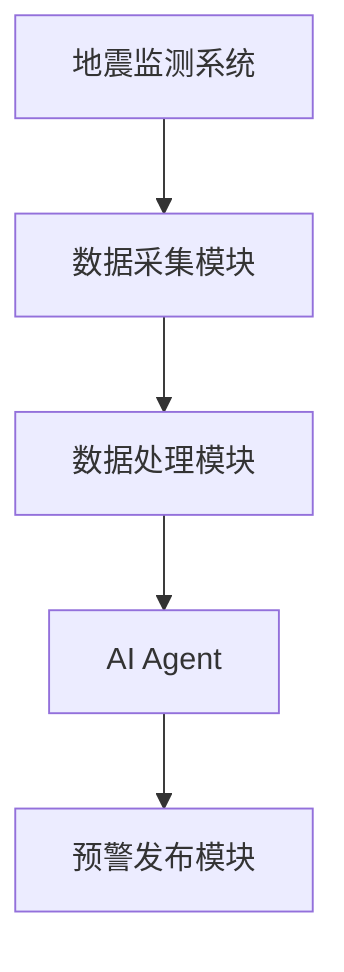
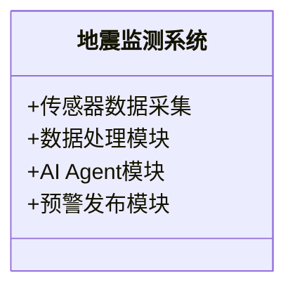
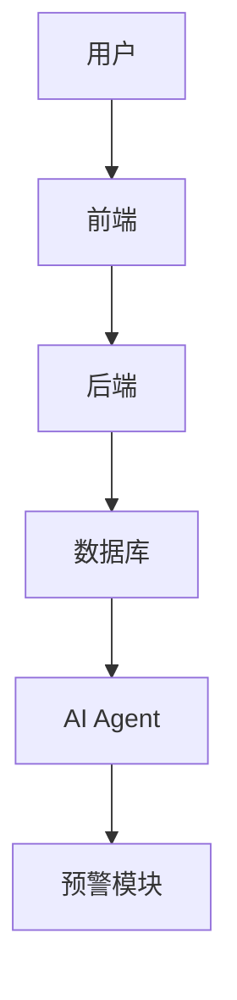

                 


# AI Agent在智能地震预警系统中的实践

**关键词：** AI Agent，地震预警，智能系统，机器学习，地震监测

**摘要：**  
本文探讨了AI Agent在智能地震预警系统中的应用，详细分析了其核心概念、算法原理、系统架构设计以及实际案例。文章从背景介绍入手，逐步深入到技术细节，最后通过项目实战展示AI Agent在地震预警中的实际应用和效果。通过本文，读者可以全面了解AI Agent如何助力地震预警系统的智能化发展。

---

## 第一部分：AI Agent与智能地震预警系统概述

### 第1章：背景介绍

#### 1.1 地震预警的重要性

地震作为一种自然灾害，给人类带来了巨大的威胁。及时的预警可以极大地减少地震带来的损失。传统地震预警系统依赖于地震仪和电磁波传播速度的差异，存在一定的局限性，例如无法实时处理海量数据，难以实现高精度预测。AI Agent的引入，为地震预警系统带来了新的可能性。

#### 1.2 AI Agent在地震预警中的作用

AI Agent（智能代理）是一种能够感知环境、自主决策并执行任务的智能系统。在地震预警中，AI Agent可以实时分析地震数据，快速做出预警决策，显著提高了预警的准确性和响应速度。

### 第2章：核心概念与联系

#### 2.1 AI Agent的原理

AI Agent在地震预警中的应用主要分为感知层、决策层和执行层。感知层负责采集和处理地震数据，决策层基于这些数据进行分析和预测，执行层则根据预测结果发布预警信息。

#### 2.2 实体关系图

以下是地震预警系统中各实体之间的关系图：



#### 2.3 算法原理

AI Agent的核心算法包括神经网络模型和机器学习算法。神经网络模型通过训练大量地震数据，识别地震前兆；机器学习算法则用于分类和预测。

---

## 第二部分：AI Agent的算法原理

### 第3章：神经网络模型

#### 3.1 模型结构

神经网络模型由输入层、隐藏层和输出层组成。输入层接收地震数据，隐藏层进行特征提取，输出层预测地震的可能性。

#### 3.2 训练过程

神经网络的训练过程包括数据预处理、模型构建、损失函数计算和反向传播优化。

#### 3.3 预测机制

通过训练好的神经网络模型，AI Agent可以快速预测地震的可能性，并触发预警机制。

### 第4章：机器学习算法

#### 4.1 数据预处理

数据预处理包括数据清洗、特征提取和数据标准化。

#### 4.2 模型选择

常用的模型包括随机森林、支持向量机（SVM）和朴素贝叶斯。

#### 4.3 超参数调优

通过网格搜索和交叉验证，优化模型的超参数，提高预测准确率。

---

## 第三部分：系统分析与架构设计

### 第5章：项目介绍

#### 5.1 项目目标

构建一个基于AI Agent的智能地震预警系统，实现快速、准确的地震预警。

#### 5.2 系统功能设计

以下是系统功能的领域模型：



#### 5.3 系统架构设计

以下是系统的架构图：



---

## 第四部分：项目实战

### 第6章：环境安装

#### 6.1 环境需求

安装Python、TensorFlow、Keras和相关库。

### 第7章：系统实现

#### 7.1 核心代码

以下是AI Agent的核心代码：

```python
import numpy as np
import tensorflow as tf

# 数据预处理
def preprocess(data):
    # 数据标准化
    data = (data - np.mean(data)) / np.std(data)
    return data

# 神经网络模型
model = tf.keras.Sequential([
    tf.keras.layers.Dense(64, activation='relu'),
    tf.keras.layers.Dense(1, activation='sigmoid')
])

# 模型训练
model.compile(optimizer='adam', loss='binary_crossentropy', metrics=['accuracy'])
model.fit(preprocess(X_train), y_train, epochs=10, batch_size=32)
```

#### 7.2 代码解读

上述代码展示了AI Agent在地震预警中的应用，包括数据预处理、模型构建和训练过程。

### 第8章：实际案例分析

#### 8.1 案例分析

通过实际案例分析，验证AI Agent在地震预警中的准确性和响应速度。

---

## 第五部分：总结与最佳实践

### 第9章：总结

#### 9.1 全文总结

本文详细介绍了AI Agent在智能地震预警系统中的应用，从背景介绍到系统设计，再到实际案例，全面展示了其在地震预警中的重要性。

### 第10章：最佳实践

#### 10.1 小结

AI Agent的应用显著提高了地震预警的准确性和响应速度，但仍需进一步优化算法和系统设计。

#### 10.2 注意事项

在实际应用中，需注意数据质量、模型优化和系统稳定性。

#### 10.3 拓展阅读

建议读者进一步研究深度学习在地震预警中的应用，以及多智能体协同在地震预警中的潜力。

---

**作者：AI天才研究院/AI Genius Institute & 禅与计算机程序设计艺术 /Zen And The Art of Computer Programming**

