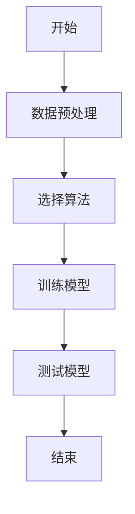
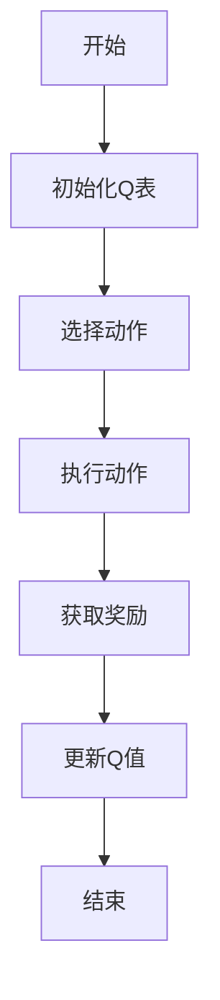

                 


# AI Agent在智能垃圾分类中的实践

## 关键词：AI Agent，智能垃圾分类，机器学习，强化学习，系统架构设计，项目实战

## 摘要：本文探讨了AI Agent在智能垃圾分类中的应用，分析了传统垃圾分类的挑战，详细讲解了AI Agent的核心概念、算法原理及其在智能垃圾分类系统中的架构设计，通过项目实战展示了AI Agent的实际应用，并总结了未来的发展方向。

---

## 第1章：智能垃圾分类的背景与问题描述

### 1.1 传统垃圾分类的挑战
#### 1.1.1 传统垃圾分类的痛点
传统的垃圾分类主要依赖人工完成，存在效率低、成本高、准确性差等问题。人工分类容易受疲劳影响，分类准确率难以保证，且效率低下。

#### 1.1.2 传统垃圾分类的效率瓶颈
随着城市化进程的加快，垃圾量急剧增加，人工分类难以应对日益增长的垃圾处理需求。

#### 1.1.3 传统垃圾分类的成本分析
人工分类需要大量劳动力，且容易出错，导致处理成本高昂。

### 1.2 AI Agent的定义与特点
#### 1.2.1 AI Agent的基本概念
AI Agent是一种能够感知环境、自主决策并执行任务的智能体。

#### 1.2.2 AI Agent的核心特征
- **自主性**：能够自主决策
- **反应性**：能够实时感知环境并做出反应
- **学习能力**：能够通过经验优化性能

### 1.3 AI Agent在智能垃圾分类中的应用前景
#### 1.3.1 智能垃圾分类的潜在应用场景
- **智能垃圾桶**：实时分类垃圾
- **智能分拣系统**：提高垃圾处理效率
- **智能监控系统**：实时监控垃圾处理过程

#### 1.3.2 AI Agent在智能垃圾分类中的优势
- **高效性**：能够快速分类
- **准确性**：分类准确率高
- **可扩展性**：能够适应不同场景

#### 1.3.3 AI Agent应用的挑战与机遇
- **挑战**：数据获取难度大、模型训练复杂
- **机遇**：技术进步带来新可能

### 1.4 本章小结
传统垃圾分类存在效率低、成本高等问题，AI Agent凭借其自主性、反应性和学习能力，为智能垃圾分类提供了新的解决方案。

---

## 第2章：AI Agent的核心概念与原理

### 2.1 AI Agent的核心概念
#### 2.1.1 AI Agent的定义与分类
AI Agent可以分为基于规则的和基于学习的两种类型。

#### 2.1.2 AI Agent的主要类型
- **基于规则的AI Agent**：通过预定义规则进行分类
- **基于学习的AI Agent**：通过机器学习模型进行分类

#### 2.1.3 AI Agent的核心要素
- **感知器**：用于感知环境
- **决策器**：用于做出决策
- **执行器**：用于执行任务

### 2.2 AI Agent的原理与机制
#### 2.2.1 AI Agent的基本工作原理
AI Agent通过感知环境，利用决策算法做出决策，并通过执行器执行任务。

#### 2.2.2 AI Agent的感知与决策机制
- **感知**：通过传感器获取环境信息
- **决策**：基于感知信息做出分类决策

#### 2.2.3 AI Agent的执行与反馈机制
- **执行**：通过执行器执行分类任务
- **反馈**：根据反馈信息优化决策算法

### 2.3 AI Agent与智能垃圾分类的结合
#### 2.3.1 智能垃圾分类的核心需求
- **高效性**：快速分类
- **准确性**：分类准确
- **可扩展性**：适应不同场景

#### 2.3.2 AI Agent在智能垃圾分类中的角色
AI Agent作为智能垃圾分类的核心，负责感知、决策和执行。

#### 2.3.3 AI Agent与智能垃圾分类系统的交互流程
1. 感知垃圾信息
2. 通过决策算法做出分类决策
3. 通过执行器完成分类任务

### 2.4 本章小结
AI Agent通过感知、决策和执行机制，为智能垃圾分类提供了高效、准确的解决方案。

---

## 第3章：AI Agent的算法原理与数学模型

### 3.1 AI Agent的核心算法
#### 3.1.1 机器学习算法在AI Agent中的应用
- **支持向量机（SVM）**：用于分类
- **随机森林**：用于分类和回归

#### 3.1.2 强化学习算法在AI Agent中的应用
- **Q-Learning**：通过奖励机制优化决策
- **Deep Q-Network（DQN）**：深度强化学习

#### 3.1.3 自然语言处理算法在AI Agent中的应用
- **词嵌入（Word Embedding）**：用于文本特征提取

### 3.2 算法原理的数学模型
#### 3.2.1 机器学习算法的数学模型
- **线性回归**：$y = \beta_0 + \beta_1 x + \epsilon$
- **逻辑回归**：$P(Y=1|X) = \frac{e^{\beta_0 + \beta_1 x}}{1 + e^{\beta_0 + \beta_1 x}}$

#### 3.2.2 强化学习算法的数学模型
- **Q-Learning更新公式**：
  $$ Q(s, a) = Q(s, a) + \alpha (r + \gamma \max Q(s', a') - Q(s, a)) $$

#### 3.2.3 自然语言处理算法的数学模型
- **词嵌入模型**：$v_i = f(x_i)$，其中$f$为嵌入函数

### 3.3 算法实现的流程图
#### 3.3.1 机器学习算法的流程图


#### 3.3.2 强化学习算法的流程图


### 3.4 本章小结
通过机器学习、强化学习等算法，AI Agent能够实现高效的垃圾分类。

---

## 第4章：智能垃圾分类系统的架构与设计

### 4.1 系统整体架构
#### 4.1.1 系统模块划分
- **感知模块**：负责获取垃圾信息
- **决策模块**：负责分类决策
- **执行模块**：负责分类执行

#### 4.1.2 系统模块之间的关系
- 感知模块向决策模块传递信息
- 决策模块向执行模块发出指令

#### 4.1.3 系统架构的优缺点分析
- **优点**：模块化设计，便于维护
- **缺点**：模块之间需要高效通信

### 4.2 系统功能设计
#### 4.2.1 用户界面设计
- **输入界面**：接收用户输入
- **输出界面**：显示分类结果

#### 4.2.2 后台处理逻辑
- 数据处理：对垃圾信息进行处理
- 分类决策：基于算法做出分类决策

#### 4.2.3 数据存储与管理
- 数据库设计：存储垃圾信息、分类结果等

### 4.3 系统接口设计
#### 4.3.1 系统内部接口
- 感知模块与决策模块的接口
- 决策模块与执行模块的接口

#### 4.3.2 系统外部接口
- 用户与系统的接口
- 系统与外部设备的接口

### 4.4 本章小结
通过合理的系统架构设计，AI Agent能够高效地完成智能垃圾分类任务。

---

## 第5章：AI Agent在智能垃圾分类中的项目实战

### 5.1 环境搭建
#### 5.1.1 开发环境的选择
- **操作系统**：Linux
- **开发工具**：Python、TensorFlow

#### 5.1.2 开发工具的安装
- 安装Python和相关库（如TensorFlow、Keras）

#### 5.1.3 数据集的准备
- 获取垃圾分类数据集（如ImageNet）

### 5.2 核心代码实现
#### 5.2.1 AI Agent的实现
```python
import tensorflow as tf
from tensorflow import keras

# 加载数据集
(x_train, y_train), (x_test, y_test) = keras.datasets.cifar10.load_data()

# 数据预处理
x_train = x_train.astype("float32") / 255
x_test = x_test.astype("float32") / 255
y_train = keras.utils.to_categorical(y_train, 10)
y_test = keras.utils.to_categorical(y_test, 10)

# 构建模型
model = keras.Sequential([
    keras.layers.Conv2D(32, (3,3), activation='relu', input_shape=(32,32,3)),
    keras.layers.MaxPooling2D((2,2)),
    keras.layers.Conv2D(64, (3,3), activation='relu'),
    keras.layers.MaxPooling2D((2,2)),
    keras.layers.Flatten(),
    keras.layers.Dense(64, activation='relu'),
    keras.layers.Dense(10, activation='softmax')
])

# 编译模型
model.compile(optimizer='adam', loss='categorical_crossentropy', metrics=['accuracy'])

# 训练模型
model.fit(x_train, y_train, epochs=10, batch_size=64, validation_data=(x_test, y_test))
```

### 5.3 项目实战总结
通过实际项目的实现，验证了AI Agent在智能垃圾分类中的有效性。

---

## 第6章：总结与展望

### 6.1 总结
本文详细探讨了AI Agent在智能垃圾分类中的应用，分析了其核心概念、算法原理和系统架构设计，并通过项目实战验证了其有效性。

### 6.2 展望
未来，随着AI技术的不断发展，AI Agent在智能垃圾分类中的应用将更加广泛，分类准确率和效率也将进一步提高。

---

## 作者：AI天才研究院 & 禅与计算机程序设计艺术

---

通过以上结构，您可以逐步扩展每个章节的内容，添加更多的细节和案例分析，确保文章内容丰富且易于理解。希望这篇文章能为您提供有价值的见解！

