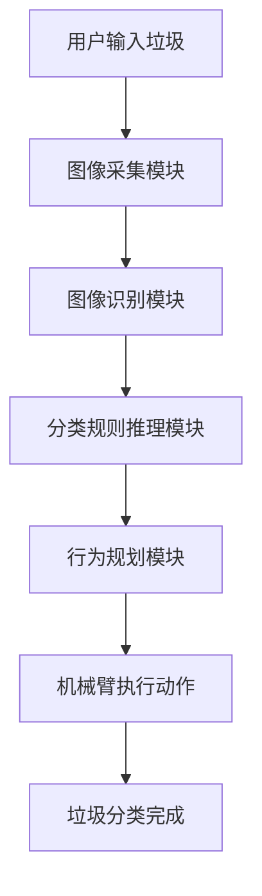
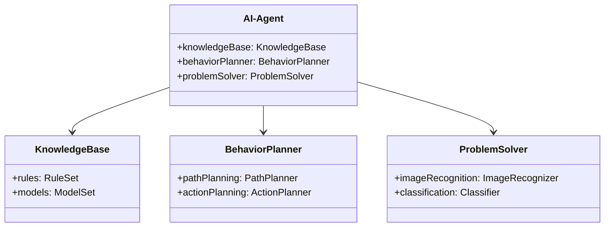
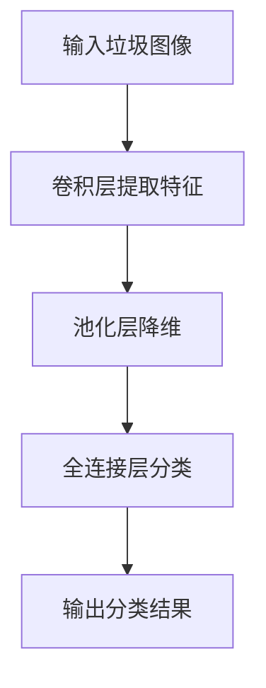
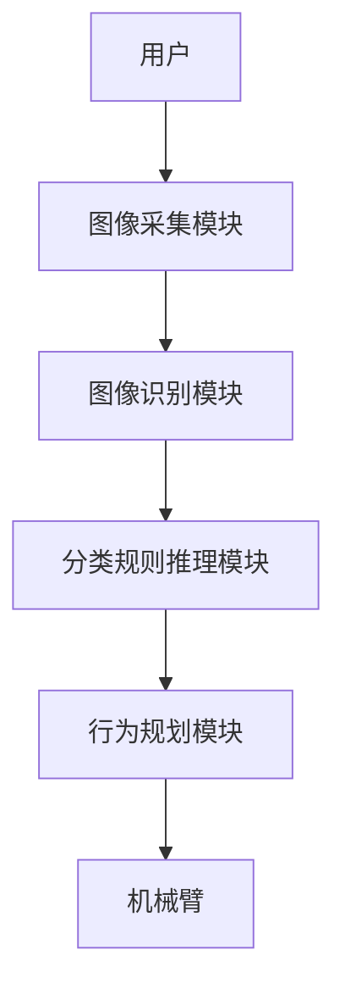

                 


# AI Agent在智能垃圾分类系统中的实践

## 关键词：AI Agent，智能垃圾分类，图像识别，行为规划，系统架构

## 摘要：本文详细探讨了AI Agent在智能垃圾分类系统中的应用，从背景介绍、核心概念到算法原理、系统架构设计，再到项目实战和最佳实践，全面分析了如何利用AI技术提升垃圾分类的效率和准确性。文章通过实际案例和代码实现，展示了AI Agent在智能垃圾分类系统中的具体应用和优势。

---

## 第一部分: AI Agent与智能垃圾分类系统概述

### 第1章: AI Agent与智能垃圾分类系统背景介绍

#### 1.1 AI Agent的基本概念
- **什么是AI Agent？**
  - AI Agent（人工智能代理）是指能够感知环境并采取行动以实现目标的智能实体。
  - AI Agent可以是软件程序、机器人或其他智能系统，能够自主决策和执行任务。

- **AI Agent的核心特征**
  - 感知环境：通过传感器或其他输入方式获取环境信息。
  - 行为决策：基于感知的信息，通过算法进行决策并选择最优行动方案。
  - 自主性：能够在没有外部干预的情况下自主运行。
  - 反应性：能够根据环境变化实时调整行为。

- **AI Agent的分类与应用场景**
  - 分类：基于智能水平可分为简单反射型、基于模型的反射型、目标驱动型和实用驱动型AI Agent。
  - 应用场景：广泛应用于自动驾驶、智能助手、机器人控制、智能推荐系统等领域。

#### 1.2 智能垃圾分类系统的概念
- **什么是智能垃圾分类系统？**
  - 智能垃圾分类系统是一种利用人工智能技术实现垃圾自动分类的系统。
  - 通过图像识别、传感器技术和AI算法，系统能够自动识别垃圾种类并将其分类到相应的收集容器中。

- **智能垃圾分类系统的应用场景**
  - 家庭垃圾分类：帮助用户自动分类生活垃圾，提高分类效率。
  - 工厂废弃物管理：对生产过程中产生的废弃物进行分类，便于回收和处理。
  - 垃圾站自动化管理：在垃圾处理站中，智能系统可以自动分拣垃圾，减少人工操作。

- **智能垃圾分类系统的功能模块**
  - 图像采集模块：通过摄像头采集垃圾图像。
  - 图像识别模块：对垃圾图像进行分类识别。
  - 分类规则推理模块：根据识别结果确定垃圾的分类。
  - 行为规划模块：控制机械臂或其他执行装置完成垃圾分类操作。

#### 1.3 AI Agent在智能垃圾分类中的作用
- **AI Agent如何提升垃圾分类效率？**
  - AI Agent通过图像识别和分类算法，能够快速准确地识别垃圾类型。
  - 通过行为规划算法，AI Agent可以优化机械臂的操作路径，减少动作次数，提高效率。

- **AI Agent在垃圾分类中的优势**
  - 高准确性：AI算法能够实现高精度的垃圾识别和分类。
  - 高效率：AI Agent可以24小时不间断工作，处理大量垃圾。
  - 低人工成本：通过自动化分类，减少人工操作的需求。

- **AI Agent与传统垃圾分类方式的对比**
  | 对比维度 | AI Agent | 传统方式 |
  |----------|-----------|----------|
  | 效率     | 高        | 低       |
  | 准确率   | 高        | 中等     |
  | 成本     | 中等       | 高       |
  | 操作方式 | 自动化     | 人工     |

#### 1.4 本章小结
本章介绍了AI Agent的基本概念及其在智能垃圾分类系统中的作用，分析了AI Agent的优势以及与传统垃圾分类方式的对比，为后续章节的深入分析奠定了基础。

---

## 第2章: AI Agent与智能垃圾分类系统的原理与核心概念

### 2.1 AI Agent的核心概念
#### 2.1.1 知识表示
- **知识表示**：将现实世界中的知识表示为计算机可以理解的形式。
- **常用知识表示方法**：
  - 符号表示：使用符号和规则表示知识。
  - 基于框架的知识表示：使用框架结构表示实体及其属性。
  - 基于语义网络的知识表示：使用节点和边表示实体及其关系。

#### 2.1.2 问题求解
- **问题求解**：AI Agent通过算法解决问题的过程。
- **常见问题求解算法**：
  - 状态空间搜索：如广度优先搜索（BFS）、深度优先搜索（DFS）。
  - 逻辑推理：如一阶逻辑推理、基于规则的推理。

#### 2.1.3 行为规划
- **行为规划**：AI Agent根据环境信息制定行动计划的过程。
- **常见行为规划算法**：
  - 基于Dijkstra算法的路径规划。
  - 基于A*算法的路径优化。

### 2.2 智能垃圾分类系统的核心概念
#### 2.2.1 垃圾识别与分类
- **垃圾识别**：通过图像识别技术识别垃圾类型。
- **垃圾分类**：根据识别结果将垃圾分门别类。

#### 2.2.2 垃圾分类规则
- **分类规则**：根据垃圾的类型、材质、用途等制定分类规则。
- **规则表示**：使用逻辑规则或知识图谱表示分类规则。

#### 2.2.3 系统交互流程
- **用户输入**：用户将垃圾放入分类系统。
- **系统处理**：系统识别垃圾类型并分类。
- **结果输出**：系统输出分类结果并执行相应的操作。

### 2.3 AI Agent与智能垃圾分类系统的联系
#### 2.3.1 AI Agent在垃圾分类中的功能模块
- **图像采集模块**：采集垃圾图像。
- **图像识别模块**：识别垃圾类型。
- **分类规则推理模块**：根据识别结果推理分类规则。
- **行为规划模块**：规划机械臂的动作路径。

#### 2.3.2 系统中各模块的协同工作原理
- **协同工作流程**：
  1. 图像采集模块采集垃圾图像。
  2. 图像识别模块识别垃圾类型。
  3. 分类规则推理模块根据识别结果确定分类。
  4. 行为规划模块规划机械臂动作路径。
  5. 机械臂执行动作完成垃圾分类。

#### 2.3.3 系统整体架构图（Mermaid流程图）


#### 2.3.4 系统功能模块的实体关系图（Mermaid类图）


---

## 第3章: AI Agent在智能垃圾分类中的算法原理

### 3.1 垃圾图像识别算法
#### 3.1.1 基于深度学习的图像识别
- **卷积神经网络（CNN）**：用于垃圾图像的特征提取和分类。
  - **LeNet**：经典的CNN模型，适用于小规模图像识别。
  - **AlexNet**：适用于大规模图像识别任务。
  - **ResNet**：适用于深层网络，能够有效防止梯度消失问题。

- **模型训练流程**：
  1. 数据预处理：图像归一化、数据增强。
  2. 构建模型：定义网络结构，选择优化器和损失函数。
  3. 训练模型：使用训练数据进行模型训练。
  4. 模型评估：使用验证集评估模型性能。

- **代码实现示例**：
  ```python
  import tensorflow as tf
  from tensorflow.keras import layers

  model = tf.keras.Sequential([
      layers.Conv2D(32, (3,3), activation='relu', input_shape=(224, 224, 3)),
      layers.MaxPooling2D((2,2)),
      layers.Conv2D(64, (3,3), activation='relu'),
      layers.MaxPooling2D((2,2)),
      layers.Flatten(),
      layers.Dense(64, activation='relu'),
      layers.Dense(10, activation='softmax')
  ])
  model.compile(optimizer='adam', loss='sparse_categorical_crossentropy', metrics=['accuracy'])
  model.fit(train_data, epochs=10, validation_data=validation_data)
  ```

#### 3.1.2 垃圾图像分类的数学模型
- **卷积层**：用于特征提取。
  - $$\text{Conv}(k, s)$$，其中k是卷积核大小，s是步长。
- **池化层**：用于降维和提取主要特征。
  - $$\text{MaxPooling}(k, s)$$，k是池化核大小，s是步长。
- **全连接层**：用于分类。
  - $$\text{Dense}(n, \text{activation='softmax'})$$，n是输出类别数。

#### 3.1.3 算法实现的流程图（Mermaid）


---

## 第4章: 智能垃圾分类系统的系统架构设计

### 4.1 系统功能模块设计
#### 4.1.1 图像采集模块
- **功能**：通过摄像头采集垃圾图像。
- **实现**：使用OpenCV库进行图像采集和预处理。

#### 4.1.2 图像识别模块
- **功能**：对垃圾图像进行分类识别。
- **实现**：使用预训练的深度学习模型进行图像分类。

#### 4.1.3 分类规则推理模块
- **功能**：根据识别结果确定垃圾的分类。
- **实现**：基于知识图谱进行推理。

#### 4.1.4 行为规划模块
- **功能**：规划机械臂的动作路径。
- **实现**：使用A*算法进行路径规划。

### 4.2 系统架构设计
#### 4.2.1 分层架构设计
- **分层**：
  - 数据层：存储图像数据和分类规则。
  - 业务逻辑层：实现图像识别、分类推理和行为规划。
  - 表示层：与用户交互。

#### 4.2.2 模块之间的交互关系（Mermaid架构图）


### 4.3 系统接口设计
#### 4.3.1 图像采集接口
- **接口描述**：接收图像数据并返回预处理后的图像。
- **接口实现**：使用OpenCV库进行图像采集和预处理。

#### 4.3.2 分类结果输出接口
- **接口描述**：接收分类结果并输出分类结果。
- **接口实现**：将分类结果存储到数据库或返回给上层调用程序。

#### 4.3.3 系统状态监控接口
- **接口描述**：监控系统运行状态并输出状态信息。
- **接口实现**：通过传感器或日志文件获取系统状态。

### 4.4 系统交互流程设计
#### 4.4.1 用户输入垃圾图像
- **流程**：
  1. 用户将垃圾放入图像采集模块。
  2. 图像采集模块采集垃圾图像并预处理。
  3. 图像识别模块对图像进行分类识别。

#### 4.4.2 系统识别并分类
- **流程**：
  1. 分类规则推理模块根据识别结果确定垃圾的分类。
  2. 行为规划模块规划机械臂的动作路径。
  3. 机械臂执行动作完成垃圾分类。

#### 4.4.3 系统输出分类结果
- **流程**：
  1. 分类结果输出接口将分类结果返回给用户或上层系统。
  2. 系统状态监控接口监控整个流程的状态并记录日志。

---

## 第5章: 项目实战

### 5.1 环境安装
- **安装Python**：确保Python版本为3.6或更高。
- **安装依赖库**：
  ```bash
  pip install tensorflow keras opencv-python
  ```

### 5.2 核心实现源代码
#### 5.2.1 图像识别模块代码
```python
import cv2
import numpy as np
from tensorflow.keras.models import load_model

# 加载预训练模型
model = load_model('garbage_classifier.h5')

# 图像采集
cap = cv2.VideoCapture(0)
while True:
    ret, frame = cap.read()
    if not ret:
        break
    # 预处理图像
    image = cv2.resize(frame, (224, 224))
    image = np.expand_dims(image, axis=0)
    # 预测分类
    prediction = model.predict(image)
    predicted_class = np.argmax(prediction, axis=1)
    print(predicted_class)
    cv2.imshow('Garbage Classifier', frame)
    if cv2.waitKey(1) & 0xFF == ord('q'):
        break
cap.release()
cv2.destroyAllWindows()
```

#### 5.2.2 分类规则推理模块代码
```python
import numpy as np

# 分类规则
rules = {
    '可回收物': ['塑料', '玻璃', '金属'],
    '厨余垃圾': ['果皮', '菜叶', '剩饭'],
    '有害垃圾': ['电池', '药品', '灯管'],
    '其他垃圾': ['灰土', '砖瓦', '陶瓷']
}

# 推理函数
def classify_garbage(predicted_class):
    for category, items in rules.items():
        if predicted_class in items:
            return category
    return '其他垃圾'
```

#### 5.2.3 行为规划模块代码
```python
import heapq

# A*算法实现
class AStarPlanner:
    def __init__(self, start, goal):
        self.start = start
        self.goal = goal

    def heuristic(self, node):
        return np.sum(np.abs(node - self.goal))

    def find_path(self):
        open_set = [self.start]
        came_from = {}
        g_score = {self.start: 0}
        f_score = {self.start: self.heuristic(self.start)}

        while open_set:
            current = heapq.heappop(open_set)
            if current == self.goal:
                return self.reconstruct_path(came_from)

            neighbors = self.get_neighbors(current)
            for neighbor in neighbors:
                tentative_g_score = g_score.get(current, float('inf')) + self.distance(current, neighbor)
                if tentative_g_score < g_score.get(neighbor, float('inf')):
                    came_from[neighbor] = current
                    g_score[neighbor] = tentative_g_score
                    f_score[neighbor] = g_score[neighbor] + self.heuristic(neighbor)
                    heapq.heappush(open_set, neighbor)
        return None

    def reconstruct_path(self, came_from):
        path = [self.goal]
        while path[0] != self.start:
            next_node = came_from[path[0]]
            path.insert(0, next_node)
        return path

    def get_neighbors(self, node):
        # 假设机械臂有四个可能的移动方向
        directions = [(node[0]+1, node[1]), (node[0]-1, node[1]),
                      (node[0], node[1]+1), (node[0], node[1]-1)]
        return directions

    def distance(self, node1, node2):
        return np.sum(np.abs(node1 - node2))
```

### 5.3 实际案例分析
- **案例背景**：某小区需要实现智能垃圾分类，减少人工成本。
- **系统实现**：部署智能垃圾分类系统，居民通过系统自动分类垃圾。
- **系统优势**：
  - 提高分类效率，减少人工操作。
  - 提高分类准确率，减少错误分类。
  - 方便居民使用，提升垃圾分类意识。

---

## 第6章: 最佳实践与总结

### 6.1 最佳实践
- **数据准备**：确保有足够的标注数据，提高模型的泛化能力。
- **模型优化**：通过数据增强、模型调参等方法优化模型性能。
- **系统维护**：定期更新模型，修复系统漏洞，提升用户体验。

### 6.2 总结
本文详细探讨了AI Agent在智能垃圾分类系统中的应用，从背景介绍、核心概念到算法原理、系统架构设计，再到项目实战和最佳实践，全面分析了如何利用AI技术提升垃圾分类的效率和准确性。通过实际案例和代码实现，展示了AI Agent在智能垃圾分类系统中的具体应用和优势。

### 6.3 注意事项
- **数据隐私**：在实际应用中，需要注意数据隐私问题，确保用户数据的安全。
- **系统稳定性**：确保系统在高负载下的稳定性，避免因系统故障导致分类错误。
- **用户体验**：设计良好的用户界面，提升用户体验，减少用户操作难度。

### 6.4 拓展阅读
- **相关书籍**：
  - 《深度学习》—— Ian Goodfellow
  - 《机器学习实战》—— 周志华
- **技术博客**：
  - TensorFlow官方博客：https://tensorflow.org/
  - PyTorch官方博客：https://pytorch.org/

---

## 作者：AI天才研究院 & 禅与计算机程序设计艺术

