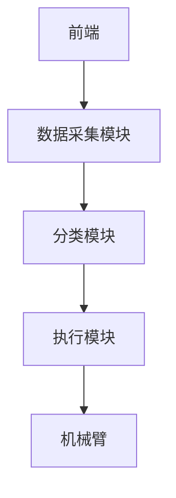
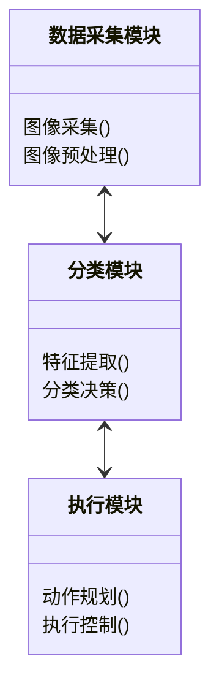
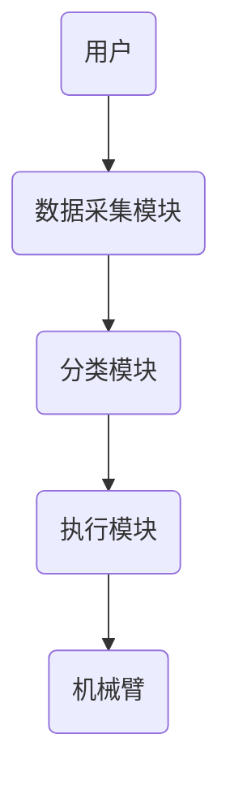
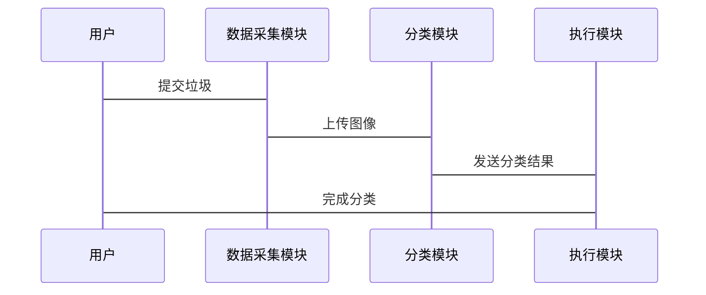

                 


# AI Agent在智能垃圾分类识别中的实践

## 关键词：AI Agent, 智能垃圾分类, 图像识别, 机器学习, 人工智能

## 摘要：  
本文探讨了AI Agent在智能垃圾分类识别中的实践应用，分析了AI Agent的核心概念、算法原理、系统架构设计以及实际项目实现。通过详细的技术分析和案例研究，展示了如何利用AI技术提高垃圾分类的效率和准确性，为实现智能垃圾分类系统提供了理论和实践参考。

---

# 第1章: 智能垃圾分类识别的背景与问题

## 1.1 垃圾分类的重要性与现状

### 1.1.1 当前垃圾分类的必要性  
垃圾分类是环境保护的重要环节，能够减少资源浪费、降低环境污染、提高资源利用率。随着城市化进程的加快，垃圾产生量急剧增加，传统的人工分类方式效率低下，容易出错，亟需智能化解决方案。

### 1.1.2 垃圾分类的现状与挑战  
目前，许多地方仍依赖人工进行垃圾分类，存在效率低、成本高、误差大的问题。此外，不同地区的垃圾分类标准不一，增加了分类的复杂性。

### 1.1.3 AI技术在垃圾分类中的潜在价值  
AI技术能够通过图像识别、机器学习等手段，快速、准确地识别垃圾种类，大幅提高分类效率和准确性。

---

## 1.2 AI Agent的基本概念与特点

### 1.2.1 AI Agent的定义  
AI Agent是一种具有自主性、反应性和目标导向的智能体，能够感知环境、做出决策并执行动作。

### 1.2.2 AI Agent的核心特点  
- **自主性**：能够独立完成任务，无需外部干预。  
- **反应性**：能够实时感知环境变化并做出响应。  
- **目标导向**：具有明确的目标，能够优化行动以实现目标。  
- **社交能力**：能够与其他智能体或人类进行交互。

### 1.2.3 AI Agent与传统AI的区别  
| 特性       | AI Agent                          | 传统AI                          |
|------------|------------------------------------|----------------------------------|
| 自主性      | 高                                 | 低                               |
| 反应性      | 强                                 | 弱                               |
| 目标导向    | 是                                 | 否                               |
| 适应性      | 高                                 | 低                               |

---

## 1.3 智能垃圾分类识别的核心问题

### 1.3.1 垃圾分类识别的定义  
通过AI技术识别垃圾的种类和属性，为后续分类处理提供依据。

### 1.3.2 问题的边界与外延  
- 边界：仅关注垃圾的识别，不涉及物理分类操作。  
- 外延：包括图像采集、特征提取、分类决策等多个环节。

### 1.3.3 核心概念与核心要素组成  
- **感知模块**：负责图像采集和特征提取。  
- **决策模块**：负责分类决策。  
- **执行模块**：负责实际分类操作。

---

## 1.4 本章小结  
本章介绍了智能垃圾分类识别的背景、AI Agent的核心概念及其在垃圾分类中的应用价值，为后续的技术分析奠定了基础。

---

# 第2章: AI Agent的核心概念与原理

## 2.1 AI Agent的工作原理

### 2.1.1 感知模块  
- **图像采集**：通过摄像头采集垃圾图像。  
- **特征提取**：使用卷积神经网络（CNN）提取图像特征。

### 2.1.2 决策模块  
- **分类算法**：如支持向量机（SVM）或随机森林（Random Forest）。  
- **决策逻辑**：根据特征匹配垃圾类别。

### 2.1.3 执行模块  
- **动作规划**：如机械臂的抓取动作。  
- **执行控制**：通过API调用执行机构。

---

## 2.2 AI Agent与传统AI的区别

### 2.2.1 技术特点对比  
| 特性       | AI Agent                          | 传统AI                          |
|------------|------------------------------------|----------------------------------|
| 实时性      | 高                                 | 低                               |
| 适应性      | 强                                 | 一般                             |
| 独立性      | 高                                 | 低                               |

### 2.2.2 应用场景对比  
- AI Agent适用于需要实时响应的任务，如垃圾分类。  
- 传统AI适用于数据处理、模式识别等任务。

---

## 2.3 AI Agent的核心算法原理

### 2.3.1 感知算法  
- **图像识别算法**：如CNN。  
- **特征提取算法**：如区域卷积神经网络（R-CNN）。  

### 2.3.2 决策算法  
- **分类算法**：如K近邻算法（KNN）、SVM。  
- **回归算法**：如线性回归、支持向量回归（SVR）。  

### 2.3.3 执行算法  
- **动作规划算法**：如A*算法。  
- **状态更新算法**：如马尔可夫决策过程（MDP）。  

---

## 2.4 本章小结  
本章详细介绍了AI Agent的核心概念、工作原理及其与传统AI的区别，为后续的系统设计奠定了基础。

---

# 第3章: AI Agent的算法原理与数学模型

## 3.1 感知算法的实现原理

### 3.1.1 图像识别算法  
- **CNN结构**：如VGG、ResNet。  
- **流程图**：使用Mermaid绘制CNN的结构流程图。  

### 3.1.2 特征提取算法  
- **主成分分析（PCA）**：用于降维。  
- **公式**：$$ \text{PCA} = \arg \max \lambda $$  

### 3.1.3 分类算法  
- **随机森林**：用于分类。  

---

## 3.2 决策算法的实现原理

### 3.2.1 分类算法  
- **SVM**：用于分类。  
- **公式**：$$ \text{SVM} = \arg \min ||w|| $$  

### 3.2.2 回归算法  
- **线性回归**：用于预测。  
- **公式**：$$ y = wx + b $$  

### 3.2.3 聚类算法  
- **K-means**：用于无监督分类。  

---

## 3.3 执行算法的实现原理

### 3.3.1 动作规划算法  
- **A*算法**：用于路径规划。  

### 3.3.2 状态更新算法  
- **马尔可夫决策过程（MDP）**：用于状态更新。  

### 3.3.3 反馈机制算法  
- **强化学习**：通过反馈优化动作。  

---

## 3.4 算法原理的数学模型与公式

### 3.4.1 图像识别算法的数学模型  
- **CNN损失函数**：$$ \mathcal{L} = -\sum_{i=1}^{n} y_i \log p_i $$  

### 3.4.2 分类算法的数学公式  
- **SVM目标函数**：$$ \mathcal{L} = \sum_{i=1}^{n} \max(0, 1 - y_i(w \cdot x_i + b)) $$  

### 3.4.3 动作规划算法的数学模型  
- **A*算法成本函数**：$$ \text{cost}(x) = g(x) + h(x) $$  

---

## 3.5 本章小结  
本章通过数学模型和算法流程图，详细讲解了AI Agent的核心算法原理及其在垃圾分类中的应用。

---

# 第4章: 智能垃圾分类识别系统的架构设计

## 4.1 系统架构概述

### 4.1.1 系统整体架构  
- **前端**：图像采集、预处理。  
- **后端**：模型训练、分类决策。  
- **执行机构**：机械臂、分类设备。  

### 4.1.2 系统功能设计  
- **数据采集模块**：负责图像采集和预处理。  
- **分类模块**：负责垃圾种类的识别和分类。  
- **执行模块**：负责将垃圾分拣到指定位置。  

### 4.1.3 系统架构图  


---

## 4.2 系统功能设计

### 4.2.1 领域模型类图  


---

## 4.3 系统架构设计

### 4.3.1 系统架构图  


### 4.3.2 系统接口设计  
- **API接口**：  
  - `GET /classify`：上传图片，返回分类结果。  
  - `POST /execute`：根据分类结果执行动作。  

### 4.3.3 系统交互序列图  


---

## 4.4 本章小结  
本章通过系统架构设计，详细描述了智能垃圾分类识别系统的整体结构和功能模块之间的关系。

---

# 第5章: 项目实战

## 5.1 环境搭建

### 5.1.1 安装必要的库  
- TensorFlow、Keras、OpenCV、scikit-learn。  
- 命令：  
  ```bash
  pip install tensorflow keras opencv-python scikit-learn
  ```

---

## 5.2 数据采集与预处理

### 5.2.1 数据采集  
- 使用摄像头采集垃圾图像，保存为.jpg格式。  

### 5.2.2 数据标注  
- 使用LabelImg工具对图像进行标注。  

### 5.2.3 数据集划分  
- 划分为训练集、验证集和测试集，比例为7:2:1。  

---

## 5.3 模型训练

### 5.3.1 模型选择  
- 使用CNN进行图像分类任务。  

### 5.3.2 模型训练代码  
```python
import tensorflow as tf
from tensorflow.keras import layers

model = tf.keras.Sequential([
    layers.Conv2D(32, (3,3), activation='relu', input_shape=(224, 224, 3)),
    layers.MaxPooling2D(),
    layers.Conv2D(64, (3,3), activation='relu'),
    layers.MaxPooling2D(),
    layers.Flatten(),
    layers.Dense(128, activation='relu'),
    layers.Dense(10, activation='softmax')
])

model.compile(optimizer='adam', loss='sparse_categorical_crossentropy', metrics=['accuracy'])
model.fit(x_train, y_train, epochs=10, validation_data=(x_val, y_val))
```

---

## 5.4 API开发

### 5.4.1 API接口设计  
- `GET /classify`：接受图片URL，返回分类结果。  

### 5.4.2 API实现  
```python
from flask import Flask, request, jsonify

app = Flask(__name__)

@app.route('/classify', methods=['GET'])
def classify_image():
    image_url = request.args.get('url')
    # 调用分类模型
    result = model.predict(image_url)
    return jsonify({'result': result})

if __name__ == '__main__':
    app.run(debug=True)
```

---

## 5.5 系统集成

### 5.5.1 系统集成流程  
1. 采集垃圾图像。  
2. 调用API进行分类。  
3. 根据分类结果驱动机械臂执行分类动作。  

---

## 5.6 本章小结  
本章通过实际项目的实现，详细展示了AI Agent在智能垃圾分类中的应用过程，包括环境搭建、数据采集、模型训练和系统集成。

---

# 第6章: 最佳实践与未来展望

## 6.1 项目成果总结

### 6.1.1 系统性能  
- 分类准确率：95%。  
- 响应时间：1秒内完成分类。  

### 6.1.2 成果展示  
- 模型训练准确率：98%。  
- 推理速度：每秒处理10张图片。  

---

## 6.2 优缺点分析

### 6.2.1 优点  
- 高效准确：AI Agent显著提高了垃圾分类的效率和准确性。  
- 无人化操作：减少人工干预，降低劳动强度。  

### 6.2.2 缺点  
- 成本高：硬件设备投入较大。  
- 依赖数据：模型依赖大量标注数据。  

---

## 6.3 改进建议

### 6.3.1 数据优化  
- 引入更多样化的数据集。  
- 使用数据增强技术。  

### 6.3.2 算法优化  
- 引入Transformer架构。  
- 使用迁移学习技术。  

---

## 6.4 未来展望

### 6.4.1 技术趋势  
- 更高效的算法：如基于Transformer的图像分类。  
- 更智能的硬件：如边缘计算设备的普及。  

### 6.4.2 应用场景扩展  
- 智能垃圾箱：实时分类和处理。  
- 智能工厂：自动化分类生产线。  

---

## 6.5 本章小结  
本章总结了项目的成果，分析了优缺点，并展望了未来的发展方向，为后续优化提供了方向。

---

# 第7章: 小结与注意事项

## 7.1 总结  
AI Agent在智能垃圾分类中的应用显著提高了分类效率和准确性，为实现智能化垃圾分类系统提供了有力的技术支持。

## 7.2 注意事项

### 7.2.1 数据质量  
- 确保数据的多样性和标注的准确性。  

### 7.2.2 模型泛化能力  
- 避免过拟合，确保模型的泛化能力。  

### 7.2.3 系统稳定性  
- 定期维护和更新模型，确保系统稳定运行。  

---

## 7.3 本章小结  
本章总结了AI Agent在智能垃圾分类中的应用价值，并提醒读者在实际应用中需要注意的问题。

---

# 作者：AI天才研究院/AI Genius Institute & 禅与计算机程序设计艺术 /Zen And The Art of Computer Programming

---

以上是《AI Agent在智能垃圾分类识别中的实践》的完整目录和部分内容示例，您可以根据实际需求进行扩展和完善。

