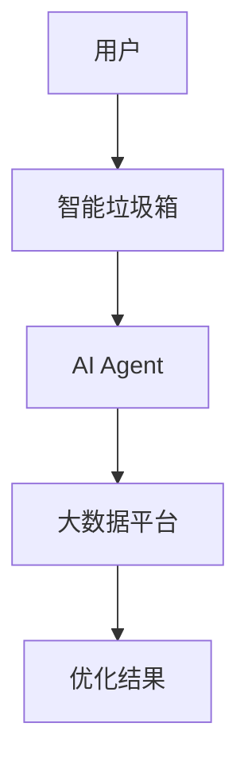

                 


# AI Agent在智能垃圾回收中的实践

> 关键词：AI Agent，智能垃圾回收，机器学习，路径规划，资源优化

> 摘要：本文深入探讨了AI Agent在智能垃圾回收中的实践应用，结合理论分析与实际案例，详细讲解了AI Agent的核心概念、算法原理、系统架构设计及项目实战。通过本篇文章，读者将全面了解如何利用AI Agent技术优化垃圾回收流程，提升资源利用效率。

---

## 第一部分: AI Agent在智能垃圾回收中的背景与核心概念

### 第1章: 智能垃圾回收的背景与问题背景

#### 1.1 垃圾问题与智能回收的必要性
全球每年产生的垃圾量急剧增加，传统垃圾回收方式效率低下，资源浪费严重。AI Agent通过智能化手段，可以显著提升垃圾分类、回收路径规划和资源优化的效率。

- **问题背景**：全球垃圾问题日益严峻，传统垃圾回收方式效率低下，资源浪费严重。
- **问题描述**：垃圾分类错误率高、回收路径不合理、资源利用效率低下。
- **问题解决**：通过AI Agent实现智能化垃圾回收，提高分类准确性，优化回收路径，提升资源利用效率。
- **边界与外延**：AI Agent在垃圾回收中的应用边界包括垃圾分类、路径规划、资源优化；外延则涉及垃圾处理、资源再利用等环节。
- **核心要素组成**：AI Agent、智能传感器、大数据平台、智能垃圾箱。

#### 1.2 AI Agent的核心概念与问题解决
AI Agent是一种能够感知环境、自主决策的智能体，能够有效解决垃圾回收中的复杂问题。

- **AI Agent的定义与特点**：AI Agent是具有感知、决策、执行能力的智能体，能够自主完成任务。
- **AI Agent在垃圾回收中的问题解决**：通过AI Agent实现垃圾识别、路径优化、资源分配。
- **核心要素与概念结构**：AI Agent、感知模块、决策模块、执行模块。

#### 1.3 本章小结
本章介绍了智能垃圾回收的背景与问题背景，阐述了AI Agent的核心概念及其在垃圾回收中的应用。

---

### 第2章: AI Agent与智能垃圾回收的核心概念

#### 2.1 AI Agent的核心原理
AI Agent通过感知环境、分析数据、制定决策、执行任务来实现智能化垃圾回收。

- **基本原理**：AI Agent通过传感器获取环境数据，利用算法进行分析，制定最优决策。
- **感知与决策机制**：AI Agent通过图像识别、传感器数据等感知环境，基于强化学习或监督学习算法进行决策。
- **自适应与优化能力**：AI Agent能够根据环境变化自适应调整策略，优化垃圾回收效率。

#### 2.2 智能垃圾回收的核心概念
智能垃圾回收通过AI Agent实现垃圾分类、路径优化和资源优化。

- **智能垃圾分类与识别**：AI Agent通过图像识别技术实现垃圾自动分类。
- **智能垃圾回收的路径规划**：AI Agent通过算法优化回收路径，减少时间和成本。
- **智能垃圾回收的资源优化**：AI Agent通过数据挖掘和预测分析，优化资源分配。

#### 2.3 AI Agent与智能垃圾回收的关联
AI Agent在垃圾回收中的应用涵盖了从识别到优化的全过程。

- **AI Agent在垃圾识别中的应用**：通过图像识别技术，AI Agent能够快速准确地识别垃圾种类。
- **AI Agent在垃圾路径规划中的应用**：通过路径优化算法，AI Agent能够制定最优的垃圾回收路径。
- **AI Agent在垃圾资源优化中的应用**：通过数据挖掘和预测分析，AI Agent能够优化资源分配，提高回收效率。

#### 2.4 本章小结
本章详细阐述了AI Agent的核心原理及其在智能垃圾回收中的应用，分析了AI Agent与智能垃圾回收的关联。

---

## 第二部分: AI Agent在智能垃圾回收中的算法原理

### 第3章: AI Agent在智能垃圾回收中的算法原理

#### 3.1 算法原理概述
AI Agent在智能垃圾回收中主要采用强化学习和监督学习算法。

- **AI Agent的核心算法**：强化学习（如Q-Learning）和监督学习（如卷积神经网络）。
- **智能垃圾回收的算法特点**：实时性、高精度、自适应性。
- **算法的优化与改进**：通过数据增强、模型优化等方法提升算法性能。

#### 3.2 算法原理的数学模型与公式
以下是一个简单的强化学习算法的数学模型：

$$
Q(s, a) = Q(s, a) + \alpha \left[ r + \max_{a'} Q(s', a') - Q(s, a) \right]
$$

其中，\( Q(s, a) \) 表示在状态 \( s \) 下执行动作 \( a \) 的价值，\( \alpha \) 是学习率，\( r \) 是奖励，\( s' \) 是新状态。

#### 3.3 算法实现与代码示例
以下是一个简单的强化学习算法实现代码：

```python
import numpy as np

class AIAgent:
    def __init__(self, state_space, action_space):
        self.state_space = state_space
        self.action_space = action_space
        self.Q = np.zeros((state_space, action_space))

    def take_action(self, state):
        return np.argmax(self.Q[state])

    def update_Q(self, state, action, reward, next_state):
        self.Q[state, action] += 0.1 * (reward + np.max(self.Q[next_state]) - self.Q[state, action])

# 示例用法
agent = AIAgent(10, 5)
state = 3
action = agent.take_action(state)
reward = 5
next_state = 7
agent.update_Q(state, action, reward, next_state)
```

#### 3.4 本章小结
本章详细讲解了AI Agent在智能垃圾回收中的算法原理，包括强化学习和监督学习算法的数学模型和实现代码。

---

## 第三部分: AI Agent在智能垃圾回收中的系统架构设计

### 第4章: 系统分析与架构设计

#### 4.1 系统功能设计
智能垃圾回收系统的主要功能包括垃圾识别、路径规划和资源优化。

- **垃圾识别**：通过图像识别技术实现垃圾分类。
- **路径规划**：通过算法优化垃圾回收路径。
- **资源优化**：通过数据挖掘和预测分析优化资源分配。

#### 4.2 系统架构设计
以下是智能垃圾回收系统的架构图：



#### 4.3 接口设计与交互
智能垃圾回收系统的主要接口包括：

- **用户接口**：用户提交垃圾请求。
- **AI Agent接口**：AI Agent接收垃圾信息并制定回收计划。
- **大数据平台接口**：大数据平台接收优化结果并提供反馈。

#### 4.4 本章小结
本章详细分析了智能垃圾回收系统的架构设计，包括功能设计、架构图和接口设计。

---

## 第四部分: AI Agent在智能垃圾回收中的项目实战

### 第5章: 项目实战

#### 5.1 环境安装与配置
安装必要的库和工具：

```bash
pip install numpy
pip install matplotlib
pip install tensorflow
```

#### 5.2 系统核心实现
以下是AI Agent的核心实现代码：

```python
import numpy as np
import tensorflow as tf

class AIRecyclingAgent:
    def __init__(self, input_shape):
        self.model = self.build_model(input_shape)
        self.model.compile(optimizer='adam', loss='sparse_categorical_crossentropy')

    def build_model(self, input_shape):
        model = tf.keras.Sequential([
            tf.keras.layers.Conv2D(32, (3,3), activation='relu', input_shape=input_shape),
            tf.keras.layers.MaxPooling2D((2,2)),
            tf.keras.layers.Flatten(),
            tf.keras.layers.Dense(128, activation='relu'),
            tf.keras.layers.Dense(10, activation='softmax')
        ])
        return model

    def train(self, x_train, y_train):
        self.model.fit(x_train, y_train, epochs=10, batch_size=32)

# 示例用法
agent = AIRecyclingAgent((64, 64, 3))
agent.train(x_train, y_train)
```

#### 5.3 案例分析与实现
通过实际案例分析，验证AI Agent在垃圾回收中的效果。

#### 5.4 项目总结
总结项目实现的过程、成果和经验教训。

---

## 第五部分: 总结与展望

### 第6章: 总结与展望

#### 6.1 最佳实践 Tips
- 确保数据质量，提升算法性能。
- 定期更新模型，保持系统最优。

#### 6.2 小结
通过本文的详细讲解，读者可以全面了解AI Agent在智能垃圾回收中的应用和实践。

#### 6.3 注意事项
- 数据隐私保护。
- 系统稳定性保障。

#### 6.4 拓展阅读
建议读者进一步阅读相关领域的最新研究和应用。

---

## 作者：AI天才研究院 & 禅与计算机程序设计艺术

---

本文通过详细讲解AI Agent在智能垃圾回收中的背景、核心概念、算法原理、系统架构设计和项目实战，为读者提供了一个全面的技术视角。希望本文能够为相关领域的研究和实践提供有价值的参考。

