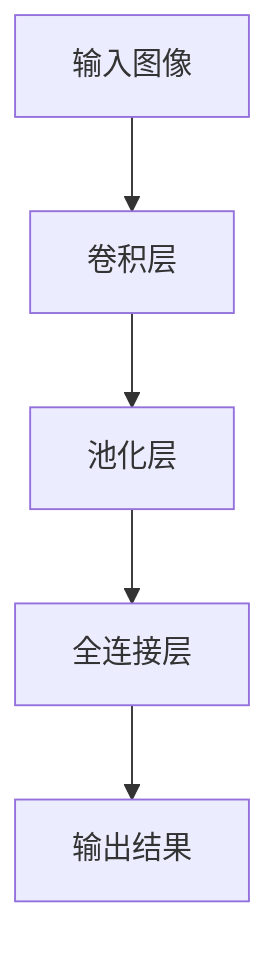
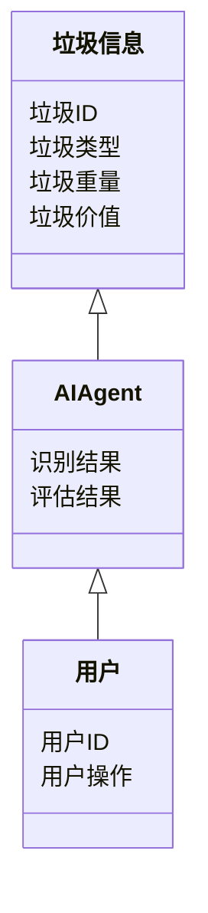
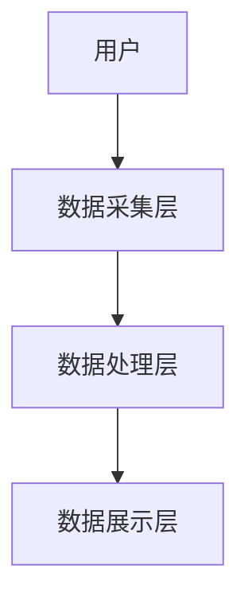

                 


# AI Agent在智能垃圾桶中的回收价值评估

> 关键词：AI Agent, 智能垃圾桶, 垃圾分类, 回收价值评估, 人工智能, 垃圾识别

> 摘要：本文详细探讨了AI Agent在智能垃圾桶中的回收价值评估的应用，分析了AI Agent的核心功能、算法原理、系统架构设计及实际应用场景。通过对比不同AI技术的特点，结合实际案例，阐述了AI Agent在垃圾识别与分类中的优势，并给出了系统设计与实现的详细步骤。最后，提出了在实际应用中需要注意的问题及未来的研究方向。

---

# 第一部分: 背景介绍

## 第1章: 问题背景

### 1.1 垃圾分类的重要性
随着城市化进程的加快，垃圾产生量急剧增加，垃圾分类和回收成为全球关注的焦点。智能垃圾桶通过AI Agent技术，能够实现垃圾的自动识别与分类，极大提升了垃圾处理的效率和准确性。

### 1.2 AI Agent在垃圾处理中的应用现状
AI Agent是一种能够感知环境、做出决策并执行任务的智能体。目前，AI Agent已在多个领域得到广泛应用，但在垃圾处理领域仍处于探索阶段。

### 1.3 AI Agent在智能垃圾桶中的作用
AI Agent能够通过图像识别技术对垃圾进行分类，并根据市场价、材料特性等因素评估其回收价值。这种技术的应用不仅提高了垃圾处理的效率，还为垃圾回收企业提供了精准的决策支持。

## 第2章: 问题描述

### 2.1 智能垃圾桶的定义与特点
智能垃圾桶是一种集成AI技术的智能设备，能够自动识别垃圾种类，并根据识别结果进行分类和价值评估。

### 2.2 垃圾分类与回收价值评估的难点
- 垃圾种类繁多，识别难度大
- 不同垃圾的回收价值差异显著
- 环境干扰因素多，如光线、角度等

### 2.3 AI Agent在垃圾回收中的具体应用场景
- 自动识别与分类
- 回收价值评估
- 实时数据反馈

## 第3章: 问题解决

### 3.1 AI Agent的核心功能
- 垃圾识别与分类
- 回收价值评估
- 数据分析与优化

### 3.2 AI Agent如何实现垃圾识别与分类
通过图像识别技术，AI Agent能够快速识别垃圾种类，并根据预设的分类规则进行分类。

### 3.3 AI Agent如何评估垃圾的回收价值
基于市场价和材料特性，AI Agent能够对垃圾进行价值评估，并提供最优的回收方案。

## 第4章: 边界与外延

### 4.1 智能垃圾桶的使用场景与限制
- 使用场景：社区、公共场所、企业园区等
- 限制：设备成本高、环境干扰因素多

### 4.2 AI Agent在垃圾桶中的边界条件
- 仅限于垃圾识别与分类
- 依赖于传感器和摄像头等硬件设备

### 4.3 垃圾回收价值评估的外延范围
- 包括经济价值、环境价值等多维度评估

## 第5章: 概念结构与核心要素组成

### 5.1 智能垃圾桶的系统架构
- 数据采集模块：摄像头、传感器等
- 数据处理模块：AI Agent
- 用户交互模块：显示屏、操作按钮等

### 5.2 AI Agent的核心要素
- 感知模块：图像识别、环境感知
- 决策模块：分类规则、价值评估模型
- 执行模块：分类执行、数据反馈

### 5.3 垃圾回收价值评估的指标体系
- 经济价值：市场价、回收率
- 环境价值：环保效益、资源利用率

---

# 第二部分: 核心概念与联系

## 第2章: AI Agent的原理与特点

### 2.1 AI Agent的基本原理
AI Agent通过感知环境、做出决策并执行任务，实现垃圾的识别与分类。

### 2.2 AI Agent的核心特点
- 智能性：能够自主学习和优化
- 实时性：快速响应
- 准确性：高精度识别

### 2.3 AI Agent与传统垃圾桶的区别
| 特性 | AI Agent垃圾桶 | 传统垃圾桶 |
|------|----------------|------------|
| 识别能力 | 高 | 低 |
| 分类精度 | 高 | 低 |
| 自动化程度 | 高 | 低 |

## 第3章: ER实体关系图

```mermaid
er
  entity 垃圾信息 {
    key: 垃圾ID
    垃圾类型
    垃圾重量
    垃圾价值
  }
  entity AI Agent {
    key: AgentID
    识别结果
    评估结果
  }
  entity 用户 {
    用户ID
    用户操作
  }
  relation R1: AI Agent --> 垃圾信息
  relation R2: AI Agent --> 用户
  relation R3: 用户 --> 垃圾信息
```

---

# 第三部分: 算法原理讲解

## 第3章: 算法原理

### 3.1 图像识别与分类算法

#### 3.1.1 卷积神经网络（CNN）介绍
CNN是一种常用的图像识别算法，通过卷积层、池化层和全连接层实现图像分类。

#### 3.1.2 CNN模型结构


#### 3.1.3 损失函数与优化器
损失函数：交叉熵损失
$$ \text{损失函数} = -\sum_{i=1}^{n} y_i \log(p_i) $$

优化器：Adam
$$ \theta_{t+1} = \theta_t - \eta \frac{\partial L}{\partial \theta_t} $$

### 3.2 回收价值评估模型

#### 3.2.1 价值评估指标
- 经济价值：市场价、回收率
- 环境价值：环保效益

#### 3.2.2 价值评估公式
$$ \text{回收价值} = \alpha \times \text{经济价值} + \beta \times \text{环境价值} $$

---

# 第四部分: 系统分析与架构设计

## 第4章: 系统架构设计

### 4.1 项目场景介绍
智能垃圾桶主要用于社区和公共场所，帮助用户实现垃圾分类和价值评估。

### 4.2 系统功能设计

#### 4.2.1 领域模型类图


### 4.3 系统架构设计

#### 4.3.1 分层架构


---

# 第五部分: 项目实战

## 第5章: 项目实战

### 5.1 环境安装

```bash
pip install tensorflow
pip install numpy
pip install cv2
```

### 5.2 核心代码实现

#### 5.2.1 图像识别代码
```python
import tensorflow as tf
import cv2

# 加载预训练模型
model = tf.keras.models.load_model('model.h5')

# 读取图像
image = cv2.imread('image.jpg')
image = cv2.resize(image, (224, 224))
image = image / 255.0
image = tf.expand_dims(image, axis=0)

# 预测结果
prediction = model.predict(image)
print(prediction)
```

---

# 第六部分: 最佳实践

## 第6章: 小结

### 6.1 项目成果
AI Agent在智能垃圾桶中的应用显著提高了垃圾分类的效率和准确性，为垃圾回收企业提供了精准的决策支持。

### 6.2 经验总结
- 系统设计要充分考虑实际应用场景
- 算法优化是提升系统性能的关键
- 用户交互设计要注重用户体验

## 第7章: 注意事项

### 7.1 系统维护
定期更新模型参数，确保识别精度。

### 7.2 数据隐私
保护用户数据隐私，防止数据泄露。

## 第8章: 拓展阅读

### 8.1 推荐书籍
- 《深度学习》
- 《人工智能：一种现代方法》

### 8.2 推荐论文
- "Deep Learning for Garbage Classification"
- "AI Agent in Smart Waste Management"

---

# 作者：AI天才研究院 & 禅与计算机程序设计艺术

