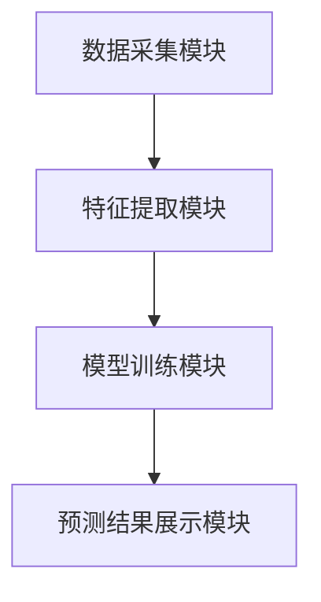
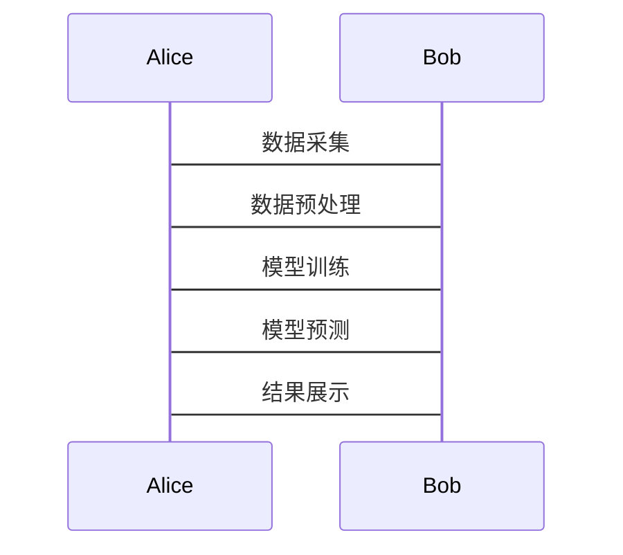

                 


# AI Agent在智能城市交通流预测中的角色

## 关键词：AI Agent, 智能城市, 交通流预测, 数据驱动, 机器学习, 深度学习, 系统架构

## 摘要：  
本文探讨了AI Agent在智能城市交通流预测中的核心作用，详细分析了AI Agent的基本概念、工作原理以及在交通流预测中的应用场景。通过结合交通流预测的基础知识、算法原理和系统架构设计，本文详细阐述了AI Agent如何通过数据驱动和知识驱动的方式提升交通流预测的准确性和实时性。同时，本文还通过项目实战展示了AI Agent在交通流预测中的具体实现，并提出了未来的研究方向和应用建议。

---

## 第一部分: AI Agent与智能城市交通流预测概述

### 第1章: AI Agent与智能城市交通流预测概述

#### 1.1 AI Agent的基本概念
##### 1.1.1 AI Agent的定义与特点
AI Agent（人工智能代理）是指能够感知环境、自主决策并采取行动的智能体。AI Agent具有以下特点：
- **自主性**：能够在没有外部干预的情况下独立运行。
- **反应性**：能够实时感知环境变化并做出相应反应。
- **目标导向性**：具备明确的目标，并通过行动实现目标。
- **学习能力**：能够通过数据和经验不断优化自身的决策能力。

##### 1.1.2 AI Agent的核心属性与功能
AI Agent的核心属性包括感知、决策和行动能力。其主要功能包括：
- 数据采集与处理
- 情况分析与预测
- 决策制定与优化
- 行动执行与反馈

##### 1.1.3 AI Agent在智能城市中的应用前景
AI Agent在智能城市中的应用前景广阔，特别是在交通管理、城市规划和资源优化等领域。通过AI Agent，城市可以实现更加智能化的交通流预测和优化，从而提高城市交通系统的效率和可靠性。

#### 1.2 智能城市交通流预测的背景
##### 1.2.1 智能城市的发展现状
智能城市是通过数字化技术将城市中的各个系统（如交通、能源、医疗等）进行整合，以实现更高效、更可持续的发展。随着城市化进程的加快，交通拥堵问题日益严重，对智能交通系统的需求也不断增加。

##### 1.2.2 交通流预测的必要性
交通流预测是智能交通系统的核心功能之一。通过预测交通流量的变化趋势，城市可以提前采取措施，优化交通信号灯配时、调整交通路线，从而缓解交通拥堵问题。

##### 1.2.3 AI Agent在交通流预测中的角色定位
AI Agent在交通流预测中扮演着关键角色。它能够实时感知交通数据，结合历史数据和环境信息，预测未来交通流量的变化，并根据预测结果制定最优的交通管理策略。

#### 1.3 本章小结
本章介绍了AI Agent的基本概念和特点，并分析了智能城市交通流预测的背景和必要性。同时，明确了AI Agent在交通流预测中的角色定位。

---

## 第二部分: AI Agent的核心概念与原理

### 第2章: AI Agent的核心概念与原理

#### 2.1 AI Agent的核心概念
##### 2.1.1 AI Agent的定义与分类
AI Agent可以根据其智能水平和应用场景进行分类。常见的分类包括：
- **反应式AI Agent**：基于当前感知信息进行实时反应。
- **认知式AI Agent**：具备复杂的推理和规划能力。
- **学习式AI Agent**：能够通过学习不断优化自身的决策能力。

##### 2.1.2 AI Agent与传统AI的区别
AI Agent与传统AI的区别主要体现在以下几个方面：
- **自主性**：AI Agent具有自主性，能够独立完成任务。
- **目标导向性**：AI Agent具有明确的目标，而传统AI更多是完成特定任务。
- **环境交互**：AI Agent能够与环境进行交互，而传统AI更多是基于静态数据进行处理。

##### 2.1.3 AI Agent在交通流预测中的作用
AI Agent在交通流预测中的作用主要体现在以下几个方面：
- **实时数据处理**：能够实时感知交通数据，进行快速处理和分析。
- **异常检测**：能够识别交通流中的异常情况，并提前发出预警。
- **优化控制**：能够根据预测结果优化交通信号灯配时，提高交通效率。

#### 2.2 AI Agent的原理与工作流程
##### 2.2.1 数据采集与处理
AI Agent通过传感器、摄像头等设备采集交通数据，包括车流量、车速、交通信号灯状态等。

##### 2.2.2 信息分析与决策
AI Agent对采集到的数据进行分析，结合历史数据和环境信息，预测未来交通流量的变化趋势。

##### 2.2.3 行动执行与反馈
AI Agent根据预测结果制定最优的交通管理策略，并通过执行机构（如交通信号灯控制器）进行实际操作。同时，AI Agent会根据执行结果进行反馈，优化自身的预测模型和决策策略。

#### 2.3 AI Agent在交通流预测中的应用
##### 2.3.1 交通流预测的定义与目标
交通流预测是指根据历史数据和环境信息，预测未来某一时间段内的交通流量变化趋势。其目标是通过准确的预测，优化交通管理策略，提高交通系统的效率和可靠性。

##### 2.3.2 AI Agent在交通流预测中的作用
AI Agent在交通流预测中的作用主要体现在以下几个方面：
- **实时预测**：能够实时感知交通数据，进行快速预测。
- **异常检测**：能够识别交通流中的异常情况，并提前发出预警。
- **优化控制**：能够根据预测结果优化交通信号灯配时，提高交通效率。

##### 2.3.3 AI Agent与交通流预测的结合方式
AI Agent与交通流预测的结合方式主要包括以下几种：
- **数据驱动**：通过大量数据训练机器学习模型，进行交通流预测。
- **知识驱动**：基于领域知识和规则，进行交通流预测。
- **混合驱动**：结合数据驱动和知识驱动的优势，进行交通流预测。

---

## 第三部分: 交通流预测的基础知识

### 第3章: 交通流预测的基础知识

#### 3.1 交通流预测的定义与分类
##### 3.1.1 交通流预测的定义
交通流预测是指根据历史数据和环境信息，预测未来某一时间段内的交通流量变化趋势。

##### 3.1.2 交通流预测的主要方法
交通流预测的主要方法包括：
- **时间序列分析**：基于历史数据，预测未来趋势。
- **机器学习**：通过训练数据，建立预测模型。
- **深度学习**：通过神经网络，进行非线性预测。

##### 3.1.3 交通流预测的挑战与难点
交通流预测的挑战与难点包括：
- 数据噪声大
- 时间序列的非线性
- 多因素影响

#### 3.2 常见的交通流预测模型
##### 3.2.1 时间序列模型
时间序列模型是一种基于历史数据预测未来趋势的模型。常见的时间序列模型包括ARIMA、GARCH等。

##### 3.2.2 机器学习模型
机器学习模型通过训练数据，建立预测模型。常见的机器学习模型包括支持向量机（SVM）、随机森林（Random Forest）等。

##### 3.2.3 深度学习模型
深度学习模型通过多层神经网络，进行非线性预测。常见的深度学习模型包括LSTM、GRU等。

#### 3.3 交通流预测的关键技术
##### 3.3.1 数据采集与预处理
数据采集与预处理是交通流预测的关键技术之一。需要对采集到的数据进行清洗、归一化等处理，确保数据质量。

##### 3.3.2 特征提取与选择
特征提取与选择是交通流预测的重要步骤。需要根据领域知识和数据特征，选择合适的特征进行预测。

##### 3.3.3 模型训练与优化
模型训练与优化是交通流预测的核心过程。需要通过交叉验证、超参数调优等方法，优化模型性能。

---

## 第四部分: AI Agent在交通流预测中的应用

### 第4章: AI Agent在交通流预测中的应用

#### 4.1 AI Agent在交通流预测中的核心作用
##### 4.1.1 实时数据处理与预测
AI Agent能够实时感知交通数据，进行快速处理和预测。

##### 4.1.2 异常检测与预警
AI Agent能够识别交通流中的异常情况，并提前发出预警。

##### 4.1.3 优化控制与决策
AI Agent能够根据预测结果优化交通信号灯配时，提高交通效率。

#### 4.2 AI Agent与交通流预测的结合方式
##### 4.2.1 数据驱动的预测模型
数据驱动的预测模型通过大量数据训练机器学习模型，进行交通流预测。

##### 4.2.2 知识驱动的预测模型
知识驱动的预测模型基于领域知识和规则，进行交通流预测。

##### 4.2.3 混合驱动的预测模型
混合驱动的预测模型结合数据驱动和知识驱动的优势，进行交通流预测。

#### 4.3 交通流预测中的AI Agent实现
##### 4.3.1 AI Agent的算法实现
AI Agent的算法实现包括数据采集、特征提取、模型训练和优化、预测结果输出等。

##### 4.3.2 AI Agent的系统实现
AI Agent的系统实现包括硬件设备（如传感器、摄像头）、软件系统（如数据处理平台、预测模型）以及执行机构（如交通信号灯控制器）。

---

## 第五部分: 算法原理与实现

### 第5章: 算法原理与实现

#### 5.1 AI Agent的算法原理
##### 5.1.1 数据预处理
数据预处理包括数据清洗、归一化、特征选择等步骤。

##### 5.1.2 特征提取
特征提取是通过提取数据中的有用特征，提高模型的预测能力。

##### 5.1.3 模型训练与优化
模型训练与优化包括选择合适的模型、调整模型参数、验证模型性能等。

##### 5.1.4 预测结果输出
预测结果输出是将模型的预测结果进行展示和应用。

#### 5.2 AI Agent的实现代码
##### 5.2.1 数据预处理代码
```python
import pandas as pd
import numpy as np

# 数据加载
data = pd.read_csv('traffic_data.csv')

# 数据清洗
data = data.dropna()

# 特征选择
features = ['time', 'speed', 'flow']
target = 'volume'

X = data[features]
y = data[target]
```

##### 5.2.2 模型训练代码
```python
from sklearn.ensemble import RandomForestRegressor
from sklearn.metrics import mean_absolute_error

# 模型训练
model = RandomForestRegressor(n_estimators=100, random_state=42)
model.fit(X, y)

# 模型预测
y_pred = model.predict(X)
print('MAE:', mean_absolute_error(y, y_pred))
```

#### 5.3 算法的数学模型
##### 5.3.1 线性回归模型
线性回归模型的数学表达式为：
$$ y = \beta_0 + \beta_1x_1 + \beta_2x_2 + ... + \beta_nx_n $$

##### 5.3.2 神经网络模型
神经网络模型的数学表达式为：
$$ y = f(Wx + b) $$
其中，$W$ 是权重矩阵，$b$ 是偏置向量，$f$ 是激活函数。

---

## 第六部分: 系统架构设计

### 第6章: 系统架构设计

#### 6.1 系统模块设计
系统模块设计包括数据采集模块、特征提取模块、模型训练模块和预测结果展示模块。

#### 6.2 系统架构图


#### 6.3 系统接口设计
系统接口设计包括数据接口、模型接口和展示接口。

#### 6.4 系统交互流程图


---

## 第七部分: 项目实战与总结

### 第7章: 项目实战与总结

#### 7.1 项目环境配置
##### 7.1.1 数据集准备
数据集包括交通流量、车速、时间等信息。

##### 7.1.2 环境安装
需要安装Python、Pandas、Scikit-learn等库。

#### 7.2 系统核心实现
##### 7.2.1 数据预处理
##### 7.2.2 模型训练
##### 7.2.3 模型预测

#### 7.3 案例分析与总结
通过具体案例分析，展示AI Agent在交通流预测中的实际应用效果。

---

## 结语

AI Agent在智能城市交通流预测中的应用前景广阔。通过结合数据驱动和知识驱动的方式，AI Agent能够显著提高交通流预测的准确性和实时性。未来，随着AI技术的不断发展，AI Agent在智能交通系统中的作用将更加重要。

---

## 作者：AI天才研究院/AI Genius Institute & 禅与计算机程序设计艺术 /Zen And The Art of Computer Programming

---

以上是《AI Agent在智能城市交通流预测中的角色》的技术博客文章的完整内容，涵盖了从基本概念到算法实现再到系统设计的全过程。希望对您有所帮助！

