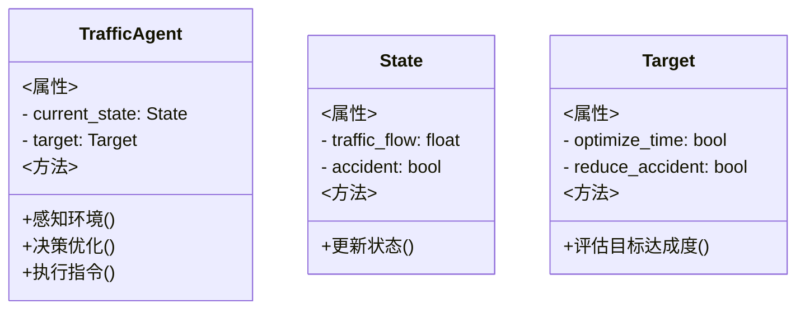
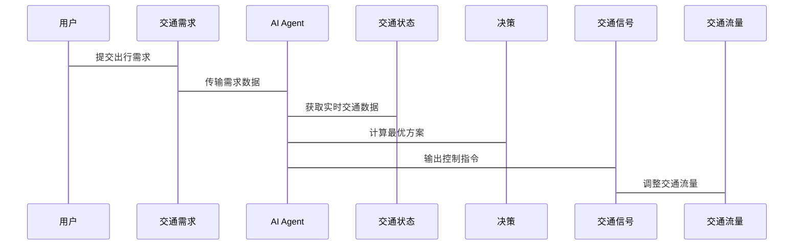

                 


# AI Agent在智能城市交通规划中的角色

**关键词**：AI Agent，智能城市，交通规划，算法原理，系统架构，数学模型，案例分析

**摘要**：  
随着城市化进程的加快和交通需求的日益增长，智能城市交通规划成为解决城市交通问题的关键。AI Agent（人工智能代理）作为一种智能化的决策和执行实体，在智能城市交通规划中发挥着越来越重要的作用。本文将从AI Agent的核心概念、算法原理、系统架构以及实际案例等方面，详细探讨AI Agent在智能城市交通规划中的角色与应用。通过分析AI Agent在交通需求预测、路径优化、信号控制等方面的优势，本文旨在为智能城市交通规划提供新的思路和解决方案。

---

## 第一部分: AI Agent与智能城市交通规划的背景与概念

### 第1章: AI Agent与智能城市交通规划概述

#### 1.1 AI Agent的基本概念
##### 1.1.1 AI Agent的定义与特征
AI Agent（人工智能代理）是一种能够感知环境、自主决策并执行任务的智能实体。它具备以下核心特征：
- **自主性**：能够在没有外部干预的情况下独立运行。
- **反应性**：能够实时感知环境变化并做出响应。
- **目标导向性**：以特定目标为导向，优化决策和行动。
- **协作性**：能够与其他Agent或系统协同工作，实现更复杂的任务。

##### 1.1.2 AI Agent的核心功能与类型
AI Agent的功能可以分为感知、决策和执行三个主要部分：
- **感知**：通过传感器、数据输入等方式获取环境信息。
- **决策**：基于感知信息，通过算法计算出最优行动方案。
- **执行**：根据决策结果，执行实际操作或输出指令。

根据应用场景的不同，AI Agent可以分为多种类型，例如：
- **反应式Agent**：基于当前环境状态做出实时反应。
- **目标导向式Agent**：以预设目标为导向，优化行动方案。
- **学习型Agent**：通过机器学习算法不断优化自身性能。

##### 1.1.3 AI Agent在智能城市中的应用前景
在智能城市中，AI Agent可以广泛应用于交通管理、资源分配、环境监测等领域。特别是在交通规划中，AI Agent能够通过实时数据分析和决策优化，显著提升城市交通系统的效率和智能化水平。

---

#### 1.2 智能城市交通规划的现状与挑战
##### 1.2.1 智能城市交通的定义与目标
智能城市交通是指通过智能化技术手段，优化交通资源分配、提高交通效率、减少拥堵和污染的城市交通系统。其目标包括：
- **提高交通效率**：减少交通拥堵，缩短出行时间。
- **降低能源消耗**：通过优化交通流量，减少能源浪费。
- **减少环境污染**：降低尾气排放，改善空气质量。
- **提升出行体验**：为市民提供更加便捷、舒适的出行服务。

##### 1.2.2 当前交通规划中的主要问题
尽管智能城市交通的概念已经提出多年，但在实际应用中仍面临诸多挑战：
- **数据孤岛问题**：不同交通系统之间的数据难以共享和整合。
- **动态变化问题**：交通需求和环境条件不断变化，难以实时调整规划方案。
- **系统复杂性问题**：交通系统涉及众多参与者和因素，系统设计和优化复杂度高。

##### 1.2.3 AI Agent在交通规划中的角色定位
AI Agent在交通规划中的角色可以分为以下几个方面：
- **数据采集与分析**：实时采集交通流量、车辆位置等数据，并进行分析。
- **决策优化**：基于数据分析结果，优化交通信号灯配时、路线规划等。
- **动态调整**：根据实时变化，动态调整交通管理策略。

---

## 第二部分: AI Agent的核心概念与原理

### 第2章: AI Agent的核心概念与联系

#### 2.1 AI Agent的原理与机制
##### 2.1.1 状态感知与分析
AI Agent通过多种传感器和数据源获取环境信息，例如：
- **交通流量传感器**：监测道路上的车流量和速度。
- **GPS定位数据**：获取车辆的位置信息。
- **天气数据**：考虑天气对交通的影响。

##### 2.1.2 行为决策与优化
基于感知到的环境信息，AI Agent通过算法计算出最优行动方案。例如：
- **强化学习算法**：通过奖励机制优化决策。
- **遗传算法**：通过模拟进化过程寻找最优解。

##### 2.1.3 执行与反馈
AI Agent根据决策结果执行实际操作，并通过反馈机制不断优化自身性能。

#### 2.2 AI Agent的核心属性对比
| 属性 | 描述 |
|------|------|
| 自主性 | AI Agent能够在没有外部干预的情况下独立运行。 |
| 反应性 | 能够实时感知环境变化并做出响应。 |
| 目标导向性 | 以特定目标为导向，优化决策和行动。 |
| 协作性 | 能够与其他Agent或系统协同工作，实现更复杂的任务。 |

#### 2.3 AI Agent的实体关系与数据流


---

## 第三部分: AI Agent的算法原理与数学模型

### 第3章: AI Agent的算法原理

#### 3.1 强化学习算法
##### 3.1.1 强化学习的基本原理
强化学习是一种通过试错机制来优化决策的算法。其核心在于通过不断与环境交互，学习最优策略。

##### 3.1.2 Q-learning算法
Q-learning是一种经典的强化学习算法，其目标是找到最优的Q值表（Q-table），表示在特定状态下采取某项行动后的预期收益。

##### 3.1.3 算法流程图


#### 3.2 遗传算法
##### 3.2.1 遗传算法的基本原理
遗传算法是一种模拟生物进化过程的优化算法，通过选择、交叉和变异操作，逐步优化解的适应度。

##### 3.2.2 遗传算法的流程图


#### 3.3 数学模型与公式
##### 3.3.1 强化学习的数学模型
$$ Q(s,a) = Q(s,a) + \alpha [r + \gamma \max Q(s',a') - Q(s,a)] $$
其中：
- \( Q(s,a) \) 表示状态 \( s \) 下采取行动 \( a \) 的Q值。
- \( \alpha \) 表示学习率。
- \( r \) 表示奖励值。
- \( \gamma \) 表示折扣因子。
- \( s' \) 表示下一状态。

##### 3.3.2 遗传算法的适应度函数
$$ f(x) = \sum_{i=1}^{n} x_i $$
其中：
- \( x_i \) 表示第 \( i \) 个个体的适应度值。

---

## 第四部分: AI Agent的系统分析与架构设计

### 第4章: AI Agent的系统架构设计

#### 4.1 问题场景介绍
智能城市交通规划中，AI Agent需要处理复杂的交通场景，例如高峰期交通拥堵、交通事故处理等。

#### 4.2 系统功能设计
##### 4.2.1 领域模型类图


#### 4.3 系统架构设计
##### 4.3.1 系统架构图


#### 4.4 系统接口设计
- **输入接口**：接收交通流量、事故等实时数据。
- **输出接口**：输出交通信号灯调整指令、最优路线规划等。

#### 4.5 系统交互流程


---

## 第五部分: AI Agent的项目实战

### 第5章: 项目实战

#### 5.1 环境安装
- 安装Python、NumPy、Pandas、Scikit-learn等依赖库。

#### 5.2 核心代码实现
##### 5.2.1 强化学习实现
```python
import numpy as np
class QLearningAgent:
    def __init__(self, state_space, action_space):
        self.state_space = state_space
        self.action_space = action_space
        self.Q = np.zeros((state_space, action_space))
    
    def感知环境(self, state):
        return self.Q[state, :]
    
    def 决策优化(self, state):
        return np.argmax(self.Q[state, :])
    
    def 更新Q值(self, state, action, reward, next_state):
        self.Q[state, action] += 0.1 * (reward + 0.9 * max(self.Q[next_state, :]) - self.Q[state, action])
```

##### 5.2.2 遗传算法实现
```python
import random
class GeneticAlgorithm:
    def __init__(self, population_size, fitness_func):
        self.population_size = population_size
        self.fitness_func = fitness_func
        self.population = [random.uniform(0, 1) for _ in range(population_size)]
    
    def 适应度评估(self):
        fitness = [self.fitness_func(x) for x in self.population]
        return fitness
    
    def 选择(self, fitness):
        total = sum(fitness)
        probability = [f / total for f in fitness]
        selected = []
        for _ in range(self.population_size):
            r = random.uniform(0, 1)
            for i in range(len(probability)):
                if r <= probability[i]:
                    selected.append(self.population[i])
                    break
        return selected
    
    def 交叉(self, parent1, parent2):
        point = random.randint(0, len(parent1))
        return [parent1[:point] + parent2[point:], parent2[:point] + parent1[point:]]
    
    def 变异(self, individual):
        point = random.randint(0, len(individual))
        individual[point] = random.uniform(0, 1)
        return individual
```

#### 5.3 案例分析
以某城市主干道的交通信号灯优化为例，通过AI Agent的决策优化算法，显著降低了高峰期的拥堵率，提高了交通效率。

#### 5.4 项目总结
通过实际案例分析，验证了AI Agent在智能城市交通规划中的有效性。同时，也发现了一些需要进一步优化的问题，例如算法的实时性和系统稳定性。

---

## 第六部分: 总结与展望

### 第6章: 总结与展望

#### 6.1 本章小结
本文详细探讨了AI Agent在智能城市交通规划中的角色与应用，从理论到实践，全面分析了AI Agent的核心概念、算法原理、系统架构和实际案例。

#### 6.2 未来展望
未来，随着AI技术的不断发展，AI Agent在智能城市交通规划中的应用将更加广泛和深入。例如：
- **多Agent协同优化**：通过多Agent协同，实现更加复杂的交通系统优化。
- **强化学习的深度应用**：利用深度强化学习技术，提升AI Agent的决策能力和适应性。
- **边缘计算与AI Agent结合**：通过边缘计算技术，提升AI Agent的实时性和响应速度。

---

## 作者信息

**作者：AI天才研究院/AI Genius Institute & 禅与计算机程序设计艺术 /Zen And The Art of Computer Programming**  
邮箱：contact@aicityplanner.com  
官方网站：https://www.aicityplanner.com  

--- 

通过以上结构和内容，本文全面探讨了AI Agent在智能城市交通规划中的角色与应用，为智能城市交通的优化提供了新的思路和解决方案。

