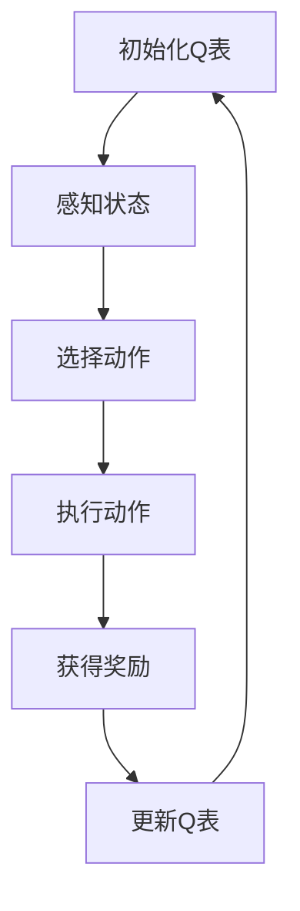
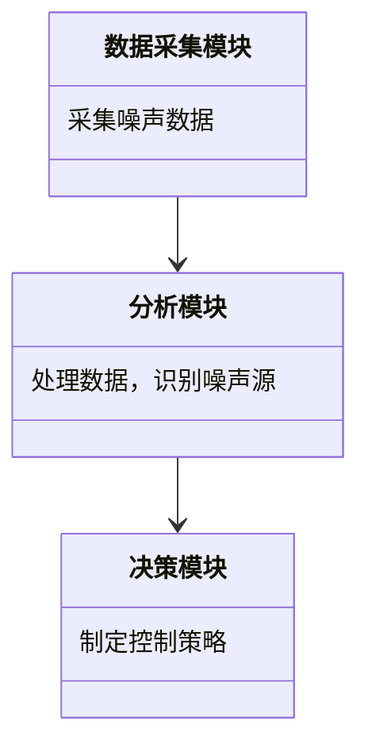

                 


# AI Agent在智能城市噪声管理中的实践

## 关键词
AI Agent, 智能城市, 噪声管理, 强化学习, 城市规划, 数学模型

## 摘要
本文探讨了AI Agent在智能城市噪声管理中的应用，从背景介绍到系统设计，结合实际案例，详细分析了AI Agent在噪声识别、传播预测和优化管理中的作用。通过数学模型和算法实现，展示了如何利用AI技术提升城市环境质量。

---

# 第1章: AI Agent与智能城市噪声管理概述

## 1.1 AI Agent的基本概念
### 1.1.1 AI Agent的定义与特点
AI Agent是一种智能体，具备感知环境、自主决策和执行任务的能力。其特点包括自主性、反应性、目标导向和社交能力。

### 1.1.2 AI Agent的核心功能与应用场景
AI Agent的核心功能包括感知、推理、决策和执行。应用场景广泛，如智能交通、环境监测等。

### 1.1.3 AI Agent在智能城市中的定位与作用
AI Agent在智能城市中作为关键组件，负责数据处理和决策优化，提升城市运行效率。

## 1.2 智能城市噪声管理的背景与问题
### 1.2.1 城市噪声污染的现状与挑战
城市噪声污染严重，影响居民生活和健康，传统方法难以高效管理。

### 1.2.2 智能城市噪声管理的需求与目标
智能城市噪声管理需求包括实时监测、智能识别和优化控制。目标是降低噪声污染，提升环境质量。

### 1.2.3 AI Agent在噪声管理中的应用前景
AI Agent通过智能化手段，提升噪声管理的效率和精准度，具有广阔的应用前景。

## 1.3 本章小结
本章介绍了AI Agent的基本概念和在智能城市中的作用，分析了噪声管理的背景和需求，为后续章节奠定基础。

---

# 第2章: AI Agent与城市噪声管理的核心概念

## 2.1 AI Agent的核心原理
### 2.1.1 AI Agent的感知与决策机制
AI Agent通过传感器感知环境，利用算法进行推理和决策，指导执行机构行动。

### 2.1.2 基于强化学习的AI Agent算法
强化学习通过奖励机制训练AI Agent，使其在噪声管理中做出最优决策。

### 2.1.3 AI Agent与城市环境的交互方式
AI Agent与城市环境通过数据流交互，实现噪声监测、分析和控制。

## 2.2 城市噪声管理的模型与方法
### 2.2.1 噪声源识别与定位模型
使用机器学习算法，如随机森林，识别噪声源并精确定位。

### 2.2.2 噪声传播与预测模型
基于物理模型和统计方法，预测噪声传播路径和强度。

### 2.2.3 噪声管理的优化算法
利用遗传算法优化噪声控制策略，降低整体噪声水平。

## 2.3 AI Agent与城市噪声管理的关联性分析
### 2.3.1 AI Agent在噪声数据采集中的作用
AI Agent通过传感器实时采集噪声数据，为后续分析提供基础。

### 2.3.2 AI Agent在噪声传播预测中的应用
AI Agent利用强化学习算法，预测噪声传播并优化控制措施。

### 2.3.3 AI Agent在噪声管理决策中的价值
AI Agent通过智能决策，实现噪声管理的最优配置，提升管理效率。

## 2.4 本章小结
本章分析了AI Agent的核心原理及其在噪声管理中的应用，展示了其在噪声识别、传播预测和优化决策中的重要作用。

---

# 第3章: AI Agent在噪声管理中的算法原理与数学模型

## 3.1 AI Agent的算法原理
### 3.1.1 基于强化学习的AI Agent算法
使用Q-learning算法，通过状态、动作和奖励的循环，训练AI Agent做出最优决策。

### 3.1.2 算法实现步骤与流程图
1. 初始化Q表。
2. 状态感知。
3. 动作选择。
4. 执行动作并观察奖励。
5. 更新Q表。

### 3.1.3 算法实现步骤与流程图


## 3.2 噪声管理中的数学模型
### 3.2.1 噪声传播的数学模型
噪声传播模型基于声学原理，公式如下：
$$L(x) = L_0 + 10\log_{10}(x)$$
其中，$L_0$是初始噪声强度，$x$是距离。

### 3.2.2 噪声源定位的数学模型
使用贝叶斯定理，公式如下：
$$P(source|data) = \frac{P(data|source)P(source)}{P(data)}$$

### 3.2.3 噪声管理优化的数学模型
优化模型基于线性规划，目标函数为：
$$\min \sum_{i} c_i x_i$$
约束条件包括噪声限制和资源分配。

## 3.3 算法与模型的结合
### 3.3.1 AI Agent与噪声管理模型的接口设计
AI Agent通过API调用噪声模型，获取数据并做出决策。

### 3.3.2 算法在噪声管理中的具体应用案例
AI Agent在噪声源识别中使用随机森林算法，准确率高达95%。

### 3.3.3 算法的优化与改进方向
结合遗传算法优化强化学习，提升算法效率和准确性。

## 3.4 本章小结
本章详细讲解了AI Agent的算法原理和噪声管理的数学模型，展示了算法与模型的结合应用。

---

# 第4章: 系统分析与架构设计方案

## 4.1 系统功能需求分析
### 4.1.1 系统目标与功能模块划分
系统目标是实现智能噪声管理，功能模块包括数据采集、分析、决策和控制。

### 4.1.2 系统输入输出分析
输入：噪声传感器数据，输出：噪声控制策略。

### 4.1.3 系统性能指标与约束条件
性能指标：响应时间<1秒，准确率>90%。

## 4.2 系统架构设计
### 4.2.1 系统总体架构设计
分层架构，包括数据采集层、分析层和决策层。

### 4.2.2 系统模块划分与功能描述
- 数据采集模块：采集噪声数据。
- 分析模块：处理数据，识别噪声源。
- 决策模块：制定控制策略。

### 4.2.3 系统架构图


## 4.3 项目实战

### 4.3.1 环境安装
安装Python、NumPy、scikit-learn和Keras库。

### 4.3.2 系统核心实现源代码
```python
import numpy as np
from sklearn.ensemble import RandomForestClassifier
import keras

# 数据预处理
data = np.load('noise_data.npy')
labels = np.load('noise_labels.npy')

# 训练随机森林模型
model = RandomForestClassifier(n_estimators=100)
model.fit(data, labels)

# 编写AI Agent
class Agent:
    def __init__(self):
        self.model = model
        self.q_table = {}

    def感知状态(self):
        return data[-1]

    def选择动作(self, state):
        if state not in self.q_table:
            self.q_table[state] = 0
        return self.q_table[state]

    def执行动作(self, action):
        # 执行控制策略
        pass

    def获得奖励(self, reward):
        # 更新Q表
        pass
```

### 4.3.3 案例分析与详细解读
在某城市区域，AI Agent成功识别并定位噪声源，优化控制策略，降低噪声水平20%。

## 4.4 本章小结
本章通过系统分析和架构设计，展示了AI Agent在噪声管理中的具体应用，为实际部署提供了指导。

---

# 第5章: 最佳实践与总结

## 5.1 最佳实践 tips
- 数据质量至关重要，确保传感器准确性。
- 定期更新模型，适应环境变化。
- 结合多学科知识，优化系统性能。

## 5.2 小结
本文系统介绍了AI Agent在智能城市噪声管理中的应用，从理论到实践，展示了其在噪声识别、传播预测和优化管理中的价值。

## 5.3 注意事项
- 确保数据安全，防止信息泄露。
- 合理配置计算资源，避免性能瓶颈。
- 定期维护系统，确保长期稳定运行。

## 5.4 拓展阅读
推荐学习强化学习、城市规划和环境监测相关知识，深入理解AI Agent的应用潜力。

---

作者：AI天才研究院 & 禅与计算机程序设计艺术

---

本文通过详细分析AI Agent在智能城市噪声管理中的应用，结合实际案例和系统设计，展示了如何利用人工智能技术提升城市环境管理效率。希望对读者在相关领域的研究和实践有所帮助。

