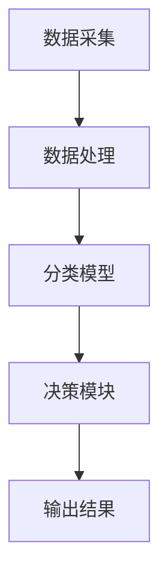
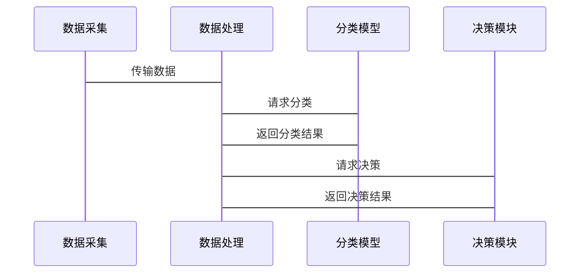

                 


# AI Agent在智能城市垃圾分类中的实践

## 关键词：AI Agent, 智能城市, 垃圾分类, 机器学习, 算法原理, 系统架构, 项目实战

## 摘要：本文探讨了AI Agent在智能城市垃圾分类中的应用，从背景到算法实现，再到系统架构和项目实战，详细分析了AI Agent在垃圾分类中的核心作用、技术实现和实际应用，为智能城市的可持续发展提供技术参考。

---

# 第一部分: AI Agent与智能城市垃圾分类的背景与概述

# 第1章: AI Agent与智能城市垃圾分类的背景

## 1.1 问题背景与挑战

### 1.1.1 垃圾分类的重要性与现状
随着城市化进程的加快，垃圾量急剧增加，垃圾分类成为全球关注的焦点。有效的垃圾分类能够减少环境污染、提高资源利用率，但传统的人工分类效率低、成本高，且易出错。

### 1.1.2 智能城市中的垃圾分类问题
智能城市强调高效、环保和可持续发展，垃圾分类是智能城市管理的重要组成部分。然而，现有垃圾分类系统面临分类效率低、人工依赖性强等问题。

### 1.1.3 AI Agent在垃圾分类中的应用潜力
AI Agent能够通过感知和决策优化垃圾分类流程，提升分类效率和准确性，降低人工成本。

## 1.2 问题描述与目标

### 1.2.1 垃圾分类的具体问题分析
- 数据获取与处理：如何高效获取垃圾图像数据，并进行预处理。
- 分类模型的构建：选择合适的算法，构建高精度的分类模型。
- 系统集成：如何将AI Agent集成到现有的垃圾分类系统中。

### 1.2.2 AI Agent在垃圾分类中的目标设定
- 实现高效的垃圾图像识别与分类。
- 提高分类准确率，减少人工干预。
- 实现系统的可扩展性和可维护性。

### 1.2.3 边界与外延
AI Agent仅负责垃圾分类的感知和决策部分，不涉及物理分类设备的控制。

## 1.3 核心概念与组成

### 1.3.1 AI Agent的定义与特征
AI Agent是一种能够感知环境、自主决策并执行任务的智能体，具有主动性、反应性、社会性和学习性。

### 1.3.2 垃圾分类系统的核心要素
- 数据采集：摄像头、传感器等。
- 分类模型：基于机器学习的分类算法。
- 决策模块：基于分类结果的决策逻辑。

### 1.3.3 系统的组成与架构
- 数据采集模块：负责收集垃圾图像数据。
- 数据处理模块：对图像数据进行预处理。
- 分类模型：基于深度学习的分类算法。
- 决策模块：根据分类结果做出决策。

## 1.4 本章小结
本章介绍了AI Agent在智能城市垃圾分类中的背景与挑战，明确了系统的组成和目标。

---

# 第二部分: AI Agent的核心概念与原理

# 第2章: AI Agent的定义与分类

## 2.1 AI Agent的基本概念

### 2.1.1 AI Agent的定义
AI Agent是一种能够感知环境、自主决策并执行任务的智能体。

### 2.1.2 AI Agent的核心属性
- 主动性：能够主动采取行动。
- 反应性：能够感知环境并做出反应。
- 社会性：能够与其他系统或用户进行交互。
- 学习性：能够通过经验改进性能。

### 2.1.3 AI Agent与传统AI的区别
AI Agent具有自主性和目标导向性，能够适应动态环境。

## 2.2 AI Agent的分类

### 2.2.1 基于智能水平的分类
- 单智能体：独立运行的AI Agent。
- 多智能体：多个AI Agent协同工作。

### 2.2.2 基于应用场景的分类
- 监督式AI Agent：在监督下进行分类。
- 无监督式AI Agent：自主学习和分类。

### 2.2.3 垃圾分类中的AI Agent类型
- 图像识别型：基于视觉数据的分类。
- 行为决策型：基于分类结果做出决策。

## 2.3 AI Agent与智能城市的关系

### 2.3.1 AI Agent在智能城市中的角色
AI Agent是智能城市中的关键组件，负责数据处理和决策优化。

### 2.3.2 垃圾分类与城市信息化的结合
通过AI Agent实现垃圾分类的自动化和智能化，提升城市管理效率。

### 2.3.3 AI Agent在垃圾分类中的优势
- 高效性：快速处理大量数据。
- 准确性：高精度的分类结果。
- 可扩展性：适应不同的垃圾分类需求。

## 2.4 本章小结
本章详细阐述了AI Agent的定义、分类及其在智能城市垃圾分类中的应用优势。

---

# 第三部分: AI Agent的算法原理与数学模型

# 第3章: AI Agent的算法原理

## 3.1 垃圾分类中的算法选择

### 3.1.1 监督学习
- **定义**：在标注数据上训练模型，使其能够预测新数据的标签。
- **适用场景**：适用于图像分类任务。

### 3.1.2 强化学习
- **定义**：通过与环境交互，学习最优策略。
- **适用场景**：适用于需要决策的复杂任务。

### 3.1.3 图像分类算法
- **卷积神经网络（CNN）**：广泛应用于图像分类任务。
- **迁移学习**：利用预训练模型提升分类效果。

## 3.2 算法实现

### 3.2.1 图像分类算法实现
```python
import tensorflow as tf
from tensorflow.keras import layers

model = tf.keras.Sequential([
    layers.Conv2D(32, (3,3), activation='relu', input_shape=(224, 224, 3)),
    layers.MaxPooling2D((2,2)),
    layers.Conv2D(64, (3,3), activation='relu'),
    layers.MaxPooling2D((2,2)),
    layers.Flatten(),
    layers.Dense(128, activation='relu'),
    layers.Dense(10, activation='softmax')
])
```

### 3.2.2 算法原理的数学模型
$$ P(y|x) = \frac{P(x|y)P(y)}{P(x)} $$
其中，$P(y|x)$表示在垃圾类型$y$下图像$x$的概率。

---

# 第四部分: 系统分析与架构设计

# 第4章: 系统分析与架构设计

## 4.1 系统组成

### 4.1.1 数据采集模块
- 使用摄像头采集垃圾图像数据。
- 通过传感器获取其他环境信息。

### 4.1.2 数据处理模块
- 对图像数据进行预处理，包括归一化和数据增强。

### 4.1.3 分类模型
- 使用预训练的CNN模型进行图像分类。

### 4.1.4 决策模块
- 根据分类结果，做出相应的决策。

## 4.2 系统架构设计

### 4.2.1 系统架构图


### 4.2.2 系统交互序列图


---

# 第五部分: 项目实战

# 第5章: 项目实战

## 5.1 环境安装

### 5.1.1 安装Python
```bash
python --version
```

### 5.1.2 安装TensorFlow和Keras
```bash
pip install tensorflow keras
```

## 5.2 系统核心实现

### 5.2.1 数据采集与预处理
```python
import cv2

def capture_image():
    cap = cv2.VideoCapture(0)
    ret, frame = cap.read()
    if ret:
        cv2.imwrite("image.jpg", frame)
    cap.release()
```

### 5.2.2 分类模型实现
```python
import tensorflow as tf
from tensorflow.keras.models import load_model

model = load_model('garbage_classifier.h5')
```

### 5.2.3 决策模块实现
```python
def decide_action(classification_result):
    if classification_result == '可回收物':
        return '分拣至可回收物区域'
    else:
        return '分拣至不可回收物区域'
```

## 5.3 实际案例分析
通过实际案例分析，验证系统的分类准确率和决策效率。

## 5.4 本章小结
本章通过实际项目实战，详细展示了AI Agent在垃圾分类中的实现过程。

---

# 第六部分: 最佳实践与总结

# 第6章: 最佳实践

## 6.1 小结
AI Agent在智能城市垃圾分类中的应用前景广阔，能够显著提高分类效率和准确性。

## 6.2 注意事项
- 数据质量：确保数据的多样性和代表性。
- 算法选择：根据具体需求选择合适的算法。
- 系统维护：定期更新模型和优化系统。

## 6.3 拓展阅读
建议阅读《深度学习》和《强化学习》相关书籍，深入了解AI Agent的实现细节。

---

作者：AI天才研究院 & 禅与计算机程序设计艺术

