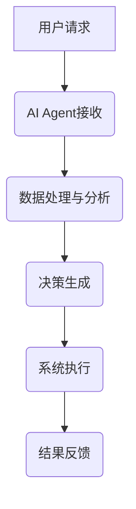
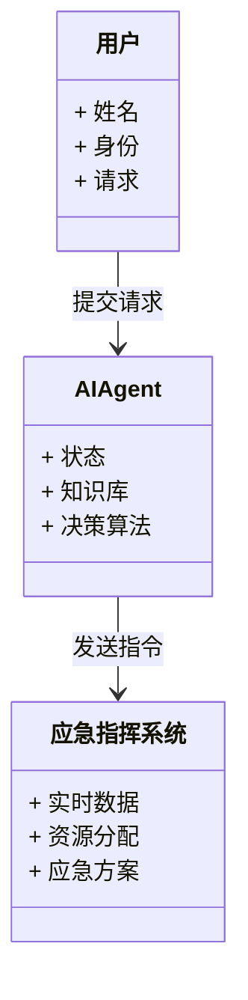
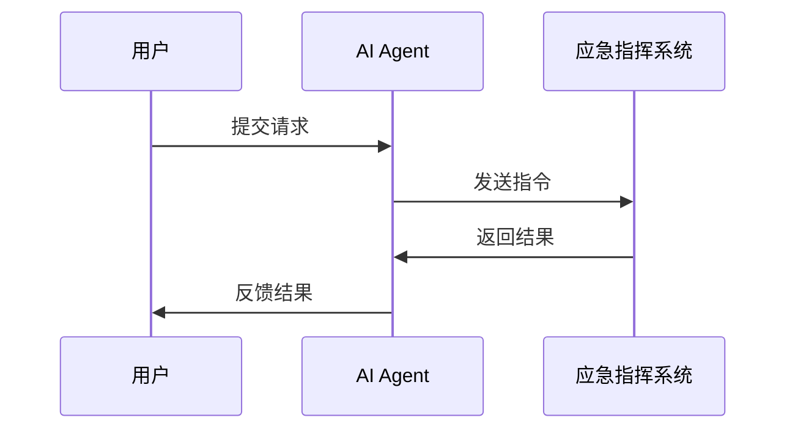

                 


# AI Agent在智能城市应急指挥中的角色

> 关键词：AI Agent，智能城市，应急指挥，实时监控，决策支持，资源协调

> 摘要：  
随着城市化进程的加速，智能城市应急指挥系统的需求日益迫切。AI Agent作为人工智能领域的核心技术，能够通过智能化的感知、分析和决策能力，显著提升城市应急指挥的效率和准确性。本文从AI Agent的核心概念、算法原理、系统架构到实际应用案例，全面探讨AI Agent在智能城市应急指挥中的角色与价值。文章结合实际场景，分析了AI Agent在应急指挥中的具体应用，包括实时监控、智能决策支持和资源协调优化等方面，并通过系统架构设计和项目实战案例，详细解读了AI Agent在智能城市应急指挥中的实现过程和应用效果。

---

# 第1章: AI Agent与智能城市应急指挥概述

## 1.1 AI Agent的基本概念

### 1.1.1 AI Agent的定义  
AI Agent（人工智能代理）是指能够感知环境、自主决策并执行任务的智能实体。与传统程序不同，AI Agent具备自主性、反应性、目标导向性和社会性等特征。

### 1.1.2 AI Agent的核心特征  
- **自主性**：AI Agent能够自主决策，无需外部干预。  
- **反应性**：能够实时感知环境变化并做出反应。  
- **目标导向性**：具备明确的目标，能够优化行动以实现目标。  
- **社会性**：能够与其他AI Agent或人类进行协作与交互。  

### 1.1.3 AI Agent与传统自动化的区别  
传统自动化依赖预设的规则和程序，而AI Agent能够通过学习和推理，适应复杂多变的环境。

## 1.2 智能城市应急指挥的定义与特点

### 1.2.1 智能城市的定义  
智能城市是指通过物联网、大数据、人工智能等技术，实现城市基础设施、公共服务和管理的智能化。

### 1.2.2 应急指挥的核心任务  
- **实时监控**：对城市运行状态进行实时监测。  
- **快速响应**：在突发事件中迅速启动应急机制。  
- **资源协调**：优化应急资源的分配与调度。  

### 1.2.3 智能城市应急指挥的优势  
- **高效性**：通过智能化技术提高应急响应速度。  
- **准确性**：利用AI技术提升决策的科学性。  
- **协同性**：实现跨部门、跨区域的协同应急。

## 1.3 AI Agent在智能城市应急指挥中的作用

### 1.3.1 提高应急响应效率  
AI Agent能够快速分析海量数据，提供实时的决策支持。  

### 1.3.2 实现资源优化配置  
通过AI Agent的智能调度算法，实现应急资源的最优分配。  

### 1.3.3 提供智能决策支持  
AI Agent能够基于历史数据和实时信息，生成最优的应急方案。

## 1.4 本章小结  
本章介绍了AI Agent的基本概念和核心特征，并阐述了智能城市应急指挥的定义与特点。同时，分析了AI Agent在智能城市应急指挥中的重要作用，为后续章节的展开奠定了基础。

---

# 第2章: AI Agent的核心原理

## 2.1 AI Agent的工作原理

### 2.1.1 信息感知与数据采集  
AI Agent通过传感器、摄像头、数据库等设备，实时采集城市运行的各类数据。  

### 2.1.2 数据处理与分析  
对采集到的海量数据进行清洗、建模和分析，提取有用的信息。  

### 2.1.3 决策与执行  
基于分析结果，生成决策方案并执行行动。

## 2.2 AI Agent的分类与特点

### 2.2.1 基于规则的AI Agent  
- 通过预设的规则和条件进行决策。  
- 适用于规则明确的场景，如交通信号灯控制。  

### 2.2.2 基于机器学习的AI Agent  
- 通过机器学习算法（如神经网络、支持向量机）进行决策。  
- 适用于复杂、动态变化的场景，如应急指挥。  

### 2.2.3 基于知识图谱的AI Agent  
- 利用知识图谱进行推理和决策。  
- 适用于需要知识推理的场景，如医疗诊断。

## 2.3 AI Agent的核心技术

### 2.3.1 自然语言处理  
用于理解和生成人类语言，支持与用户的自然交互。  

### 2.3.2 机器学习与深度学习  
通过数据训练模型，实现智能决策和预测。  

### 2.3.3 知识表示与推理  
利用知识图谱和逻辑推理技术，支持复杂的决策任务。

## 2.4 AI Agent的实体关系图

```mermaid
er
actor: 用户
agent: AI Agent
system: 应急指挥系统
action: 应急响应
```

## 2.5 AI Agent的工作流程图



## 2.6 本章小结  
本章详细讲解了AI Agent的核心原理，包括信息感知、数据处理、决策执行等过程，并通过实体关系图和流程图，直观展示了AI Agent的工作机制。

---

# 第3章: AI Agent在智能城市应急指挥中的系统架构设计

## 3.1 系统功能设计

### 3.1.1 领域模型设计  


### 3.1.2 系统功能模块  
- **数据采集模块**：实时采集城市运行数据。  
- **数据分析模块**：对数据进行清洗和建模。  
- **决策支持模块**：生成应急决策方案。  
- **执行模块**：将决策方案转化为具体行动。

## 3.2 系统架构设计

### 3.2.1 系统架构图  


### 3.2.2 接口设计  
- **数据接口**：与传感器、数据库等外部系统对接。  
- **用户接口**：提供人机交互界面，支持用户操作。  

### 3.2.3 交互流程图  


## 3.3 本章小结  
本章从系统架构的角度，详细设计了AI Agent在智能城市应急指挥中的实现方案，包括功能模块、架构设计和交互流程。

---

# 第4章: AI Agent在智能城市应急指挥中的应用案例

## 4.1 应急响应实时监控

### 4.1.1 场景描述  
某城市发生火灾，AI Agent实时监控火情，协调消防资源进行扑救。

### 4.1.2 实施步骤  
1. AI Agent接收火灾报警信号。  
2. 分析火情位置、规模和影响范围。  
3. 调度最近的消防资源。  
4. 实时监控灭火进展并反馈结果。

## 4.2 智能决策支持

### 4.2.1 场景描述  
AI Agent基于历史数据和实时信息，为应急指挥提供最优决策方案。

### 4.2.2 技术实现  
- 数据分析：利用机器学习模型预测火势蔓延方向。  
- 决策生成：基于知识图谱进行推理，生成最优灭火方案。  

## 4.3 资源协调优化

### 4.3.1 场景描述  
AI Agent优化应急资源的分配，确保资源利用最大化。

### 4.3.2 技术实现  
- 资源调度算法：基于遗传算法优化资源配置。  
- 实时反馈：根据现场情况动态调整资源分配方案。

## 4.4 本章小结  
本章通过具体案例，展示了AI Agent在智能城市应急指挥中的实际应用，包括实时监控、智能决策支持和资源协调优化。

---

# 第5章: AI Agent在智能城市应急指挥中的系统实现

## 5.1 环境配置

### 5.1.1 开发环境  
- 操作系统：Linux/Windows  
- 开发工具：Python、Jupyter Notebook  
- 依赖库：NumPy、Pandas、Scikit-learn  

### 5.1.2 数据源  
- 市政数据：如交通流量、天气数据。  
- 应急数据：如消防、医疗救援资源位置。  

## 5.2 核心代码实现

### 5.2.1 数据采集与处理  
```python
import pandas as pd
import numpy as np

# 数据采集
data = pd.read_csv('emergency_data.csv')

# 数据清洗
data.dropna(inplace=True)
data = data[~data['longitude'].isnull()]
```

### 5.2.2 决策算法实现  
```python
from sklearn import linear_model

# 训练模型
model = linear_model.LinearRegression()
model.fit(X, y)

# 预测结果
prediction = model.predict(X_test)
```

### 5.2.3 系统交互接口  
```python
import flask

app = Flask(__name__)

@app.route('/')
def home():
    return "AI Agent Ready!"

@app.route('/request', methods=['POST'])
def handle_request():
    # 处理请求
    return "Processed!"
```

## 5.3 系统测试与优化

### 5.3.1 测试用例设计  
- 功能测试：验证系统是否正常运行。  
- 性能测试：评估系统在高负载下的表现。  

### 5.3.2 优化建议  
- 数据预处理：提高数据处理效率。  
- 算法优化：采用更高效的机器学习算法。  

## 5.4 本章小结  
本章详细介绍了AI Agent在智能城市应急指挥系统中的实现过程，包括环境配置、核心代码实现和系统测试优化。

---

# 第6章: 未来发展趋势与挑战

## 6.1 未来发展趋势

### 6.1.1 技术创新  
- 更先进的AI算法：如强化学习、生成对抗网络。  
- 多模态数据处理：整合文本、图像、视频等多种数据类型。  

### 6.1.2 应用扩展  
- 应急指挥的全球化：支持跨国协作的应急指挥系统。  
- AI Agent的自主性提升：实现完全自主的应急响应。  

## 6.2 当前挑战

### 6.2.1 技术挑战  
- 数据隐私问题：如何保护用户数据不被滥用。  
- 系统稳定性：确保AI Agent在极端情况下的可靠性。  

### 6.2.2 应用挑战  
- 用户信任问题：如何建立用户对AI Agent的信任。  
- 法律法规：如何应对AI技术在应急指挥中的法律问题。  

## 6.3 最佳实践

### 6.3.1 技术层面  
- 数据安全：采用加密技术保护用户数据。  
- 系统容错：设计容错机制，确保系统稳定运行。  

### 6.3.2 应用层面  
- 用户教育：通过培训提高用户对AI Agent的信任。  
- 法律合规：遵守相关法律法规，确保技术应用的合法性。  

## 6.4 本章小结  
本章分析了AI Agent在智能城市应急指挥中的未来发展趋势和当前挑战，并提出了应对挑战的最佳实践建议。

---

# 第7章: 总结与展望

## 7.1 本章总结  
本文从AI Agent的核心概念出发，详细探讨了其在智能城市应急指挥中的角色与应用。通过理论分析和实际案例，展示了AI Agent如何提高应急指挥的效率和准确性。

## 7.2 未来展望  
随着AI技术的不断发展，AI Agent将在智能城市应急指挥中发挥越来越重要的作用。未来的研究方向包括更先进的算法、多模态数据处理和全球化协作等方面。

---

# 附录: 参考文献

1. Russell, S., & Norvig, P. (2010). Artificial Intelligence: A Modern Approach.  
2. Lecun, Y., Bengio, Y., & Hinton, G. (2015). Deep Learning.  
3. Goodfellow, I., Bengio, Y., & Courville, A. (2016). Deep Learning.  
4. Zhang, Z., & Pan, S. (2019). AI Agent in Urban Emergency Management.

---

# 作者：AI天才研究院/AI Genius Institute & 禅与计算机程序设计艺术 /Zen And The Art of Computer Programming

