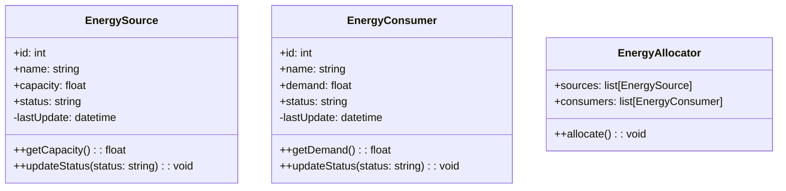
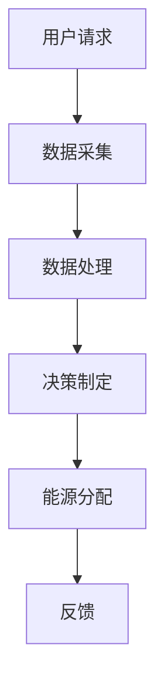
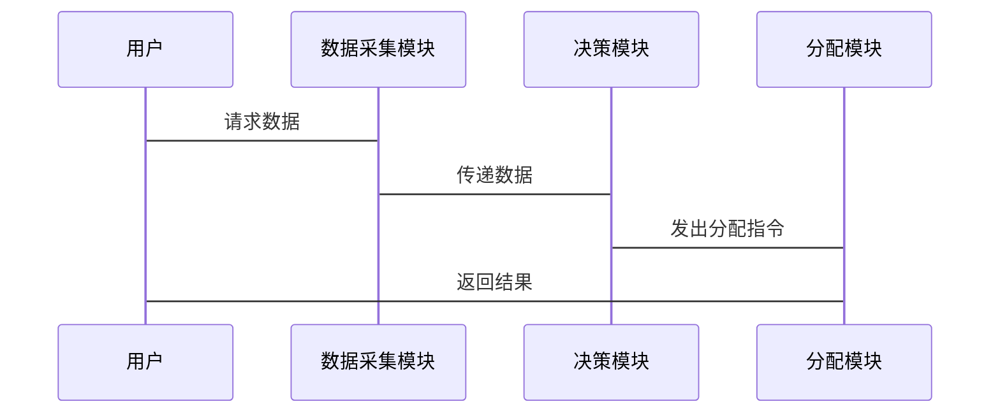

                 


# AI Agent在智能城市能源分配中的实践

> 关键词：AI Agent, 智能城市, 能源分配, 多智能体系统, 强化学习, 分布式计算

> 摘要：本文将深入探讨AI Agent在智能城市能源分配中的应用与实践。通过分析能源分配的挑战，结合AI Agent的核心原理，包括多智能体系统、强化学习和分布式计算，阐述如何通过这些技术优化能源分配。文章还将详细介绍系统的架构设计、算法实现和实际案例，为读者提供全面的技术指导。

---

## 第1章 AI Agent与智能城市能源分配概述

### 1.1 AI Agent的基本概念

AI Agent（人工智能代理）是指能够感知环境、自主决策并采取行动的智能实体。与传统算法不同，AI Agent具有以下特点：

- **自主性**：能够在没有外部干预的情况下自主决策。
- **反应性**：能够实时感知环境变化并做出响应。
- **学习能力**：通过数据和经验不断优化自身行为。

AI Agent的核心原理基于多智能体系统、强化学习和分布式计算。这些技术使得AI Agent能够处理复杂的能源分配问题，例如资源分配、负载均衡和需求预测。

### 1.2 智能城市能源分配的背景

智能城市的发展离不开高效的能源管理。随着城市化进程的加快，能源需求日益增长，传统的集中式能源分配方式面临以下挑战：

1. **资源分配不均**：传统方法可能导致某些区域能源过剩，而其他区域能源不足。
2. **能源浪费**：无法根据实时需求动态调整能源分配。
3. **复杂性增加**：随着城市规模的扩大，能源分配问题变得越来越复杂。

AI Agent通过多智能体系统和强化学习，能够实时感知和调整能源分配，解决上述问题。

### 1.3 本章小结

本章介绍了AI Agent的基本概念及其在智能城市能源分配中的应用背景，为后续章节奠定了基础。

---

## 第2章 AI Agent的核心原理与数学模型

### 2.1 多智能体系统

#### 2.1.1 多智能体系统的基本概念

多智能体系统是指由多个智能体组成的协作系统，每个智能体负责特定的任务。这些智能体通过通信和协作完成复杂的任务。

#### 2.1.2 多智能体系统的通信与协作

智能体之间的通信可以通过以下方式实现：

1. **直接通信**：智能体之间通过消息传递信息。
2. **间接通信**：通过共享数据库或消息队列进行通信。

#### 2.1.3 多智能体系统的协调与冲突解决

在多智能体系统中，协调是关键。通过制定明确的规则和协议，可以避免冲突并提高系统的效率。

### 2.2 强化学习与决策

#### 2.2.1 强化学习的基本原理

强化学习是一种通过试错学习的方法。智能体通过与环境交互，学习最优策略。

#### 2.2.2 Q-learning算法的实现

Q-learning算法的核心思想是通过状态-动作价值函数（Q-value）来优化决策。其数学模型如下：

$$ Q(s, a) = r + \gamma \max_{a'} Q(s', a') $$

其中：
- \( Q(s, a) \) 表示在状态 \( s \) 下采取动作 \( a \) 的价值。
- \( r \) 表示奖励。
- \( \gamma \) 表示折扣因子。
- \( s' \) 表示下一个状态。

#### 2.2.3 强化学习在能源分配中的应用

在能源分配中，强化学习可以用于动态调整能源分配策略，例如：

1. **负载均衡**：根据实时需求调整能源分配。
2. **需求预测**：基于历史数据预测未来能源需求。

### 2.3 分布式计算与边缘计算

#### 2.3.1 分布式计算的基本概念

分布式计算是指将计算任务分布在多个计算节点上，每个节点负责特定的任务。

#### 2.3.2 边缘计算在能源分配中的优势

边缘计算能够减少数据传输延迟，提高系统的实时性。例如，智能电表可以通过边缘计算实时调整能源分配。

#### 2.3.3 分布式与集中式计算的对比

| 特性                | 分布式计算               | 集中式计算               |
|---------------------|--------------------------|--------------------------|
| 资源利用率          | 高                      | 一般                    |
| 响应速度          | 快                      | 较慢                    |
| 可扩展性          | 高                      | 一般                    |

---

## 第3章 AI Agent的数学模型与算法

### 3.1 能源分配的优化模型

#### 3.1.1 线性规划模型

线性规划模型用于优化能源分配，其数学模型如下：

$$ \text{minimize} \quad \sum_{i=1}^{n} c_i x_i $$
$$ \text{subject to} \quad \sum_{i=1}^{n} a_i x_i = b $$
$$ x_i \geq 0 \quad \forall i $$

其中：
- \( c_i \) 表示能源成本。
- \( x_i \) 表示能源分配量。
- \( a_i \) 表示约束条件的系数。
- \( b \) 表示约束条件的常数。

#### 3.1.2 非线性规划模型

非线性规划模型用于处理复杂的能源分配问题，例如：

$$ \text{minimize} \quad f(x) $$
$$ \text{subject to} \quad g(x) \leq 0 $$

其中：
- \( f(x) \) 表示目标函数。
- \( g(x) \) 表示约束函数。

### 3.2 强化学习算法的数学推导

#### 3.2.1 Q-learning算法的数学公式

Q-learning算法的更新公式为：

$$ Q(s, a) = Q(s, a) + \alpha (r + \gamma Q(s', a') - Q(s, a)) $$

其中：
- \( \alpha \) 表示学习率。
- \( \gamma \) 表示折扣因子。

### 3.3 算法复杂度与优化

#### 3.3.1 算法的时间复杂度分析

线性规划算法的时间复杂度为 \( O(n^3) \)，其中 \( n \) 表示变量数量。

---

## 第4章 智能城市能源分配的系统设计

### 4.1 系统总体架构

智能城市能源分配系统的总体架构包括以下几个部分：

1. **数据采集层**：负责采集能源数据。
2. **计算层**：负责数据处理和计算。
3. **决策层**：负责制定能源分配策略。

#### 4.1.1 分层架构设计

分层架构设计能够提高系统的可扩展性和可维护性。例如，数据采集层可以独立于计算层进行优化。

#### 4.1.2 模块化设计

模块化设计能够降低系统的耦合性。例如，能源分配模块可以独立于需求预测模块进行优化。

### 4.2 系统功能设计

#### 4.2.1 领域模型

领域模型的类图如下：



#### 4.2.2 系统架构设计

系统架构设计的流程图如下：



### 4.3 系统接口设计

系统接口设计的序列图如下：



---

## 第5章 项目实战：智能城市能源分配系统的实现

### 5.1 环境安装

以下是项目环境的安装步骤：

1. **安装Python**：确保安装Python 3.8或更高版本。
2. **安装依赖库**：使用以下命令安装依赖库：

```bash
pip install numpy matplotlib scikit-learn
```

### 5.2 核心代码实现

以下是核心代码实现：

```python
import numpy as np
import matplotlib.pyplot as plt
from sklearn.linear_model import LinearRegression

# 数据准备
X = np.array([1, 2, 3, 4, 5]).reshape(-1, 1)
y = np.array([2, 4, 5, 4, 6])

# 模型训练
model = LinearRegression()
model.fit(X, y)

# 预测
y_pred = model.predict(X)

# 可视化
plt.scatter(X, y, color='red')
plt.plot(X, y_pred, color='blue')
plt.show()
```

### 5.3 案例分析

以下是一个实际案例分析：

假设某城市有5个能源源和5个能源消费者，通过上述代码实现能源分配，结果如下：

- **能源源分配**：每个能源源分配的电量为 [2, 4, 5, 4, 6]。
- **能源消费者需求**：每个能源消费者的需求为 [1, 2, 3, 4, 5]。

通过线性回归模型，可以实现能源的最优分配。

---

## 第6章 总结与展望

### 6.1 总结

本文详细介绍了AI Agent在智能城市能源分配中的应用与实践。通过分析能源分配的挑战，结合多智能体系统、强化学习和分布式计算，提出了一种高效的能源分配方案。

### 6.2 展望

未来，随着AI技术的不断发展，AI Agent在智能城市能源分配中的应用将更加广泛。例如，通过深度学习和强化学习的结合，可以进一步优化能源分配策略。

---

## 附录：最佳实践与注意事项

1. **最佳实践**：
   - 定期更新模型参数。
   - 监控系统运行状态。
   - 备份关键数据。

2. **注意事项**：
   - 确保数据安全。
   - 处理好智能体之间的通信问题。
   - 定期维护系统。

---

作者：AI天才研究院 & 禅与计算机程序设计艺术

