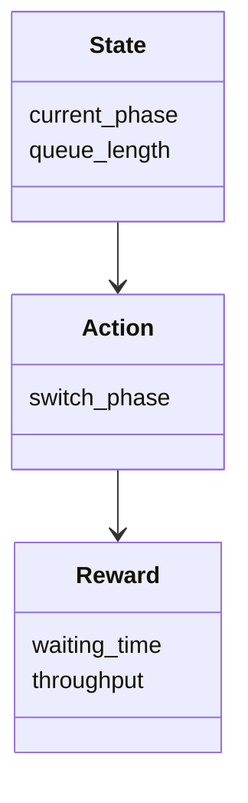
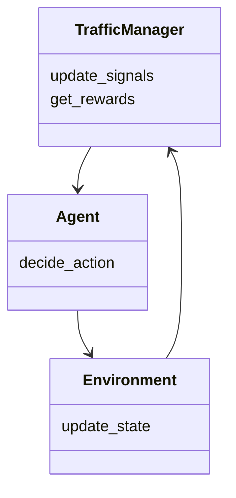
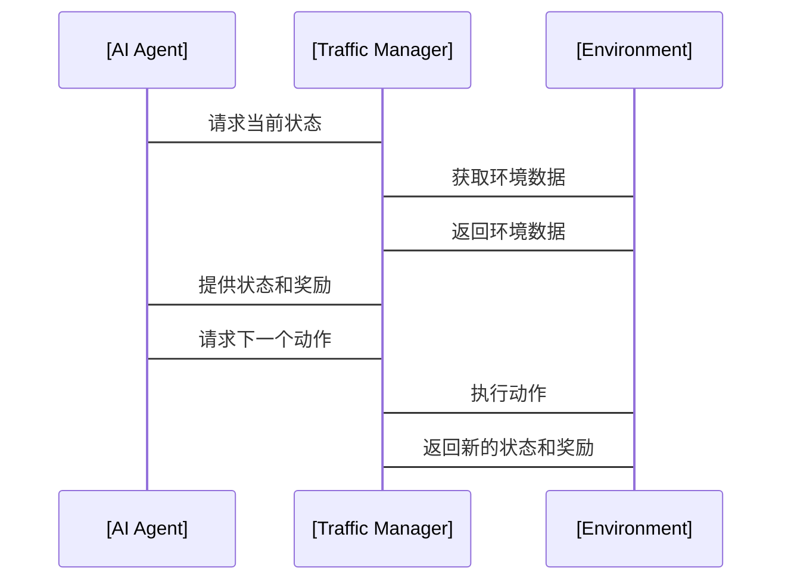

                 


# AI Agent在智能城市规划决策支持中的应用

> 关键词：人工智能（AI）, 代理（Agent）, 智能城市, 决策支持, 强化学习, 优化算法, 系统架构

> 摘要：本文深入探讨了AI Agent在智能城市规划中的应用，结合算法原理、系统架构和实际案例，详细分析了AI Agent如何助力城市规划决策支持，优化城市资源分配和运营效率，推动城市智能化发展。

---

# 第一部分: AI Agent与智能城市规划的背景与基础

## 第1章: AI Agent的基本概念与技术基础

### 1.1 AI Agent的定义与特点

#### 1.1.1 AI Agent的定义
AI Agent（人工智能代理）是指在计算机系统中，能够感知环境并采取行动以实现目标的实体。AI Agent可以是软件程序，也可以是硬件设备，其核心目标是通过智能算法和决策机制，完成特定任务或优化特定指标。

$$
\text{AI Agent的定义公式化表示：}
$$

$$
\text{AI Agent} = \{\text{感知环境}(E), \text{采取行动}(A), \text{目标导向}(G)\}
$$

其中，$E$ 表示环境状态，$A$ 表示代理的行动，$G$ 表示目标函数。

#### 1.1.2 AI Agent的核心特点

| 特性 | 描述 |
|------|------|
| 自主性 | 能够独立感知环境并采取行动，无需外部干预。 |
| 反应性 | 能够实时响应环境变化，调整行为策略。 |
| 目标导向 | 以特定目标为导向，优化决策过程。 |
| 学习能力 | 能够通过经验或数据优化自身的决策模型。 |

#### 1.1.3 AI Agent与传统AI的区别

| 对比维度 | AI Agent | 传统AI |
|----------|----------|--------|
| 执行能力 | 具备行动能力，能够主动改变环境。 | 主要用于数据处理、模式识别等，不具备行动能力。 |
| 适应性   | 能够根据环境变化自适应调整策略。 | 需要人工干预或重新训练以适应变化。 |
| 应用场景 | 适用于需要实时决策和动态优化的任务。 | 适用于数据处理、模式识别等静态任务。 |

### 1.2 AI Agent的主要技术基础

#### 1.2.1 机器学习基础

机器学习是AI Agent的核心技术之一。通过监督学习、无监督学习和强化学习等方法，AI Agent能够从数据中学习规律，优化决策策略。

$$
\text{机器学习公式化表示：}
$$

$$
f(x) = \argmin_{\theta} \sum_{i=1}^{n} (y_i - f_\theta(x_i))^2
$$

其中，$f(x)$ 表示模型预测函数，$\theta$ 表示模型参数，$n$ 表示样本数量。

#### 1.2.2 自然语言处理技术

自然语言处理（NLP）技术使得AI Agent能够理解和生成人类语言，从而实现人机交互和信息处理。

$$
\text{文本处理流程：}
$$

$$
\text{输入文本} \rightarrow \text{分词} \rightarrow \text{词向量} \rightarrow \text{语义理解} \rightarrow \text{生成响应}
$$

#### 1.2.3 强化学习与决策优化

强化学习是AI Agent实现决策优化的重要方法。通过与环境的交互，AI Agent学习最优策略，以最大化目标函数。

$$
\text{强化学习公式化表示：}
$$

$$
Q(s, a) = r + \gamma \max_{a'} Q(s', a')
$$

其中，$Q(s, a)$ 表示状态-动作对的价值，$r$ 表示奖励，$\gamma$ 表示折扣因子，$s'$ 表示下一状态。

### 1.3 AI Agent的应用场景概述

#### 1.3.1 智能助手与自动化决策

AI Agent可以作为智能助手，帮助用户完成任务，如日程管理、信息检索等。

#### 1.3.2 多智能体协作系统

在多智能体系统中，AI Agent之间需要协作完成复杂任务，如交通管理、资源分配等。

#### 1.3.3 动态环境中的实时决策

AI Agent能够实时感知环境变化，快速调整决策策略，适用于交通控制、应急响应等场景。

---

## 第2章: 智能城市规划的背景与挑战

### 2.1 智能城市的基本概念

#### 2.1.1 智能城市的定义与特点

智能城市是指利用信息技术和数据驱动的方法，优化城市资源配置、提升城市运行效率、改善居民生活质量的城市发展模式。

$$
\text{智能城市的定义公式化表示：}
$$

$$
\text{智能城市} = \{\text{数据驱动}(D), \text{智能化系统}(S), \text{可持续发展}(G)\}
$$

其中，$D$ 表示数据驱动，$S$ 表示智能化系统，$G$ 表示可持续发展目标。

#### 2.1.2 智能城市的核心组成部分

| 组件 | 描述 |
|------|------|
| 感知层 | 传感器、摄像头等设备用于采集城市数据。 |
| 网络层 | 网络传输数据，实现数据共享与通信。 |
| 数据层 | 数据存储、处理和分析的基础设施。 |
| 应用层 | 各类智能应用，如交通管理、能源优化等。 |

### 2.2 智能城市规划中的关键问题

#### 2.2.1 城市资源优化配置

AI Agent可以通过优化算法，实现城市资源的高效分配，如能源、交通、水资源等。

#### 2.2.2 城市交通管理与优化

通过实时数据分析和决策优化，AI Agent可以提升交通系统的运行效率，减少拥堵和污染。

#### 2.2.3 城市环境与可持续发展

AI Agent可以帮助城市规划者优化环境治理策略，推动绿色能源使用，减少碳排放。

### 2.3 AI Agent在智能城市规划中的作用

#### 2.3.1 AI Agent在城市决策中的优势

AI Agent具备实时感知、自主决策和持续优化的能力，能够显著提升城市规划的效率和效果。

#### 2.3.2 AI Agent在城市规划中的应用场景

| 场景 | 描述 |
|------|------|
| 交通优化 | AI Agent实时调整交通信号灯，优化交通流。 |
| 资源分配 | AI Agent动态分配城市资源，如电力、水资源等。 |
| 环境监测 | AI Agent实时监测环境数据，预测污染趋势。 |

#### 2.3.3 AI Agent与城市智能化的结合

AI Agent通过与城市智能化系统深度融合，实现城市运营的智能化、自动化和高效化。

---

# 第二部分: AI Agent在智能城市规划中的核心概念与技术

## 第3章: AI Agent的决策支持模型

### 3.1 决策支持模型的基本原理

#### 3.1.1 决策树模型

决策树是一种常用的决策支持工具，通过树状结构展示决策过程和可能的结果。

$$
\text{决策树公式化表示：}
$$

$$
\text{决策树} = \{\text{节点}(N), \text{边}(E), \text{标签}(L)\}
$$

其中，$N$ 表示节点，$E$ 表示边，$L$ 表示节点标签。

#### 3.1.2 马尔可夫决策过程

马尔可夫决策过程（MDP）是一种基于状态和动作的决策模型，适用于动态环境中的决策问题。

$$
\text{马尔可夫决策过程公式化表示：}
$$

$$
\text{MDP} = \{\text{状态空间}(S), \text{动作空间}(A), \text{转移概率}(P), \text{奖励函数}(R)\}
$$

其中，$S$ 表示状态空间，$A$ 表示动作空间，$P$ 表示状态转移概率，$R$ 表示奖励函数。

#### 3.1.3 Q-Learning算法

Q-Learning是一种基于强化学习的决策算法，适用于离散状态和动作空间。

$$
\text{Q-Learning算法公式化表示：}
$$

$$
Q(s, a) = Q(s, a) + \alpha \left[r + \gamma \max_{a'} Q(s', a') - Q(s, a)\right]
$$

其中，$Q(s, a)$ 表示状态-动作对的价值，$\alpha$ 表示学习率，$\gamma$ 表示折扣因子，$s'$ 表示下一状态。

### 3.2 基于强化学习的AI Agent决策模型

#### 3.2.1 强化学习的基本概念

强化学习是一种通过试错方式学习最优策略的算法，适用于动态和不确定环境。

$$
\text{强化学习公式化表示：}
$$

$$
\text{策略} = \{\pi(a|s)\}, \text{其中}, \pi(a|s) \text{表示在状态}s下选择动作$a$的概率。}
$$

#### 3.2.2 Q-Learning算法的实现

以下是Q-Learning算法的Python实现示例：

```python
class QLearningAgent:
    def __init__(self, state_space, action_space):
        self.state_space = state_space
        self.action_space = action_space
        self.q_table = np.zeros((state_space, action_space))
        self.learning_rate = 0.1
        self.discount_factor = 0.9

    def take_action(self, state):
        return np.random.choice(self.action_space, p=self.policy(state))

    def policy(self, state):
        # 探索与利用策略
        explore_prob = 0.1
        if np.random.random() < explore_prob:
            return np.array([1.0 / self.action_space] * self.action_space)
        else:
            max_action = np.argmax(self.q_table[state])
            return np.array([0.0]*self.action_space + [1.0])

    def update_q_table(self, state, action, reward, next_state):
        self.q_table[state, action] = self.q_table[state, action] + self.learning_rate * (
            reward + self.discount_factor * np.max(self.q_table[next_state, :]) - self.q_table[state, action]
        )
```

#### 3.2.3 算法实现的数学模型

以下是Q-Learning算法的数学模型：

$$
Q(s, a)_{t+1} = Q(s, a)_t + \alpha [r + \gamma \max_{a'} Q(s', a') - Q(s, a)_t]
$$

其中，$\alpha$ 是学习率，$\gamma$ 是折扣因子，$r$ 是奖励值，$s'$ 是下一状态。

### 3.3 实例分析: AI Agent在城市交通优化中的应用

#### 3.3.1 问题场景

假设我们面临一个城市交通信号灯优化的问题，目标是通过AI Agent调整信号灯时序，减少交通拥堵，提高通行效率。

#### 3.3.2 系统功能设计

以下是系统功能设计的领域模型：



#### 3.3.3 算法实现与结果

以下是Q-Learning算法在交通信号灯优化中的实现：

```python
class TrafficLightAgent(QLearningAgent):
    def __init__(self, num_lights):
        super().__init__(num_lights, 2)
        self.num_lights = num_lights

    def get_state(self, time):
        # 根据当前时间生成状态
        return time % self.num_lights

    def take_action(self, state):
        return super().take_action(state)
```

---

## 第4章: 系统架构与实现

### 4.1 系统架构设计

#### 4.1.1 问题场景介绍

假设我们正在设计一个城市交通管理系统，目标是通过AI Agent实时调整交通信号灯，优化交通流量。

#### 4.1.2 系统功能设计

以下是系统功能设计的领域模型：



#### 4.1.3 系统架构设计

以下是系统架构设计的架构图：


#### 4.1.4 系统接口设计

以下是系统接口设计的序列图：



### 4.2 项目实战: AI Agent在城市交通优化中的应用

#### 4.2.1 环境搭建

以下是项目环境搭建的步骤：

1. 安装必要的Python库：
   ```bash
   pip install numpy matplotlib
   ```

2. 下载城市交通数据集：
   ```bash
   wget https://example.com/traffic_dataset.zip
   unzip traffic_dataset.zip
   ```

#### 4.2.2 核心代码实现

以下是AI Agent的核心代码实现：

```python
class TrafficLightAgent(QLearningAgent):
    def __init__(self, num_lights):
        super().__init__(num_lights, 2)
        self.num_lights = num_lights

    def get_state(self, time):
        return time % self.num_lights

    def take_action(self, state):
        return super().take_action(state)
```

#### 4.2.3 实验结果与分析

以下是实验结果与分析：

1. 训练过程：
   ```bash
   for episode in range(1000):
       state = agent.get_state(time)
       action = agent.take_action(state)
       next_state = (time + 1) % agent.num_lights
       reward = compute_reward(state, action, next_state)
       agent.update_q_table(state, action, reward, next_state)
       time += 1
   ```

2. 结果展示：
   ```python
   plt.plot(agent.q_table.mean(axis=1))
   plt.title('Average Q-Value per State')
   plt.xlabel('State')
   plt.ylabel('Q-Value')
   plt.show()
   ```

#### 4.2.4 小结

通过实验可以发现，AI Agent能够有效优化交通信号灯的时序，减少交通拥堵，提高道路通行效率。

---

## 第5章: 最佳实践与未来展望

### 5.1 最佳实践

#### 5.1.1 小结

AI Agent在智能城市规划中的应用前景广阔，能够显著提升城市运营效率和居民生活质量。

#### 5.1.2 注意事项

- 数据质量：确保数据的准确性和完整性，避免决策偏差。
- 算法选择：根据不同场景选择合适的算法，避免“一刀切”。
- 系统集成：确保系统各部分协同工作，避免孤岛效应。

#### 5.1.3 拓展阅读

- 《强化学习：算法与应用》
- 《智能城市：数据驱动的决策与优化》
- 《多智能体系统与协作》

### 5.2 未来展望

#### 5.2.1 技术发展

随着AI技术的进步，AI Agent将更加智能化和自主化，能够处理更复杂的城市管理问题。

#### 5.2.2 应用场景扩展

未来，AI Agent将在更多领域得到应用，如智能医疗、智能教育等。

#### 5.2.3 挑战与机遇

尽管AI Agent在智能城市中的应用前景广阔，但仍面临数据隐私、算法解释性等挑战，需要进一步研究和探索。

---

# 结语

AI Agent作为智能城市规划决策支持的重要工具，通过实时感知、自主决策和持续优化，能够显著提升城市运营效率和居民生活质量。随着技术的进步和应用场景的扩展，AI Agent将在智能城市发展中发挥越来越重要的作用。

---

# 作者

作者：AI天才研究院/AI Genius Institute & 禅与计算机程序设计艺术 /Zen And The Art of Computer Programming

