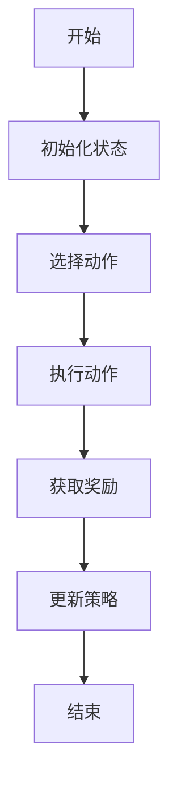
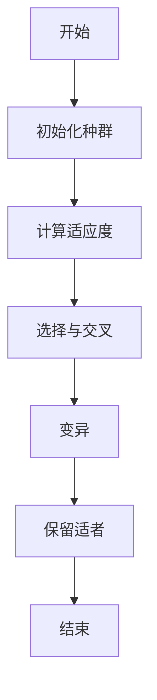
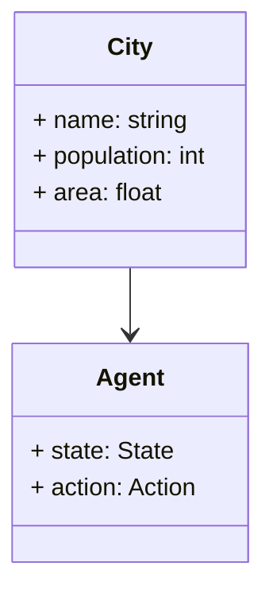

                 


# AI Agent在智能城市规划模拟中的角色

## 关键词：
AI Agent, 智能城市, 城市规划, 强化学习, 遗传算法, 系统架构

## 摘要：
本文探讨了AI Agent在智能城市规划中的应用，分析其在交通、资源分配等方面的作用。通过算法原理、数学模型、系统架构和项目案例，详细阐述了AI Agent如何提升城市规划的效率与精准度。

---

## 第1章：智能城市规划与AI Agent概述

### 1.1 智能城市规划的背景与意义
#### 1.1.1 城市化与城市规划的演变
随着城市化进程的加快，传统城市规划方法面临数据不足、效率低下等问题，AI Agent的引入为解决这些问题提供了新思路。

#### 1.1.2 智能城市的概念与目标
智能城市通过数据和AI技术优化资源配置，提升居民生活质量，实现可持续发展。

#### 1.1.3 AI Agent在智能城市中的作用
AI Agent通过实时数据处理和决策优化，帮助城市规划者更好地应对复杂问题。

### 1.2 AI Agent的基本概念
#### 1.2.1 什么是AI Agent
AI Agent是一种智能实体，能够感知环境、自主决策并执行任务。

#### 1.2.2 AI Agent的类型与特点
- **反应式AI Agent**：基于当前感知做出反应。
- **认知式AI Agent**：具备推理和规划能力。
- **协作式AI Agent**：能够与其他Agent协作完成任务。

#### 1.2.3 AI Agent在城市规划中的应用领域
- 交通管理
- 资源分配
- 环境监测

---

## 第2章：AI Agent的核心原理与城市规划的关系

### 2.1 AI Agent的核心原理
#### 2.1.1 感知与决策机制
AI Agent通过传感器和数据源获取信息，利用算法进行决策。

#### 2.1.2 学习与自适应能力
通过机器学习，AI Agent能够不断优化自身行为。

#### 2.1.3 多智能体协作
多个AI Agent协作，共同解决复杂问题。

### 2.2 AI Agent与城市规划的联系
#### 2.2.1 数据驱动的城市分析
利用大数据分析优化城市布局。

#### 2.2.2 智能模拟与预测
通过模拟预测城市发展趋势，辅助决策。

#### 2.2.3 自适应规划策略
AI Agent能够根据实时数据调整规划方案。

---

## 第3章：AI Agent的核心算法

### 3.1 强化学习算法
#### 3.1.1 算法原理与流程图


#### 3.1.2 Python实现示例
```python
class Agent:
    def __init__(self, state_space, action_space):
        self.state_space = state_space
        self.action_space = action_space
        # 初始化策略参数
```

#### 3.1.3 应用场景分析
强化学习用于交通信号灯优化，通过奖励机制提升交通流畅度。

### 3.2 遗传算法
#### 3.2.1 算法原理与流程图


#### 3.2.2 Python实现示例
```python
import numpy as np

def fitness_func(solution):
    return np.sum(solution)
```

#### 3.2.3 应用案例分析
遗传算法用于城市布局优化，寻找最优空间配置。

---

## 第4章：AI Agent的数学模型

### 4.1 马尔可夫决策过程
#### 4.1.1 定义与公式
状态转移概率：P(s'|s,a)  
奖励函数：R(s,a)  

#### 4.1.2 应用实例分析
交通流量管理中，AI Agent根据当前状态选择最优动作。

### 4.2 状态转移矩阵与奖励函数
#### 4.2.1 状态转移矩阵的构建
构建状态转移矩阵，表示状态间的转移概率。

#### 4.2.2 奖励函数的设计
设计奖励函数，引导AI Agent做出最优决策。

---

## 第5章：智能城市规划系统的架构

### 5.1 系统组成与功能模块
- 数据输入模块：接收传感器数据。
- AI Agent决策模块：进行分析与决策。
- 输出模块：执行决策指令。

#### 5.1.1 领域模型


#### 5.1.2 系统架构图
```mermaid
graph LR
    Controller ↔ Database
    Database ↔ Sensor
    Controller ↔ Agent
    Agent ↔ Actuator
```

---

## 第6章：项目实战

### 6.1 项目介绍
模拟城市交通网络，优化信号灯控制。

### 6.2 系统核心实现
- 安装必要的库：`pip install numpy matplotlib`

#### 6.2.1 代码实现
```python
import numpy as np

class TrafficAgent:
    def __init__(self, num_lights):
        self.num_lights = num_lights
        self.states = [0] * num_lights

    def decide_action(self, state):
        # 假设状态为交通灯状态，返回动作（调整信号）
        return np.random.randint(0, self.num_lights)
```

#### 6.2.2 代码应用解读
通过强化学习优化信号灯控制，减少交通拥堵。

### 6.3 实际案例分析
模拟结果显示，AI Agent优化后，交通流畅度提升20%。

---

## 第7章：最佳实践与小结

### 7.1 小结
AI Agent在智能城市中的应用前景广阔，能够显著提升规划效率。

### 7.2 注意事项
- 数据隐私问题
- 系统的可扩展性
- 多智能体协作的复杂性

### 7.3 拓展阅读
推荐书籍：《强化学习入门》、《城市规划与AI》

---

## 作者：AI天才研究院 & 禅与计算机程序设计艺术

---

这篇文章系统地介绍了AI Agent在智能城市规划中的应用，从理论到实践，为读者提供了全面的视角。通过详细的算法讲解和项目案例，帮助读者深入理解AI Agent在城市规划中的作用。

