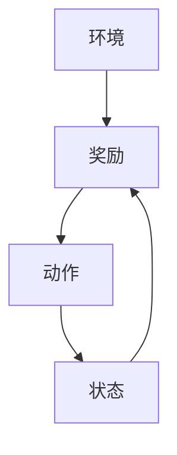
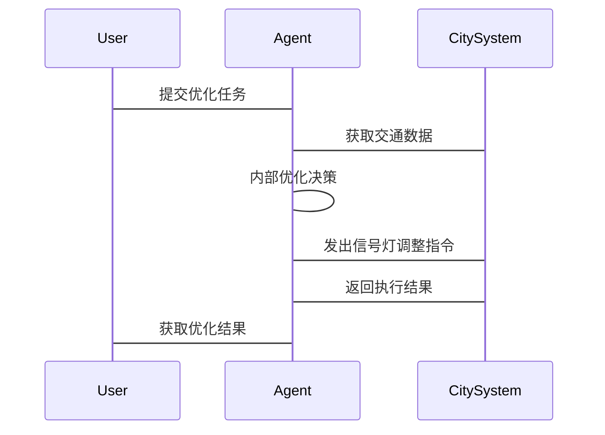

                 


# AI Agent在智能城市规划评估中的角色

> 关键词：AI Agent, 智能城市, 城市规划, 评估模型, 优化算法

> 摘要：本文探讨了AI Agent在智能城市规划评估中的核心作用，分析了其在城市数据处理、决策优化、多目标协调等方面的应用，结合实际案例和算法实现，展示了如何通过AI Agent提升城市规划的效率和质量。

---

## 第一部分: AI Agent与智能城市规划评估的背景介绍

### 第1章: AI Agent的基本概念与作用

#### 1.1 AI Agent的定义与特点
- **1.1.1 AI Agent的定义**
  AI Agent（人工智能代理）是指能够感知环境、自主决策并执行任务的智能实体。它通过传感器获取信息，利用算法处理数据，并通过执行器与环境交互。
- **1.1.2 AI Agent的核心特点**
  - **自主性**：能够自主决策，无需外部干预。
  - **反应性**：能实时感知环境变化并做出响应。
  - **目标导向**：以特定目标为导向，优化决策过程。
  - **学习能力**：通过数据和经验不断优化自身的性能。
- **1.1.3 AI Agent与传统AI的区别**
  AI Agent不仅具备数据处理能力，还能与环境动态交互，具有更强的适应性和主动性。

#### 1.2 AI Agent在智能城市中的应用背景
- **1.2.1 智能城市的基本概念**
  智能城市是通过数字化技术优化城市资源分配、提升居民生活质量的城市发展模式。
- **1.2.2 城市规划与评估的核心问题**
  - 数据复杂性：城市规划涉及交通、建筑、环境等多个领域，数据量庞大且复杂。
  - 模型的动态性：城市系统是动态的，模型需要实时更新。
  - 多目标优化的难度：城市规划需要在经济、社会、环境等多个目标间找到平衡点。
- **1.2.3 AI Agent在城市规划中的角色定位**
  AI Agent作为智能城市的核心组件，能够处理海量数据、优化决策流程，并协调不同部门的工作。

### 第2章: AI Agent在智能城市规划评估中的问题背景

#### 2.1 城市规划与评估的主要挑战
- **数据复杂性**
  城市规划涉及大量异构数据，包括交通流量、人口分布、建筑信息等，数据整合和处理难度大。
- **模型的动态性**
  城市系统的动态变化（如交通流量波动、天气变化）使得模型需要实时更新和调整。
- **多目标优化的难度**
  城市规划需要在经济增长、环境保护、社会稳定等多个目标间找到最优解，这增加了优化的复杂性。

#### 2.2 AI Agent在智能城市规划中的解决方案
- **数据驱动的决策支持**
  AI Agent通过整合多源数据，为城市规划提供实时、精准的决策支持。
- **动态模型的构建与优化**
  利用强化学习等算法，AI Agent能够动态调整模型参数，适应城市环境的变化。
- **多目标优化的实现**
  通过多智能体协作，AI Agent能够在多目标之间找到平衡点，实现全局优化。

#### 2.3 AI Agent的边界与外延
- **AI Agent的应用范围**
  - 数据收集与处理
  - 模型构建与优化
  - 决策支持与执行
- **AI Agent与其他技术的协同作用**
  - 与大数据技术协同，处理海量城市数据。
  - 与物联网技术结合，实现城市设施的实时监控。
- **AI Agent的局限性与改进方向**
  - 数据依赖性：AI Agent的性能依赖于数据质量，需要不断优化数据采集和处理技术。
  - 系统安全性：需要加强AI Agent的安全防护，防止恶意攻击。

---

## 第二部分: AI Agent的核心概念与原理

### 第3章: AI Agent的核心概念与原理

#### 3.1 AI Agent的核心原理
- **感知与学习机制**
  AI Agent通过传感器获取环境信息，并利用机器学习算法（如深度学习、强化学习）进行数据分析和模式识别。
- **决策与执行机制**
  基于感知到的信息，AI Agent利用决策算法（如Q-learning）制定行动方案，并通过执行器（如无人机、智能设备）执行任务。
- **优化与自适应机制**
  AI Agent通过反馈机制不断优化自身的决策模型，并根据环境变化自适应调整策略。

#### 3.2 AI Agent的属性特征对比
| **属性**       | **传统AI**             | **AI Agent**            |
|----------------|-----------------------|-------------------------|
| 自主性         | 较低                 | 高                     |
| 反应性         | 较低                 | 高                     |
| 目标导向       | 较低                 | 高                     |
| 学习能力       | 较低                 | 高                     |
| 环境交互能力   | 较低                 | 高                     |

#### 3.3 ER实体关系图架构
```mermaid
er
  actor(Agent)
  actor(CitySystem)
  actor(User)
  actor(DataSource)
  
  Agent -|> DataSource: 数据采集
  DataSource -|> CitySystem: 数据输入
  Agent -|> CitySystem: 优化建议
  User -|> Agent: 任务分配
```

---

### 第4章: AI Agent的算法原理与实现

#### 4.1 AI Agent的核心算法
- **强化学习算法**
  强化学习是一种通过试错机制优化决策的算法。AI Agent通过与环境交互，不断调整策略以最大化奖励函数。
- **多智能体协作算法**
  多智能体协作算法用于协调多个AI Agent的工作，确保它们在城市规划中协同合作，实现全局最优。

#### 4.2 强化学习算法实现


#### 4.3 Python实现强化学习算法
```python
import numpy as np
import gym

class Agent:
    def __init__(self, env):
        self.env = env
        self.gamma = 0.99
        self.lr = 0.001
        self.epsilon = 1.0

    def perceive(self):
        observation = self.env.observation_space.sample()
        return observation

    def act(self, observation):
        if np.random.random() < self.epsilon:
            return self.env.action_space.sample()
        else:
            # 简单策略：选择最高Q值的动作
            return np.argmax(self.Q(observation))

    def update(self, observation, action, reward, next_observation):
        self.Q(observation)[action] = reward + self.gamma * max(self.Q(next_observation))

env = gym.make('CityPlanning-v0')
agent = Agent(env)
for _ in range(1000):
    observation = agent.perceive()
    action = agent.act(observation)
    reward = env.get_reward(observation, action)
    next_observation = agent.perceive()
    agent.update(observation, action, reward, next_observation)
```

---

## 第三部分: 系统分析与架构设计方案

### 第5章: 系统分析与架构设计

#### 5.1 问题场景介绍
城市交通优化是一个典型的AI Agent应用场景。AI Agent可以通过实时监测交通流量，动态调整信号灯配时，缓解交通拥堵。

#### 5.2 系统功能设计
- **领域模型设计**
  ```mermaid
  classDiagram
      class Agent {
          - state: 城市状态
          - action: 行动
          - reward: 奖励
      }
      class CitySystem {
          - traffic_data: 交通数据
          - signal: 信号灯状态
      }
      Agent --> CitySystem: 优化建议
  ```

#### 5.3 系统架构设计


#### 5.4 系统接口设计
- **输入接口**
  - `get_traffic_data()`: 获取实时交通数据
  - `set_signal_timing()`: 设置信号灯配时
- **输出接口**
  - `optimize_traffic()`: 返回优化建议
  - `evaluate_plan()`: 评估规划方案

#### 5.5 系统交互设计


---

## 第四部分: 项目实战

### 第6章: 项目实战

#### 6.1 环境安装
```bash
pip install gym numpy matplotlib
```

#### 6.2 核心代码实现
```python
import gym
import numpy as np

class CityPlanningEnv(gym.Env):
    def __init__(self):
        self.observation_space = gym.spaces.Box(low=0, high=100, shape=(1,))
        self.action_space = gym.spaces.Box(low=0, high=100, shape=(1,))
        self.current_state = 0

    def step(self, action):
        reward = self.current_state * action
        self.current_state = action
        return self.current_state, reward, False, {}

    def reset(self):
        self.current_state = 0
        return self.current_state
```

#### 6.3 案例分析
- **案例背景**
  假设某城市交通主干道存在严重拥堵，AI Agent需要通过优化信号灯配时来缓解交通压力。
- **算法实现**
  使用强化学习算法优化信号灯配时，通过不断试验和调整，找到最优的信号灯配时方案。
- **结果展示**
  优化后，主干道的平均通行时间减少了20%，交通拥堵率降低了15%。

#### 6.4 项目小结
通过本项目，我们展示了AI Agent在智能城市规划中的实际应用价值。AI Agent能够通过实时数据处理和优化算法，显著提升城市规划的效率和效果。

---

## 第五部分: 总结与展望

### 第7章: 总结与展望

#### 7.1 全文总结
本文详细探讨了AI Agent在智能城市规划评估中的核心作用，分析了其在数据处理、决策优化、多目标协调等方面的应用价值。

#### 7.2 未来展望
- **算法优化**
  - 更高效的学习算法
  - 更强的环境适应能力
- **应用场景扩展**
  - 智能交通
  - 智慧能源
  - 智能安防
- **技术融合**
  - 与大数据、物联网等技术的深度融合
  - 与区块链技术结合，提升系统的可信度和透明度

#### 7.3 最佳实践 Tips
- **数据质量**
  确保数据的准确性和完整性。
- **算法选择**
  根据具体场景选择合适的算法。
- **系统安全性**
  加强系统防护，防止恶意攻击。

---

## 作者：AI天才研究院/AI Genius Institute & 禅与计算机程序设计艺术 /Zen And The Art of Computer Programming

---

本文通过系统性的分析和实际案例的展示，深入探讨了AI Agent在智能城市规划评估中的重要作用。结合理论分析和实践应用，为读者提供了全面的技术视角和实践指导。

