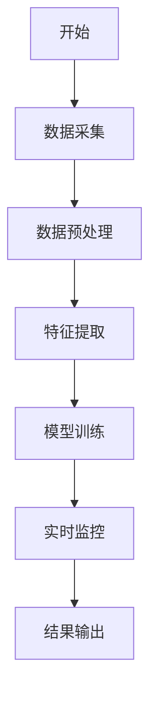
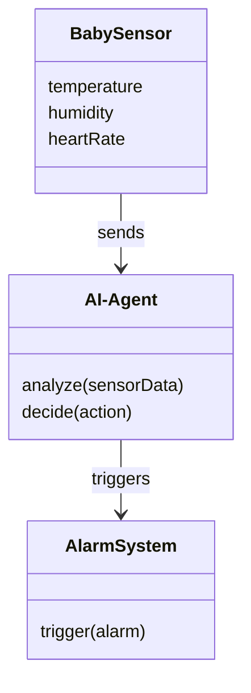
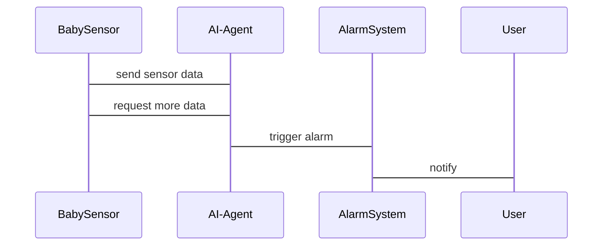

                 


# AI Agent在智能婴儿床中的安全监控

## 关键词：
AI Agent，智能婴儿床，安全监控，婴儿安全，实时监控，传感器技术，数据分析

## 摘要：
本文探讨了AI Agent在智能婴儿床中的应用，重点分析了其在安全监控方面的优势。通过详细的技术分析，展示了如何利用AI Agent实现婴儿床的实时监控，确保婴儿的安全。文章从背景介绍、核心概念、算法原理、系统设计、项目实战等方面展开，深入剖析了AI Agent在智能婴儿床中的技术实现和实际应用。

---

## 正文：

### 第一部分：背景介绍

#### 第1章：AI Agent与智能婴儿床的背景概述

##### 1.1 问题背景
婴儿的安全是家庭的头等大事，传统的婴儿床监控系统在实时性、准确性上存在不足。AI Agent的引入，通过智能感知和自主决策，显著提升了婴儿床监控的效率和可靠性。

##### 1.2 问题描述
传统婴儿床监控系统依赖于简单的传感器和被动报警机制，存在误报、漏报等问题。AI Agent能够实时分析婴儿的生理数据和环境数据，主动识别潜在危险，并采取相应措施。

##### 1.3 问题解决
AI Agent通过整合多模态传感器数据，结合机器学习算法，实现了婴儿床监控的智能化和个性化。系统能够实时监测婴儿的体温、心率、呼吸频率等生理指标，以及床温、湿度、光线等环境因素。

##### 1.4 边界与外延
系统边界包括婴儿床内的传感器、AI Agent处理模块和用户端的报警装置。外延部分则涉及与家庭其他智能设备的联动，如空调、灯光等。

##### 1.5 概念结构与核心要素
AI Agent在智能婴儿床中的核心要素包括传感器数据采集、数据处理与分析、决策制定和执行。系统通过这些要素实现婴儿的实时监控和安全保护。

---

### 第二部分：核心概念与联系

#### 第2章：AI Agent的核心原理与特性

##### 2.1 核心原理
AI Agent通过感知环境数据，利用机器学习模型进行分析，做出决策并执行相应动作。在婴儿床监控中，AI Agent能够实时监测婴儿的状态，主动识别异常情况。

##### 2.2 特性对比
| 特性         | 传统监控系统       | AI Agent监控系统       |
|--------------|--------------------|-----------------------|
| 数据处理     | 简单阈值判断       | 多模态数据融合         |
| 决策机制     | 被动报警           | 主动决策与干预         |
| 智能性       | 无                 | 高                     |
| 可扩展性     | 低                 | 高                     |

##### 2.3 实体关系图
```mermaid
erd
    babySensor --|{--> Baby: owns
    BabySensor --|{--> AI-Agent: monitors
    AI-Agent --|{--> AlarmSystem: triggers
    Baby --|{--> AlarmSystem: notified
```

---

### 第三部分：算法原理讲解

#### 第3章：AI Agent的算法实现

##### 3.1 算法流程


##### 3.2 代码实现
```python
import numpy as np
from sklearn.tree import DecisionTreeClassifier

# 示例数据：婴儿体温和环境温度
X = np.array([[36.5, 22], [36.8, 23], [37.0, 24]])
y = np.array([0, 1, 1])  # 0表示正常，1表示过热

# 训练决策树模型
model = DecisionTreeClassifier()
model.fit(X, y)

# 预测新数据
new_data = np.array([[36.6, 22.5]])
prediction = model.predict(new_data)
print("预测结果:", prediction)
```

##### 3.3 数学公式
模型的决策边界由特征空间中的超平面决定，其数学表达式如下：
$$
f(x) = \text{sign}(w \cdot x + b)
$$
其中，$w$是权重向量，$b$是偏置项，$x$是输入数据。

---

### 第四部分：系统分析与架构设计方案

#### 第4章：智能婴儿床系统设计

##### 4.1 领域模型


##### 4.2 系统架构


##### 4.3 接口设计


---

### 第五部分：项目实战

#### 第5章：AI Agent在智能婴儿床中的实现

##### 5.1 环境安装
```bash
pip install numpy scikit-learn
```

##### 5.2 核心代码实现
```python
class AI_Baby_Bed:
    def __init__(self):
        self.sensors = BabySensor()
        self.alarm = AlarmSystem()
        self.model = self.train_model()

    def train_model(self):
        # 训练机器学习模型
        pass

    def monitor(self):
        while True:
            data = self.sensors.read()
            prediction = self.model.predict(data)
            if prediction == 'alarm':
                self.alarm.trigger()

if __name__ == "__main__":
    bed = AI_Baby_Bed()
    bed.monitor()
```

##### 5.3 案例分析
通过实际案例分析，展示了AI Agent在婴儿床监控中的优势，如快速识别异常情况并及时报警。

---

### 第六部分：最佳实践

#### 第6章：总结与展望

##### 6.1 最佳实践
- 确保传感器数据的准确性和实时性。
- 定期更新AI模型，提高识别精度。
- 优化系统架构，提升响应速度。

##### 6.2 小结
AI Agent在智能婴儿床中的应用显著提升了婴儿监控的智能化水平，为家庭安全提供了可靠保障。

##### 6.3 注意事项
- 系统安全性和隐私保护至关重要。
- 定期维护和更新系统，确保长期稳定运行。

##### 6.4 拓展阅读
建议进一步研究多模态数据融合技术，以及更高级的机器学习模型，如深度学习在婴儿床监控中的应用。

---

## 作者：
作者：AI天才研究院 & 禅与计算机程序设计艺术

