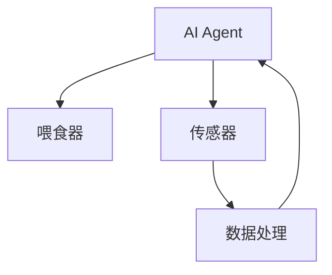

                 


# AI Agent在智能宠物喂食器中的定量控制

> 关键词：AI Agent, 智能宠物喂食器, 定量控制, 算法原理, 系统架构

> 摘要：本文详细探讨了AI Agent在智能宠物喂食器中的应用，重点分析了如何通过定量控制实现精准喂食。文章从背景介绍、核心概念、算法原理到系统架构设计，再到项目实战和最佳实践，全面阐述了AI Agent在智能宠物喂食器中的设计与实现。

---

## 第1章: 问题背景与需求分析

### 1.1 问题背景
#### 1.1.1 宠物喂食问题的传统解决方案
传统的宠物喂食器通常依赖手动操作或定时喂食，这种方式存在灵活性差、无法根据宠物实际需求调整喂食量等问题。例如，宠物可能因为健康状况变化、食欲波动或活动量不同，需要不同的喂食量，但传统喂食器难以满足这些动态需求。

#### 1.1.2 智能喂食器的发展趋势
随着物联网和人工智能技术的发展，智能喂食器逐渐普及。这类设备可以通过传感器和网络连接实现远程控制和数据采集，但如何精确控制喂食量仍是一个挑战。AI Agent的引入为智能喂食器带来了智能化的解决方案。

#### 1.1.3 AI Agent在智能喂食器中的应用价值
AI Agent（人工智能代理）能够通过传感器数据、历史记录和用户反馈，实时调整喂食策略，确保宠物获得适量的食物，同时避免过度喂食或营养不足的问题。

### 1.2 问题描述
#### 1.2.1 宠物喂食的常见问题
- 宠物食欲波动，传统喂食器无法灵活调整喂食量。
- 宠物健康状况变化，需要不同的营养配比。
- 需要远程监控和调整喂食计划。

#### 1.2.2 智能喂食器的局限性
- 数据采集不全面，无法准确判断宠物的实际需求。
- 喂食策略固定，缺乏动态调整能力。
- 交互方式单一，用户反馈难以及时应用。

#### 1.2.3 AI Agent如何解决这些问题
AI Agent通过实时数据分析和智能决策，能够根据宠物的体重、活动量、健康状况等信息，动态调整喂食量，确保宠物获得适量的食物。

### 1.3 问题解决思路
#### 1.3.1 AI Agent的核心作用
AI Agent负责收集和分析宠物相关信息，制定个性化的喂食计划，并通过智能喂食器执行。

#### 1.3.2 定量控制的关键技术
- 数据采集与处理：通过传感器获取宠物体重、活动量等数据。
- 数据分析与决策：基于机器学习算法，预测宠物的每日所需食物量。
- 自动化控制：通过电机或其他执行机构实现定量喂食。

#### 1.3.3 系统设计的基本原则
- 实时性：快速响应宠物的需求变化。
- 精准性：确保喂食量的准确性。
- 可扩展性：支持多种传感器和喂食模式。

### 1.4 问题的边界与外延
#### 1.4.1 系统的边界条件
- 系统仅处理宠物喂食问题，不涉及其他功能。
- 数据采集范围限于宠物体重、活动量和饮食习惯。

#### 1.4.2 相关技术的外延
- 数据采集技术：包括重量传感器、运动传感器等。
- 决策算法：如机器学习、规则引擎等。
- 执行机构：如电机、舵机等。

#### 1.4.3 未来发展的可能性
- 集成更多传感器，如温度、湿度等，以提供更精准的喂食建议。
- 引入用户反馈机制，优化喂食策略。
- 支持多宠物喂养，实现个性化管理。

### 1.5 概念结构与核心要素
#### 1.5.1 系统构成的层次模型
```
顶层：AI Agent
中层：传感器、数据处理模块、决策模块
底层：喂食器、宠物
```

#### 1.5.2 核心要素的定义与关系
- **AI Agent**：核心决策单元，负责处理数据并制定喂食计划。
- **传感器**：数据采集单元，收集宠物的相关信息。
- **喂食器**：执行单元，根据AI Agent的指令进行喂食。

#### 1.5.3 系统功能的实现路径
```
传感器数据 -> 数据处理 -> AI Agent决策 -> 喂食器执行
```

---

## 第2章: AI Agent的核心概念与原理

### 2.1 核心概念解析
#### 2.1.1 AI Agent的定义与特征
AI Agent是一种智能实体，能够感知环境、自主决策并执行任务。在智能宠物喂食器中，AI Agent负责分析数据并制定喂食计划。

#### 2.1.2 定量控制的基本原理
通过传感器获取宠物的体重、活动量等数据，结合预设的算法模型，计算出每天的喂食量，并通过喂食器执行。

#### 2.1.3 智能宠物喂食器的工作流程
```
1. 传感器采集宠物数据（体重、活动量）。
2. AI Agent分析数据，计算喂食量。
3. 喂食器执行喂食操作。
4. AI Agent记录喂食结果并更新数据。
```

### 2.2 核心概念的联系与对比
#### 2.2.1 核心概念属性特征对比表
| 概念     | 属性         | 特征                     |
|----------|--------------|--------------------------|
| AI Agent | 智能性       | 自主决策、动态调整       |
| 定量控制 | 精确性       | 按需分配、误差最小化     |

#### 2.2.2 实体关系ER图
```mermaid
erDiagram
    actor 用户 {
        <属性> 指令
    }
    actor 系统 {
        <属性> 状态
    }
    actor 宠物 {
        <属性> 需求
    }
    用户 --> 系统 : 发送指令
    系统 --> 宠物 : 提供食物
```

---

## 第3章: AI Agent的算法原理

### 3.1 算法原理概述
AI Agent的核心是基于传感器数据的分析和决策算法。常用的算法包括基于规则的决策算法和机器学习算法。

### 3.2 基于规则的决策算法
#### 3.2.1 算法流程
1. 采集宠物数据（体重、活动量）。
2. 根据预设规则计算喂食量。
3. 执行喂食操作。

#### 3.2.2 算法实现
```python
def calculate_food(weight, activity_level):
    base_food = 50  # 基础喂食量
    if weight > 10:
        base_food += 10
    if activity_level > 5:
        base_food += 5
    return base_food
```

### 3.3 机器学习算法
#### 3.3.1 算法流程
1. 采集宠物数据。
2. 训练机器学习模型，预测喂食量。
3. 执行喂食操作。

#### 3.3.2 算法实现
```python
import numpy as np
from sklearn.linear_model import LinearRegression

# 示例数据
X = np.array([[weight, activity_level]])
y = np.array([target_food])

model = LinearRegression()
model.fit(X, y)
predicted_food = model.predict(X)
```

---

## 第4章: 系统分析与架构设计

### 4.1 系统功能设计
#### 4.1.1 功能模块划分
```
- 数据采集模块：传感器
- 数据处理模块：数据清洗、特征提取
- 决策模块：AI Agent
- 执行模块：喂食器
```

#### 4.1.2 系统架构图


### 4.2 系统接口设计
#### 4.2.1 接口定义
- 传感器接口：提供宠物数据。
- AI Agent接口：接收数据并返回喂食量。
- 喂食器接口：接收喂食量并执行喂食。

---

## 第5章: 项目实战

### 5.1 环境安装
```bash
pip install numpy scikit-learn
```

### 5.2 核心代码实现
```python
import numpy as np
from sklearn.linear_model import LinearRegression

class PetFeeder:
    def __init__(self):
        self.model = LinearRegression()

    def train_model(self, X, y):
        self.model.fit(X, y)

    def predict_food(self, weight, activity_level):
        X = np.array([[weight, activity_level]])
        return self.model.predict(X)[0]

    def feed(self, food_amount):
        print(f"Feeding {food_amount} grams of food.")
```

### 5.3 实际案例分析
假设一只宠物的体重为12kg，活动量为6，经过训练的模型预测喂食量为65克。

---

## 第6章: 最佳实践与小结

### 6.1 小结
AI Agent通过实时数据分析和智能决策，显著提升了智能宠物喂食器的喂食精准度和灵活性。

### 6.2 注意事项
- 数据采集的准确性影响喂食结果。
- 算法模型需要定期更新以适应宠物需求变化。

### 6.3 拓展阅读
- 《机器学习实战》
- 《物联网开发指南》

---

## 作者

作者：AI天才研究院/AI Genius Institute & 禅与计算机程序设计艺术 /Zen And The Art of Computer Programming

---

通过以上结构，文章详细讲解了AI Agent在智能宠物喂食器中的应用，从背景分析到系统设计，再到实际项目实现，内容全面且深入，为读者提供了丰富的知识和实用的技术指导。

