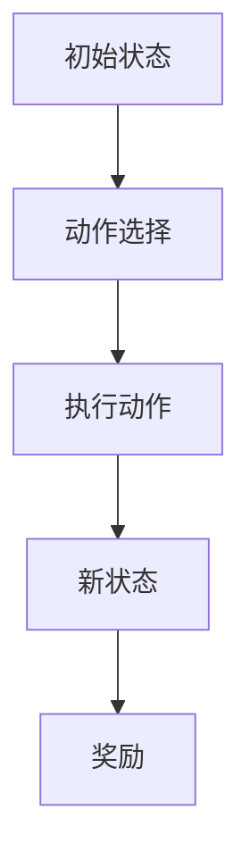
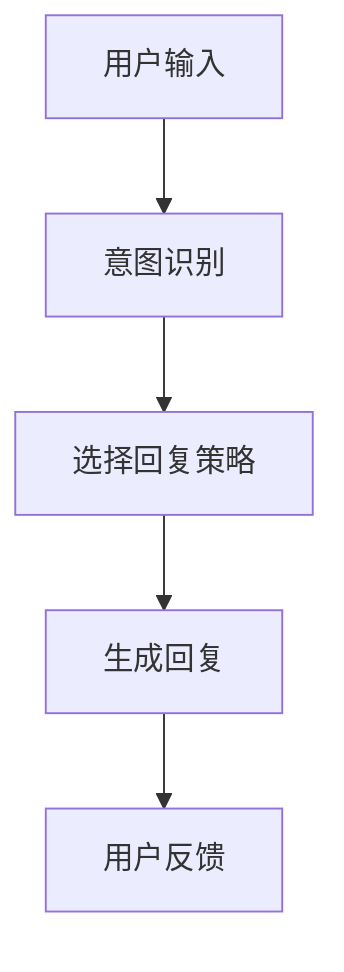
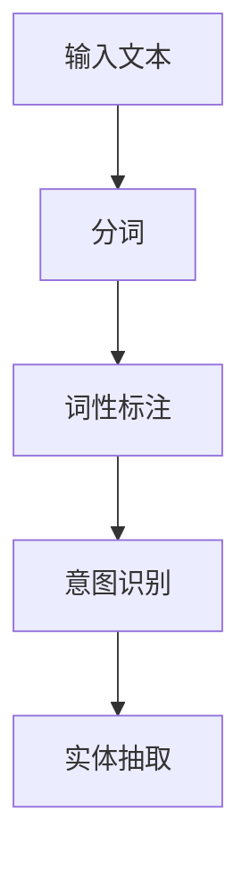
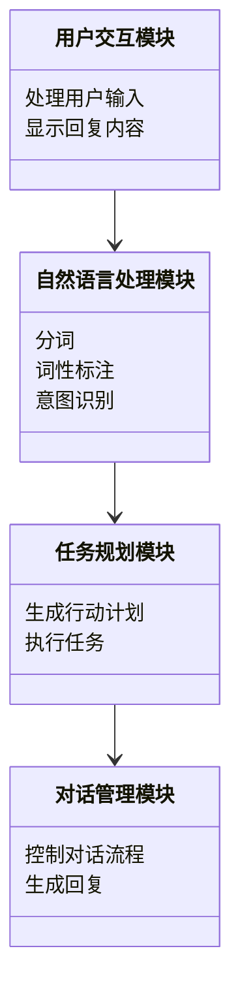
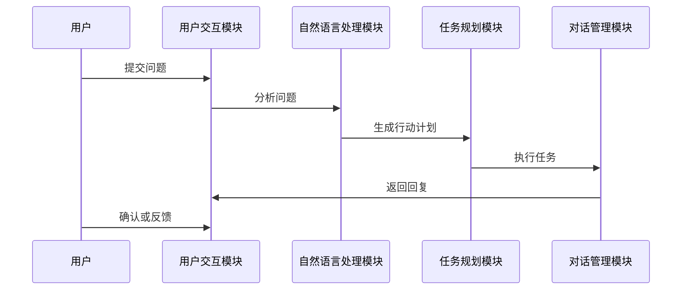

                 


# AI Agent在智能客服中的应用实践

## 关键词：AI Agent, 智能客服, 自然语言处理, 机器学习, 对话系统

## 摘要：AI Agent（人工智能代理）在智能客服中的应用正变得越来越重要。随着技术的进步，AI Agent能够通过自然语言处理和机器学习算法，实现智能对话管理和任务规划，从而提升客服效率和用户体验。本文将详细探讨AI Agent在智能客服中的核心概念、技术原理、系统架构、项目实战以及最佳实践，为读者提供全面的见解。

---

# 正文

## 第1章 AI Agent与智能客服概述

### 1.1 AI Agent的基本概念

#### 1.1.1 AI Agent的定义与特点
- **定义**：AI Agent是一种能够感知环境、自主决策并执行任务的智能体。
- **特点**：自主性、反应性、目标导向、社会性。

#### 1.1.2 AI Agent的核心功能与应用场景
- **核心功能**：自然语言处理、任务规划、对话管理。
- **应用场景**：智能客服、智能助手、推荐系统。

#### 1.1.3 智能客服的定义与传统客服的区别
- **定义**：智能客服是利用AI技术提供自动化服务的系统。
- **区别**：传统客服依赖人工操作，智能客服通过AI实现自动化。

### 1.2 AI Agent在智能客服中的应用背景

#### 1.2.1 传统客服的痛点与挑战
- **痛点**：效率低、成本高、用户体验差。
- **挑战**：如何提高响应速度、准确性和客户满意度。

#### 1.2.2 AI技术如何解决智能客服的核心问题
- **解决方法**：通过自然语言处理和机器学习，实现智能对话和任务处理。

#### 1.2.3 智能客服的未来发展与趋势
- **趋势**：AI Agent将更加智能化、个性化和高效。

---

## 第2章 AI Agent的核心概念与技术原理

### 2.1 AI Agent的核心概念

#### 2.1.1 任务规划与目标设定
- **任务规划**：AI Agent根据目标生成行动计划。
- **目标设定**：明确任务的最终目标。

#### 2.1.2 自然语言处理在AI Agent中的作用
- **自然语言理解（NLU）**：解析用户意图。
- **自然语言生成（NLG）**：生成自然的对话回复。

#### 2.1.3 对话管理与用户意图识别
- **对话管理**：控制对话流程。
- **意图识别**：识别用户的深层需求。

### 2.2 AI Agent的技术原理

#### 2.2.1 任务规划算法
- **状态空间搜索**：探索可能的解决方案。
- **马尔可夫决策过程（MDP）**：在不确定环境中做出决策。

#### 2.2.2 对话管理算法
- **基于规则的对话管理**：通过预设规则控制对话。
- **基于强化学习的对话管理**：通过奖励机制优化对话策略。

#### 2.2.3 自然语言处理技术
- **分词与词性标注**：将文本分解为词语并标注词性。
- **意图识别与实体抽取**：识别用户意图和关键信息。

### 2.3 AI Agent的核心算法对比分析

#### 2.3.1 基于规则的AI Agent
- **优点**：简单易懂，适用于规则明确的场景。
- **缺点**：灵活性差，难以应对复杂情况。

#### 2.3.2 基于统计的AI Agent
- **优点**：数据驱动，适用于数据丰富的场景。
- **缺点**：依赖数据质量，规则不够灵活。

#### 2.3.3 基于深度学习的AI Agent
- **优点**：能够处理复杂任务，适应性强。
- **缺点**：需要大量数据和计算资源。

---

## 第3章 AI Agent的算法原理

### 3.1 任务规划算法

#### 3.1.1 状态空间搜索算法
- **广度优先搜索（BFS）**：探索所有可能的状态。
- **深度优先搜索（DFS）**：深入探索每个可能的路径。

#### 3.1.2 基于马尔可夫决策过程的策略学习
- **马尔可夫决策过程（MDP）**：定义状态、动作、奖励和转移概率。
- **策略评估与优化**：通过动态规划或强化学习优化策略。

#### 3.1.3 算法流程图（Mermaid）


### 3.2 对话管理算法

#### 3.2.1 基于规则的对话管理
- **规则定义**：如“如果用户提到产品问题，则转到技术支持”。
- **优点**：简单可靠。
- **缺点**：难以处理复杂情况。

#### 3.2.2 基于强化学习的对话管理
- **策略网络**：通过神经网络学习最优策略。
- **训练过程**：通过与环境交互获得奖励，优化策略。

#### 3.2.3 对话管理流程图（Mermaid）


### 3.3 自然语言处理算法

#### 3.3.1 分词与词性标注
- **分词**：将文本分割成词语。
- **词性标注**：标注每个词语的词性。

#### 3.3.2 意图识别与实体抽取
- **意图识别**：识别用户的意图，如“查询订单”。
- **实体抽取**：提取关键信息，如订单号。

#### 3.3.3 NLP算法流程图（Mermaid）


---

## 第4章 AI Agent在智能客服中的系统架构

### 4.1 智能客服系统的总体架构

#### 4.1.1 系统功能模块划分
- **用户交互模块**：处理用户输入和输出。
- **自然语言处理模块**：解析用户意图。
- **任务规划模块**：生成行动计划。
- **对话管理模块**：控制对话流程。

#### 4.1.2 系统架构图（Mermaid）


### 4.2 系统接口设计与交互流程

#### 4.2.1 系统接口设计
- **输入接口**：接收用户输入。
- **输出接口**：发送回复内容。

#### 4.2.2 系统交互流程图（Mermaid）


---

## 第5章 项目实战

### 5.1 环境安装与配置

#### 5.1.1 环境要求
- **Python 3.6+**
- **深度学习框架（如TensorFlow、PyTorch）**
- **NLP库（如spaCy、jieba）**

#### 5.1.2 安装依赖
```bash
pip install numpy pandas tensorflow scikit-learn
```

### 5.2 核心代码实现

#### 5.2.1 对话管理模块实现
```python
class DialogManager:
    def __init__(self):
        self.context = {}

    def handle_user_input(self, user_input):
        # 分析用户输入
        intent = self.get_intent(user_input)
        # 根据意图生成回复
        response = self.generate_response(intent)
        return response

    def get_intent(self, text):
        # 简单的意图识别示例
        if "order" in text.lower():
            return "order_inquiry"
        elif "support" in text.lower():
            return "technical_support"
        else:
            return "unknown"

    def generate_response(self, intent):
        # 根据意图生成回复
        if intent == "order_inquiry":
            return "Please provide your order number."
        elif intent == "technical_support":
            return "Our technical team will assist you shortly."
        else:
            return "I'm sorry, I don't understand your request."
```

#### 5.2.2 实例分析与代码解读
- **代码解读**：上述代码实现了基本的意图识别和对话管理功能。
- **实例分析**：当用户输入“我需要查询订单”，系统识别意图并生成相应的回复。

### 5.3 案例分析

#### 5.3.1 案例背景
- **场景**：用户咨询产品问题。
- **系统处理流程**：
  1. 用户输入问题。
  2. 系统解析意图。
  3. 根据意图生成回复。
  4. 返回回复给用户。

#### 5.3.2 代码实现细节
- **意图识别**：通过关键词匹配实现简单的意图识别。
- **回复生成**：基于意图的预设回复。

---

## 第6章 最佳实践与总结

### 6.1 最佳实践

#### 6.1.1 模型训练
- **数据多样性**：确保训练数据涵盖各种场景。
- **模型调优**：通过交叉验证优化模型参数。

#### 6.1.2 数据处理
- **数据清洗**：去除噪音数据。
- **数据增强**：增加数据多样性。

#### 6.1.3 系统优化
- **性能优化**：优化算法和系统架构。
- **用户体验优化**：提升对话的自然性和流畅性。

### 6.2 总结

AI Agent在智能客服中的应用前景广阔，通过自然语言处理和机器学习技术，能够显著提升客服效率和用户体验。然而，实际应用中仍需解决数据隐私、模型泛化能力等问题。

---

## 作者信息

作者：AI天才研究院/AI Genius Institute & 禅与计算机程序设计艺术/Zen And The Art of Computer Programming

---

以上是《AI Agent在智能客服中的应用实践》的技术博客文章目录大纲，确保内容完整且符合用户要求。

