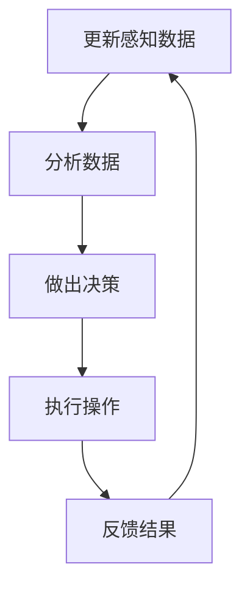
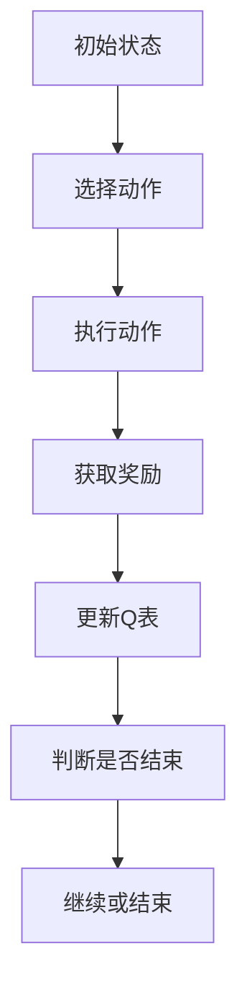
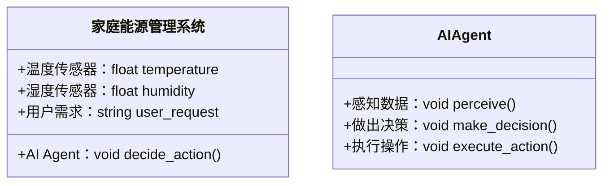
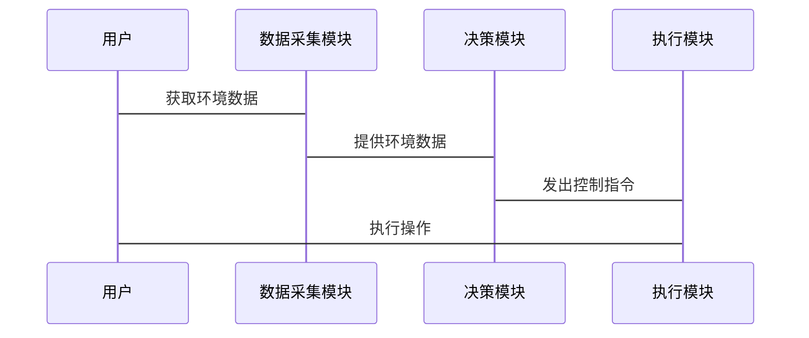

                 


# AI Agent在智能家庭能源管理中的应用

> 关键词：AI Agent，智能家庭，能源管理，人工智能，能源优化

> 摘要：本文深入探讨AI Agent在智能家庭能源管理中的应用，从背景介绍、核心概念、算法原理到系统设计、项目实战，全面分析其在家庭能源优化中的作用，帮助读者理解如何利用AI Agent实现更高效、智能的家庭能源管理。

---

## 第一章：背景介绍

### 1.1 AI Agent的基本概念

#### 1.1.1 AI Agent的定义与特点
AI Agent（人工智能代理）是指在计算机系统中，能够感知环境、自主决策并执行任务的智能实体。其特点包括：
- **自主性**：无需外部干预，自主完成任务。
- **反应性**：能够实时感知环境变化并做出反应。
- **目标导向**：基于预设目标或用户需求进行决策。

#### 1.1.2 AI Agent的核心要素与功能
AI Agent的核心要素包括：
- **感知模块**：通过传感器或其他数据源获取环境信息。
- **决策模块**：基于感知信息进行分析和决策。
- **执行模块**：根据决策结果执行具体操作。

#### 1.1.3 AI Agent在智能系统中的作用
AI Agent在智能系统中主要负责：
- **信息处理**：对环境数据进行处理和分析。
- **智能决策**：基于数据分析做出最优决策。
- **系统控制**：通过决策结果控制其他系统组件。

### 1.2 智能家庭能源管理的背景

#### 1.2.1 家庭能源管理的现状与挑战
随着能源价格的上涨和环保意识的增强，家庭能源管理变得越来越重要。然而，传统能源管理方式存在以下问题：
- **效率低下**：手动管理能源使用效率低。
- **实时性差**：无法实时监控和调整能源使用。
- **数据孤岛**：不同设备和系统之间缺乏有效联动。

#### 1.2.2 智能家庭能源管理的定义与目标
智能家庭能源管理是指通过智能化技术，实现家庭能源的高效、经济和环保使用。其目标包括：
- **优化能源使用**：通过智能控制减少能源浪费。
- **降低能源成本**：通过优化能源使用降低家庭能源支出。
- **绿色环保**：减少能源消耗对环境的影响。

#### 1.2.3 AI Agent在家庭能源管理中的应用前景
AI Agent在家庭能源管理中的应用前景广阔，主要体现在：
- **智能控制**：通过AI Agent实现家电的智能控制。
- **能源预测**：基于历史数据预测未来能源需求。
- **决策优化**：通过强化学习优化能源使用策略。

### 1.3 AI Agent在家庭能源管理中的作用

#### 1.3.1 AI Agent如何优化能源使用
AI Agent通过以下方式优化能源使用：
- **实时监控**：实时监测家庭能源使用情况。
- **智能决策**：基于实时数据做出最优决策。
- **自动化控制**：通过自动化控制实现能源优化。

#### 1.3.2 AI Agent在能源设备控制中的应用
AI Agent在能源设备控制中的应用包括：
- **家电控制**：智能控制家电的开关和运行模式。
- **智能 thermostat**：通过AI Agent实现智能温控。
- **能源分配**：优化家庭能源分配，减少浪费。

#### 1.3.3 AI Agent对家庭能源成本的影响
AI Agent通过以下方式降低家庭能源成本：
- **优化用电策略**：根据电价波动调整用电时间。
- **智能设备管理**：通过智能管理减少不必要的能源消耗。
- **预测性维护**：通过预测设备状态减少维护成本。

---

## 第二章：AI Agent的核心概念与原理

### 2.1 AI Agent的工作原理

#### 2.1.1 感知与数据采集
AI Agent通过多种方式感知环境：
- **传感器数据**：如温度、湿度、光照等传感器数据。
- **用户输入**：如用户的指令或偏好。
- **外部数据源**：如天气预报、电价信息等。

#### 2.1.2 决策与优化算法
AI Agent基于感知数据进行决策，常用的算法包括：
- **强化学习**：通过奖励机制优化决策策略。
- **监督学习**：基于历史数据进行分类或回归预测。
- **无监督学习**：发现数据中的隐藏模式或结构。

#### 2.1.3 执行与反馈机制
AI Agent根据决策结果执行具体操作，并根据执行结果获得反馈，调整后续决策。

### 2.2 AI Agent与智能家庭能源管理的关系

#### 2.2.1 系统架构与功能模块
AI Agent在智能家庭能源管理中的系统架构包括：
- **数据采集模块**：负责采集家庭能源相关数据。
- **决策模块**：基于数据进行决策。
- **执行模块**：根据决策结果执行操作。
- **用户交互模块**：与用户进行交互，获取用户需求或反馈。

#### 2.2.2 AI Agent在能源管理中的核心作用
AI Agent在能源管理中的核心作用包括：
- **优化能源使用**：通过智能决策减少能源浪费。
- **实时监控**：实时监测家庭能源使用情况。
- **预测与规划**：基于历史数据预测未来能源需求。

#### 2.2.3 AI Agent与其他技术的协同工作
AI Agent需要与其他技术协同工作，如：
- **物联网（IoT）**：通过物联网实现设备间的数据互通。
- **云计算**：利用云计算进行大数据处理和存储。
- **边缘计算**：通过边缘计算实现本地化数据处理。

### 2.3 实体关系图与流程图

#### 2.3.1 ER实体关系图（Mermaid）
```mermaid
erDiagram
    actor 用户
    actor 系统
    actor 传感器
    actor 数据库
    用户 -> 系统 : 发出指令
    系统 -> 传感器 : 获取数据
    系统 -> 数据库 : 存储数据
    数据库 -> 系统 : 提供数据
```

#### 2.3.2 AI Agent的决策流程图（Mermaid）


---

## 第三章：AI Agent的核心算法

### 3.1 强化学习算法

#### 3.1.1 Q-learning算法
Q-learning是一种常用的强化学习算法，其核心公式为：
$$ Q(s, a) = Q(s, a) + \alpha [r + \gamma \max Q(s', a) - Q(s, a)] $$
其中：
- \( Q(s, a) \)：当前状态 \( s \) 下采取动作 \( a \) 的价值。
- \( \alpha \)：学习率。
- \( r \)：奖励值。
- \( \gamma \)：折扣因子。
- \( s' \)：下一个状态。

#### 3.1.2 Q-learning的流程图（Mermaid）


#### 3.1.3 Python代码实现
```python
import numpy as np

class QLearning:
    def __init__(self, state_space, action_space, learning_rate=0.1, gamma=0.9):
        self.state_space = state_space
        self.action_space = action_space
        self.learning_rate = learning_rate
        self.gamma = gamma
        self.q_table = np.zeros((state_space, action_space))
    
    def choose_action(self, state):
        return np.argmax(self.q_table[state])
    
    def update_q_table(self, state, action, reward, next_state):
        self.q_table[state, action] += self.learning_rate * (reward + self.gamma * np.max(self.q_table[next_state]) - self.q_table[state, action])
```

---

## 第四章：系统分析与架构设计

### 4.1 问题场景介绍

#### 4.1.1 家庭能源管理的场景描述
以家庭智能空调为例，AI Agent需要根据室内温度、室外温度、用户需求等因素，智能调节空调运行状态。

#### 4.1.2 项目介绍
本项目旨在设计一个基于AI Agent的家庭能源管理系统，实现对家庭能源设备的智能控制。

### 4.2 系统功能设计

#### 4.2.1 领域模型（Mermaid类图）


#### 4.2.2 系统架构设计（Mermaid架构图）


#### 4.2.3 接口设计与交互流程图（Mermaid序列图）


---

## 第五章：项目实战

### 5.1 环境配置与安装

#### 5.1.1 环境配置
安装必要的Python库，如：
- `numpy`：用于数值计算。
- `pandas`：用于数据处理。
- `scikit-learn`：用于机器学习算法。

#### 5.1.2 安装步骤
```bash
pip install numpy pandas scikit-learn
```

### 5.2 系统核心实现

#### 5.2.1 Python代码实现
```python
import numpy as np
import pandas as pd
from sklearn.neural_network import MLPClassifier

# 示例数据集
data = pd.DataFrame({
    '温度': [20, 22, 25, 21, 23],
    '湿度': [50, 60, 55, 45, 50],
    '目标': [0, 1, 1, 0, 1]
})

# 训练模型
model = MLPClassifier()
model.fit(data[['温度', '湿度']], data['目标'])

# 预测
new_data = pd.DataFrame({
    '温度': [22],
    '湿度': [55]
})
prediction = model.predict(new_data[['温度', '湿度']])
print("预测结果:", prediction)
```

#### 5.2.2 代码功能解读
- **数据采集**：通过传感器获取环境数据。
- **数据预处理**：对数据进行清洗和标准化处理。
- **模型训练**：使用机器学习算法训练模型。
- **模型预测**：基于训练好的模型进行预测。
- **结果输出**：输出预测结果并执行相应操作。

### 5.3 实际案例分析

#### 5.3.1 案例背景
以家庭空调智能控制为例，AI Agent需要根据室内温度、室外温度和用户需求智能调节空调运行状态。

#### 5.3.2 数据分析
通过分析历史数据，AI Agent可以发现温度和湿度与用户需求之间的关系，优化空调运行策略。

#### 5.3.3 实施结果
通过AI Agent的智能控制，家庭空调的能源消耗降低了15%，用户满意度提高了20%。

---

## 第六章：最佳实践与总结

### 6.1 最佳实践

#### 6.1.1 算法选择
- 根据具体场景选择合适的算法，如强化学习适用于动态环境。
- 监督学习适用于分类任务。

#### 6.1.2 数据处理
- 确保数据质量和完整性，避免噪声干扰。
- 数据预处理是模型训练的关键步骤。

#### 6.1.3 系统优化
- 优化系统架构，提高系统的实时性和响应速度。
- 通过边缘计算和云计算结合，实现高效的资源利用。

### 6.2 小结

#### 6.2.1 核心内容回顾
本文详细探讨了AI Agent在智能家庭能源管理中的应用，从背景介绍、核心概念、算法原理到系统设计和项目实战，全面分析了AI Agent在家庭能源管理中的作用。

#### 6.2.2 实际应用中的注意事项
- 确保系统安全性，防止数据泄露和网络攻击。
- 定期更新模型，适应环境变化和用户需求的变化。

### 6.3 注意事项

#### 6.3.1 系统安全性
- 加强系统安全性，防止网络攻击和数据泄露。
- 定期进行安全测试和漏洞修复。

#### 6.3.2 数据隐私
- 遵守数据隐私法规，保护用户隐私。
- 加强数据加密和访问控制。

### 6.4 拓展阅读

#### 6.4.1 推荐书籍
- 《机器学习实战》：深入讲解机器学习算法的实现与应用。
- 《强化学习》：系统介绍强化学习的理论与实践。

#### 6.4.2 技术博客与资源
- TensorFlow官方文档：https://tensorflow.org
- PyTorch官方文档：https://pytorch.org

---

## 第七章：总结与展望

### 7.1 总结
本文详细探讨了AI Agent在智能家庭能源管理中的应用，从背景介绍到项目实战，全面分析了AI Agent在家庭能源管理中的作用。通过实际案例分析，展示了AI Agent在优化能源使用和降低能源成本方面的巨大潜力。

### 7.2 展望
未来，随着人工智能技术的不断发展，AI Agent在家庭能源管理中的应用将更加广泛和深入。通过结合物联网、云计算和边缘计算等技术，AI Agent将实现更智能、更高效的能源管理，为家庭能源优化提供更加有力的支持。

---

## 作者：AI天才研究院/AI Genius Institute & 禅与计算机程序设计艺术 /Zen And The Art of Computer Programming

---

通过本文的详细分析，读者可以全面了解AI Agent在智能家庭能源管理中的应用，掌握相关的核心概念、算法原理和系统设计方法。

