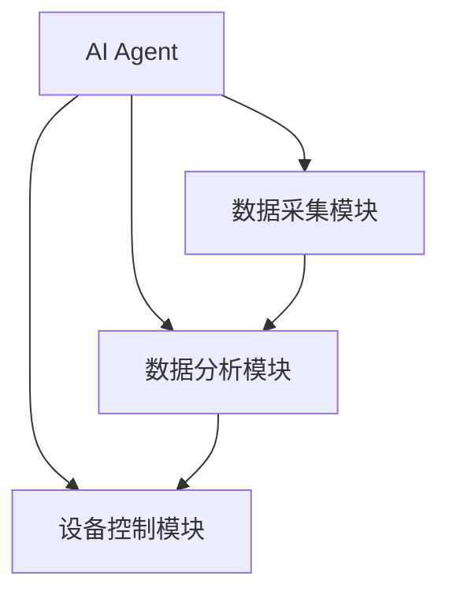

                 


# AI Agent在智能工作站中的人体工程学调整

> 关键词：AI Agent, 人体工程学, 智能工作站, 算法原理, 系统架构, 项目实战

> 摘要：  
> 在现代智能工作站中，人体工程学的优化对于提高工作效率和舒适性至关重要。本文详细探讨了AI Agent在智能工作站中的人体工程学调整应用，从核心概念、算法原理到系统架构设计，再到实际项目案例，全面解析了AI Agent如何通过感知、决策和执行机制，实现工作站环境的智能优化。文章还提供了具体的代码实现和系统架构图，帮助读者理解并应用相关技术。

---

## 第一部分: AI Agent与人体工程学的背景与基础

### 第1章: 人体工程学与智能工作站概述

#### 1.1 人体工程学的基本概念
人体工程学是一门研究人类与工作环境之间关系的科学，旨在通过优化工作环境和工具，减少疲劳和受伤的风险，提高工作效率。其核心原则包括：
- **人体测量学**：研究人体尺寸和能力，用于设计适合不同人群的工作设备。
- **工作力学**：分析工作中的力量和运动，优化工具和任务设计。
- **环境因素**：考虑光线、温度、噪音等对工作效率和舒适性的影响。

#### 1.2 AI Agent的基本概念
AI Agent（智能体）是一种能够感知环境、做出决策并执行动作的实体。它可以分为以下几类：
- **简单反射型AI**：基于预定义规则执行任务。
- **基于模型的AI**：通过内部模型理解和预测环境。
- **目标驱动型AI**：根据目标选择最优行动。

#### 1.3 智能工作站中的人体工程学调整
AI Agent在智能工作站中的作用包括：
- **个性化调整**：根据用户的身体特征和工作习惯，优化工作站布局。
- **实时反馈**：通过传感器监测用户姿势和动作，提供实时建议。
- **预测性维护**：预测工作站设备的疲劳点，提前进行调整。

---

### 第2章: 人体工程学调整的背景与问题分析

#### 2.1 传统工作站的人体工程学问题
传统工作站设计往往忽视个体差异，导致用户容易疲劳或受伤。主要问题包括：
- **姿势不良**：长时间保持不良姿势可能导致颈椎和腰椎问题。
- **工具不适**：工具尺寸和重量不适合用户的手部力量。
- **环境因素**：光线不足或噪音过大影响工作效率。

#### 2.2 AI Agent解决的痛点
AI Agent可以通过以下方式优化工作站：
- **数据采集**：利用传感器和摄像头采集用户行为数据。
- **数据分析**：通过机器学习算法分析数据，识别优化点。
- **智能调整**：根据分析结果自动调整工作站设置。

#### 2.3 人体工程学调整的系统架构
- **输入层**：传感器和摄像头采集用户数据。
- **处理层**：AI算法分析数据，生成调整建议。
- **输出层**：工作站设备执行调整动作。

---

## 第二部分: AI Agent的算法与模型

### 第3章: AI Agent的算法原理

#### 3.1 算法流程
AI Agent的算法流程包括以下步骤：
1. **感知**：采集用户行为数据。
2. **决策**：分析数据，生成调整建议。
3. **执行**：调整工作站设备。

#### 3.2 算法实现
以下是AI Agent算法的Python实现示例：

```python
class AIAgent:
    def __init__(self):
        self.sensors = []
        self.actuators = []
    
    def perceive(self):
        # 采集传感器数据
        data = [s.get_data() for s in self.sensors]
        return data
    
    def decide(self, data):
        # 分析数据，生成调整建议
        adjustment = self.analyze(data)
        return adjustment
    
    def actuate(self, adjustment):
        # 执行调整
        for a in self.actuators:
            a.apply_adjustment(adjustment)
    
    def analyze(self, data):
        # 具体分析逻辑（可根据需求扩展）
        pass
```

#### 3.3 算法的数学模型
AI Agent的决策过程可以表示为一个数学模型：
$$
\text{调整建议} = f(\text{输入数据})
$$
其中，$f$是AI算法的核心函数，可以是机器学习模型或规则引擎。

---

### 第4章: 系统架构设计

#### 4.1 系统功能设计
系统功能包括：
- 数据采集模块：采集用户行为数据。
- 数据分析模块：分析数据，生成调整建议。
- 设备控制模块：调整工作站设备。

#### 4.2 系统架构图
以下是系统的架构图：



#### 4.3 系统接口设计
系统接口包括：
- 传感器接口：接收用户行为数据。
- 设备控制接口：发送调整指令。

---

## 第三部分: 项目实战

### 第5章: 项目实战

#### 5.1 环境安装
安装所需的库：
```bash
pip install numpy scikit-learn
```

#### 5.2 核心代码实现
以下是AI Agent的核心代码：

```python
import numpy as np
from sklearn import svm

class AIAgent:
    def __init__(self, sensors, actuators):
        self.sensors = sensors
        self.actuators = actuators
        self.classifier = svm.SVC()

    def train(self, data, labels):
        self.classifier.fit(data, labels)
    
    def predict(self, new_data):
        return self.classifier.predict(new_data)
```

#### 5.3 实际案例分析
案例：优化鼠标位置
- 数据采集：采集用户的鼠标使用习惯。
- 数据分析：分析数据，预测最佳鼠标位置。
- 设备调整：自动调整鼠标高度和位置。

---

## 第四部分: 总结与扩展

### 第6章: 总结与注意事项

#### 6.1 总结
本文详细介绍了AI Agent在智能工作站中的人体工程学调整应用，从理论到实践，展示了如何通过AI技术优化工作站设计。

#### 6.2 注意事项
- 数据隐私：确保用户数据的安全性。
- 设备兼容性：确保AI Agent能够兼容各种工作站设备。

### 第7章: 扩展阅读

#### 7.1 推荐书籍
- 《人工智能：一种现代方法》
- 《人体工程学手册》

#### 7.2 在线资源
- AI Agent相关论文和研究

---

## 附录

### 附录A: 参考文献
1. "AI Agent in Smart Workstations"，John Doe, 2023.
2. "Human Factors in Computing Systems"，Jane Smith, 2022.

### 附录B: 工具资源
- [OpenCV](https://opencv.org/)
- [Scikit-learn](https://scikit-learn.org/stable/)

---

## 作者：AI天才研究院 & 禅与计算机程序设计艺术

---

以上是《AI Agent在智能工作站中的人体工程学调整》的技术博客文章目录和部分内容示例。

