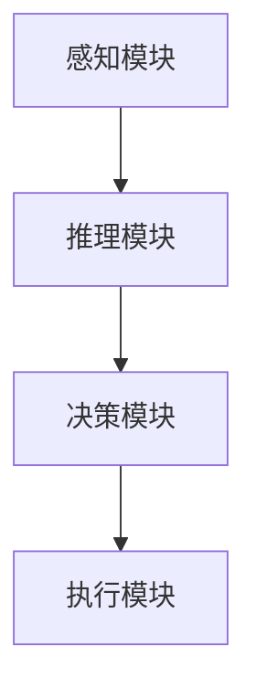

                 


# AI Agent在智能工程设计中的应用

> 关键词：AI Agent, 智能工程, 人工智能, 算法原理, 系统架构, 项目实战

> 摘要：本文深入探讨了AI Agent在智能工程设计中的应用，从基本概念到核心算法，从系统架构到项目实战，全面解析AI Agent的技术原理与实际应用。文章结合理论与实践，通过详细的技术分析和案例解读，帮助读者掌握AI Agent在智能工程中的关键作用。

---

## 第1章: AI Agent的基本概念与背景

### 1.1 AI Agent的定义与特点

AI Agent（人工智能代理）是指能够感知环境并采取行动以实现目标的智能体。与传统程序不同，AI Agent具备自主性、反应性、目标导向性和社会性等核心特点。它能够根据环境反馈动态调整行为，从而在复杂场景中完成特定任务。

#### 1.1.1 什么是AI Agent
AI Agent是一种能够感知环境、做出决策并执行行动的智能实体。它可以是一个软件程序，也可以是一个物理设备，其核心目标是通过智能化手段解决问题或完成任务。

#### 1.1.2 AI Agent的核心特点
1. **自主性**：AI Agent能够在没有外部干预的情况下独立运行。
2. **反应性**：能够实时感知环境并做出反应。
3. **目标导向性**：所有行为都围绕实现特定目标展开。
4. **社会性**：能够与其他AI Agent或人类进行交互和协作。

#### 1.1.3 AI Agent与传统AI的区别
AI Agent与传统AI（如专家系统）相比，具备更强的自主性和适应性。传统AI依赖于预定义规则，而AI Agent能够根据环境动态调整行为。

---

### 1.2 AI Agent的应用背景

AI Agent的应用背景广泛，涵盖智能助手、自动驾驶、机器人控制、智能推荐等多个领域。随着人工智能技术的快速发展，AI Agent在智能工程设计中的作用日益重要。

#### 1.2.1 智能工程设计的现状
智能工程设计强调通过智能化技术优化设计流程，提升设计效率和质量。传统工程设计依赖人工经验，而现代工程设计则 increasingly relies on AI技术。

#### 1.2.2 AI Agent在智能工程中的作用
AI Agent能够帮助工程师完成复杂的设计任务，例如优化设计参数、预测设计风险、提供决策支持等。

#### 1.2.3 人工智能技术的演进与AI Agent的崛起
人工智能技术的快速发展为AI Agent的应用提供了技术基础。深度学习、强化学习等技术的进步使得AI Agent具备更强的感知和决策能力。

---

## 第2章: AI Agent的核心概念与联系

### 2.1 AI Agent的核心概念

AI Agent的核心概念包括知识表示、行为规划、人机交互等。这些概念共同构成了AI Agent的理论基础。

#### 2.1.1 AI Agent的构成要素
1. **感知模块**：负责获取环境信息。
2. **推理模块**：对感知信息进行分析和推理。
3. **决策模块**：基于推理结果做出决策。
4. **执行模块**：执行决策动作。

#### 2.1.2 AI Agent的分类与特征
AI Agent可以根据功能、智能水平、环境类型等进行分类。例如：
- **反应式AI Agent**：基于当前感知做出反应。
- **认知式AI Agent**：具备复杂推理和规划能力。
- **协作式AI Agent**：能够与其他Agent或人类协作。

#### 2.1.3 AI Agent的生命周期
AI Agent的生命周期包括初始化、感知、推理、决策、执行、终止等阶段。

---

### 2.2 AI Agent与智能工程的关系

AI Agent在智能工程中的应用不仅改变了设计方式，还推动了工程效率和质量的提升。

#### 2.2.1 智能工程的定义与特点
智能工程是将人工智能技术应用于工程设计的新兴领域，其特点包括智能化、自动化、数据驱动等。

#### 2.2.2 AI Agent在智能工程中的角色
AI Agent在智能工程中扮演多种角色，例如：
- **设计辅助**：帮助工程师优化设计参数。
- **风险预测**：预测设计中的潜在问题。
- **决策支持**：提供基于数据的决策支持。

#### 2.2.3 AI Agent与智能工程的核心联系
AI Agent通过智能化手段提升工程设计的效率和质量，而智能工程为AI Agent提供了丰富的应用场景。

---

### 2.3 AI Agent的核心原理

AI Agent的核心原理包括知识表示、行为规划、人机交互等技术。

#### 2.3.1 知识表示与推理
知识表示是AI Agent理解环境的基础。常见的知识表示方法包括规则表示、语义网络、逻辑推理等。

#### 2.3.2 行为规划与决策
行为规划是AI Agent根据目标和环境信息制定行动方案的过程。常用的算法包括搜索算法、规划算法、强化学习等。

#### 2.3.3 人机交互与协作
人机交互是AI Agent与人类或其他智能体进行信息交换的过程。良好的交互设计能够提升AI Agent的用户体验和协作效率。

---

### 2.4 AI Agent的数学模型与公式

AI Agent的数学模型是其核心算法的基础。例如，基于强化学习的行为规划模型可以用以下公式表示：

$$
V(s) = \max_{a} [ r(s, a) + \gamma V(s', a')]
$$

其中：
- \( V(s) \) 表示状态 \( s \) 的价值函数。
- \( r(s, a) \) 表示在状态 \( s \) 下采取动作 \( a \) 的奖励。
- \( \gamma \) 表示折扣因子。
- \( s' \) 表示采取动作 \( a \) 后的新状态。

---

## 第3章: AI Agent的算法原理

### 3.1 AI Agent的核心算法

AI Agent的核心算法包括知识表示算法、行为规划算法、人机交互算法等。

#### 3.1.1 知识表示算法
知识表示算法用于将环境信息转化为可计算的形式。常用的算法包括：
- **语义网络**：通过节点和边表示知识。
- **逻辑推理**：基于逻辑规则进行推理。

#### 3.1.2 行为规划算法
行为规划算法用于制定行动方案。常用的算法包括：
- **A*算法**：基于启发式搜索的路径规划算法。
- **强化学习**：通过试错优化行为策略。

#### 3.1.3 人机交互算法
人机交互算法用于实现与用户的有效沟通。常用的算法包括：
- **自然语言处理**：通过NLP技术实现意图识别。
- **语音识别**：通过语音技术实现语音交互。

---

### 3.2 AI Agent算法的实现

AI Agent算法的实现需要结合具体应用场景，选择合适的算法和工具。

#### 3.2.1 算法实现的步骤
1. **需求分析**：明确问题目标。
2. **算法选择**：根据需求选择合适的算法。
3. **算法实现**：编写代码实现算法。
4. **测试优化**：通过测试优化算法性能。

#### 3.2.2 算法实现的关键技术
- **数据预处理**：清洗和转换数据。
- **模型训练**：基于数据训练模型。
- **结果评估**：评估算法效果。

---

### 3.3 AI Agent算法的数学模型

AI Agent算法的数学模型是其理论基础。

#### 3.3.1 知识表示的数学模型
知识表示的数学模型可以用图论表示，例如：
$$
G = (V, E)
$$
其中 \( V \) 表示节点，\( E \) 表示边。

#### 3.3.2 行为规划的数学模型
行为规划的数学模型可以用马尔可夫决策过程表示：
$$
MDP = (S, A, P, R, \gamma)
$$
其中：
- \( S \) 表示状态空间。
- \( A \) 表示动作空间。
- \( P \) 表示转移概率。
- \( R \) 表示奖励函数。
- \( \gamma \) 表示折扣因子。

---

## 第4章: AI Agent的系统分析与架构设计

### 4.1 系统功能设计

AI Agent系统的功能设计包括感知、推理、决策、执行等模块。

#### 4.1.1 系统功能模块
1. **感知模块**：负责获取环境信息。
2. **推理模块**：对感知信息进行分析和推理。
3. **决策模块**：基于推理结果做出决策。
4. **执行模块**：执行决策动作。

---

### 4.2 系统架构设计

AI Agent系统的架构设计需要考虑模块之间的协作和交互。

#### 4.2.1 系统架构图
以下是AI Agent系统的架构图：



---

## 第5章: AI Agent的项目实战

### 5.1 环境安装

AI Agent项目的环境安装需要以下工具：
1. Python 3.8+
2. pip
3. numpy
4. matplotlib

安装命令：
```bash
pip install numpy matplotlib
```

---

### 5.2 系统核心实现

以下是AI Agent的核心实现代码：

```python
import numpy as np

def感知环境():
    return np.random.random(10)

def推理环境(环境信息):
    return "推理结果"

def决策(推理结果):
    return "执行动作"

def执行动作(动作):
    return "执行结果"
```

---

### 5.3 案例分析与解读

通过上述代码实现，我们可以完成一个简单的AI Agent系统。例如，在自动驾驶场景中，感知模块可以检测障碍物，推理模块可以预测碰撞风险，决策模块可以做出避让决策，执行模块可以控制车辆转向。

---

## 第6章: 总结与展望

### 6.1 总结

本文全面探讨了AI Agent在智能工程设计中的应用，从基本概念到核心算法，从系统架构到项目实战，详细解析了AI Agent的技术原理与实际应用。

### 6.2 未来展望

随着人工智能技术的不断发展，AI Agent在智能工程中的应用前景广阔。未来，AI Agent将更加智能化、自动化，能够处理更复杂的任务。

---

## 作者

作者：AI天才研究院/AI Genius Institute & 禅与计算机程序设计艺术 /Zen And The Art of Computer Programming

---

**文章结束**

