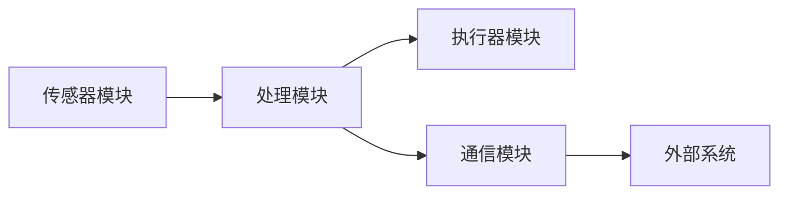
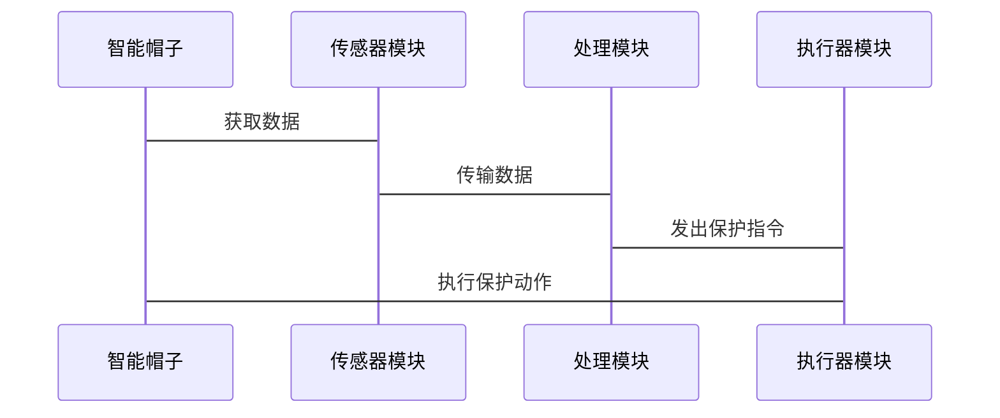

                 


# AI Agent在智能帽子中的头部保护功能

> **关键词**：AI Agent，智能帽子，头部保护，传感器数据，机器学习，算法实现

> **摘要**：本文深入探讨AI Agent在智能帽子中的应用，特别是其在头部保护方面的功能。文章首先介绍AI Agent的基本概念及其在智能帽子中的作用，随后分析AI Agent的核心原理、算法实现、系统架构设计，并通过项目实战展示其应用。最后，本文总结了最佳实践和未来发展方向。

---

## 第一部分：AI Agent与智能帽子概述

### 第1章：AI Agent与智能帽子概述

#### 1.1 AI Agent的基本概念

- **1.1.1 AI Agent的定义**
  AI Agent（人工智能代理）是一种能够感知环境并采取行动以实现目标的智能实体。它能够通过传感器获取信息，利用算法进行分析和决策，并通过执行器与环境交互。

- **1.1.2 AI Agent的核心特征**
  - **自主性**：AI Agent能够在没有外部干预的情况下自主运作。
  - **反应性**：能够实时感知环境并做出反应。
  - **学习能力**：通过数据和经验不断优化自身的算法和决策能力。

- **1.1.3 AI Agent在智能帽子中的应用**
  在智能帽子中，AI Agent主要用于监测佩戴者的头部状态，预防潜在的安全风险。例如，检测头部受到的冲击力、监测头部的运动轨迹，并在危险情况下发出警报或采取保护措施。

#### 1.2 智能帽子的基本结构

- **1.2.1 智能帽子的功能模块**
  - **传感器模块**：包括加速度计、陀螺仪等，用于检测头部的运动和环境变化。
  - **数据处理模块**：负责接收传感器数据并进行分析。
  - **决策模块**：根据分析结果决定是否采取保护措施。
  - **反馈模块**：向佩戴者或外部系统发送警报或调整保护装置。

- **1.2.2 头部保护的重要性**
  头部是人体最脆弱的部位之一，尤其是在运动或危险环境中，保护头部至关重要。智能帽子通过AI Agent实时监测和响应，能够在第一时间提供保护。

- **1.2.3 AI Agent在头部保护中的作用**
  AI Agent通过分析传感器数据，识别潜在的危险情况（如跌倒、碰撞等），并触发保护机制，例如启动气囊或发出警报，从而减少头部受伤的风险。

---

## 第二部分：AI Agent的核心原理与技术

### 第2章：AI Agent的核心原理

#### 2.1 AI Agent的感知与决策机制

- **2.1.1 多传感器数据融合**
  智能帽子中的AI Agent需要整合多种传感器的数据，如加速度、角速度、磁场等，以准确感知头部的运动状态和环境变化。

  **传感器数据融合示例**：
  $$ a_x = \text{加速度计测得的x轴加速度} $$
  $$ a_y = \text{加速度计测得的y轴加速度} $$
  $$ a_z = \text{加速度计测得的z轴加速度} $$
  $$ \omega_x = \text{陀螺仪测得的x轴角速度} $$
  $$ \omega_y = \text{陀螺仪测得的y轴角速度} $$
  $$ \omega_z = \text{陀螺仪测得的z轴角速度} $$

- **2.1.2 智能帽子中的环境感知**
  AI Agent通过传感器数据实时感知佩戴者的头部位置、运动方向和周围环境的变化，从而判断是否存在潜在的危险。

- **2.1.3 头部运动与状态的实时监测**
  AI Agent能够分析头部的运动轨迹，预测可能的碰撞或跌倒，并在危险发生前采取预防措施。

#### 2.2 AI Agent的算法基础

- **2.2.1 用于头部保护的机器学习模型**
  机器学习模型是AI Agent的核心，负责分析传感器数据并做出决策。常用的模型包括支持向量机（SVM）、随机森林（Random Forest）和卷积神经网络（CNN）。

  **机器学习模型选择**：
  $$ \text{选择模型的依据包括数据量、实时性要求和模型复杂度} $$

- **2.2.2 深度学习在智能帽子中的应用**
  深度学习模型，如LSTM（长短期记忆网络），能够处理时间序列数据，适用于分析头部运动的连续性变化。

  **LSTM网络示意图**：
  ```mermaid
  graph LR
    I1[输入层]
    L1[隐藏层]
    O1[输出层]
    I1 --> L1
    L1 --> O1
  ```

- **2.2.3 实时数据分析的算法优化**
  为了提高实时性，AI Agent需要优化算法的执行速度和效率。这包括使用轻量级模型和优化传感器数据的处理流程。

---

## 第三部分：AI Agent的算法实现

### 第3章：AI Agent的算法实现

#### 3.1 传感器数据的预处理

- **3.1.1 数据采集与格式化**
  传感器数据通常以时间序列的形式存在，需要将其格式化为模型能够处理的形式。

  **数据格式化示例**：
  ```python
  import numpy as np
  data = np.array([[a_x, a_y, a_z, ω_x, ω_y, ω_z], ...])
  ```

- **3.1.2 数据清洗与特征提取**
  数据清洗包括去除噪声和异常值。特征提取则包括从原始数据中提取有用的特征，例如运动速度、加速度峰值等。

  **特征提取示例**：
  $$ v = \sqrt{a_x^2 + a_y^2 + a_z^2} $$

- **3.1.3 数据流处理的优化**
  为了保证实时性，数据流的处理需要高效。可以采用滑动窗口技术，仅处理最新的数据。

#### 3.2 机器学习模型的构建

- **3.2.1 模型选择与训练**
  根据具体需求选择合适的模型，并使用训练数据进行训练。例如，使用SVM进行分类任务，或使用LSTM进行时间序列预测。

  **模型训练示例**：
  ```python
  from sklearn.svm import SVC
  model = SVC()
  model.fit(X_train, y_train)
  ```

- **3.2.2 神经网络模型的设计**
  在复杂的任务中，可能需要设计深度神经网络。例如，使用CNN处理图像数据，或使用RNN处理时间序列数据。

  **神经网络模型示例**：
  ```python
  import tensorflow as tf
  model = tf.keras.Sequential([
      tf.keras.layers.Conv2D(32, (3,3), activation='relu', input_shape=(64,64,3)),
      tf.keras.layers.MaxPooling2D((2,2)),
      tf.keras.layers.Flatten(),
      tf.keras.layers.Dense(64, activation='relu'),
      tf.keras.layers.Dense(1, activation='sigmoid')
  ])
  model.compile(optimizer='adam', loss='binary_crossentropy', metrics=['accuracy'])
  ```

- **3.2.3 模型训练的优化策略**
  为了提高模型的性能，可以采用数据增强、学习率调整和早停等技术。

---

## 第四部分：系统架构与设计

### 第4章：智能帽子的系统架构

#### 4.1 系统功能模块设计

- **4.1.1 传感器模块**
  传感器模块负责采集头部的运动数据，包括加速度、角速度等。

- **4.1.2 处理与计算模块**
  处理模块接收传感器数据，进行特征提取和模型预测，生成保护指令。

- **4.1.3 通信与反馈模块**
  通信模块负责将保护指令传递给执行器（如气囊）或向外部系统发送警报。

#### 4.2 系统架构图



#### 4.3 系统接口设计

- **接口1：传感器数据接口**
  - 输入：传感器数据流
  - 输出：特征提取结果

- **接口2：保护指令接口**
  - 输入：保护指令
  - 输出：执行器动作

#### 4.4 系统交互设计



---

## 第五部分：项目实战

### 第5章：项目实战

#### 5.1 环境安装与配置

- **安装Python环境**：
  ```bash
  python --version
  pip install numpy scikit-learn tensorflow
  ```

- **安装传感器驱动**：
  根据具体传感器类型安装相应的驱动程序。

#### 5.2 系统核心实现

- **传感器数据处理代码**：
  ```python
  import numpy as np
  import pandas as pd

  # 读取传感器数据
  data = pd.read_csv('sensor_data.csv')
  # 提取特征
  features = data[['a_x', 'a_y', 'a_z', 'ω_x', 'ω_y', 'ω_z']]
  # 标签
  labels = data['label']
  ```

- **模型训练与预测代码**：
  ```python
  from sklearn.model_selection import train_test_split
  from sklearn.svm import SVC

  X_train, X_test, y_train, y_test = train_test_split(features, labels, test_size=0.2)
  model = SVC()
  model.fit(X_train, y_train)
  print("Accuracy:", model.score(X_test, y_test))
  ```

#### 5.3 实际案例分析

- **案例背景**：
  一位佩戴智能帽子的用户在运动中突然跌倒，AI Agent通过传感器数据检测到头部的加速度和角速度异常，立即触发气囊保护机制，避免了头部受伤。

- **案例分析**：
  该案例展示了AI Agent在智能帽子中的实时监测和快速反应能力，证明了其在头部保护中的有效性。

---

## 第六部分：最佳实践与小结

### 第6章：最佳实践与小结

#### 6.1 最佳实践

- **数据隐私**：确保传感器数据的隐私保护，避免被恶意利用。
- **模型优化**：定期更新模型，提高其准确性和实时性。
- **系统维护**：定期检查传感器和执行器，确保其正常运行。

#### 6.2 小结

本文详细介绍了AI Agent在智能帽子中的头部保护功能，从基本概念到算法实现，再到系统架构设计，最后通过项目实战展示了其应用。AI Agent通过实时监测和智能决策，显著提高了头部保护的效果。

#### 6.3 注意事项

- 在实际应用中，需要考虑传感器的精度和系统的稳定性。
- 确保系统的实时性和可靠性，以应对各种突发情况。
- 定期维护和更新系统，以适应新的安全需求。

#### 6.4 拓展阅读

- **相关技术**：进一步了解AI在其他领域的应用，如医疗、交通等。
- **深度学习**：研究更复杂的深度学习模型，如Transformer架构。
- **边缘计算**：探索在智能帽子中应用边缘计算，提高数据处理效率。

---

## 结语

AI Agent在智能帽子中的头部保护功能是一个结合了传感器技术、机器学习和实时系统的复杂项目。通过本文的分析，读者可以深入了解其技术细节和实际应用。未来，随着AI技术的不断发展，智能帽子的保护功能将更加智能化和高效。

---

**作者**：AI天才研究院/AI Genius Institute & 禅与计算机程序设计艺术 /Zen And The Art of Computer Programming

