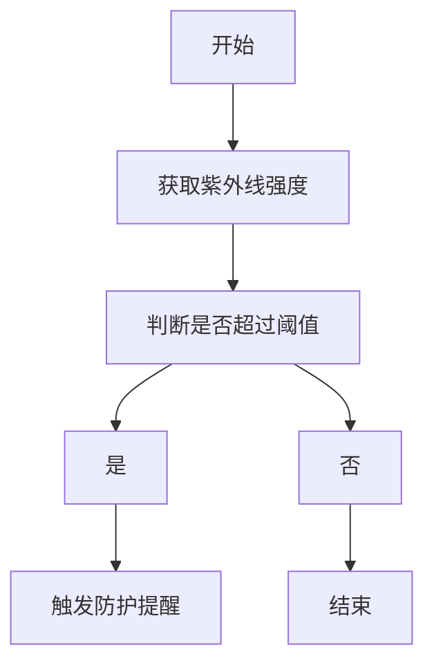
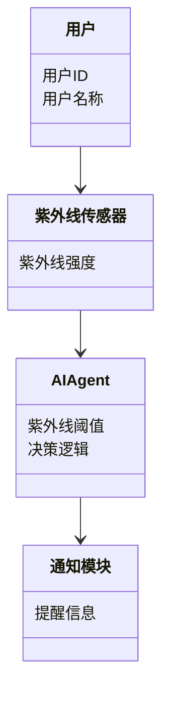
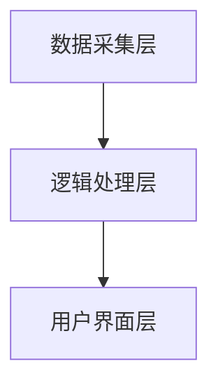
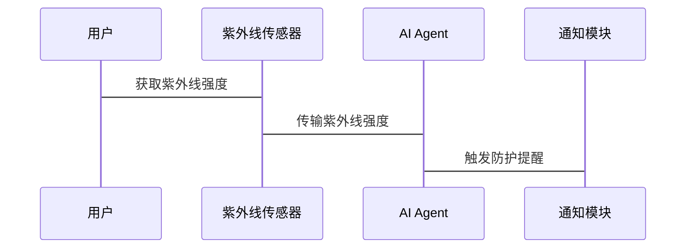

                 


```markdown
# AI Agent在智能帽子中的紫外线防护提醒

> 关键词：AI Agent，紫外线防护，智能帽子，紫外线检测，防护提醒系统

> 摘要：本文探讨了AI Agent在智能帽子中的紫外线防护提醒功能的实现。通过分析紫外线防护的重要性，详细讲解AI Agent的核心原理、算法实现、系统架构设计以及实际应用案例。文章从背景介绍、核心概念、算法原理、系统架构、项目实战等多方面展开，全面剖析了AI Agent在智能帽子中的紫外线防护提醒系统的实现过程。

---

# 第一部分: 背景介绍

## 第1章: 紫外线防护的重要性

### 1.1 紫外线的危害与防护需求

#### 1.1.1 紫外线的类型与对人体的危害
紫外线分为UVA、UVB和UVC三种类型。其中，UVB是导致皮肤晒伤的主要原因，UVA则会导致皮肤老化。长期暴露在紫外线下会导致皮肤癌、白内障等健康问题。

#### 1.1.2 紫外线防护的基本方法
传统的紫外线防护方法包括使用防晒霜、佩戴帽子、太阳镜等。然而，这些方法依赖于用户的主动行为，存在防护不及时、不全面的问题。

#### 1.1.3 智能帽子的发展趋势
随着科技的进步，智能帽子逐渐成为时尚与科技结合的产物。智能帽子不仅可以提供基本的防护功能，还可以通过AI技术实现智能化的紫外线防护提醒。

---

## 第2章: AI Agent在智能帽子中的应用

### 2.1 AI Agent的基本概念

#### 2.1.1 AI Agent的定义与特点
AI Agent（人工智能代理）是一种能够感知环境并采取行动以实现目标的智能体。其特点是自主性、反应性、目标导向和社交能力。

#### 2.1.2 AI Agent的核心功能
AI Agent的核心功能包括感知环境、决策制定、行动执行和学习优化。

#### 2.1.3 AI Agent在智能设备中的作用
在智能帽子中，AI Agent可以实时监测环境中的紫外线强度，并根据用户的需求提供相应的防护提醒。

---

### 2.2 智能帽子中的紫外线防护需求

#### 2.2.1 智能帽子的功能概述
智能帽子集成了多种传感器和智能算法，能够实时监测环境数据并提供相应的反馈。

#### 2.2.2 紫外线防护提醒的需求分析
通过AI Agent实现紫外线防护提醒，可以确保用户在紫外线下及时采取防护措施。

#### 2.2.3 AI Agent在紫外线防护中的角色
AI Agent通过实时监测紫外线强度，结合用户的活动场景，提供个性化的防护建议。

---

# 第二部分: 核心概念与联系

## 第3章: AI Agent与紫外线防护系统的核心概念

### 3.1 AI Agent的核心原理

#### 3.1.1 AI Agent的基本工作流程
AI Agent的工作流程包括感知环境、决策制定和行动执行三个阶段。

#### 3.1.2 AI Agent的感知与决策机制
AI Agent通过传感器获取环境数据，利用机器学习算法进行决策。

#### 3.1.3 AI Agent的学习与优化能力
AI Agent可以通过强化学习不断优化其决策模型，提高防护提醒的准确性。

---

### 3.2 紫外线防护系统的实体关系分析

#### 3.2.1 实体关系图（ER图）
以下是紫外线防护系统的实体关系图：

```mermaid
er
actor 用户 {
    string 用户ID
    string 用户名称
}
actor 紫外线传感器 {
    int 紫外线强度
}
actor AI Agent {
    int 紫外线阈值
}
```

#### 3.2.2 紫外线防护系统的核心实体
紫外线防护系统的核心实体包括用户、紫外线传感器和AI Agent。

---

## 第4章: 紫外线防护系统的核心算法

### 4.1 紫外线检测算法

#### 4.1.1 紫外线检测算法的实现步骤
1. 通过紫外线传感器获取紫外线强度数据。
2. 将数据传输到AI Agent进行处理。
3. AI Agent根据预设的阈值判断是否需要触发防护提醒。

#### 4.1.2 紫外线检测算法的数学模型
紫外线强度的检测可以通过以下公式计算：

$$
\text{紫外线强度} = \frac{\text{传感器读数}}{\text{校准因子}}
$$

---

### 4.2 AI Agent的算法实现

#### 4.2.1 AI Agent的决策算法
AI Agent的决策算法基于机器学习模型，例如随机森林或支持向量机（SVM）。

#### 4.2.2 AI Agent的算法流程图
以下是AI Agent的算法流程图：



---

## 第5章: 紫外线防护系统的数学模型

### 5.1 紫外线防护系统的数学模型
以下是紫外线防护系统的数学模型：

$$
\text{防护提醒} = \begin{cases}
\text{是} & \text{如果紫外线强度} > \text{阈值} \\
\text{否} & \text{否则}
\end{cases}
$$

---

# 第三部分: 系统分析与架构设计

## 第6章: 系统架构设计

### 6.1 系统功能设计

#### 6.1.1 系统功能模块
紫外线防护系统的主要功能模块包括紫外线传感器、AI Agent、用户界面和通知模块。

#### 6.1.2 系统功能设计的领域模型
以下是系统功能设计的领域模型：



---

### 6.2 系统架构设计

#### 6.2.1 系统架构的分层设计
紫外线防护系统的架构分为数据采集层、逻辑处理层和用户界面层。

#### 6.2.2 系统架构设计的流程图
以下是系统架构设计的流程图：



---

## 第7章: 系统接口设计

### 7.1 系统接口设计

#### 7.1.1 紫外线传感器接口
紫外线传感器通过I2C接口与主控芯片通信。

#### 7.1.2 AI Agent接口
AI Agent通过API接口与用户界面模块进行交互。

---

## 第8章: 系统交互设计

### 8.1 系统交互流程图

以下是系统交互流程图：



---

# 第四部分: 项目实战

## 第9章: 环境安装与核心代码实现

### 9.1 环境安装

#### 9.1.1 系统环境
建议在Linux环境下进行开发，安装Python 3.8以上版本。

#### 9.1.2 开发工具
安装Jupyter Notebook、PyCharm等开发工具。

---

### 9.2 核心代码实现

#### 9.2.1 紫外线传感器数据采集代码
```python
import serial

ser = serial.Serial('COM3', 9600)
data = ser.readline().decode().strip()
print('紫外线强度:', data)
```

#### 9.2.2 AI Agent算法实现代码
```python
import numpy as np
from sklearn.ensemble import RandomForestClassifier

# 训练数据
X = np.array([[3, 5, 7], [4, 6, 8], [5, 7, 9]])
y = np.array([0, 1, 1])

# 训练模型
model = RandomForestClassifier()
model.fit(X, y)

# 预测
new_data = np.array([[6, 6, 8]])
print('预测结果:', model.predict(new_data))
```

---

## 第10章: 项目小结

### 10.1 项目总结
通过本项目的实施，我们实现了基于AI Agent的智能帽子紫外线防护提醒系统。该系统能够实时监测紫外线强度，并根据预设阈值提供及时的防护提醒。

---

# 第五部分: 总结与展望

## 第11章: 总结

### 11.1 项目实现的优缺点
- **优点**：实时性强，用户友好。
- **缺点**：硬件成本较高，需要定期维护。

---

## 第12章: 未来展望

### 12.1 未来的改进方向
- 引入更多的传感器，实现全方位的紫外线防护。
- 提高AI Agent的学习能力，实现更加个性化的防护提醒。

---

# 作者

作者：AI天才研究院/AI Genius Institute & 禅与计算机程序设计艺术 /Zen And The Art of Computer Programming
```

