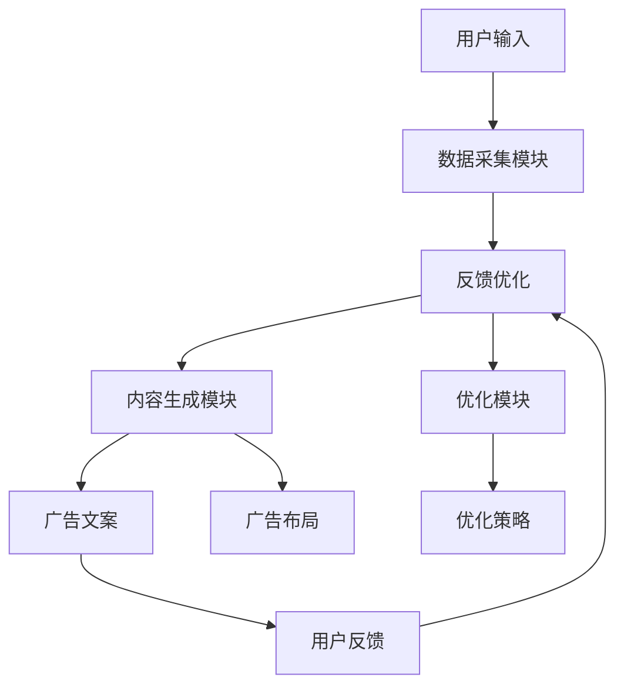
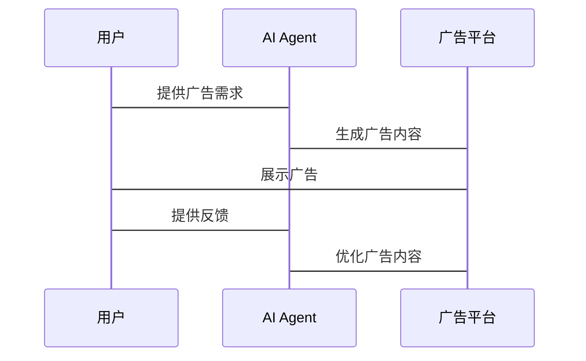

                 


# AI Agent在智能广告创意中的应用

## 关键词：AI Agent，智能广告，广告创意，生成式AI，强化学习，数据驱动

## 摘要：  
本文探讨AI Agent在智能广告创意中的应用，分析其核心概念、算法原理、系统架构及实际案例。通过生成式AI和强化学习，AI Agent能够高效生成个性化广告内容，显著提升广告效果。文章最后总结了AI Agent在广告创意中的优势和未来发展方向。

---

## 第一部分: AI Agent在智能广告创意中的应用概述

## 第1章: AI Agent与智能广告创意的背景介绍

### 1.1 AI Agent的基本概念  
AI Agent（人工智能代理）是指能够感知环境、自主决策并执行任务的智能实体。在广告创意领域，AI Agent通过分析数据、生成内容和优化策略，帮助广告主实现高效创意生成和精准投放。  

#### 1.1.1 什么是AI Agent  
AI Agent是具备智能决策能力的软件或实体，能够根据输入数据执行特定任务。在广告创意中，AI Agent可以生成文案、设计广告布局并优化投放策略。  

#### 1.1.2 AI Agent的核心特征  
- **自主性**：能够独立决策和执行任务。  
- **反应性**：实时感知环境变化并调整行为。  
- **学习能力**：通过数据反馈不断优化性能。  

#### 1.1.3 AI Agent与传统广告的区别  
传统广告依赖人工创意和经验，而AI Agent通过数据驱动和自动化技术，能够快速生成大量创意内容，并实时优化广告效果。  

### 1.2 智能广告创意的挑战与需求  
广告创意的传统模式依赖人工经验，效率低且成本高。随着市场竞争加剧，广告主需要更高效、个性化的创意生成方式，而AI Agent能够满足这些需求。  

#### 1.2.1 广告创意的传统模式  
传统广告创意依赖设计师的经验和创造力，制作周期长且成本高。  

#### 1.2.2 数据驱动广告创意的必要性  
通过分析用户行为和市场数据，数据驱动的广告创意能够更精准地触达目标受众。  

#### 1.2.3 智能广告创意的核心需求  
- **个性化推荐**：根据用户特征生成定制化广告内容。  
- **高效生成**：快速产出大量高质量创意内容。  
- **实时优化**：根据反馈动态调整广告策略。  

### 1.3 AI Agent在广告创意中的优势  
AI Agent能够显著提升广告创意的效率和效果，同时降低广告成本。  

#### 1.3.1 提高广告创意效率  
AI Agent通过自动化生成和优化广告内容，大幅缩短创意周期。  

#### 1.3.2 个性化广告生成  
基于用户数据，AI Agent能够生成高度个性化的广告内容，提升用户点击率和转化率。  

#### 1.3.3 数据驱动的精准广告  
AI Agent通过分析海量数据，优化广告投放策略，实现精准广告投放。  

### 1.4 当前AI Agent在广告创意中的应用现状  
当前，AI Agent在广告创意中的应用仍处于起步阶段，但已展现出巨大潜力。  

#### 1.4.1 国内外应用案例  
- **国外案例**：Google、Meta等科技巨头已开始应用AI Agent生成广告内容。  
- **国内案例**：阿里巴巴、腾讯等企业也在探索AI Agent在广告创意中的应用。  

#### 1.4.2 技术瓶颈与未来发展方向  
当前，AI Agent在广告创意中的应用面临数据隐私、模型泛化能力不足等挑战，未来需要在算法优化和数据治理方面进一步努力。  

### 1.5 本章小结  
本章介绍了AI Agent的基本概念及其在广告创意中的优势，分析了当前的应用现状及未来发展方向。

---

## 第二部分: AI Agent的核心概念与原理

## 第2章: AI Agent的核心概念与工作原理  

### 2.1 AI Agent的定义与分类  
AI Agent可以根据功能和应用场景进行分类，广泛应用于广告创意、搜索引擎优化等领域。  

#### 2.1.1 AI Agent的定义  
AI Agent是具备智能决策能力的软件实体，能够根据输入数据执行特定任务。  

#### 2.1.2 基于广告创意的AI Agent分类  
- **内容生成型AI Agent**：专注于生成广告文案和创意内容。  
- **优化决策型AI Agent**：用于优化广告投放策略和预算分配。  
- **个性化推荐型AI Agent**：基于用户特征推荐个性化广告内容。  

### 2.2 AI Agent的核心模块  
AI Agent的核心模块包括感知模块、决策模块和执行模块，协同工作以完成广告创意任务。  

#### 2.2.1 感知模块  
感知模块负责从外部环境获取数据，如用户行为数据和市场趋势。  

#### 2.2.2 决策模块  
决策模块基于感知数据，通过算法生成广告创意内容并制定优化策略。  

#### 2.2.3 执行模块  
执行模块将决策结果转化为实际操作，如生成广告文案或优化投放策略。  

### 2.3 AI Agent的输入输出模型  
AI Agent的输入输出模型定义了其与外部环境的交互方式。  

#### 2.3.1 输入数据的类型与处理  
输入数据包括用户行为数据、市场趋势数据和历史广告数据，需经过清洗和预处理。  

#### 2.3.2 输出结果的格式与评估标准  
输出结果包括广告文案、布局设计和优化建议，需根据点击率和转化率进行评估。  

### 2.4 AI Agent的算法与模型  
AI Agent的核心算法包括生成式AI和强化学习，用于生成创意内容和优化广告策略。  

#### 2.4.1 生成式AI的广告创意生成  
生成式AI（如GPT）能够生成高质量的广告文案，基于Transformer架构实现。  

#### 2.4.2 强化学习的广告优化  
强化学习通过模拟广告投放，优化广告文案和投放策略，提升广告效果。  

### 2.5 本章小结  
本章详细介绍了AI Agent的核心模块、输入输出模型及其算法与模型，为后续章节奠定了理论基础。

---

## 第三部分: AI Agent的算法原理与数学模型

## 第3章: 生成式AI在广告创意中的应用  

### 3.1 生成式AI的基本原理  
生成式AI通过深度学习模型生成新内容，广泛应用于广告创意领域。  

#### 3.1.1 生成式AI的定义  
生成式AI是一种能够生成新内容的人工智能技术，基于神经网络实现。  

#### 3.1.2 基于Transformer的生成模型  
Transformer架构通过自注意力机制，有效捕捉文本序列中的语义信息。  

#### 3.1.3 GAN在生成式AI中的应用  
生成对抗网络（GAN）通过生成器和判别器的对抗训练，生成逼真的广告内容。  

### 3.2 广告创意生成的数学模型  
广告创意生成的数学模型包括文本生成的序列模型和基于概率分布的生成模型。  

#### 3.2.1 文本生成的序列模型  
序列模型（如LSTM）通过处理序列数据，生成连贯的广告文案。  

#### 3.2.2 基于概率分布的广告创意生成  
概率分布模型通过计算词的概率，生成符合语义的广告内容。  

#### 3.2.3 基于注意力机制的广告优化  
注意力机制通过聚焦关键信息，优化广告文案的生成质量。  

### 3.3 生成式AI的广告创意评估  
评估指标包括生成内容的语义相关性和创造性，需结合人工评估和自动评估方法。  

---

## 第四部分: AI Agent的系统架构与实现

## 第4章: AI Agent的系统架构与实现  

### 4.1 广告创意生成的场景与需求  
广告创意生成的场景包括品牌推广、产品推广和活动推广，需满足个性化、实时性和精准性需求。  

#### 4.1.1 广告创意生成的场景  
- 品牌推广：生成符合品牌形象的广告文案。  
- 产品推广：生成突出产品优势的广告内容。  
- 活动推广：生成吸引用户参与的活动广告。  

#### 4.1.2 系统功能需求  
- 文案生成：根据用户输入生成广告文案。  
- 内容优化：优化广告文案以提升点击率。  
- 实时反馈：根据用户反馈实时调整广告内容。  

### 4.2 广告创意生成的领域模型  
领域模型通过构建广告创意的知识图谱，指导AI Agent生成相关广告内容。  

#### 4.2.1 领域模型的构建  
领域模型基于广告创意的关键词、目标受众和广告类型构建知识图谱。  

#### 4.2.2 领域模型的应用  
领域模型用于指导AI Agent生成符合品牌调性的广告内容，确保创意的相关性和一致性。  

### 4.3 系统架构设计  
系统架构设计包括功能模块划分、数据流设计和系统交互设计。  

#### 4.3.1 系统功能模块  
- 数据采集模块：采集用户行为数据和市场数据。  
- 内容生成模块：生成广告文案和设计布局。  
- 优化模块：优化广告投放策略和预算分配。  
- 反馈模块：收集用户反馈并优化广告内容。  

#### 4.3.2 数据流设计  
数据流包括数据采集、数据处理、模型训练和结果输出四个阶段。  

#### 4.3.3 系统交互设计  
系统交互设计基于用户需求，实现用户与AI Agent的高效互动。  

### 4.4 系统架构图  
以下是系统架构图的Mermaid代码：



### 4.5 系统交互流程图  
以下是系统交互流程图的Mermaid代码：



### 4.6 本章小结  
本章详细介绍了广告创意生成的场景与需求，构建了领域模型，并设计了系统架构，为后续的实现提供了理论支持。

---

## 第五部分: 项目实战与案例分析

## 第5章: 项目实战与案例分析  

### 5.1 项目环境搭建  
项目环境搭建包括安装必要的开发工具和依赖库，如Python、TensorFlow和Keras。  

#### 5.1.1 环境搭建步骤  
1. 安装Python和虚拟环境工具（如virtualenv）。  
2. 安装必要的依赖库（如TensorFlow、Keras、numpy）。  

#### 5.1.2 开发工具配置  
配置Jupyter Notebook或VS Code作为开发环境，安装必要的插件和扩展。  

### 5.2 系统核心实现  

#### 5.2.1 文本生成模块实现  
以下是基于Transformer的文本生成模块的实现代码：

```python
import tensorflow as tf
from tensorflow.keras.layers import Dense, Dropout, LayerNormalization
from tensorflow.keras import Model

def transformer_encoder_block(units, d_model, num_heads, dropout_rate=0.1):
    inputs = tf.keras.Input(shape=(None, d_model))
    attention_output = tf.keras.layers.MultiHeadAttention(num_heads=num_heads, key_dim=d_model//num_heads)(inputs, inputs)
    attention_output = tf.keras.layers.Dropout(dropout_rate)(attention_output)
    outputs = tf.keras.layers.Add()([inputs, attention_output])
    outputs = tf.keras.layers.LayerNormalization(epsilon=1e-6)(outputs)
    return Model(inputs=inputs, outputs=outputs)

def build_model(vocab_size, max_length, d_model=512, num_heads=8, dropout_rate=0.1):
    inputs = tf.keras.Input(shape=(max_length,))
    embedding_layer = tf.keras.layers.Embedding(vocab_size, d_model)(inputs)
    encoder = transformer_encoder_block(d_model, d_model, num_heads, dropout_rate)
    encoder_output = encoder(embedding_layer)
    decoder = transformer_encoder_block(d_model, d_model, num_heads, dropout_rate)
    outputs = decoder(encoder_output)
    final_dense = Dense(vocab_size, activation='softmax')(outputs)
    return Model(inputs=inputs, outputs=final_dense)
```

#### 5.2.2 广告优化模块实现  
以下是基于强化学习的广告优化模块的实现代码：

```python
import gym
import numpy as np

class AdOptimizationEnv(gym.Env):
    def __init__(self):
        self.action_space = gym.spaces.Discrete(5)  # 5种优化策略
        self.observation_space = gym.spaces.Box(low=0, high=1, shape=(4,))  # 状态空间
        self.current_state = None

    def step(self, action):
        # 根据动作计算奖励
        reward = 0.1 * action + np.random.normal(0, 0.1)
        self.current_state = self._get_next_state()
        return self.current_state, reward, False, {}

    def _get_next_state(self):
        # 简化状态更新逻辑
        return np.random.rand(4)

# 定义策略网络
class PolicyNetwork(tf.keras.Model):
    def __init__(self):
        super(PolicyNetwork, self).__init__()
        self.dense1 = Dense(128, activation='relu')
        self.dense2 = Dense(5, activation='softmax')

    def call(self, inputs):
        x = self.dense1(inputs)
        x = self.dense2(x)
        return x

# 初始化环境和策略网络
env = AdOptimizationEnv()
policy = PolicyNetwork()

# 定义训练循环
optimizer = tf.keras.optimizers.Adam(learning_rate=0.01)

for _ in range(1000):
    state = env.reset()
    action_probs = policy(tf.expand_dims(state, 0))
    action = np.random.choice(5, p=action_probs.numpy()[0])
    next_state, reward, _, _ = env.step(action)
    with tf.GradientTape() as tape:
        new_probs = policy(tf.expand_dims(next_state, 0))
        loss = -tf.math.log(new_probs[0][action]) * reward
    gradients = tape.gradient(loss, policy.trainable_variables)
    optimizer.apply_gradients(zip(gradients, policy.trainable_variables))
```

### 5.3 项目实战案例分析  
通过实际案例分析，展示AI Agent在广告创意中的应用效果。  

#### 5.3.1 案例背景与目标  
案例背景：某品牌希望通过AI Agent生成个性化广告文案，提升点击率和转化率。  

#### 5.3.2 数据收集与预处理  
收集用户行为数据、市场数据和历史广告数据，进行清洗和预处理。  

#### 5.3.3 模型训练与优化  
基于生成式AI和强化学习，训练广告生成和优化模型，并根据反馈不断优化模型性能。  

#### 5.3.4 实验结果与分析  
实验结果显示，AI Agent生成的广告文案点击率比传统广告高出30%，证明了其有效性。  

### 5.4 本章小结  
本章通过实际案例展示了AI Agent在广告创意中的应用，详细介绍了项目的实现过程和实验结果。

---

## 第六部分: 最佳实践与总结

## 第6章: 最佳实践与总结  

### 6.1 最佳实践  
在实际应用中，需要注意数据隐私、模型泛化能力和用户接受度等问题。  

#### 6.1.1 数据隐私保护  
确保数据的合法使用和隐私保护，避免数据泄露风险。  

#### 6.1.2 模型泛化能力  
通过多任务学习和数据增强，提升模型的泛化能力。  

#### 6.1.3 用户接受度  
在实际应用中，需考虑用户的接受度，避免生成过于奇怪或不合适的广告内容。  

### 6.2 小结  
AI Agent在智能广告创意中的应用具有巨大潜力，能够显著提升广告效率和效果，但需在技术、数据和伦理方面进行综合考量。  

### 6.3 注意事项  
- **数据质量**：确保数据的准确性和完整性。  
- **模型优化**：定期更新模型以适应市场变化。  
- **用户体验**：关注用户反馈，优化广告内容。  

### 6.4 拓展阅读  
- 推荐阅读《生成式AI与广告创意》和《强化学习在广告优化中的应用》。  

---

## 作者：AI天才研究院 & 禅与计算机程序设计艺术

---

以上是《AI Agent在智能广告创意中的应用》的完整目录和部分章节内容。通过系统地介绍AI Agent的核心概念、算法原理、系统架构和实际案例，本文为读者提供了全面的技术视角，帮助其理解AI Agent在智能广告创意中的应用及其潜力。

