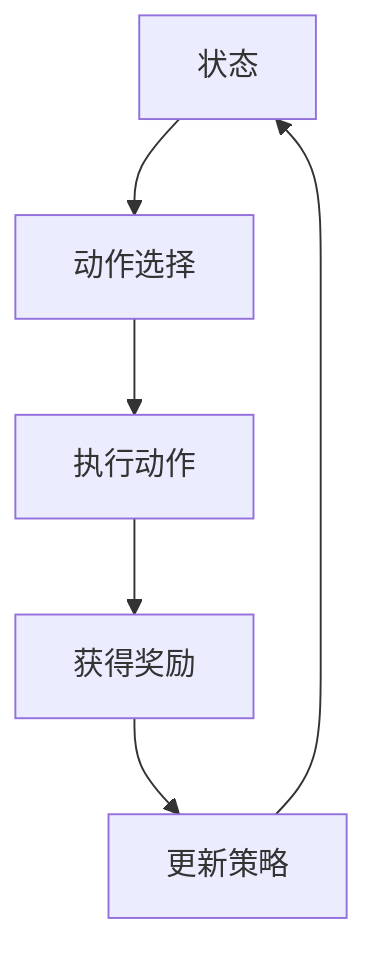
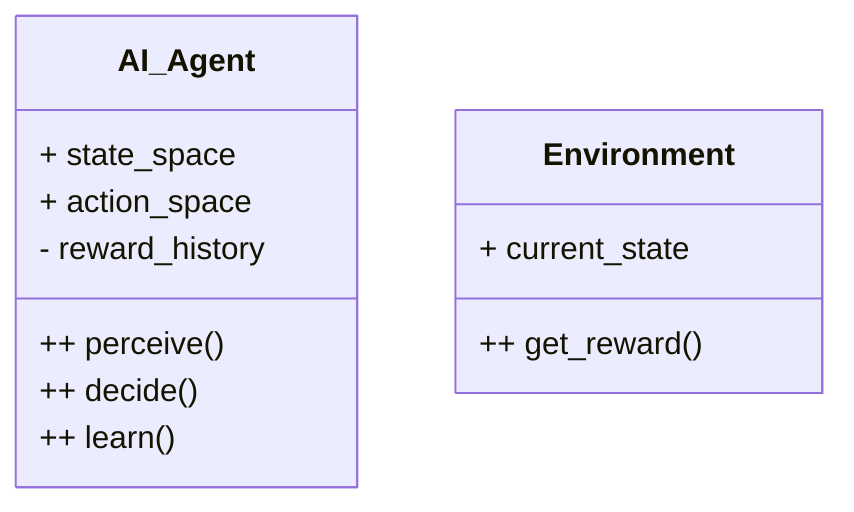
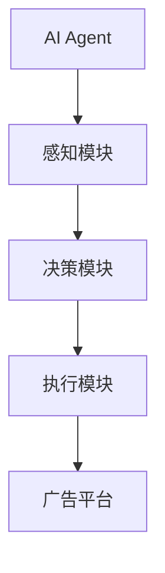

                 


# AI Agent在智能广告投放中的应用

> 关键词：AI Agent，智能广告投放，强化学习，多智能体系统，知识图谱，意图识别

> 摘要：本文深入探讨AI Agent在智能广告投放中的应用，分析其在广告决策优化、意图识别、知识图谱构建等方面的核心原理和实际应用。通过结合强化学习和多智能体系统，AI Agent能够显著提升广告投放的效果和效率，为广告行业带来革命性的变化。

---

# 第1章: AI Agent与智能广告投放概述

## 1.1 AI Agent的基本概念

### 1.1.1 AI Agent的定义与特点
AI Agent（人工智能代理）是指能够感知环境、自主决策并执行任务的智能体。AI Agent的核心特点包括：
1. **自主性**：能够独立决策，无需外部干预。
2. **反应性**：能够实时感知环境并做出响应。
3. **目标导向性**：基于目标进行决策和行动。

### 1.1.2 AI Agent的核心要素与功能
AI Agent的功能模块包括：
- **感知模块**：收集环境信息。
- **决策模块**：基于感知信息做出决策。
- **执行模块**：执行决策动作。

### 1.1.3 AI Agent与传统广告投放的区别
传统广告投放依赖人工或基于规则的系统，而AI Agent能够通过学习和优化，实时调整策略，实现更精准的广告投放。

---

## 1.2 智能广告投放的背景与现状

### 1.2.1 数字广告行业的演变
随着互联网的普及，广告投放从传统媒介逐渐转向数字平台，如搜索引擎、社交媒体和视频网站。

### 1.2.2 AI技术在广告行业的应用趋势
AI技术的引入，使得广告投放更加智能化和精准化，能够实时优化广告策略，提升转化率。

### 1.2.3 智能广告投放的核心问题与挑战
- **数据量大**：需要处理海量数据。
- **实时性要求高**：需要快速决策和执行。
- **个性化需求**：需要满足不同用户的需求。

---

## 1.3 AI Agent在智能广告投放中的作用

### 1.3.1 AI Agent如何优化广告投放
AI Agent能够实时分析用户行为，优化广告投放策略，提升广告效果。

### 1.3.2 AI Agent在广告决策中的优势
- **高效性**：能够快速做出决策。
- **精准性**：基于数据驱动的决策更精准。
- **适应性**：能够根据环境变化自适应调整策略。

### 1.3.3 AI Agent与广告生态的结合
通过AI Agent，广告投放能够实现从创意生成、投放优化到效果监测的全流程自动化。

---

## 1.4 本章小结
本章介绍了AI Agent的基本概念、核心要素及其在智能广告投放中的作用，为后续章节奠定了基础。

---

# 第2章: AI Agent的核心原理

## 2.1 多智能体系统与协作

### 2.1.1 多智能体系统的定义与特点
多智能体系统是指多个智能体协同工作的系统，具有以下特点：
1. **分布式**：智能体之间分布协作。
2. **协作性**：通过协作实现整体目标。

### 2.1.2 多智能体系统在广告投放中的应用
在智能广告投放中，多个AI Agent可以分别负责不同的任务，如创意生成、投放优化和效果监测。

### 2.1.3 多智能体系统的协作机制
通过通信协议和协作算法，多个AI Agent能够协同工作，实现广告投放的全局优化。

---

## 2.2 强化学习与决策优化

### 2.2.1 强化学习的基本原理
强化学习是一种通过试错学习的方法，智能体通过与环境互动，获得奖励或惩罚，从而优化决策策略。

### 2.2.2 强化学习在广告投放中的应用
在广告投放中，强化学习可以用于实时优化广告策略，提升点击率和转化率。

### 2.2.3 基于强化学习的广告决策优化
通过构建状态空间、动作空间和奖励函数，AI Agent能够实现广告投放的优化。

---

## 2.3 知识图谱与意图识别

### 2.3.1 知识图谱的构建与应用
知识图谱是一种结构化数据表示方式，能够帮助AI Agent更好地理解用户需求。

### 2.3.2 意图识别的基本原理
意图识别是通过分析用户行为和上下文信息，推断用户的意图。

### 2.3.3 意图识别在广告投放中的应用
通过意图识别，AI Agent能够精准定位目标用户，实现个性化广告投放。

---

## 2.4 本章小结
本章详细介绍了AI Agent的核心原理，包括多智能体系统、强化学习和知识图谱的应用，为后续章节的实现提供了理论基础。

---

# 第3章: 基于强化学习的广告投放算法

## 3.1 强化学习的基本框架

### 3.1.1 状态空间的定义
状态空间是智能体所处环境的所有可能状态的集合。

### 3.1.2 动作空间的定义
动作空间是智能体在状态空间中可以执行的所有动作的集合。

### 3.1.3 奖励函数的设计
奖励函数用于衡量智能体的动作是否符合预期目标。

---

## 3.2 基于强化学习的广告投放算法实现

### 3.2.1 算法流程图（Mermaid）


### 3.2.2 Python代码实现
```python
import random

class AI_Agent:
    def __init__(self, state_space, action_space):
        self.state_space = state_space
        self.action_space = action_space
        self.reward_history = []

    def perceive(self, state):
        # 感知环境状态
        pass

    def decide(self, state):
        # 根据当前状态选择动作
        return random.choice(self.action_space)

    def learn(self, reward):
        # 学习奖励，更新策略
        self.reward_history.append(reward)

# 示例用法
states = ['用户行为', '广告位置', '时间']
actions = ['展示广告', '不展示广告']

agent = AI_Agent(states, actions)
action = agent.decide('用户行为')
agent.learn(reward)
```

---

## 3.3 本章小结
本章详细介绍了基于强化学习的广告投放算法，包括算法框架和实现代码，展示了AI Agent在广告投放中的应用潜力。

---

# 第4章: 知识图谱与意图识别

## 4.1 知识图谱的构建与应用

### 4.1.1 知识图谱的构建方法
知识图谱的构建包括数据采集、实体识别和关系抽取等步骤。

### 4.1.2 知识图谱在广告投放中的应用
通过知识图谱，AI Agent能够更好地理解用户需求，实现精准广告推荐。

---

## 4.2 意图识别的原理与实现

### 4.2.1 意图识别的步骤
1. **数据采集**：收集用户行为数据。
2. **特征提取**：提取用户行为特征。
3. **模型训练**：训练意图识别模型。

### 4.2.2 基于深度学习的意图识别
使用神经网络模型（如LSTM）进行意图识别，能够提高识别准确率。

---

## 4.3 意图识别在广告投放中的应用

### 4.3.1 个性化广告推荐
通过意图识别，实现个性化广告推荐，提升用户点击率。

### 4.3.2 动态广告调整
根据用户意图实时调整广告内容，提升广告效果。

---

## 4.4 本章小结
本章介绍了知识图谱和意图识别的原理及其在广告投放中的应用，展示了AI Agent在提升广告精准度方面的潜力。

---

# 第5章: 系统架构与实现

## 5.1 系统功能设计

### 5.1.1 领域模型类图（Mermaid）


### 5.1.2 系统功能模块
- **感知模块**：收集用户行为数据。
- **决策模块**：基于数据做出广告投放决策。
- **执行模块**：执行广告投放动作。

---

## 5.2 系统架构设计

### 5.2.1 系统架构图（Mermaid）


### 5.2.2 接口设计
- **输入接口**：接收用户行为数据。
- **输出接口**：输出广告投放决策。

---

## 5.3 本章小结
本章详细设计了AI Agent广告投放系统的架构，包括功能模块和系统交互流程。

---

# 第6章: 项目实战

## 6.1 环境安装与配置

### 6.1.1 安装Python与相关库
```bash
pip install numpy
pip install matplotlib
pip install scikit-learn
```

### 6.1.2 安装广告投放平台
安装并配置广告投放平台，确保能够接收AI Agent的决策指令。

---

## 6.2 核心代码实现

### 6.2.1 AI Agent代码实现
```python
import numpy as np
from sklearn.metrics import accuracy_score

class AI_Agent:
    def __init__(self):
        self.model = self.build_model()

    def build_model(self):
        # 构建深度学习模型
        pass

    def train(self, X, y):
        # 训练模型
        pass

    def predict(self, X):
        # 预测广告投放策略
        pass

# 示例用法
agent = AI_Agent()
agent.train(X_train, y_train)
predictions = agent.predict(X_test)
accuracy = accuracy_score(y_test, predictions)
print(f'准确率: {accuracy}')
```

---

## 6.3 案例分析与效果评估

### 6.3.1 实际案例分析
分析AI Agent在某广告投放项目中的实际应用效果。

### 6.3.2 效果评估指标
- **点击率（CTR）**：广告被点击的比例。
- **转化率（CVR）**：广告点击后转化为实际行为的比例。

---

## 6.4 项目总结
通过项目实战，验证了AI Agent在广告投放中的有效性，同时总结了实际应用中的经验和教训。

---

# 第7章: 最佳实践与未来展望

## 7.1 最佳实践

### 7.1.1 系统优化建议
- 定期更新模型，保持广告投放的准确性。
- 加强数据隐私保护，确保用户数据安全。

### 7.1.2 实际应用中的注意事项
- 避免过度依赖AI，结合人工干预。
- 定期监控系统运行状态，及时发现并解决问题。

---

## 7.2 未来展望

随着AI技术的不断发展，AI Agent在广告投放中的应用将更加广泛和深入。未来，AI Agent将更加智能化和个性化，广告投放效果将进一步提升。

---

# 作者

作者：AI天才研究院/AI Genius Institute & 禅与计算机程序设计艺术 /Zen And The Art of Computer Programming

---

通过以上结构和内容，文章系统地介绍了AI Agent在智能广告投放中的应用，从理论到实践，从原理到实现，为读者提供了全面的知识和指导。

