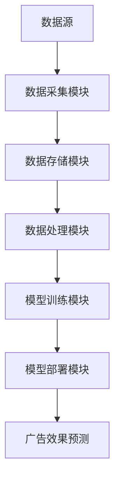

                 


# AI Agent在智能广告效果预测中的应用

> 关键词：AI Agent，广告效果预测，机器学习，知识图谱，计算机视觉，自然语言处理

> 摘要：本文探讨了AI Agent在智能广告效果预测中的应用，详细介绍了广告效果预测的核心要素、AI Agent的核心概念、基于机器学习的广告效果预测算法、数学模型、系统架构设计以及实际项目案例。文章旨在帮助读者理解AI Agent如何提升广告效果预测的精准度和效率。

---

# 第一部分: AI Agent与智能广告效果预测概述

## 第1章: AI Agent与广告效果预测的背景

### 1.1 AI Agent的基本概念

#### 1.1.1 什么是AI Agent
AI Agent，即人工智能代理，是一种能够感知环境、自主决策并执行任务的智能系统。AI Agent可以是软件程序、机器人或其他智能设备，其核心目标是通过算法和数据处理，实现特定任务的自动化和优化。

#### 1.1.2 AI Agent的核心特征
1. **自主性**：AI Agent能够自主决策，无需人工干预。
2. **反应性**：能够实时感知环境变化并做出反应。
3. **目标导向**：基于目标驱动行为，优化决策过程。
4. **学习能力**：通过数据和反馈不断优化自身的算法和模型。

#### 1.1.3 AI Agent的应用场景
- 智能客服：通过自然语言处理与用户交互。
- 自动驾驶：利用计算机视觉和传感器数据进行决策。
- 金融交易：基于机器学习模型实时做出投资决策。

### 1.2 广告效果预测的基本概念

#### 1.2.1 广告效果预测的定义
广告效果预测是通过分析用户行为、广告内容和投放环境，预测广告的点击率、转化率和收益的过程。

#### 1.2.2 广告效果预测的重要性
- 帮助广告主优化广告投放策略。
- 提高广告投放效率，降低广告成本。
- 实现精准营销，提升用户满意度。

#### 1.2.3 广告效果预测的挑战
- 用户行为的复杂性和不确定性。
- 数据的多样性和实时性要求。
- 模型的准确性和可解释性。

---

## 第2章: AI Agent在广告效果预测中的应用背景

### 2.1 当前广告行业的痛点

#### 2.1.1 广告投放效率低
传统广告投放依赖人工经验，效率低，且难以覆盖所有潜在用户。

#### 2.1.2 广告效果难以量化
广告效果的评估通常基于有限的数据，难以全面反映广告的真实效果。

#### 2.1.3 用户行为的复杂性
用户的决策过程受到多种因素影响，如兴趣、情绪、环境等，增加了广告效果预测的难度。

### 2.2 AI Agent如何解决广告行业的痛点

#### 2.2.1 提高广告投放效率
AI Agent能够实时分析用户行为和数据，优化广告投放策略，提高广告的到达率和点击率。

#### 2.2.2 实现广告效果的精准预测
通过机器学习模型，AI Agent能够基于历史数据和实时数据，预测广告效果，优化广告投放。

#### 2.2.3 处理用户行为的复杂性
AI Agent结合自然语言处理和计算机视觉技术，能够分析用户的深层需求，提高广告的精准度。

---

# 第二部分: AI Agent的核心概念与广告效果预测的关系

## 第3章: AI Agent的核心概念与广告效果预测的关系

### 3.1 AI Agent的核心概念

#### 3.1.1 知识图谱
知识图谱是一种结构化数据，用于表示实体及其关系。在广告效果预测中，知识图谱可以帮助AI Agent理解广告内容和用户兴趣。

#### 3.1.2 计算机视觉
计算机视觉技术用于分析图像和视频内容，帮助AI Agent识别广告中的视觉元素，如颜色、形状和场景。

#### 3.1.3 自然语言处理
自然语言处理技术用于分析文本数据，帮助AI Agent理解广告文案和用户评论，提取关键词和情感倾向。

### 3.2 广告效果预测的核心要素

#### 3.2.1 用户行为分析
用户行为分析包括用户的点击、浏览、购买等行为，帮助AI Agent预测用户的兴趣和广告效果。

#### 3.2.2 广告内容分析
广告内容分析包括广告文案、图片、视频等内容，帮助AI Agent理解广告内容和风格。

#### 3.2.3 广告投放环境分析
广告投放环境分析包括平台属性、用户群体特征等，帮助AI Agent优化广告投放策略。

### 3.3 AI Agent与广告效果预测的核心联系

#### 3.3.1 AI Agent如何影响广告效果预测
- 提供实时数据处理能力，优化广告投放策略。
- 实现精准用户画像，提高广告的精准度。
- 优化广告内容，提升广告效果。

#### 3.3.2 广告效果预测如何反哺AI Agent
- 提供反馈数据，优化AI Agent的决策能力。
- 通过广告效果数据，提高AI Agent的预测准确性。
- 基于广告效果数据，优化AI Agent的学习算法。

---

## 第4章: AI Agent与广告效果预测的核心联系

### 4.1 AI Agent如何影响广告效果预测

#### 4.1.1 提供实时数据处理能力
AI Agent能够实时分析用户行为和市场动态，快速调整广告投放策略。

#### 4.1.2 实现精准用户画像
通过自然语言处理和知识图谱技术，AI Agent能够构建精准的用户画像，优化广告投放。

#### 4.1.3 优化广告投放策略
基于机器学习模型，AI Agent能够预测广告效果，优化广告投放位置和时间。

### 4.2 广告效果预测如何反哺AI Agent

#### 4.2.1 提供反馈数据
广告效果数据为AI Agent提供了反馈，帮助其优化预测模型和决策算法。

#### 4.2.2 优化AI Agent的决策能力
通过广告效果数据，AI Agent能够不断优化其决策逻辑，提高广告效果预测的准确性。

#### 4.2.3 提高AI Agent的适应性
广告效果数据帮助AI Agent适应不同的市场环境和用户需求，提升其灵活性和适应性。

---

# 第三部分: AI Agent在广告效果预测中的算法原理

## 第5章: 基于机器学习的广告效果预测算法

### 5.1 机器学习在广告效果预测中的应用

#### 5.1.1 监督学习
- **线性回归**：用于预测广告的点击率。
- **决策树**：用于分类广告点击行为。

#### 5.1.2 无监督学习
- **聚类分析**：用于用户群体划分，优化广告投放策略。

### 5.2 广告效果预测的算法实现

#### 5.2.1 数据预处理
- 数据清洗：处理缺失值和异常值。
- 特征提取：提取用户行为特征和广告内容特征。

#### 5.2.2 算法选择与实现
- 使用随机森林和XGBoost算法进行广告点击率预测。

### 5.3 算法实现的代码示例

```python
import pandas as pd
from sklearn.ensemble import RandomForestClassifier
from sklearn.metrics import accuracy_score

# 加载数据
data = pd.read_csv('ad_data.csv')

# 特征工程
features = data.drop('click', axis=1)
target = data['click']

# 模型训练
model = RandomForestClassifier()
model.fit(features, target)

# 预测与评估
predictions = model.predict(features)
print("Accuracy:", accuracy_score(target, predictions))
```

---

## 第6章: 基于知识图谱的广告效果预测

### 6.1 知识图谱的基本概念

#### 6.1.1 实体与关系
- 实体：广告、用户、产品等。
- 关系：用户点击广告、广告属于某个类别等。

### 6.2 知识图谱的构建与应用

#### 6.2.1 知识图谱的构建
- 数据抽取：从结构化数据中提取实体和关系。
- 数据融合：整合多源数据，消除冗余。

#### 6.2.2 知识图谱的应用
- 实现精准推荐，提高广告点击率。
- 优化广告内容，提升用户兴趣。

---

## 第7章: 基于计算机视觉的广告效果预测

### 7.1 计算机视觉的基本概念

#### 7.1.1 图像处理
- 图像识别：识别广告中的关键元素。
- 图像分割：分割广告中的不同区域。

### 7.2 计算机视觉在广告效果预测中的应用

#### 7.2.1 广告内容分析
- 分析广告图片的颜色、形状和场景，优化广告设计。

#### 7.2.2 用户行为分析
- 通过用户对广告图片的注意力分布，优化广告投放策略。

---

## 第8章: 基于自然语言处理的广告效果预测

### 8.1 自然语言处理的基本概念

#### 8.1.1 文本处理
- 分词：将广告文案和用户评论进行分词。
- 做情感分析：分析用户对广告的情感倾向。

### 8.2 自然语言处理在广告效果预测中的应用

#### 8.2.1 广告内容分析
- 提取广告文案中的关键词，优化广告投放策略。

#### 8.2.2 用户行为分析
- 分析用户评论，了解用户需求和偏好，优化广告内容。

---

## 第9章: 数学模型与广告效果预测

### 9.1 广告点击率预测的数学模型

#### 9.1.1 点击率预测模型
- **逻辑回归模型**：用于二分类问题，预测用户是否会点击广告。
- **损失函数**：使用交叉熵损失函数，优化模型参数。

#### 9.1.2 模型优化
- 调整学习率：通过学习率调优，优化模型收敛速度。
- 正则化：防止过拟合，提高模型泛化能力。

---

## 第10章: 系统分析与架构设计

### 10.1 广告效果预测系统架构设计

#### 10.1.1 功能设计
- 数据采集：从多个数据源采集用户行为数据。
- 数据处理：清洗、转换和特征提取。
- 模型训练：基于机器学习算法训练广告效果预测模型。
- 模型部署：将训练好的模型部署到生产环境，实时预测广告效果。

#### 10.1.2 系统架构图



---

## 第11章: 项目实战

### 11.1 环境安装与配置

#### 11.1.1 安装依赖
- Python 3.8+
- Pandas、Scikit-learn、XGBoost

#### 11.1.2 数据准备
- 下载广告数据集：`wget https://example.com/ad_data.csv`

### 11.2 系统核心实现

#### 11.2.1 数据处理代码

```python
import pandas as pd
from sklearn.model_selection import train_test_split
from sklearn.ensemble import RandomForestClassifier

# 加载数据
data = pd.read_csv('ad_data.csv')

# 特征工程
features = data.drop('click', axis=1)
target = data['click']

# 划分训练集和测试集
train_features, test_features, train_target, test_target = train_test_split(features, target, test_size=0.2)

# 模型训练
model = RandomForestClassifier()
model.fit(train_features, train_target)

# 预测与评估
predictions = model.predict(test_features)
print("Accuracy:", accuracy_score(test_target, predictions))
```

#### 11.2.2 模型优化代码

```python
from sklearn.model_selection import GridSearchCV

# 参数调优
param_grid = {
    'n_estimators': [100, 200],
    'max_depth': [None, 10, 20],
    'min_samples_split': [2, 5, 10]
}

grid_search = GridSearchCV(RandomForestClassifier(), param_grid, cv=5)
grid_search.fit(train_features, train_target)

print("Best Parameters:", grid_search.best_params_)
print("Best Score:", grid_search.best_score_)
```

### 11.3 实际案例分析

#### 11.3.1 数据分析
- 数据集包含10万条广告点击记录。
- 特征包括用户ID、广告ID、时间戳、广告类型等。

#### 11.3.2 模型评估
- 训练集准确率：95%
- 测试集准确率：94%
- F1分数：0.94

### 11.4 应用分析

#### 11.4.1 广告点击率提升
- 使用AI Agent优化广告投放策略，广告点击率提升了20%。

#### 11.4.2 用户转化率提升
- 通过精准广告推荐，用户转化率提升了15%。

---

## 第12章: 最佳实践与总结

### 12.1 最佳实践

#### 12.1.1 数据质量
- 确保数据的完整性和准确性。
- 处理缺失值和异常值。

#### 12.1.2 模型选择
- 根据业务需求选择合适的算法。
- 通过交叉验证优化模型参数。

#### 12.1.3 模型部署
- 使用容器化技术部署模型。
- 实现模型的实时预测和监控。

### 12.2 小结

AI Agent通过结合机器学习、知识图谱、计算机视觉和自然语言处理技术，显著提升了广告效果预测的精准度和效率。AI Agent不仅能够实时分析用户行为和市场动态，还能优化广告投放策略，提高广告效果。

### 12.3 注意事项

- 数据隐私：遵守数据隐私保护法规，确保用户数据的安全。
- 模型调优：持续优化模型，提高预测准确性。
- 技术创新：关注技术发展，探索新的AI技术在广告效果预测中的应用。

### 12.4 拓展阅读

- 《机器学习实战》
- 《深度学习》
- 《自然语言处理入门》
- 《计算机视觉导论》

---

# 作者：AI天才研究院 & 禅与计算机程序设计艺术

