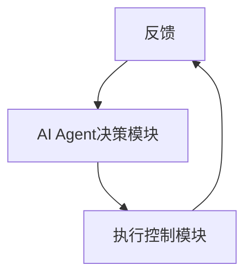
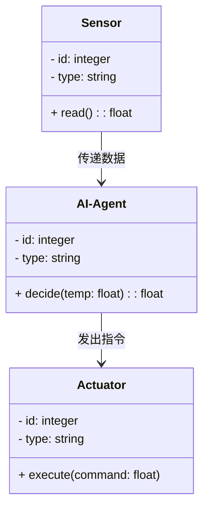
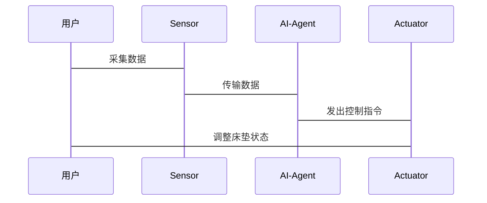

                 


```markdown
# AI Agent在智能床垫中的体温调节

> 关键词：AI Agent, 智能床垫, 体温调节, 传感器技术, 温度控制, 智能家居

> 摘要：随着智能家居技术的快速发展，AI Agent在智能床垫中的应用逐渐成为研究热点。本文详细探讨了AI Agent在智能床垫中的体温调节原理、算法实现、系统架构设计以及实际案例分析。通过对AI Agent的核心概念、算法优化、系统交互设计的深入剖析，展示了AI Agent如何通过感知、决策和执行模块实现智能床垫的精准体温调节。本文还结合实际项目，详细介绍了系统实现的关键步骤和注意事项，并提出了相关的优化建议。

---

# 第1章: AI Agent与智能床垫概述

## 1.1 AI Agent的基本概念

### 1.1.1 AI Agent的定义
AI Agent（人工智能代理）是指能够感知环境、自主决策并执行任务的智能实体。AI Agent可以通过传感器获取数据，利用算法进行分析和推理，并通过执行器与环境交互。AI Agent的核心目标是通过智能化的决策和行动，实现特定任务的最优或次优解。

### 1.1.2 AI Agent的核心特征
1. **自主性**：AI Agent可以在没有外部干预的情况下自主运行。
2. **反应性**：AI Agent能够实时感知环境变化并做出反应。
3. **目标导向性**：AI Agent的行为以实现特定目标为导向。
4. **学习能力**：AI Agent可以通过数据学习和优化算法，提升自身的决策能力。

### 1.1.3 AI Agent与传统自动控制系统的区别
传统自动控制系统依赖于预设的规则和程序，无法根据环境变化进行自主决策。而AI Agent具备学习和适应能力，能够根据实时数据动态调整策略。

## 1.2 智能床垫的基本原理

### 1.2.1 智能床垫的定义
智能床垫是一种结合了传感器技术、AI算法和物联网技术的智能设备，能够根据用户的生理数据和环境条件，自动调节床垫的软硬度和温度，以提供更加舒适的睡眠环境。

### 1.2.2 智能床垫的工作原理
智能床垫通过内置的温度传感器、压力传感器等设备，实时采集用户的体温、体重分布等数据，并通过AI Agent进行分析和决策，最终通过电热装置、气囊等执行机构实现温度调节和床垫硬度调整。

### 1.2.3 体温调节的重要性
体温调节是智能床垫的核心功能之一。通过精准的体温调节，智能床垫可以有效改善用户的睡眠质量，缓解失眠、关节疼痛等问题，同时也能提高用户的舒适感和健康水平。

## 1.3 本章小结
本章主要介绍了AI Agent的基本概念和智能床垫的工作原理，强调了体温调节在智能床垫中的重要性。AI Agent通过感知、决策和执行模块，能够实现智能床垫的智能化控制。

---

# 第2章: AI Agent的核心概念与原理

## 2.1 AI Agent的感知与决策机制

### 2.1.1 感知模块的功能与实现
感知模块是AI Agent获取环境信息的关键部分，主要包括温度传感器、压力传感器等设备。通过这些传感器，AI Agent可以实时获取用户的体温、体重分布等数据。

### 2.1.2 决策模块的算法选择
决策模块是AI Agent的核心部分，负责根据感知到的数据进行分析和推理，并制定相应的控制策略。常用的算法包括模糊控制算法、PID控制算法等。

### 2.1.3 执行模块的实现方式
执行模块是AI Agent的输出部分，负责根据决策模块的指令调整床垫的温度和硬度。执行模块通常包括电热装置、气囊等设备。

## 2.2 体温调节的数学模型与公式

### 2.2.1 体温调节的基本模型
体温调节的基本模型可以表示为一个动态系统，其中体温变化与环境温度、人体代谢等因素相关。

$$ T(t+1) = a \cdot T(t) + b \cdot U(t) + c $$

其中，$T(t)$ 表示当前体温，$U(t)$ 表示控制输入，$a$、$b$、$c$ 是常数参数。

### 2.2.2 温度变化的数学公式
通过数学公式可以实现对温度变化的预测和控制。例如，PID控制算法的公式如下：

$$ u(t) = K_p \cdot e(t) + K_i \cdot \int e(t) dt + K_d \cdot \frac{de(t)}{dt} $$

其中，$e(t)$ 是误差，$K_p$、$K_i$、$K_d$ 是比例、积分和微分系数。

### 2.2.3 温度调节的反馈机制
反馈机制是温度调节系统的重要组成部分，通过实时采集温度数据并调整控制参数，实现系统的稳定运行。

## 2.3 AI Agent与智能床垫的实体关系图

### 2.3.1 实体关系图的定义
实体关系图展示了智能床垫系统中各实体之间的关系。主要实体包括AI Agent、传感器、执行器和用户。

### 2.3.2 实体关系图的构建
```mermaid
erd
actor User {
  id: integer
  name: string
}
actor Sensor {
  id: integer
  type: string
}
actor Actuator {
  id: integer
  type: string
}
actor AI-Agent {
  id: integer
  type: string
}
User --> Sensor: 通过传感器采集数据
Sensor --> AI-Agent: 将数据传输给AI Agent
AI-Agent --> Actuator: 根据决策结果控制执行器
Actuator --> User: 执行器调整床垫状态
```

### 2.3.3 实体关系图的分析
实体关系图展示了智能床垫系统中各实体之间的交互关系。用户通过传感器向AI Agent提供数据，AI Agent根据数据做出决策，并通过执行器调整床垫状态，从而实现体温调节。

## 2.4 本章小结
本章详细介绍了AI Agent的核心概念与原理，重点分析了感知与决策机制、数学模型与公式，以及实体关系图。通过这些内容，我们可以更好地理解AI Agent在智能床垫中的工作原理。

---

# 第3章: 算法原理与实现

## 3.1 算法选择与优化

### 3.1.1 算法选择的原则
在选择算法时，需要考虑系统的实时性、准确性和可扩展性。常用的算法包括模糊控制算法、PID控制算法等。

### 3.1.2 算法优化的方法
通过参数调整、模型简化等方法，可以提高算法的效率和准确性。

### 3.1.3 算法实现的步骤
1. 数据采集：通过传感器获取用户体温、环境温度等数据。
2. 数据处理：对采集到的数据进行预处理和特征提取。
3. 模型训练：利用机器学习算法训练模型，优化控制策略。
4. 系统测试：通过实验验证算法的性能和效果。

## 3.2 算法实现的数学模型

### 3.2.1 算法的数学表达式
以模糊控制算法为例，其数学表达式如下：

$$ u(t) = \sum_{i=1}^{n} w_i \cdot f_i(x_i) $$

其中，$w_i$ 是权重系数，$f_i(x_i)$ 是模糊函数。

### 3.2.2 算法的数学推导
通过对模糊控制算法的数学推导，可以得到具体的控制规则和决策逻辑。

### 3.2.3 算法的数学验证
通过实验数据验证算法的数学模型，确保系统的准确性和稳定性。

## 3.3 算法实现的代码示例

### 3.3.1 环境搭建
需要安装Python、NumPy、Matplotlib等库。

### 3.3.2 代码实现
```python
import numpy as np
import matplotlib.pyplot as plt

# 定义模糊控制算法
def fuzzy_control(input_temp, desired_temp):
    error = input_temp - desired_temp
    # 模糊化
    linguistic_labels = ['冷', '适中', '热']
    membership = [max(0, 1 - abs(error - 2)) for _ in linguistic_labels]
    # 决策规则
    control_output = 0
    for i in range(len(membership)):
        if membership[i] > 0:
            control_output += membership[i] * linguistic_labels[i]
    return control_output

# 模拟实验
desired_temp = 25
current_temp = 20
output = fuzzy_control(current_temp, desired_temp)
print("控制输出:", output)
```

### 3.3.3 代码解读与分析
上述代码实现了模糊控制算法的基本功能，包括数据采集、模糊化处理、决策规则制定和输出控制。

## 3.4 本章小结
本章详细介绍了算法选择与优化、数学模型与实现，以及代码示例。通过对模糊控制算法的分析和实现，我们可以更好地理解AI Agent在智能床垫中的体温调节原理。

---

# 第4章: 系统分析与架构设计

## 4.1 问题场景介绍

### 4.1.1 问题背景
智能床垫的体温调节系统需要在复杂环境下稳定运行，面临着传感器精度、算法优化、系统稳定性等挑战。

### 4.1.2 问题描述
如何设计一个高效、准确的体温调节系统，实现智能床垫的智能化控制。

### 4.1.3 问题解决的思路
通过系统分析与架构设计，构建一个高效的智能床垫体温调节系统。

## 4.2 系统功能设计

### 4.2.1 系统功能模块划分
智能床垫体温调节系统主要包括数据采集模块、AI Agent决策模块和执行控制模块。

### 4.2.2 功能模块的交互设计


### 4.2.3 功能模块的实现方式
1. 数据采集模块：通过传感器采集用户体温、环境温度等数据。
2. AI Agent决策模块：利用算法分析数据，制定控制策略。
3. 执行控制模块：根据决策结果，调整床垫的温度和硬度。

## 4.3 系统架构设计

### 4.3.1 系统架构的选择
采用分层架构，包括感知层、决策层和执行层。

### 4.3.2 系统架构的实现


### 4.3.3 系统架构的优化
通过优化算法和硬件设计，提高系统的稳定性和响应速度。

## 4.4 系统接口设计

### 4.4.1 接口定义
1. 数据采集接口：传感器数据的读取接口。
2. 控制接口：AI Agent对执行器的控制接口。
3. 反馈接口：执行器对AI Agent的反馈接口。

### 4.4.2 接口实现
通过API接口实现传感器、AI Agent和执行器之间的通信。

### 4.4.3 接口测试
通过实际测试验证接口的稳定性和可靠性。

## 4.5 系统交互设计

### 4.5.1 交互流程图的绘制


### 4.5.2 交互流程图的分析
通过交互流程图可以清晰地了解系统的运行流程和各模块之间的关系。

### 4.5.3 交互流程图的优化
通过对交互流程图的优化，提高系统的运行效率。

## 4.6 本章小结
本章详细介绍了系统分析与架构设计，重点分析了系统功能设计、架构设计、接口设计和交互设计。通过对系统的全面设计，我们可以构建一个高效、稳定的智能床垫体温调节系统。

---

# 第5章: 项目实战与案例分析

## 5.1 项目环境搭建

### 5.1.1 开发环境的选择
选择合适的开发环境和工具，例如Python、Arduino等。

### 5.1.2 开发工具的安装
安装必要的开发工具和库，例如Python的Paho-MQTT、Arduino IDE等。

### 5.1.3 开发环境的配置
配置开发环境，确保传感器、AI Agent和执行器能够正常通信。

## 5.2 项目核心实现

### 5.2.1 核心代码的编写
编写AI Agent的核心代码，实现体温调节的算法和逻辑。

### 5.2.2 核心代码的调试
通过实验验证代码的正确性和稳定性。

### 5.2.3 核心代码的优化
通过对代码的优化，提高系统的运行效率和准确性。

## 5.3 项目案例分析

### 5.3.1 案例背景
通过实际案例分析，展示AI Agent在智能床垫中的应用效果。

### 5.3.2 案例分析
通过实验数据和用户反馈，验证系统的性能和效果。

### 5.3.3 案例总结
总结案例分析的结果，提出改进建议和优化方向。

## 5.4 本章小结
本章通过项目实战和案例分析，验证了AI Agent在智能床垫中的体温调节系统的可行性和有效性。

---

# 第6章: 最佳实践与总结

## 6.1 最佳实践 tips

### 6.1.1 系统设计
1. 确保系统的实时性和准确性。
2. 优化算法和硬件设计，提高系统的稳定性和响应速度。

### 6.1.2 代码实现
1. 使用模块化设计，便于维护和扩展。
2. 通过实验验证算法的正确性和有效性。

### 6.1.3 测试与优化
1. 全面测试系统，确保各模块的协调运行。
2. 通过优化算法和硬件设计，提高系统的性能。

## 6.2 小结
通过本文的详细分析和案例研究，我们可以看到AI Agent在智能床垫中的体温调节系统具有广阔的应用前景。通过不断的优化和创新，AI Agent技术将进一步提升智能床垫的功能和性能。

## 6.3 注意事项
1. 确保系统的安全性和隐私性。
2. 定期更新算法和系统，适应新的需求和环境变化。

## 6.4 拓展阅读
1. 《模糊控制算法及其应用》
2. 《智能系统与人工智能》
3. 《物联网技术与智能家居》

---

# 作者：AI天才研究院/AI Genius Institute & 禅与计算机程序设计艺术 /Zen And The Art of Computer Programming
```

