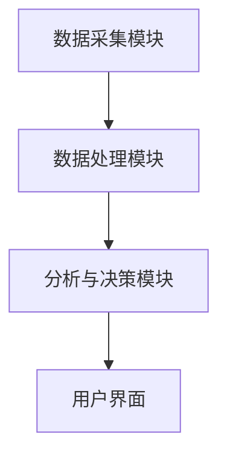

                 


# AI Agent在智能床垫中的睡眠姿势分析

## 关键词
AI Agent, 智能床垫, 睡眠姿势分析, 机器学习, 数据分析

## 摘要
AI Agent在智能床垫中的应用为睡眠健康提供了新的解决方案。通过分析睡眠姿势，AI Agent能够实时监测用户的睡眠状态，并提供个性化的健康建议。本文从AI Agent的基本原理出发，结合智能床垫的数据采集技术，详细探讨了睡眠姿势分析的算法实现，并通过实际案例展示了系统的设计与实现过程。

## 正文

### 第1章 AI Agent与智能床垫概述

#### 1.1 睡眠健康的重要性
睡眠是人类健康的重要组成部分，良好的睡眠质量直接影响到身体和心理的健康。根据世界卫生组织的数据，全球约有10%的人存在睡眠障碍问题。智能床垫通过实时监测用户的睡眠状态，能够帮助用户改善睡眠质量，预防健康问题。

#### 1.2 AI Agent的基本概念
AI Agent是一种具有自主决策能力的智能体，能够根据环境信息做出相应的反应。AI Agent的核心特征包括感知能力、推理能力、决策能力和执行能力。在医疗健康领域，AI Agent可以用于疾病诊断、健康监测和个性化治疗建议。

#### 1.3 AI Agent与智能床垫的结合
智能床垫是一种结合了传感器技术和智能算法的床垫，能够实时监测用户的睡眠状态。AI Agent在智能床垫中的应用主要体现在睡眠姿势分析、睡眠质量评估和个性化健康建议等方面。

### 第2章 AI Agent的工作原理

#### 2.1 AI Agent的核心技术
AI Agent的工作原理包括数据采集、数据分析、决策制定和执行反馈四个主要环节。数据采集是通过传感器获取用户的生理数据，数据分析是通过对数据进行处理和挖掘，决策制定是基于分析结果做出相应的决策，执行反馈是将决策结果反馈给用户。

#### 2.2 智能床垫的数据采集技术
智能床垫通常配备多种传感器，包括压力传感器、加速度传感器和温度传感器等。这些传感器能够实时监测用户的睡眠姿势、心率、呼吸频率等生理指标。

#### 2.3 睡眠姿势分析的算法基础
睡眠姿势分析主要基于机器学习算法，包括数据预处理、特征提取和分类算法三个主要步骤。数据预处理包括数据清洗和数据标准化，特征提取包括时间序列分析和频域分析，分类算法包括支持向量机和随机森林等。

### 第3章 睡眠姿势分析的算法实现

#### 3.1 数据预处理
数据预处理是睡眠姿势分析的关键步骤，主要包括数据清洗和数据标准化。数据清洗的目标是去除噪声数据，确保数据的准确性。数据标准化则是将数据转换到统一的范围内，便于后续分析。

#### 3.2 特征提取
特征提取是将原始数据转化为能够反映睡眠姿势的特征向量。常用的方法包括时间序列分析和频域分析。时间序列分析主要关注数据的时间特性，如均值、方差和自相关性等。频域分析则是将数据转换到频域，分析其频率特性。

#### 3.3 分类算法
分类算法是睡眠姿势分析的核心部分，常用的算法包括支持向量机（SVM）和随机森林（Random Forest）。SVM是一种监督学习算法，适用于小样本数据的分类。随机森林是一种基于决策树的集成学习算法，具有较强的抗过拟合能力。

### 第4章 系统架构设计

#### 4.1 系统功能设计
智能床垫的睡眠姿势分析系统主要包括数据采集模块、数据处理模块和分析与决策模块。数据采集模块负责采集用户的生理数据，数据处理模块对数据进行预处理和特征提取，分析与决策模块基于机器学习算法进行睡眠姿势分类。

#### 4.2 系统架构图


#### 4.3 接口设计与交互流程
系统接口设计包括数据采集接口和用户交互接口。数据采集接口负责与传感器设备进行数据通信，用户交互接口则是用户与系统进行交互的界面。交互流程包括数据采集、数据处理、分析与决策和结果反馈四个步骤。

### 第5章 项目实战

#### 5.1 环境搭建
项目实战需要搭建一个完整的智能床垫系统，包括传感器设备、数据采集卡和机器学习框架。常用的机器学习框架有TensorFlow和Scikit-learn。

#### 5.2 核心代码实现
以下是睡眠姿势分析的核心代码实现：

```python
import numpy as np
from sklearn import svm

# 数据预处理
def preprocess(data):
    # 去除噪声数据
    data_clean = data[abs(data - np.mean(data)) < 3 * np.std(data)]
    # 数据标准化
    data_normalized = (data_clean - np.mean(data_clean)) / np.std(data_clean)
    return data_normalized

# 特征提取
def extract_features(data):
    # 时间序列特征
    mean = np.mean(data)
    std = np.std(data)
    # 频域特征
    fft = np.fft.fft(data)
    fft_mean = np.mean(abs(fft))
    return [mean, std, fft_mean]

# 分类器训练
def train_classifier(X_train, y_train):
    clf = svm.SVC()
    clf.fit(X_train, y_train)
    return clf

# 测试与预测
def predict_sleep_posture(data, clf):
    features = extract_features(data)
    result = clf.predict([features])
    return result
```

#### 5.3 实际案例分析
通过实际案例分析，验证系统的有效性和准确性。例如，可以收集不同用户的睡眠数据，训练分类器，并评估其分类准确率。

### 第6章 应用案例与未来展望

#### 6.1 应用案例
介绍智能床垫在实际应用中的案例，如帮助用户改善睡眠质量、预防睡眠呼吸暂停综合征等。

#### 6.2 未来展望
展望AI Agent在智能床垫中的未来发展，包括更精准的姿势分析算法、更智能的健康建议系统和更广泛的应用场景。

## 小结
AI Agent在智能床垫中的睡眠姿势分析是一项具有重要应用价值的技术。通过本文的介绍，读者可以深入了解AI Agent的基本原理、算法实现和系统设计。未来，随着技术的不断发展，AI Agent在智能床垫中的应用将更加广泛，为睡眠健康提供更加智能化的解决方案。

## 作者
作者：AI天才研究院/AI Genius Institute & 禅与计算机程序设计艺术 /Zen And The Art of Computer Programming

