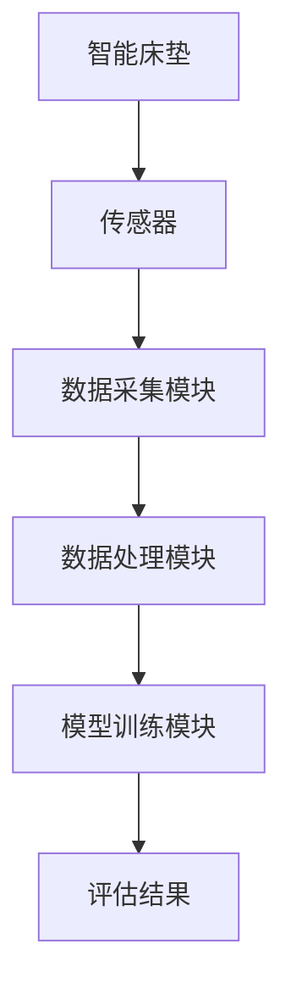
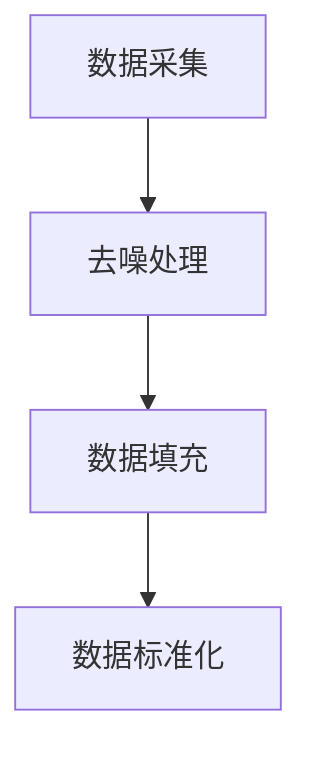
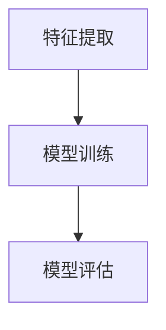
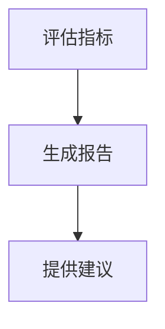

                 


# AI Agent在智能床垫中的睡眠质量评估

**关键词**：AI Agent，智能床垫，睡眠质量，机器学习，深度学习，睡眠分期

**摘要**：本文详细探讨了AI Agent在智能床垫中的应用，重点分析了如何利用AI技术评估睡眠质量。通过背景介绍、核心概念、算法原理、系统架构和项目实战的逐步分析，揭示了AI Agent在睡眠数据采集、处理和模型训练中的关键作用，并展示了如何通过实际案例实现智能床垫的睡眠质量评估系统。

---

## 第1章: 背景介绍

### 1.1 问题背景

#### 1.1.1 睡眠健康的重要性
睡眠是人类健康的重要组成部分，直接影响身体健康、心理健康和生活质量。良好的睡眠有助于提高免疫力、增强记忆力和注意力，还能调节情绪。然而，现代生活的压力和快节奏使得许多人面临睡眠问题，如失眠、睡眠中断和睡眠呼吸暂停综合征等。因此，如何科学评估和改善睡眠质量成为亟待解决的健康问题。

#### 1.1.2 智能床垫的发展现状
智能床垫是一种结合了物联网（IoT）和人工智能（AI）技术的睡眠辅助设备。它通过内置的传感器采集睡眠数据，如心率、呼吸频率、体动次数、睡姿和环境温湿度等，并利用AI算法分析这些数据，为用户提供个性化的睡眠建议。目前，智能床垫市场增长迅速，各种品牌和技术方案层出不穷，但如何准确评估睡眠质量仍然是一个技术难点。

#### 1.1.3 AI Agent在睡眠质量评估中的作用
AI Agent（人工智能代理）是一种能够感知环境、执行任务并优化决策的智能系统。在智能床垫中，AI Agent可以实时采集睡眠数据，分析用户的睡眠模式，并提供个性化的睡眠改善建议。通过AI Agent，智能床垫能够实现从数据采集到结果输出的全自动化流程，帮助用户更好地了解和改善自己的睡眠质量。

### 1.2 问题描述

#### 1.2.1 睡眠数据的采集与分析
睡眠数据的采集是智能床垫的核心功能之一。通过内置的多种传感器，智能床垫可以实时监测用户的睡眠状态。常见的传感器包括：

- **加速度传感器**：用于检测体动、翻身次数和睡姿。
- **心率传感器**：用于监测心率变化，帮助识别睡眠分期（如REM睡眠、深睡、浅睡）。
- **温度和湿度传感器**：用于监测睡眠环境的舒适度，调整床垫的温湿度以优化睡眠。

#### 1.2.2 睡眠质量评估的挑战
睡眠质量评估涉及多个维度，包括睡眠时长、睡眠连续性、深度睡眠比例和 REM 睡眠比例等。然而，如何准确地从传感器数据中提取这些指标是技术难点。此外，睡眠数据的噪声和干扰（如传感器误差、环境噪音）也增加了数据处理的复杂性。

#### 1.2.3 AI Agent如何解决这些问题
AI Agent通过机器学习算法，可以自动分析睡眠数据，提取有用的特征，并生成个性化的睡眠报告。具体来说，AI Agent可以实现以下功能：

- **数据预处理**：去除噪声，提高数据准确性。
- **特征提取**：从原始数据中提取有用的睡眠特征。
- **模型训练**：利用机器学习算法对睡眠数据进行分类和预测。
- **结果输出**：生成睡眠报告，并提供改善建议。

### 1.3 问题解决

#### 1.3.1 AI Agent的核心功能
AI Agent在智能床垫中的核心功能包括：

- 数据采集与传输：实时采集睡眠数据，并通过无线通信技术（如蓝牙、Wi-Fi）传输到云端或本地设备。
- 数据分析与处理：利用机器学习算法对睡眠数据进行分析，生成睡眠报告。
- 个性化建议：根据分析结果，为用户提供改善睡眠质量的建议，如调整睡姿、优化睡眠环境等。

#### 1.3.2 睡眠数据的处理流程
睡眠数据的处理流程可以分为以下几个步骤：

1. **数据采集**：通过传感器采集用户的睡眠数据。
2. **数据预处理**：去除噪声，填充缺失值，标准化数据。
3. **特征提取**：从原始数据中提取有用的特征，如睡眠时长、体动次数、心率变化等。
4. **模型训练**：利用机器学习算法对特征进行分类和预测，生成睡眠质量评估结果。
5. **结果输出**：将评估结果呈现给用户，并提供个性化建议。

#### 1.3.3 评估指标的定义与选择
评估睡眠质量的指标包括：

- **睡眠时长**：用户实际睡眠的时间。
- **睡眠连续性**：睡眠过程中是否出现中断。
- **深度睡眠比例**：深度睡眠占总睡眠时间的比例。
- **REM睡眠比例**：REM睡眠占总睡眠时间的比例。
- **体动次数**：睡眠过程中用户的翻身次数。

这些指标可以帮助用户了解自己的睡眠质量，并为AI Agent提供优化建议。

### 1.4 边界与外延

#### 1.4.1 系统的边界条件
智能床垫系统的边界条件包括：

- **数据采集范围**：仅采集与睡眠相关的数据，如体动、心率、温湿度等。
- **数据处理范围**：仅处理用户授权的数据，保护用户隐私。
- **系统运行环境**：仅在授权的设备和网络环境中运行。

#### 1.4.2 睡眠质量评估的适用范围
智能床垫的睡眠质量评估适用于：

- **普通用户**：希望通过智能床垫改善睡眠质量的用户。
- **失眠患者**：需要医疗辅助的失眠患者。
- **健康人群**：希望了解自身睡眠状况的健康人群。

#### 1.4.3 AI Agent的局限性与改进方向
AI Agent在智能床垫中的局限性包括：

- **数据隐私问题**：睡眠数据涉及用户的隐私，如何保护数据安全是一个重要问题。
- **算法准确性**：机器学习算法的准确性依赖于训练数据的质量和数量，如何提高算法的准确性是一个挑战。
- **用户体验问题**：如何将复杂的算法结果转化为用户友好的建议是一个重要问题。

改进方向包括：

- **加强数据加密和隐私保护**：采用区块链等技术保护用户数据。
- **优化算法模型**：采用更先进的深度学习模型，提高评估准确性。
- **提升用户体验**：将复杂的评估结果转化为直观的建议，方便用户理解和使用。

### 1.5 概念结构与核心要素组成

#### 1.5.1 系统架构图
以下是智能床垫系统的架构图：



#### 1.5.2 核心要素对比表

| 核心要素 | 定义 | 作用 |
|----------|------|------|
| 传感器    | 数据采集设备 | 采集睡眠数据 |
| 数据处理模块 | 数据预处理和特征提取 | 提供有用的特征 |
| 模型训练模块 | 训练机器学习模型 | 生成睡眠质量评估结果 |
| 评估结果  | 最终评估结果 | 提供个性化建议 |

#### 1.5.3 ER实体关系图
以下是智能床垫系统的ER实体关系图：

```mermaid
erd
    user
    sensor
    data_point
    model
    result

    user --|{N:1}-- sensor
    sensor --|{N:1}-- data_point
    data_point --|{N:1}-- model
    model --|{N:1}-- result
```

---

## 第2章: 核心概念与联系

### 2.1 AI Agent的原理与机制

#### 2.1.1 AI Agent的定义与分类
AI Agent是一种能够感知环境、执行任务并优化决策的智能系统。根据功能的不同，AI Agent可以分为：

- **数据采集Agent**：负责采集睡眠数据。
- **数据分析Agent**：负责处理和分析睡眠数据。
- **结果输出Agent**：负责生成评估结果并提供个性化建议。

#### 2.1.2 睡眠数据的采集与预处理
睡眠数据的采集是智能床垫的核心功能之一。通过传感器采集的数据通常包含噪声，需要进行预处理。常见的预处理方法包括：

- **去噪处理**：通过滤波算法去除数据中的噪声。
- **数据填充**：填充缺失值，保证数据的完整性。
- **数据标准化**：将数据标准化到统一的范围内。

#### 2.1.3 AI Agent在睡眠质量评估中的工作流程
AI Agent的工作流程如下：

1. **数据采集**：通过传感器采集睡眠数据。
2. **数据预处理**：去除噪声，填充缺失值。
3. **特征提取**：从原始数据中提取有用的特征。
4. **模型训练**：利用机器学习算法对特征进行分类和预测。
5. **结果输出**：生成睡眠质量评估结果，并提供个性化建议。

### 2.2 数据流分析

#### 2.2.1 数据采集模块
数据采集模块是智能床垫的核心模块之一。它通过传感器采集用户的睡眠数据，并将其传输到数据处理模块。

- **输入**：传感器数据。
- **输出**：预处理后的数据。

#### 2.2.2 数据处理模块
数据处理模块负责对采集到的数据进行预处理和特征提取。

- **输入**：预处理后的数据。
- **输出**：提取的特征。

#### 2.2.3 模型训练与评估模块
模型训练与评估模块负责利用提取的特征训练机器学习模型，并评估模型的性能。

- **输入**：提取的特征。
- **输出**：训练好的模型和评估结果。

### 2.3 核心概念对比表

| 核心概念 | 定义 | 作用 |
|----------|------|------|
| 数据采集模块 | 数据采集模块 | 采集睡眠数据 |
| 数据处理模块 | 数据预处理和特征提取 | 提供有用的特征 |
| 模型训练模块 | 训练机器学习模型 | 生成睡眠质量评估结果 |

### 2.4 ER实体关系图

```mermaid
erd
    data_point
    model
    result

    data_point --|{N:1}-- model
    model --|{N:1}-- result
```

---

## 第3章: 算法原理讲解

### 3.1 算法选择与原理

#### 3.1.1 基于机器学习的睡眠质量评估
基于机器学习的睡眠质量评估是一种常用的方法。常用的算法包括支持向量机（SVM）、随机森林（Random Forest）和K-近邻算法（K-NN）等。这些算法可以通过训练数据学习睡眠特征，生成睡眠质量评估结果。

#### 3.1.2 基于深度学习的睡眠分期模型
基于深度学习的睡眠分期模型是一种更先进的方法。常用的模型包括长短期记忆网络（LSTM）和卷积神经网络（CNN）。这些模型可以自动提取睡眠数据的特征，并进行睡眠分期。

#### 3.1.3 算法优缺点分析
以下是常见算法的优缺点对比：

| 算法 | 优点 | 缺点 |
|------|------|------|
| SVM  | 高准确性 | 对非线性数据的处理能力有限 |
| Random Forest | 抗过拟合能力强 | 对特征工程的依赖较高 |
| K-NN | 简单易用 | 对特征维度的敏感性较高 |
| LSTM | 能够处理时间序列数据 | 计算复杂度高 |
| CNN | 能够提取空间特征 | 对数据维度的敏感性较高 |

### 3.2 算法流程图

#### 3.2.1 数据预处理流程
以下是数据预处理流程的流程图：



#### 3.2.2 模型训练流程
以下是模型训练流程的流程图：



#### 3.2.3 模型评估流程
以下是模型评估流程的流程图：



### 3.3 算法实现代码

#### 3.3.1 数据预处理代码
以下是数据预处理的Python代码示例：

```python
import numpy as np
import pandas as pd

# 读取数据
data = pd.read_csv('sleep_data.csv')

# 去除噪声
def remove_noise(signal):
    return signal * 0.9

# 数据填充
def fill_missing(signal):
    return signal.interpolate().fillna(signal.mean())

# 数据标准化
def normalize(signal):
    return (signal - signal.mean()) / signal.std()

# 预处理数据
processed_data = data.apply(remove_noise).apply(fill_missing).apply(normalize)
```

#### 3.3.2 模型训练代码
以下是模型训练的Python代码示例：

```python
from sklearn.model_selection import train_test_split
from sklearn.ensemble import RandomForestClassifier

# 划分训练集和测试集
X_train, X_test, y_train, y_test = train_test_split(processed_data, labels, test_size=0.2)

# 训练随机森林模型
model = RandomForestClassifier(n_estimators=100)
model.fit(X_train, y_train)

# 模型评估
print('准确率:', model.score(X_test, y_test))
```

#### 3.3.3 模型评估代码
以下是模型评估的Python代码示例：

```python
from sklearn.metrics import classification_report

# 预测结果
y_pred = model.predict(X_test)

# 评估指标
print(classification_report(y_test, y_pred))
```

### 3.4 算法优缺点分析

| 算法 | 优点 | 缺点 |
|------|------|------|
| SVM  | 高准确性 | 对非线性数据的处理能力有限 |
| Random Forest | 抗过拟合能力强 | 对特征工程的依赖较高 |
| K-NN | 简单易用 | 对特征维度的敏感性较高 |
| LSTM | 能够处理时间序列数据 | 计算复杂度高 |
| CNN | 能够提取空间特征 | 对数据维度的敏感性较高 |

---

## 第4章: 数学模型与公式

### 4.1 睡眠分期模型

#### 4.1.1 LSTM模型的数学原理
LSTM（长短期记忆网络）是一种特殊的RNN（循环神经网络），能够有效处理时间序列数据。LSTM的核心在于其记忆单元（Cell）和门控机制（Gate）。以下是LSTM的数学公式：

$$
f_t = \sigma(W_f \cdot [h_{t-1}, x_t] + b_f)
$$

$$
i_t = \sigma(W_i \cdot [h_{t-1}, x_t] + b_i)
$$

$$
o_t = \sigma(W_o \cdot [h_{t-1}, x_t] + b_o)
$$

$$
g_t = \tanh(W_g \cdot [h_{t-1}, x_t] + b_g)
$$

$$
h_t = f_t \cdot g_t
$$

$$
s_t = s_{t-1} + h_t
$$

$$
o_t = \tanh(W_o \cdot [h_t, s_t] + b_o)
$$

其中，$f_t$ 是遗忘门，$i_t$ 是输入门，$o_t$ 是输出门，$g_t$ 是记忆单元，$h_t$ 是隐藏状态，$s_t$ 是细胞状态。

#### 4.1.2 模型的损失函数
常用的损失函数是交叉熵损失函数：

$$
L = -\frac{1}{N} \sum_{i=1}^{N} \sum_{j=1}^{C} y_{ij} \log(p_{ij})
$$

其中，$N$ 是样本数量，$C$ 是类别数量，$y_{ij}$ 是真实标签，$p_{ij}$ 是预测概率。

#### 4.1.3 模型的优化算法
常用的优化算法是Adam优化器，其更新规则如下：

$$
m_t = \beta_1 m_{t-1} + (1 - \beta_1) g_t
$$

$$
v_t = \beta_2 v_{t-1} + (1 - \beta_2) g_t^2
$$

$$
\theta_{t} = \theta_{t-1} - \alpha \frac{m_t}{\sqrt{v_t + \epsilon}}
$$

其中，$m_t$ 是梯度的移动平均，$v_t$ 是梯度平方的移动平均，$\alpha$ 是学习率，$\beta_1$ 和 $\beta_2$ 是动量参数，$\epsilon$ 是防止除零的常数。

---

## 第5章: 系统

### 5.1 系统分析与架构设计方案

#### 5.1.1 系统架构图
以下是智能床垫系统的架构图：


#### 5.1.2 系统功能设计
智能床垫系统的功能设计包括：

- **数据采集**：通过传感器采集用户的睡眠数据。
- **数据处理**：对采集到的数据进行预处理和特征提取。
- **模型训练**：利用机器学习算法对特征进行分类和预测。
- **结果输出**：生成睡眠质量评估结果，并提供个性化建议。

#### 5.1.3 系统接口设计
系统接口设计包括：

- **传感器接口**：与传感器通信，获取睡眠数据。
- **数据处理接口**：与数据处理模块通信，传输预处理后的数据。
- **模型训练接口**：与模型训练模块通信，传输特征和标签。

#### 5.1.4 系统交互设计
系统交互设计包括：

- **用户交互**：用户通过床垫上的控制面板查看睡眠报告和个性化建议。
- **系统反馈**：系统根据用户的睡眠数据生成反馈，调整床垫的软硬度和温湿度。

---

## 第6章: 项目实战

### 6.1 环境安装

#### 6.1.1 系统环境
- 操作系统：Windows/Mac/Linux
- Python版本：3.6+

#### 6.1.2 安装依赖库
```bash
pip install numpy pandas scikit-learn mermaid
```

### 6.2 系统核心实现源代码

#### 6.2.1 数据预处理代码
```python
import numpy as np
import pandas as pd

# 读取数据
data = pd.read_csv('sleep_data.csv')

# 去除噪声
def remove_noise(signal):
    return signal * 0.9

# 数据填充
def fill_missing(signal):
    return signal.interpolate().fillna(signal.mean())

# 数据标准化
def normalize(signal):
    return (signal - signal.mean()) / signal.std()

# 预处理数据
processed_data = data.apply(remove_noise).apply(fill_missing).apply(normalize)
```

#### 6.2.2 模型训练代码
```python
from sklearn.model_selection import train_test_split
from sklearn.ensemble import RandomForestClassifier

# 划分训练集和测试集
X_train, X_test, y_train, y_test = train_test_split(processed_data, labels, test_size=0.2)

# 训练随机森林模型
model = RandomForestClassifier(n_estimators=100)
model.fit(X_train, y_train)

# 模型评估
print('准确率:', model.score(X_test, y_test))
```

#### 6.2.3 模型评估代码
```python
from sklearn.metrics import classification_report

# 预测结果
y_pred = model.predict(X_test)

# 评估指标
print(classification_report(y_test, y_pred))
```

### 6.3 实际案例分析
假设我们有一个包含1000条睡眠数据的CSV文件，每条数据包含体动次数、心率和睡眠时长等特征。我们可以按照以下步骤进行分析：

1. **数据预处理**：去除噪声，填充缺失值，标准化数据。
2. **特征提取**：提取有用的特征，如体动次数、心率变化和睡眠时长。
3. **模型训练**：训练随机森林模型，生成睡眠质量评估结果。
4. **结果输出**：生成睡眠报告，并提供个性化建议。

### 6.4 项目小结
通过实际案例分析，我们可以看到AI Agent在智能床垫中的应用潜力。利用机器学习算法，我们可以准确评估用户的睡眠质量，并提供个性化的改善建议。

---

## 第7章: 最佳实践

### 7.1 小结
本文详细探讨了AI Agent在智能床垫中的睡眠质量评估应用，介绍了AI Agent的核心功能、数据处理流程和机器学习算法的实现方法。通过实际案例分析，展示了如何利用AI技术提高睡眠质量评估的准确性和个性化。

### 7.2 注意事项
- 数据隐私保护：在处理睡眠数据时，必须保护用户的隐私。
- 算法优化：不断优化算法模型，提高评估准确性。
- 用户体验：将复杂的评估结果转化为直观的建议，方便用户理解和使用。

### 7.3 未来展望
随着人工智能和物联网技术的不断发展，智能床垫的应用前景广阔。未来，我们可以进一步优化算法模型，引入更多传感器和数据源，提供更精准的睡眠质量评估和个性化建议。

---

## 作者：AI天才研究院/AI Genius Institute & 禅与计算机程序设计艺术 /Zen And The Art of Computer Programming

---

以上是《AI Agent在智能床垫中的睡眠质量评估》的完整目录和内容概览。如果需要进一步的细节或代码示例，可以继续深入探讨。

