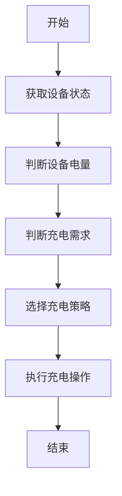

                 


# AI Agent在智能床头柜中的充电管理

## 关键词：AI Agent，智能床头柜，充电管理，算法实现，系统架构，项目实战

## 摘要：本文探讨了AI Agent在智能床头柜充电管理中的应用，详细分析了充电管理的核心问题、解决思路以及AI Agent的算法实现。通过系统架构设计和实际案例分析，展示了AI Agent在优化充电策略、提高设备管理效率方面的优势。最后，本文总结了项目的实施经验，并展望了未来的发展方向。

---

## 第一部分: AI Agent在智能床头柜中的充电管理背景介绍

### 第1章: 问题背景与需求分析

#### 1.1 问题背景

- **智能床头柜的发展现状**  
  智能床头柜作为智能家居的一部分，逐渐成为人们生活中不可或缺的设备。它不仅提供基本的床头柜功能，还集成了智能充电、语音控制、健康监测等多种功能。

- **充电管理中的痛点与挑战**  
  随着智能家居设备的普及，充电设备数量激增，传统的充电管理方式难以满足用户需求。例如，设备充电顺序混乱、充电效率低、设备兼容性差等问题亟待解决。

- **AI Agent技术的引入意义**  
  AI Agent（人工智能代理）能够通过智能决策和优化算法，帮助床头柜实现更高效的充电管理。它可以根据设备的电量、使用习惯和充电需求，动态调整充电策略。

#### 1.2 问题描述

- **智能床头柜的功能需求**  
  智能床头柜需要支持多种设备的充电管理，包括手机、平板、智能手表等。同时，还需要具备智能识别设备、自动启动/停止充电、实时监控设备状态等功能。

- **充电管理的核心问题**  
  充电管理的核心问题在于如何在有限的充电资源下，满足多种设备的充电需求，同时优化充电效率和用户体验。

- **用户需求与系统目标**  
  用户希望床头柜能够自动管理充电过程，优先满足重要设备的充电需求，并且在设备电量不足时及时启动充电。系统目标是实现智能化、个性化的充电管理，提升用户体验。

#### 1.3 问题解决思路

- **AI Agent在充电管理中的作用**  
  AI Agent可以通过收集设备的电量、使用习惯和环境数据，制定个性化的充电策略。例如，根据用户的作息时间，优先为智能手表充电，确保用户能够及时使用设备。

- **技术选型与实现方案**  
  在实现过程中，可以选择基于优先级的充电策略和强化学习算法。优先级策略可以根据设备的重要性和紧急程度进行排序；强化学习算法可以通过不断优化充电策略，提升充电效率。

- **系统架构的设计思路**  
  系统架构需要包括设备管理模块、充电管理模块和用户交互模块。设备管理模块负责识别和管理连接的设备；充电管理模块负责制定和执行充电策略；用户交互模块提供友好的操作界面。

#### 1.4 本章小结

本章从背景介绍和问题分析入手，明确了AI Agent在智能床头柜充电管理中的应用价值和目标。接下来，将深入探讨AI Agent的核心原理和系统架构。

---

## 第二部分: AI Agent与智能床头柜的核心概念

### 第2章: AI Agent的基本原理

#### 2.1 AI Agent的定义与特点

- **AI Agent的定义**  
  AI Agent是一种能够感知环境、自主决策并执行任务的智能实体。它可以在复杂环境中根据实时数据做出最优决策。

- **AI Agent的核心特点**  
  - **自主性**：能够在没有外部干预的情况下独立运行。  
  - **反应性**：能够实时感知环境变化并做出响应。  
  - **目标导向性**：基于目标和优先级进行决策。  
  - **学习能力**：通过数据和反馈不断优化自身行为。

- **AI Agent与传统算法的对比**  
  与传统算法相比，AI Agent具有更强的适应性和灵活性，能够处理复杂多变的环境。

#### 2.2 智能床头柜的系统架构

- **系统组成与功能模块**  
  智能床头柜的系统架构包括以下几个模块：  
  - 设备管理模块：负责识别和管理连接的设备。  
  - 充电管理模块：根据设备的电量和需求制定充电策略。  
  - 用户交互模块：提供友好的操作界面和反馈。

- **设备连接与数据采集**  
  床头柜通过蓝牙、Wi-Fi或USB接口与设备连接，实时采集设备的电量、使用频率等数据。

- **用户交互界面设计**  
  用户可以通过手机APP或床头柜上的触摸屏查看设备状态、设置充电偏好和查看充电记录。

#### 2.3 AI Agent在充电管理中的应用

- **充电需求分析**  
  AI Agent需要分析设备的电量、使用频率和用户需求，确定哪些设备需要优先充电。

- **充电策略的制定**  
  根据设备的重要性和紧急程度，AI Agent会动态调整充电顺序和功率分配。

- **充电过程的优化**  
  在充电过程中，AI Agent会实时监控设备状态，动态调整充电参数，确保设备在最短时间内完成充电。

#### 2.4 本章小结

本章详细介绍了AI Agent的基本原理和智能床头柜的系统架构，为后续的算法实现和系统设计奠定了基础。

---

## 第三部分: AI Agent的算法原理与数学模型

### 第3章: AI Agent的算法实现

#### 3.1 算法原理

- **基于优先级的充电策略**  
  优先级策略的核心思想是根据设备的重要性和电量需求，为每个设备分配优先级。例如，智能手表的优先级高于手机，因为手表通常用于时间管理，延迟充电可能会影响用户体验。

- **基于时间序列的充电预测**  
  通过分析设备的历史使用数据，AI Agent可以预测设备未来的电量消耗情况，提前制定充电计划。

- **基于强化学习的充电优化**  
  强化学习是一种通过试错不断优化策略的算法。AI Agent可以通过与环境的交互，学习最优的充电策略，例如在电量紧张时优先充电重要设备。

#### 3.2 算法流程图



#### 3.3 数学模型

- **优先级计算公式**  
  设备的优先级可以通过以下公式计算：  
  $$ priority = \alpha \times importance + \beta \times urgency $$  
  其中，$\alpha$ 和 $\beta$ 是权重系数，$importance$ 表示设备的重要程度，$urgency$ 表示设备的紧急程度。

- **充电功率分配模型**  
  在多设备充电场景下，AI Agent可以根据设备的优先级和剩余电量，动态分配充电功率：  
  $$ power_i = \frac{priority_i}{\sum_{j} priority_j} \times total\_power $$  
  其中，$priority_i$ 是设备i的优先级，$total\_power$ 是床头柜的最大充电功率。

#### 3.4 实际案例分析

- **案例1：优先级排序**  
  假设有两个设备，设备A（重要性高，紧急程度中）和设备B（重要性中，紧急程度高）。根据优先级公式，设备A的优先级为$0.7\alpha + 0.3\beta$，设备B的优先级为$0.3\alpha + 0.7\beta$。假设$\alpha=0.6$，$\beta=0.4$，则设备A的优先级为$0.42 + 0.12=0.54$，设备B的优先级为$0.18 + 0.28=0.46$。因此，设备A将优先充电。

- **案例2：充电功率分配**  
  假设床头柜的最大充电功率为100W，设备A的优先级为0.6，设备B的优先级为0.4。根据功率分配公式，设备A将分配$60W$，设备B将分配$40W$。

#### 3.5 本章小结

本章通过算法流程图和数学模型，详细阐述了AI Agent在智能床头柜充电管理中的实现原理。接下来，将从系统架构和项目实战的角度，进一步探讨充电管理的实现细节。

---

## 第四部分: 系统分析与架构设计方案

### 第4章: 系统架构设计

#### 4.1 问题场景介绍

- **问题场景**  
  在智能床头柜中，需要同时管理多个设备的充电需求。设备类型多样，电量需求不同，用户对充电时间也有不同的期望。如何在有限的充电资源下，实现高效的充电管理，是一个复杂的系统性问题。

#### 4.2 项目介绍

- **项目目标**  
  实现一个基于AI Agent的智能床头柜充电管理系统，能够根据设备状态和用户需求，动态调整充电策略，优化充电效率和用户体验。

- **系统功能设计**  
  - 设备管理：支持多种设备的连接和识别。  
  - 充电管理：根据设备状态和用户偏好，制定和执行充电策略。  
  - 用户交互：提供友好的操作界面和实时反馈。

#### 4.3 系统架构设计

- **领域模型（类图）**  
  ```mermaid
  classDiagram
  class Device {
      - id: int
      - name: string
      - battery_level: float
      - charging_status: bool
      + getId(): int
      + getBatteryLevel(): float
      + getChargingStatus(): bool
      + setChargingStatus(status: bool): void
  }
  class Charger {
      - id: int
      - power: float
      - status: bool
      + getId(): int
      + getPower(): float
      + getStatus(): bool
      + setStatus(status: bool): void
  }
  class ChargingStrategy {
      - devices: list(Device)
      - chargers: list(Charger)
      + getDevicePriorities(): list(float)
      + assignPower(devices: list(Device), chargers: list(Charger)): list(float)
  }
  class AI-Agent {
      - devices: list(Device)
      - chargers: list(Charger)
      - strategy: ChargingStrategy
      + updateDevicesStatus(): void
      + updateChargersStatus(): void
      + executeChargingStrategy(): void
  }
  ```

- **系统架构图**  
  ```mermaid
  graph TD
  AI-Agent --> Charger
  AI-Agent --> Device
  AI-Agent --> ChargingStrategy
  Charger --> Device
  ```

- **系统接口设计**  
  - 设备管理接口：用于设备的连接和断开。  
  - 充电管理接口：用于获取设备状态、设置充电策略和启动/停止充电。  
  - 用户交互接口：用于显示设备状态、充电进度和用户设置。

- **系统交互流程图**  
  ```mermaid
  sequenceDiagram
  participant User
  participant AI-Agent
  participant Charger
  participant Device
  User -> AI-Agent: 查询设备状态
  AI-Agent -> Device: 获取设备电量
  Device --> AI-Agent: 返回电量
  AI-Agent -> Charger: 获取充电状态
  Charger --> AI-Agent: 返回充电状态
  AI-Agent -> Charger: 设置充电功率
  Charger --> Device: 开始充电
  ```

#### 4.4 本章小结

本章通过系统架构设计，明确了智能床头柜充电管理系统的各个组成部分及其交互关系。接下来，将从项目实战的角度，详细讲解系统的实现细节。

---

## 第五部分: 项目实战

### 第5章: 系统核心实现

#### 5.1 环境安装

- **开发环境**  
  - 操作系统：Linux/Windows/MacOS  
  - 开发工具：Python 3.8+，IDE（PyCharm/VS Code）  
  - 第三方库：numpy, matplotlib, scikit-learn

- **安装步骤**  
  ```bash
  pip install numpy matplotlib scikit-learn
  ```

#### 5.2 核心代码实现

- **AI Agent实现**  
  ```python
  class AI-Agent:
      def __init__(self, devices, chargers):
          self.devices = devices
          self.chargers = chargers
          self.strategy = ChargingStrategy(devices, chargers)

      def updateDevicesStatus(self):
          # 获取设备状态
          pass

      def updateChargersStatus(self):
          # 获取充电器状态
          pass

      def executeChargingStrategy(self):
          # 执行充电策略
          pass
  ```

- **充电策略实现**  
  ```python
  class ChargingStrategy:
      def __init__(self, devices, chargers):
          self.devices = devices
          self.chargers = chargers

      def getDevicePriorities(self):
          # 根据设备的重要性、紧急程度计算优先级
          pass

      def assignPower(self, devices, chargers):
          # 根据优先级分配充电功率
          pass
  ```

- **设备管理实现**  
  ```python
  class Device:
      def __init__(self, id, name):
          self.id = id
          self.name = name
          self.battery_level = 0.0
          self.charging_status = False

      def getBatteryLevel(self):
          return self.battery_level

      def getChargingStatus(self):
          return self.charging_status

      def setChargingStatus(self, status):
          self.charging_status = status
  ```

#### 5.3 代码应用解读与分析

- **AI Agent的初始化与运行**  
  ```python
  devices = [Device(1, 'Smart Watch'), Device(2, 'Phone')]
  chargers = [Charger(1, 100, False)]
  ai_agent = AI-Agent(devices, chargers)
  ai_agent.executeChargingStrategy()
  ```

- **优先级计算与功率分配**  
  ```python
  priorities = ai_agent.strategy.getDevicePriorities()
  power_allocation = ai_agent.strategy.assignPower(devices, chargers)
  ```

#### 5.4 实际案例分析

- **案例1：设备优先级计算**  
  设备1（智能手表）的重要性为0.8，紧急程度为0.6；设备2（手机）的重要性为0.6，紧急程度为0.8。根据优先级公式，设备1的优先级为$0.8 \times 0.6 + 0.2 \times 0.8 = 0.64$，设备2的优先级为$0.6 \times 0.8 + 0.2 \times 0.6 = 0.54$。因此，设备1将优先充电。

- **案例2：充电功率分配**  
  假设床头柜的最大充电功率为100W，设备1的优先级为0.6，设备2的优先级为0.4。根据功率分配公式，设备1将分配$60W$，设备2将分配$40W$。

#### 5.5 本章小结

本章通过代码实现和案例分析，详细讲解了AI Agent在智能床头柜充电管理中的具体实现。接下来，将总结项目的实施经验，并展望未来的发展方向。

---

## 第六部分: 最佳实践与总结

### 第6章: 最佳实践

#### 6.1 小结

- **系统优势**  
  基于AI Agent的智能床头柜充电管理系统，能够根据设备状态和用户需求，动态调整充电策略，优化充电效率和用户体验。

- **实施经验**  
  在实际项目中，需要特别注意设备兼容性、用户隐私保护和系统稳定性。同时，建议在系统中加入用户自定义功能，以满足不同用户的需求。

#### 6.2 注意事项

- **设备兼容性**  
  确保床头柜支持多种设备的充电需求，包括不同品牌和类型的设备。

- **用户隐私保护**  
  在设备管理中，需要保护用户的隐私数据，避免数据泄露和滥用。

- **系统稳定性**  
  确保系统在高负载和复杂环境下的稳定运行，避免因系统故障导致充电中断。

#### 6.3 拓展阅读

- **相关技术**  
  - 强化学习在资源分配中的应用  
  - 多目标优化在智能系统中的应用  
  - 智能家居设备的协同优化

- **未来展望**  
  随着AI技术的不断发展，智能床头柜的功能将更加智能化和个性化。未来，床头柜可能集成更多功能，如健康监测、环境感知和智能交互。

---

## 结语

通过本文的详细讲解，我们可以看到，AI Agent在智能床头柜中的充电管理具有广阔的应用前景。通过合理的系统设计和算法优化，可以实现高效、智能的充电管理，提升用户体验。未来，随着技术的不断进步，智能床头柜的功能将更加丰富，AI Agent的应用也将更加广泛。

---

## 作者：AI天才研究院 & 禅与计算机程序设计艺术

--- 

这篇文章系统地探讨了AI Agent在智能床头柜充电管理中的应用，从理论分析到实际实现，涵盖了技术细节和项目经验。通过本文的阅读，读者可以全面了解AI Agent在智能床头柜中的具体应用，掌握充电管理的核心技术和实现方法。

