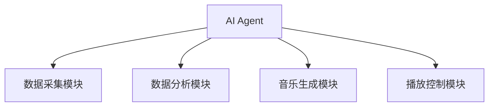
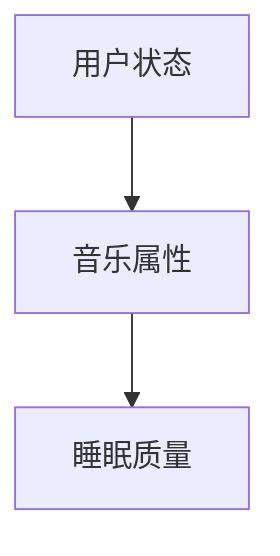
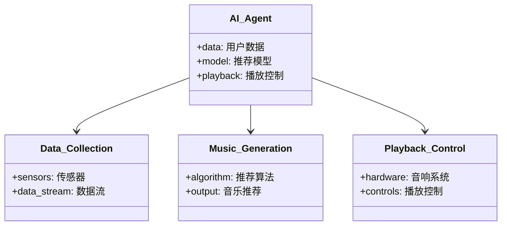
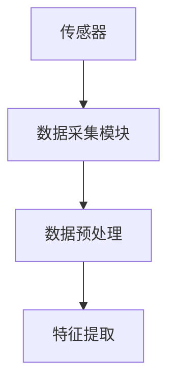
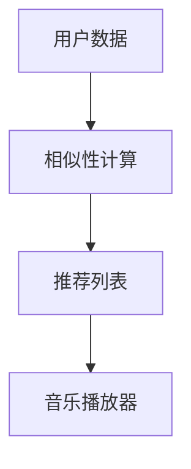
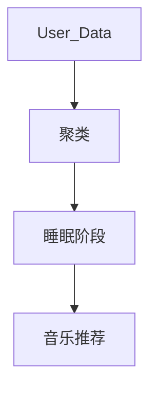
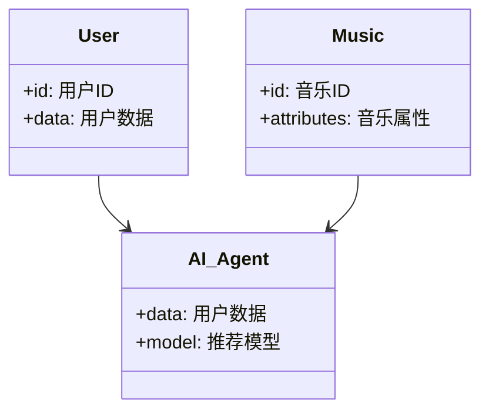
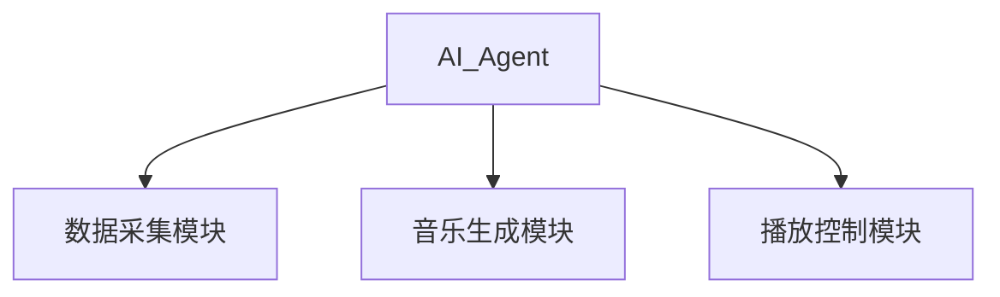
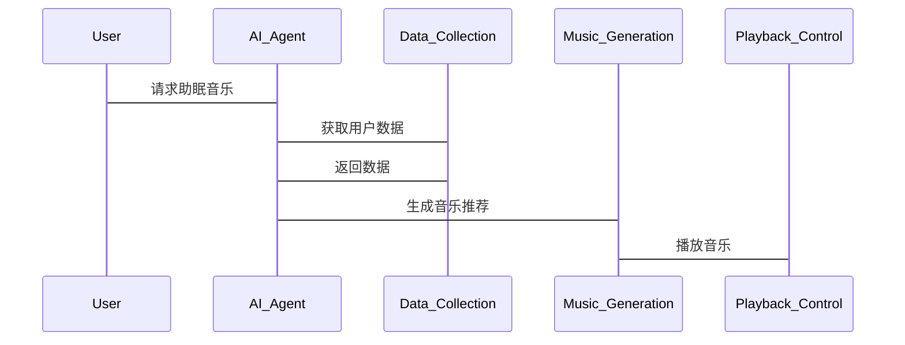

                 


# AI Agent在智能床头柜中的助眠音乐定制

> 关键词：AI Agent, 智能床头柜, 助眠音乐, 定制推荐, 算法原理

> 摘要：本文探讨了AI Agent在智能床头柜中的应用，特别是在助眠音乐的定制推荐方面。通过分析用户需求、系统架构设计、算法原理和项目实现，本文详细阐述了如何利用AI技术实现个性化的助眠音乐推荐，为用户提供高效的睡眠解决方案。

---

## 第1章: 背景介绍

### 1.1 问题背景

#### 1.1.1 助眠音乐的重要性
现代人生活节奏快，压力大，睡眠问题日益普遍。助眠音乐通过调节神经系统，帮助用户放松身心，进入深度睡眠。传统助眠音乐多为固定曲目，难以满足个性化需求。

#### 1.1.2 现有助眠音乐的局限性
现有助眠音乐通常基于固定分类（如白噪音、自然声音、古典音乐等），无法根据用户的实时状态（如心率、情绪、睡眠周期）动态调整。

#### 1.1.3 AI技术在助眠音乐中的潜力
AI技术可以通过分析用户数据，实时生成个性化音乐推荐，动态调整音乐节奏、音调和节拍，以优化用户的睡眠质量。

### 1.2 问题描述

#### 1.2.1 用户需求分析
用户需要根据自身状态（如压力水平、情绪状态、睡眠周期）动态调整助眠音乐的节奏、音调和节拍。

#### 1.2.2 助眠音乐个性化推荐的挑战
- 数据采集：需要实时采集用户的心率、呼吸频率、体温等生理数据。
- 算法复杂性：需要结合机器学习算法，实时生成个性化音乐推荐。
- 系统集成：需要将AI算法与智能床头柜硬件无缝集成。

#### 1.2.3 AI Agent在智能床头柜中的作用
AI Agent作为智能床头柜的核心模块，负责采集用户数据、分析需求、生成音乐推荐，并通过床头柜的音响系统播放音乐。

### 1.3 问题解决

#### 1.3.1 AI Agent的核心作用
AI Agent通过实时分析用户数据，动态调整助眠音乐的参数，提供个性化的睡眠解决方案。

#### 1.3.2 助眠音乐定制的实现路径
1. 数据采集：通过智能床头柜中的传感器采集用户数据。
2. 数据分析：利用机器学习算法分析用户数据。
3. 音乐生成：根据分析结果生成个性化音乐推荐。
4. 音乐播放：通过床头柜音响系统播放音乐。

#### 1.3.3 系统设计的总体思路
系统设计采用模块化架构，分为数据采集模块、数据分析模块、音乐生成模块和播放控制模块。

### 1.4 边界与外延

#### 1.4.1 系统功能的边界
- 数据采集范围：心率、呼吸频率、体温。
- 助眠音乐类型：白噪音、自然声音、古典音乐。
- 睡眠周期支持：深度睡眠、浅睡眠、觉醒状态。

#### 1.4.2 助眠音乐定制的适用范围
- 用户年龄：18岁以上。
- 用户健康状况：无严重心脏病、高血压等疾病。

#### 1.4.3 AI Agent与其他功能的协同
AI Agent与床头柜的灯光、温度调节功能协同工作，提供全方位的睡眠优化方案。

### 1.5 概念结构与核心要素

#### 1.5.1 核心概念的层次结构
```
AI Agent
├── 数据采集模块
├── 数据分析模块
├── 音乐生成模块
└── 播放控制模块
```

#### 1.5.2 核心要素的定义与关系
| 核心要素 | 定义 | 关系 |
|----------|------|------|
| 数据采集模块 | 采集用户生理数据 | 与数据分析模块交互 |
| 数据分析模块 | 分析用户数据 | 与音乐生成模块交互 |
| 音乐生成模块 | 生成个性化音乐推荐 | 与播放控制模块交互 |
| 播放控制模块 | 控制音乐播放 | 与床头柜硬件交互 |

#### 1.5.3 概念结构的图示化展示


---

## 第2章: 核心概念与联系

### 2.1 AI Agent的定义与原理

#### 2.1.1 AI Agent的基本定义
AI Agent是一种智能体，能够感知环境、分析数据并采取行动以实现目标。

#### 2.1.2 AI Agent的核心原理
AI Agent通过感知环境、分析数据、制定决策并执行行动，实现对环境的智能控制。

#### 2.1.3 AI Agent与助眠音乐的关系
AI Agent作为智能床头柜的核心模块，负责分析用户数据并生成个性化助眠音乐推荐。

### 2.2 助眠音乐的核心要素

#### 2.2.1 助眠音乐的属性特征
| 属性 | 特征 |
|------|------|
| 音调 | 放松、舒缓 |
| 节奏 | 缓慢、稳定 |
| 音量 | 舒适、柔和 |

#### 2.2.2 助眠音乐与用户状态的关系


### 2.3 系统架构设计

#### 2.3.1 系统功能模块


---

## 第3章: 算法原理

### 3.1 数据采集与预处理

#### 3.1.1 数据采集流程


#### 3.1.2 数据预处理方法
- 去噪处理：去除传感器噪声。
- 标准化：将数据归一化处理。

### 3.2 推荐算法

#### 3.2.1 协同过滤算法
协同过滤算法基于用户相似性或物品相似性推荐音乐。

#### 3.2.2 基于聚类的推荐算法
聚类算法将用户分成不同的睡眠状态群体，推荐相应的音乐。

### 3.3 算法流程

#### 3.3.1 协同过滤算法流程


#### 3.3.2 聚类算法流程


### 3.4 算法实现

#### 3.4.1 协同过滤算法实现
```python
import numpy as np

# 用户-物品矩阵
user_item_matrix = np.array([[1, 2, 3], [4, 5, 6], [7, 8, 9]])

# 计算余弦相似性
def cosine_similarity(matrix):
    # 归一化
    normalized = matrix / np.linalg.norm(matrix, axis=1, keepdims=True)
    # 计算相似性
    similarity = np.dot(normalized, normalized.T)
    return similarity

similarity = cosine_similarity(user_item_matrix)
print(similarity)
```

#### 3.4.2 聚类算法实现
```python
from sklearn.cluster import KMeans

# 特征数据
features = np.array([[1, 2], [3, 4], [5, 6]])

# 聚类
kmeans = KMeans(n_clusters=2)
kmeans.fit(features)

# 获取聚类结果
labels = kmeans.labels_
print(labels)
```

### 3.5 数学模型

#### 3.5.1 协同过滤模型
$$ \text{相似性} = \frac{\sum_{i=1}^{n} x_i y_i}{\sqrt{\sum_{i=1}^{n} x_i^2} \cdot \sqrt{\sum_{i=1}^{n} y_i^2}} $$

#### 3.5.2 聚类模型
$$ \text{目标函数} = \sum_{i=1}^{k} \sum_{j=1}^{n} (x_{ij} - c_j)^2 $$

---

## 第4章: 系统分析与架构设计

### 4.1 问题场景

#### 4.1.1 功能需求
- 数据采集：心率、呼吸频率、体温。
- 数据分析：用户睡眠状态分析。
- 音乐推荐：个性化音乐推荐。
- 音乐播放：控制播放设备。

#### 4.1.2 约束条件
- 硬件限制：床头柜传感器和音响系统。
- 软件限制：AI Agent算法性能。

### 4.2 系统功能设计

#### 4.2.1 领域模型


#### 4.2.2 系统架构


### 4.3 接口设计

#### 4.3.1 数据接口
- 数据采集模块：提供REST API接口。
- 数据分析模块：提供数据处理接口。

#### 4.3.2 播放控制接口
- 音乐生成模块：提供音乐推荐接口。
- 播放控制模块：提供播放控制接口。

### 4.4 交互设计

#### 4.4.1 用户-系统交互


---

## 第5章: 项目实战

### 5.1 环境安装

#### 5.1.1 系统环境
- 操作系统：Linux/Windows/MacOS。
- 开发工具：Python、Jupyter Notebook、Git。

#### 5.1.2 依赖安装
```bash
pip install numpy
pip install scikit-learn
pip install mermaid
```

### 5.2 核心代码实现

#### 5.2.1 数据采集模块
```python
import numpy as np

def collect_data(sensors):
    # 模拟传感器数据采集
    data = np.random.normal(size=(100, 3))
    return data
```

#### 5.2.2 数据分析模块
```python
from sklearn.cluster import KMeans

def analyze_data(data):
    # 聚类分析
    kmeans = KMeans(n_clusters=2)
    labels = kmeans.fit_predict(data)
    return labels
```

#### 5.2.3 音乐生成模块
```python
def generate_music(recommendation):
    # 播放音乐
    print("Playing music:", recommendation)
```

### 5.3 案例分析

#### 5.3.1 数据采集案例
```python
sensors = ["heart_rate", "breathing_rate", "temperature"]
data = collect_data(sensors)
print(data)
```

#### 5.3.2 数据分析案例
```python
labels = analyze_data(data)
print(labels)
```

#### 5.3.3 音乐生成案例
```python
recommendation = labels[0]
generate_music(recommendation)
```

---

## 第6章: 最佳实践

### 6.1 小结

#### 6.1.1 核心内容回顾
AI Agent通过实时分析用户数据，动态调整助眠音乐的节奏、音调和节拍，提供个性化的睡眠解决方案。

#### 6.1.2 项目实现的关键点
- 数据采集的准确性。
- 算法的实时性。
- 系统的稳定性。

### 6.2 注意事项

#### 6.2.1 数据隐私
确保用户数据的安全性和隐私性。

#### 6.2.2 系统兼容性
确保系统与不同床头柜硬件的兼容性。

### 6.3 拓展阅读

#### 6.3.1 推荐算法优化
探索更高效的音乐推荐算法。

#### 6.3.2 系统集成
研究AI Agent在其他智能家居设备中的应用。

---

## 作者信息

作者：AI天才研究院/AI Genius Institute & 禅与计算机程序设计艺术/Zen And The Art of Computer Programming

