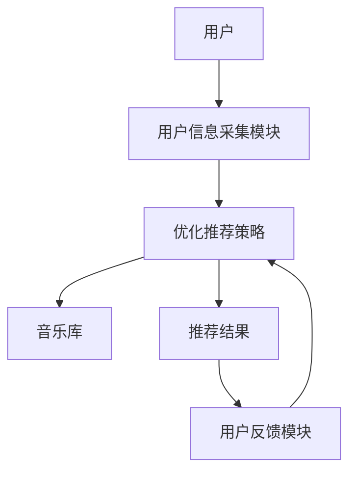
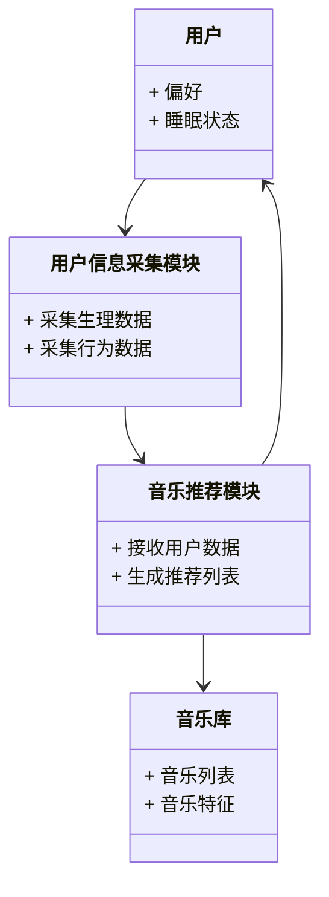

                 


# AI Agent在智能床头柜中的助眠音乐选择

## 关键词：AI Agent，智能床头柜，助眠音乐，协同过滤推荐算法，系统架构设计

## 摘要：  
随着人工智能技术的快速发展，智能床头柜逐渐成为现代家居生活的重要组成部分。本文深入探讨了AI Agent在智能床头柜中的应用，特别是在助眠音乐选择方面。通过分析用户需求和音乐特征，结合协同过滤推荐算法，提出了一种高效的助眠音乐推荐系统。本文详细介绍了系统的架构设计、算法实现和实际应用，为智能床头柜的设计和优化提供了理论依据和实践指导。

---

# 第1章 助眠音乐选择的背景与问题背景

## 1.1 助眠音乐选择的背景

### 1.1.1 睡眠健康的重要性  
睡眠是人类健康的核心要素之一，直接影响着人体的生理功能和心理健康。根据世界卫生组织的报告，全球约有10%~15%的人存在睡眠障碍问题。助眠音乐作为一种非侵入式的干预手段，能够有效缓解失眠、焦虑等问题，帮助用户获得更好的睡眠质量。

### 1.1.2 助眠音乐在现代生活中的作用  
现代生活节奏快、压力大，许多人通过音乐来放松身心。助眠音乐通过特定的旋律、节奏和频率，能够调节人体的生理状态，降低心率、缓解焦虑，从而帮助用户进入深度睡眠。

### 1.1.3 智能床头柜的发展趋势  
随着智能家居的普及，床头柜的功能不再局限于简单的储物或装饰，而是逐渐向智能化方向发展。智能床头柜可以通过传感器和AI技术，实时监测用户的睡眠状态，并根据数据提供个性化的助眠服务。

---

## 1.2 助眠音乐选择的问题背景

### 1.2.1 现有睡眠辅助工具的局限性  
传统的助眠工具，如白噪音机或固定的音乐播放器，无法根据用户的实时需求进行个性化推荐。用户需要手动选择音乐，体验不够便捷。

### 1.2.2 用户个性化需求的多样性  
每个人的睡眠需求和音乐偏好都不同。有些人喜欢轻柔的古典音乐，有些人则偏好自然声音或冥想音乐。如何满足用户的个性化需求，是助眠音乐推荐系统的核心挑战。

### 1.2.3 助眠音乐选择的科学依据  
助眠音乐的选择需要结合音乐学、心理学和生理学的理论。例如，节奏较慢的音乐（每分钟60~80拍）更适合助眠，而过于刺激的音乐则可能适得其反。

---

# 第2章 AI Agent的核心概念与工作原理

## 2.1 AI Agent的定义与特点

### 2.1.1 AI Agent的定义  
AI Agent（人工智能代理）是指能够感知环境、执行任务并做出决策的智能实体。它能够通过传感器获取数据，利用算法进行分析，并通过执行器与环境交互。

### 2.1.2 AI Agent的核心特点  
1. **自主性**：AI Agent能够自主决策，无需人工干预。  
2. **反应性**：能够实时感知环境变化并做出响应。  
3. **学习能力**：通过机器学习算法不断优化决策模型。  

### 2.1.3 AI Agent与传统软件的区别  
AI Agent的核心区别在于其智能化和自主性。传统软件依赖于固定的规则，而AI Agent能够通过数据学习，动态调整行为策略。

---

## 2.2 AI Agent在智能床头柜中的应用

### 2.2.1 AI Agent的功能模块  
1. **用户信息采集模块**：通过传感器采集用户的生理数据（如心率、体温）和行为数据（如睡眠周期）。  
2. **音乐推荐模块**：基于用户数据，结合音乐库进行个性化推荐。  
3. **用户反馈模块**：收集用户的反馈，优化推荐算法。  

### 2.2.2 AI Agent与智能床头柜的交互方式  
AI Agent通过床头柜的传感器获取数据，并通过床头柜的音响设备播放推荐的音乐。用户可以通过床头柜的触摸屏或语音助手与AI Agent进行交互。

### 2.2.3 AI Agent的决策机制  
AI Agent通过机器学习模型分析用户数据，生成推荐音乐列表，并根据用户的反馈不断优化推荐策略。

---

# 第3章 助眠音乐选择的算法原理

## 3.1 助眠音乐选择的核心算法

### 3.1.1 基于用户生理数据的音乐推荐  
AI Agent可以通过分析用户的心率、体温等数据，推荐适合当前生理状态的音乐。例如，当用户心率较高时，推荐节奏较慢的音乐。

### 3.1.2 基于用户行为数据的音乐推荐  
通过分析用户的睡眠周期和音乐偏好，AI Agent可以预测用户的助眠需求，并推荐相应的音乐。

### 3.1.3 基于音乐特征的推荐算法  
音乐特征包括节奏、音调、音量等。通过分析这些特征，AI Agent可以将音乐分成不同的类别，并根据用户的偏好进行推荐。

---

## 3.2 协同过滤推荐算法

### 3.2.1 协同过滤的定义  
协同过滤是一种基于用户相似性或物品相似性的推荐算法。通过分析用户的行为数据，找到与当前用户相似的用户群体，并推荐他们喜欢的音乐。

### 3.2.2 基于用户的协同过滤  
基于用户的协同过滤通过计算用户之间的相似性，推荐相似用户喜欢的音乐。例如，使用余弦相似度计算用户之间的相似性。

### 3.2.3 基于物品的协同过滤  
基于物品的协同过滤通过分析音乐之间的相似性，推荐与当前用户喜欢的音乐相似的音乐。

---

## 3.3 协同过滤算法的数学模型

### 3.3.1 基于用户的协同过滤公式  
$$ sim(u, v) = \frac{\sum_{i=1}^{n} (r_{u,i} - \bar{r}_u)(r_{v,i} - \bar{r}_v)}{\sqrt{\sum_{i=1}^{n} (r_{u,i} - \bar{r}_u)^2} \sqrt{\sum_{i=1}^{n} (r_{v,i} - \bar{r}_v)^2}} $$  
其中，$sim(u, v)$ 表示用户 $u$ 和 $v$ 的相似度，$r_{u,i}$ 表示用户 $u$ 对物品 $i$ 的评分，$\bar{r}_u$ 表示用户 $u$ 的平均评分。

### 3.3.2 基于物品的协同过滤公式  
$$ sim(i, j) = \frac{\sum_{u=1}^{n} (r_{u,i} - \bar{r}_i)(r_{u,j} - \bar{r}_j)}{\sqrt{\sum_{u=1}^{n} (r_{u,i} - \bar{r}_i)^2} \sqrt{\sum_{u=1}^{n} (r_{u,j} - \bar{r}_j)^2}} $$  
其中，$sim(i, j)$ 表示物品 $i$ 和 $j$ 的相似度，$r_{u,i}$ 表示用户 $u$ 对物品 $i$ 的评分，$\bar{r}_i$ 表示物品 $i$ 的平均评分。

---

## 3.4 协同过滤算法的Python实现

### 3.4.1 环境搭建  
需要安装以下库：  
```bash
pip install numpy pandas scikit-learn
```

### 3.4.2 核心代码实现  
```python
import numpy as np
from sklearn.metrics.pairwise import cosine_similarity

# 示例数据：用户-音乐评分矩阵
ratings = np.array([
    [4, 3, 0],
    [3, 1, 4],
    [0, 5, 2],
    [2, 0, 5]
])

# 计算用户-用户协同过滤的相似度矩阵
def compute_user_similarity(ratings):
    # 计算平均评分
    avg_ratings = np.mean(ratings, axis=1).reshape(-1, 1)
    # 标准化评分
    normalized_ratings = ratings - avg_ratings
    # 计算余弦相似度
    similarity = cosine_similarity(normalized_ratings)
    return similarity

# 计算相似度矩阵
similarity = compute_user_similarity(ratings)
print("相似度矩阵：\n", similarity)
```

---

## 3.5 算法优化与效果评估

### 3.5.1 算法优化  
1. **基于用户的协同过滤**：通过计算用户相似性，推荐相似用户的音乐。  
2. **基于物品的协同过滤**：通过分析音乐特征，推荐相似的音乐。  
3. **混合推荐策略**：结合用户和物品的特征，提升推荐的准确率。

### 3.5.2 效果评估  
通过准确率、召回率和F1分数评估推荐算法的效果。例如，使用交叉验证的方法，计算推荐算法的准确率。

---

# 第4章 助眠音乐选择系统的架构设计

## 4.1 系统功能模块设计

### 4.1.1 用户信息采集模块  
功能：通过传感器采集用户的生理数据和行为数据。  
输入：用户的心率、体温等数据。  
输出：用户的睡眠状态和偏好。

### 4.1.2 音乐推荐模块  
功能：基于用户数据，推荐助眠音乐。  
输入：用户数据和音乐库。  
输出：推荐的音乐列表。

### 4.1.3 用户反馈模块  
功能：收集用户的反馈，优化推荐算法。  
输入：用户的反馈（如喜欢或不喜欢）。  
输出：优化后的推荐策略。

---

## 4.2 系统架构设计

### 4.2.1 系统整体架构图  


### 4.2.2 数据流设计  
1. 用户信息采集模块将数据传递给音乐推荐模块。  
2. 音乐推荐模块从音乐库中获取数据，生成推荐列表。  
3. 用户反馈模块收集用户的反馈，优化推荐算法。

---

## 4.3 系统接口设计

### 4.3.1 系统接口  
1. **用户信息接口**：获取用户的生理数据和行为数据。  
2. **音乐推荐接口**：根据用户数据返回推荐的音乐列表。  
3. **用户反馈接口**：收集用户的音乐偏好反馈。

---

## 4.4 系统交互流程

### 4.4.1 交互流程  
```mermaid
sequenceDiagram
    user ->+> 智能床头柜: 请求助眠音乐
    智能床头柜 ->+> AI Agent: 获取用户数据
    AI Agent ->+> 用户信息采集模块: 获取生理数据和行为数据
    AI Agent ->+> 音乐推荐模块: 生成推荐列表
    AI Agent ->+> 智能床头柜: 返回推荐音乐列表
    user ->+> 智能床头柜: 选择音乐
    智能床头柜 ->+> AI Agent: 获取用户反馈
    AI Agent ->+> 用户反馈模块: 优化推荐策略
```

---

## 4.5 系统架构图



---

# 第5章 助眠音乐选择系统的实现

## 5.1 环境搭建与开发工具

### 5.1.1 开发环境安装  
安装Python和相关库：  
```bash
pip install numpy scikit-learn pandas
```

### 5.1.2 开发工具配置  
使用Jupyter Notebook或PyCharm进行开发。

### 5.1.3 数据集准备  
需要收集用户的生理数据和行为数据，建立音乐库。

---

## 5.2 核心算法实现

### 5.2.1 协同过滤算法实现  
```python
from sklearn.metrics.pairwise import cosine_similarity

# 示例数据：用户-音乐评分矩阵
ratings = np.array([
    [4, 3, 0],
    [3, 1, 4],
    [0, 5, 2],
    [2, 0, 5]
])

# 计算用户-用户协同过滤的相似度矩阵
similarity = cosine_similarity(ratings)
print("相似度矩阵：\n", similarity)
```

---

## 5.3 项目实战

### 5.3.1 实际案例分析  
以某用户的睡眠数据为例，展示AI Agent如何推荐助眠音乐。

### 5.3.2 项目总结  
总结项目的实现过程和效果，分析存在的问题和改进方向。

---

## 5.4 项目优化与拓展

### 5.4.1 算法优化  
结合深度学习模型（如神经网络）进一步优化推荐算法。

### 5.4.2 功能扩展  
增加更多的音乐类型和个性化推荐功能。

---

## 5.5 项目总结与展望

### 5.5.1 项目总结  
总结项目的实现过程、主要成果和不足之处。

### 5.5.2 项目展望  
展望未来的发展方向，如结合更多传感器数据，进一步提升推荐的准确性。

---

## 5.6 小结

通过本文的详细讲解，我们可以看到AI Agent在智能床头柜中的助眠音乐选择系统是一个复杂但极具潜力的领域。通过结合机器学习算法和智能硬件，我们可以为用户提供更加智能化、个性化的睡眠健康解决方案。

---

## 作者

**作者：AI天才研究院/AI Genius Institute & 禅与计算机程序设计艺术 /Zen And The Art of Computer Programming**

---

以上是《AI Agent在智能床头柜中的助眠音乐选择》的技术博客文章的详细内容，涵盖了从背景到算法实现再到系统设计的各个方面。希望对您有所帮助！

