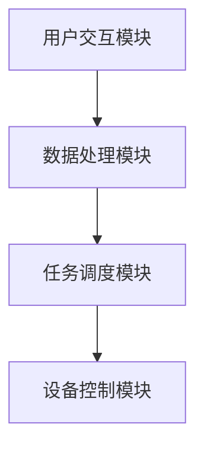

                 


# AI Agent在智能床头柜中的晨间仪式规划

## 关键词：AI Agent, 智能床头柜, 晨间仪式, 人工智能, 智能家居, 任务规划

## 摘要：  
本文详细探讨了AI Agent在智能床头柜中的应用，重点分析了晨间仪式规划的核心原理、系统架构、算法实现及实际应用场景。通过理论分析和实践案例，展示了如何利用AI技术优化用户的日常生活体验，实现智能化的晨间管理。

---

## 第一章: AI Agent与智能床头柜的背景介绍

### 1.1 AI Agent的基本概念  
AI Agent（人工智能代理）是一种能够感知环境、自主决策并执行任务的智能体。它可以理解用户的意图，主动提供服务，广泛应用于智能家居、医疗、教育等领域。  

#### 1.1.1 什么是AI Agent  
AI Agent是具备以下特征的智能系统：  
- **自主性**：无需外部干预，自主完成任务。  
- **反应性**：能够感知环境变化并做出实时反应。  
- **目标导向**：基于目标驱动行为，优化决策。  

#### 1.1.2 AI Agent的核心特征  
- **学习能力**：通过数据不断优化决策模型。  
- **推理能力**：基于逻辑推理解决问题。  
- **交互能力**：与用户或设备进行有效沟通。  

#### 1.1.3 AI Agent的应用场景  
- 智能家居：控制家电、管理日程。  
- 医疗健康：监测健康数据、提供医疗建议。  
- 教育领域：个性化学习推荐、辅助教学。  

### 1.2 智能床头柜的定义与功能  
智能床头柜是一种结合了AI技术的智能家居设备，主要用于提升用户的睡眠和晨起体验。  

#### 1.2.1 智能床头柜的基本功能  
- 睡眠监测：通过传感器监测用户的睡眠质量。  
- 晨间闹钟：根据用户的作息习惯智能调整闹钟时间。  
- 设备控制：联动智能家居设备（如灯光、空调）。  

#### 1.2.2 智能床头柜的智能化升级  
- 集成AI Agent，实现自动化管理。  
- 支持语音交互，提升用户体验。  
- 数据分析，优化服务策略。  

#### 1.2.3 智能床头柜的用户需求分析  
- 用户希望简化晨起流程。  
- 用户需要个性化的服务。  
- 用户关注设备的易用性和安全性。  

### 1.3 晨间仪式规划的必要性  
晨间仪式规划是提升用户生活质量的重要环节，AI Agent在其中扮演了关键角色。  

#### 1.3.1 晨间仪式的基本构成  
- 起床提醒  
- 健康监测  
- 生活安排（如泡咖啡、开启灯光）  

#### 1.3.2 AI Agent在晨间仪式中的作用  
- 智能调度：根据用户的作息习惯安排任务。  
- 信息整合：结合天气、日程安排优化服务。  
- 用户反馈：实时调整服务策略。  

#### 1.3.3 智能床头柜实现晨间仪式规划的优势  
- 高度集成：床头柜作为中枢，联动其他设备。  
- 个性化服务：基于用户数据提供定制化方案。  
- 实时反馈：快速响应用户需求。  

---

## 第二章: AI Agent在智能床头柜中的核心概念  

### 2.1 AI Agent的核心原理  
AI Agent通过感知、决策和执行实现任务规划。  

#### 2.1.1 AI Agent的基本工作流程  
1. **感知环境**：收集用户数据和设备状态。  
2. **分析需求**：解析用户的意图和偏好。  
3. **制定计划**：生成任务执行的最优方案。  
4. **执行任务**：通过床头柜控制相关设备。  
5. **反馈优化**：根据执行结果调整策略。  

#### 2.1.2 AI Agent的感知与决策机制  
- **感知**：通过传感器、语音交互获取信息。  
- **决策**：基于规则引擎或机器学习模型做出选择。  

#### 2.1.3 AI Agent的学习与优化能力  
- **学习**：通过强化学习优化任务调度策略。  
- **优化**：利用历史数据提升决策的准确性。  

### 2.2 智能床头柜的系统架构  
系统架构决定了AI Agent与床头柜的协同工作方式。  

#### 2.2.1 系统的整体架构设计  
- **用户交互模块**：负责与用户的语音或触控交互。  
- **数据处理模块**：分析用户的作息数据和偏好。  
- **任务调度模块**：生成并执行任务计划。  
- **设备控制模块**：联动智能家居设备。  

#### 2.2.2 各模块的功能描述  
- **用户交互模块**：支持语音指令和触控操作。  
- **数据处理模块**：整合睡眠数据、天气信息、日程安排。  
- **任务调度模块**：根据优先级安排任务执行顺序。  
- **设备控制模块**：通过API控制智能家居设备。  

#### 2.2.3 系统的交互流程  
1. 用户通过语音指令设定起床时间。  
2. 系统分析用户的作息习惯，优化闹钟时间。  
3. 系统联动灯光、空调等设备，营造舒适的起床环境。  

---

## 第三章: AI Agent的算法原理与数学模型  

### 3.1 AI Agent的核心算法  
算法是AI Agent实现任务规划的关键。  

#### 3.1.1 任务分解算法  
任务分解是将复杂任务拆解为简单步骤的过程。  

#### 3.1.2 优先级排序算法  
优先级排序是根据任务的重要性和紧急性进行排序。  

#### 3.1.3 行动规划算法  
行动规划是根据任务优先级生成执行计划。  

### 3.2 数学模型与公式  
数学模型为AI Agent的决策提供了理论基础。  

#### 3.2.1 优先级排序的数学模型  
优先级计算公式：  
$$ priority = \sum_{i=1}^{n} (w_i \cdot f_i) $$  
其中，$w_i$ 是任务特征的权重，$f_i$ 是任务特征的值。  

#### 3.2.2 行动规划的优化公式  
优化目标是最小化执行时间：  
$$ \min_{x} \sum_{i=1}^{m} t_i \cdot x_i $$  
其中，$t_i$ 是任务 $i$ 的执行时间，$x_i$ 是任务的执行顺序变量。  

---

## 第四章: 智能床头柜的系统分析与架构设计  

### 4.1 系统功能分析  
系统功能决定了AI Agent在智能床头柜中的具体应用。  

#### 4.1.1 用户数据管理模块  
- 数据收集：睡眠数据、日程安排、偏好设置。  
- 数据存储：本地数据库或云端存储。  

#### 4.1.2 任务调度模块  
- 任务分解：将晨间仪式拆解为多个子任务。  
- 优先级排序：根据任务的重要性排序。  

#### 4.1.3 设备控制模块  
- 灯光控制：开关、亮度调节。  
- 空调控制：温度、模式调节。  

### 4.2 系统架构设计  
系统架构决定了各模块的协作方式。  

#### 4.2.1 系统架构图  


---

## 第五章: 项目实战  

### 5.1 环境搭建  
- **硬件设备**：智能床头柜、智能家居设备。  
- **软件工具**：Python、AI框架（如TensorFlow）。  

### 5.2 系统核心实现  
#### 5.2.1 任务调度模块实现  
```python
def schedule_tasks(tasks):
    # 计算任务优先级
    priorities = {task: calculate_priority(task) for task in tasks}
    # 按优先级排序
    sorted_tasks = sorted(tasks, key=lambda x: priorities[x], reverse=True)
    return sorted_tasks
```

#### 5.2.2 设备控制模块实现  
```python
def control_devices(action):
    if action == 'open_light':
        # 调用API开启灯光
        call_api('light', 'on')
    elif action == 'close_light':
        call_api('light', 'off')
```

### 5.3 功能测试  
- **测试场景**：用户设定起床时间为7:00。  
- **执行流程**：  
  1. 系统根据用户习惯调整闹钟时间。  
  2. 闹钟响起后，联动灯光和空调。  

---

## 第六章: 优化与扩展  

### 6.1 系统优化  
- **性能优化**：减少任务调度的延迟。  
- **用户体验优化**：增加更多交互方式（如手势控制）。  

### 6.2 多设备协同  
- **设备联动**：与更多智能家居设备兼容。  
- **数据共享**：统一管理用户数据，提升服务效率。  

---

## 第七章: 总结与展望  

### 7.1 总结  
本文详细探讨了AI Agent在智能床头柜中的应用，展示了如何通过算法优化用户的晨间体验。  

### 7.2 展望  
未来，随着AI技术的进步，智能床头柜将具备更多功能，为用户带来更智能、更便捷的生活体验。

---

## 作者：AI天才研究院 & 禅与计算机程序设计艺术

